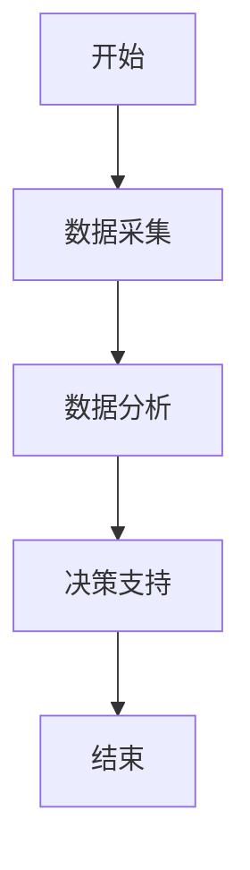
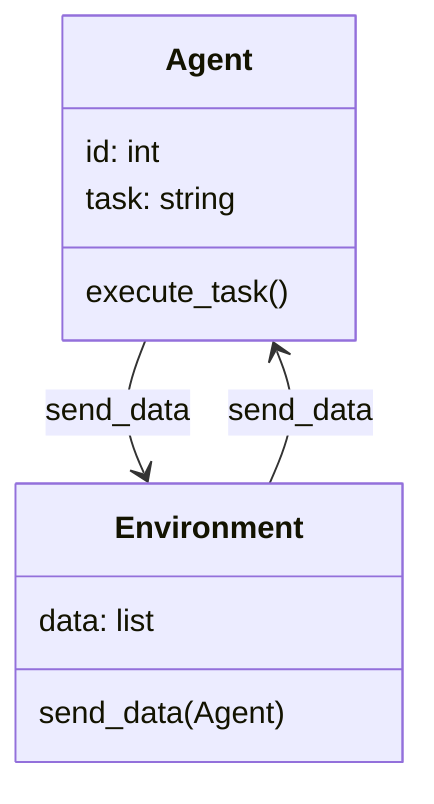

                 


# 多智能体系统在行业分析中的应用：深化价值投资研究

## 关键词：多智能体系统，价值投资，行业分析，人工智能，系统架构

## 摘要：本文探讨了多智能体系统（MAS）在行业分析和价值投资研究中的应用。通过分析MAS的核心概念、算法原理和系统架构，结合实际案例，展示了如何利用MAS提升行业分析的深度和准确性，为投资者提供更科学的决策支持。文章最后总结了MAS在价值投资中的优势，并展望了其未来的发展潜力。

---

# 第一部分: 多智能体系统在行业分析中的应用概述

## 第1章: 多智能体系统的基本概念

### 1.1 多智能体系统的定义与特点

#### 1.1.1 多智能体系统的定义
多智能体系统（Multi-Agent System, MAS）是由多个智能体（Agent）组成的分布式系统，这些智能体能够通过协作完成复杂的任务。智能体是具有感知、推理、决策和执行能力的实体，可以是软件程序、机器人或其他智能设备。

#### 1.1.2 多智能体系统的核心特点
- **分布式性**：智能体之间通过分布式协作完成任务，避免了单点依赖。
- **自主性**：每个智能体都具有自主决策的能力，能够独立完成部分任务。
- **协作性**：智能体之间通过通信和协作完成共同目标。
- **动态性**：系统能够适应环境的变化，智能体之间可以动态调整协作策略。

#### 1.1.3 多智能体系统与传统单智能体系统的区别
| 属性       | 单智能体系统           | 多智能体系统           |
|------------|----------------------|----------------------|
| 系统结构    | 集中式                | 分布式                |
| 决策方式    | 单点决策              | 分布式决策            |
| 任务处理    | 单一任务              | 多任务协作            |
| 灵活性      | 较低                  | 较高                  |

### 1.2 多智能体系统的组成与结构

#### 1.2.1 智能体的定义与分类
- **智能体定义**：智能体是能够感知环境、自主决策并采取行动的实体。
- **智能体分类**：可以根据智能体的智能水平分为简单智能体和复杂智能体；根据智能体的功能分为感知型智能体和执行型智能体。

#### 1.2.2 多智能体系统的组成结构
- **智能体层**：包括多个智能体，每个智能体负责特定的任务。
- **通信层**：智能体之间的通信机制，用于信息交换和协作。
- **环境层**：智能体所处的环境，包括数据源、用户输入等。

#### 1.2.3 智能体之间的通信与协作机制
智能体之间的通信可以通过以下方式进行：
- **直接通信**：智能体之间直接交换信息。
- **间接通信**：通过中间层或共享数据库进行信息交换。
- **事件驱动**：智能体通过事件触发通信。

### 1.3 多智能体系统的应用领域

#### 1.3.1 多智能体系统在金融领域的应用
- **金融数据分析**：智能体可以实时分析市场数据，提供投资建议。
- **风险管理**：多个智能体协同工作，实时监控市场风险。

#### 1.3.2 多智能体系统在行业分析中的优势
- **分布式计算能力**：能够处理大规模数据，提高分析效率。
- **协作能力**：多个智能体协同工作，提供更全面的分析结果。

#### 1.3.3 多智能体系统在价值投资研究中的潜力
- **多维度分析**：智能体可以从不同角度分析行业数据，提供更深入的见解。
- **动态调整**：智能体能够根据市场变化动态调整分析策略。

### 1.4 本章小结
本章介绍了多智能体系统的定义、特点、组成结构以及在金融领域的应用。通过对比分析，展示了多智能体系统在行业分析中的优势，为后续章节奠定了基础。

---

## 第2章: 价值投资研究的行业分析背景

### 2.1 价值投资的核心理念

#### 2.1.1 价值投资的定义与特点
- **定义**：价值投资是一种投资策略，旨在通过寻找被市场低估的股票进行投资。
- **特点**：注重长期投资、基本面分析、安全边际。

#### 2.1.2 价值投资的基本原则
- **长期视角**：关注企业的长期价值，而非短期波动。
- **安全边际**：买入价格低于内在价值，以降低风险。
- **分散投资**：通过分散投资降低风险。

#### 2.1.3 价值投资与多智能体系统的结合点
- **数据处理**：智能体可以处理大量非结构化数据，提供更全面的分析。
- **动态调整**：智能体能够根据市场变化实时调整投资策略。

### 2.2 行业分析的基本方法

#### 2.2.1 行业分析的定义与作用
- **定义**：行业分析是对特定行业内的企业进行分析，以评估其投资价值。
- **作用**：帮助投资者识别行业趋势，评估企业竞争力。

#### 2.2.2 行业分析的主要指标与方法
- **主要指标**：市盈率、市净率、ROE（净资产收益率）等。
- **分析方法**：SWOT分析、PEST分析等。

#### 2.2.3 行业分析在价值投资中的重要性
- **行业趋势**：行业发展趋势直接影响企业的长期价值。
- **竞争优势**：企业是否具备竞争优势是价值投资的重要考量。

### 2.3 传统行业分析的局限性

#### 2.3.1 数据处理能力有限
传统行业分析主要依赖人工处理数据，难以处理海量非结构化数据。

#### 2.3.2 分析深度不足
传统分析方法难以从多维度全面分析企业价值。

#### 2.3.3 动态调整能力差
传统分析方法难以实时调整分析策略，应对市场变化。

### 2.4 本章小结
本章介绍了价值投资的核心理念和行业分析的基本方法，分析了传统行业分析的局限性，为后续章节利用多智能体系统提升行业分析能力奠定了基础。

---

## 第3章: 多智能体系统的核心概念与行业分析的联系

### 3.1 多智能体系统的数学模型

#### 3.1.1 智能体的数学模型
- **感知模型**：智能体通过传感器或数据源获取信息。
- **推理模型**：基于感知信息进行推理，得出决策。

#### 3.1.2 多智能体系统的交互模型
- **通信模型**：智能体之间的信息交换机制。
- **协作模型**：智能体之间的协作策略。

#### 3.1.3 多智能体系统的整体模型
$$
\text{MAS} = \{\text{Agent}_1, \text{Agent}_2, \ldots, \text{Agent}_n, \text{Environment}\}
$$

### 3.2 多智能体系统与价值投资的结合

#### 3.2.1 智能体在价值投资中的角色
- **数据采集智能体**：负责收集市场数据。
- **分析智能体**：负责对企业进行基本面分析。
- **决策智能体**：负责制定投资策略。

#### 3.2.2 多智能体系统的协作机制
- **信息共享机制**：智能体之间共享数据和分析结果。
- **任务分配机制**：根据智能体的能力分配任务。

#### 3.2.3 多智能体系统的动态调整能力
- **实时反馈机制**：根据市场变化实时调整策略。
- **自适应学习机制**：通过机器学习不断优化分析模型。

### 3.3 本章小结
本章分析了多智能体系统的数学模型，并探讨了其与价值投资的结合方式，展示了多智能体系统在提升行业分析能力方面的潜力。

---

## 第4章: 多智能体系统的算法原理与实现

### 4.1 多智能体协调算法

#### 4.1.1 协调算法的定义与分类
- **定义**：协调算法是指智能体之间通过协作完成任务的算法。
- **分类**：基于任务分配的协调算法、基于信息共享的协调算法。

#### 4.1.2 协调算法的流程
1. 任务分解：将整体任务分解为子任务。
2. 任务分配：根据智能体的能力分配子任务。
3. 信息共享：智能体之间共享相关信息。
4. 协调执行：智能体协同执行任务。

#### 4.1.3 协调算法的数学模型
$$
\text{Task Decomposition} = \{T_1, T_2, \ldots, T_n\}
$$
$$
\text{Task Allocation} = \{\text{Agent}_i \rightarrow T_j\}
$$

### 4.2 多智能体系统的实现

#### 4.2.1 系统架构设计
- **分层架构**：包括感知层、决策层和执行层。
- **分布式架构**：智能体分布在不同的节点上，通过网络通信协作。

#### 4.2.2 智能体的实现
- **感知模块**：负责数据采集。
- **推理模块**：负责数据分析和决策。
- **执行模块**：负责执行决策。

#### 4.2.3 通信协议设计
- **消息格式**：定义智能体之间的消息格式。
- **通信机制**：定义智能体之间的通信方式。

### 4.3 算法实现与优化

#### 4.3.1 算法实现
以下是多智能体协调算法的Python实现示例：

```python
class Agent:
    def __init__(self, id):
        self.id = id
        self.task = None

    def assign_task(self, task):
        self.task = task

    def execute_task(self):
        pass

def multi_agent_coordination():
    # 初始化智能体
    agents = [Agent(i) for i in range(4)]
    
    # 任务分解
    tasks = ['data_collection', 'analysis', 'decision', 'execution']
    
    # 任务分配
    for i in range(len(agents)):
        agents[i].assign_task(tasks[i])
    
    # 任务执行
    for agent in agents:
        agent.execute_task()

multi_agent_coordination()
```

#### 4.3.2 算法优化
- **负载均衡**：确保任务分配合理，避免某些智能体过载。
- **通信优化**：减少智能体之间的通信开销。

### 4.4 本章小结
本章详细讲解了多智能体系统的算法原理，并通过Python代码展示了算法实现。通过优化算法，可以提高系统的效率和性能。

---

## 第5章: 多智能体系统在行业分析中的应用实践

### 5.1 项目背景与目标

#### 5.1.1 项目背景
- **行业选择**：选择金融行业作为研究对象。
- **研究目标**：利用多智能体系统提升行业分析的深度和准确性。

### 5.2 系统功能设计

#### 5.2.1 功能模块划分
- **数据采集模块**：负责收集市场数据。
- **数据分析模块**：负责对企业进行基本面分析。
- **决策支持模块**：提供投资建议。

#### 5.2.2 功能流程图
使用Mermaid绘制功能流程图：



### 5.3 系统架构设计

#### 5.3.1 系统架构图
使用Mermaid绘制系统架构图：



### 5.4 项目实施与优化

#### 5.4.1 项目实施
- **环境搭建**：安装必要的软件和工具。
- **代码实现**：实现各功能模块的代码。
- **测试与调试**：确保系统正常运行。

#### 5.4.2 系统优化
- **性能优化**：提高系统的运行效率。
- **功能优化**：增强系统的分析能力。

### 5.5 本章小结
本章通过实际案例展示了多智能体系统在行业分析中的应用，通过系统设计和实现，验证了MAS在提升行业分析能力方面的有效性。

---

## 第6章: 总结与展望

### 6.1 本章总结
本文详细探讨了多智能体系统在行业分析中的应用，分析了MAS的核心概念、算法原理和系统架构，并通过实际案例展示了其在价值投资研究中的潜力。

### 6.2 未来展望
未来，随着人工智能技术的发展，多智能体系统在行业分析中的应用将更加广泛。可以通过以下方面进一步研究：
- **智能体的自主性提升**：增强智能体的自主决策能力。
- **系统的可扩展性优化**：提高系统的扩展性，适应更多场景的应用。
- **算法的优化**：进一步优化算法，提高系统的效率和性能。

### 6.3 注意事项
- **数据隐私**：在处理数据时，需要注意数据隐私和安全。
- **系统稳定性**：确保系统的稳定性和可靠性。

### 6.4 拓展阅读
- **推荐书籍**：《Multi-Agent Systems: Algorithmic, Complexity Theoretic, and Game Theoretic Foundations》
- **推荐论文**：《A Survey of Multi-Agent Systems and Their Applications》

---

## 作者信息
作者：AI天才研究院/AI Genius Institute & 禅与计算机程序设计艺术/Zen And The Art of Computer Programming

---

通过本文的系统介绍，读者可以全面了解多智能体系统在行业分析中的应用，并能够将其应用于实际的价值投资研究中。

