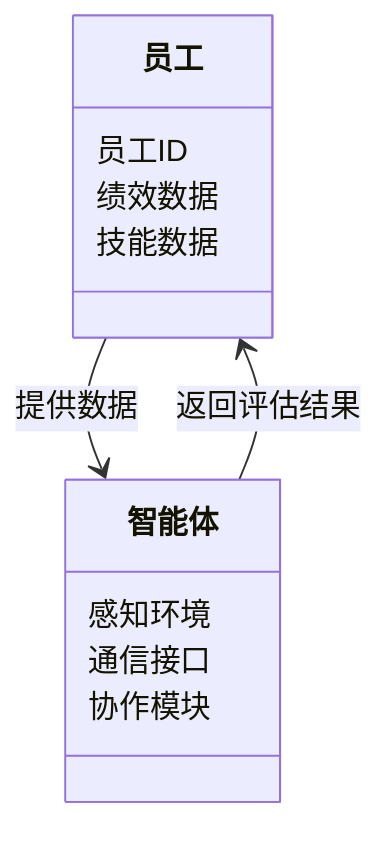
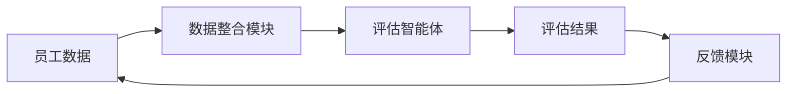
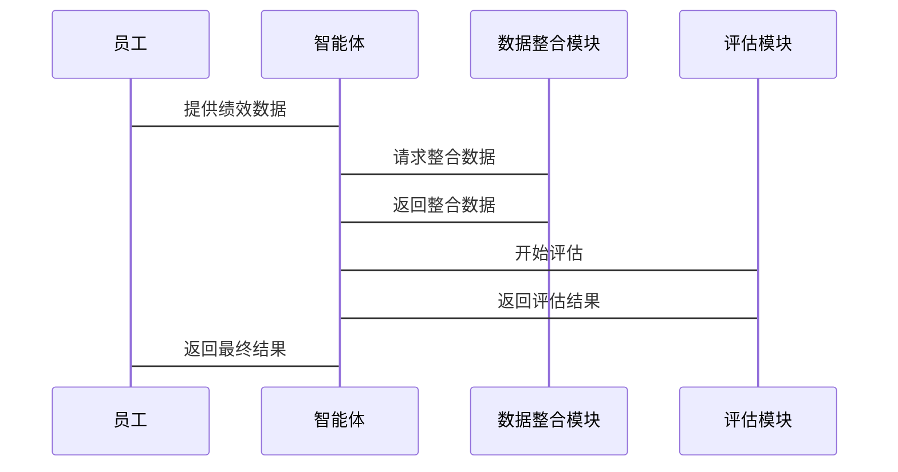

                 

<think>
好的，我现在需要帮助用户撰写一篇关于《多智能体系统在评估公司人力资本价值中的应用》的技术博客文章。用户已经提供了详细的目录大纲，并要求文章内容符合特定的格式和要求。首先，我需要确保文章的结构清晰，内容详实，并且符合用户的格式要求。

首先，文章标题和关键词部分已经完成，摘要也已经撰写完毕。接下来，我需要按照目录大纲逐步填充每个章节的内容。

第一章是背景介绍，包括多智能体系统和人力资本的概述。我需要详细解释多智能体系统的基本概念，人力资本的定义，以及它们在评估公司价值中的应用背景。同时，我需要确保每个小节都涵盖必要的内容，并且语言简洁明了。

第二章讨论多智能体系统的核心原理和人力资本评估的核心要素。我需要在这里详细分析多智能体系统的工作原理，以及这些原理如何与人力资本评估联系起来。同时，我需要绘制相关的图表，如ER实体关系图，使用Mermaid来展示。

第三章是算法原理讲解，这部分需要详细讲解多智能体系统中的算法，如协调机制和博弈论模型。我需要使用Mermaid流程图展示算法流程，并提供Python代码示例，解释数学模型和公式。

第四章涉及系统分析与架构设计，我需要描述问题场景，设计系统功能，绘制领域模型和架构图。这部分需要展示系统的各个组成部分及其交互关系。

第五章是项目实战，需要详细说明如何安装环境，实现核心代码，分析案例，并进行总结。这部分将帮助读者实际应用所学知识。

最后，我需要添加最佳实践、小结、注意事项和拓展阅读等内容，以巩固读者的知识。

在撰写过程中，我需要确保每个部分都符合用户的格式要求，使用markdown格式，并且每个小节内容丰富详细。同时，我需要使用数学公式和代码示例来增强文章的技术深度。

现在，我开始逐步填充每个章节的内容，确保逻辑清晰，语言专业，同时保持易懂。
</think>

# 多智能体系统在评估公司人力资本价值中的应用

---

## 关键词：多智能体系统，人力资本，价值评估，协作机制，算法原理

---

## 摘要：多智能体系统在评估公司人力资本价值中的应用

随着企业对员工价值评估的需求日益增长，传统的评估方法逐渐显露出其局限性。多智能体系统（MAS）作为一种新兴的技术，通过其独特的协作机制和分布式问题解决能力，为人力资本评估提供了新的思路。本文将探讨多智能体系统如何应用于公司人力资本价值评估，分析其核心原理、算法实现、系统架构，并结合实际案例进行深入分析。通过本文，读者将了解如何利用多智能体系统提升公司的人力资本评估效率和准确性。

---

## 第1章：多智能体系统与人力资本概述

### 1.1 多智能体系统的基本概念

#### 1.1.1 多智能体系统的定义与特点

多智能体系统（Multi-Agent Systems, MAS）是由多个智能体组成的分布式系统，这些智能体能够通过协作完成复杂任务。MAS的特点包括自主性、反应性、协作性、分布性和动态性。

#### 1.1.2 多智能体系统的核心要素

- **智能体**：能够感知环境并采取行动的实体。
- **通信**：智能体之间通过消息传递进行协作。
- **协作机制**：确保智能体之间的有效合作。
- **问题求解**：通过分布式计算解决复杂问题。

#### 1.1.3 多智能体系统的主要应用场景

- **分布式计算**
- **智能交通系统**
- **电子商务**
- **组织管理**

### 1.2 人力资本的定义与价值评估

#### 1.2.1 人力资本的定义

人力资本是指员工的知识、技能、经验和健康状况等，是企业核心竞争力的重要组成部分。

#### 1.2.2 人力资本评估的核心维度

- **员工绩效**
- **员工贡献**
- **员工技能**

#### 1.2.3 人力资本评估的意义

- 优化人力资源管理
- 提高员工满意度
- 促进企业绩效提升

### 1.3 多智能体系统在人力资本评估中的应用背景

#### 1.3.1 传统人力资本评估方法的局限性

- **数据孤岛**：信息分散，难以整合
- **评估效率低**：依赖人工，耗时耗力
- **动态性不足**：难以应对变化

#### 1.3.2 多智能体系统的优势与潜力

- **分布式协作**：提升评估效率
- **动态适应**：实时更新评估结果
- **数据整合**：多维度分析

#### 1.3.3 当前研究现状与未来趋势

- 研究现状：初步应用，技术成熟度较高
- 未来趋势：深度融合，智能化发展

---

## 第2章：多智能体系统的核心原理

### 2.1 多智能体系统的核心原理

#### 2.1.1 智能体的定义与特征

- **自主性**：智能体能够自主决策
- **反应性**：能感知环境变化并做出反应
- **协作性**：通过协作完成任务

#### 2.1.2 多智能体系统中的通信与协作机制

- **通信协议**：定义消息格式和传输方式
- **协作机制**：如分布式协商、任务分配

#### 2.1.3 分布式问题求解与决策制定

- **分布式计算**：任务分解和协同处理
- **分布式决策**：基于局部信息做出决策

---

## 第3章：多智能体系统与人力资本评估的结合

### 3.1 多智能体系统在人力资本评估中的应用

#### 3.1.1 问题场景：传统评估方法的挑战

- **数据分散**：员工绩效、健康数据分散在不同部门
- **信息不一致**：不同部门的评估标准不统一
- **实时性不足**：评估结果滞后

#### 3.1.2 多智能体系统的解决方案

- **数据整合**：通过通信协议整合分散数据
- **协作评估**：智能体协同完成评估任务
- **实时更新**：动态调整评估结果

---

## 第4章：算法原理讲解

### 4.1 协调机制与算法实现

#### 4.1.1 分布式协调算法

- **算法流程**：任务分解 → 协商 → 执行 → 反馈
- **代码示例**：使用Python实现简单的分布式协商

```python
def distribute_task(tasks, agents):
    import random
    agent = random.choice(agents)
    agent.tasks.append(tasks.pop())
```

#### 4.1.2 基于博弈论的决策算法

- ** Nash均衡**：确保各方利益最大化
- **算法实现**：通过博弈论模型优化决策过程

---

## 第5章：系统分析与架构设计

### 5.1 问题场景介绍

#### 5.1.1 问题背景与目标

- **目标**：提升人力资本评估的效率和准确性
- **范围**：公司内部员工绩效评估

### 5.2 系统功能设计

#### 5.2.1 领域模型设计



### 5.3 系统架构设计



### 5.4 系统接口设计

- **输入接口**：员工数据输入
- **输出接口**：评估结果输出

### 5.5 交互序列图



---

## 第6章：项目实战

### 6.1 环境安装

- **Python**：安装Python 3.8+
- **库依赖**：安装numpy、pandas、networkx

### 6.2 核心代码实现

#### 6.2.1 数据整合模块

```python
import pandas as pd

def integrate_data(data_sources):
    df = pd.DataFrame()
    for source in data_sources:
        df = pd.merge(df, source, on='员工ID', how='outer')
    return df
```

#### 6.2.2 评估智能体

```python
class Agent:
    def __init__(self, data):
        self.data = data
        self.tasks = []
    
    def receive_task(self, task):
        self.tasks.append(task)
    
    def execute_task(self):
        while self.tasks:
            task = self.tasks.pop()
            # 执行评估任务
            pass
```

### 6.3 案例分析

#### 6.3.1 数据收集与预处理

- **数据收集**：从HR系统获取员工绩效数据
- **数据清洗**：处理缺失值和异常值

#### 6.3.2 评估过程

- **任务分配**：智能体接收评估任务
- **评估执行**：智能体执行评估逻辑
- **结果反馈**：智能体返回评估结果

### 6.4 项目总结

- **优势**：提高效率，增强准确性
- **挑战**：数据隐私和系统维护

---

## 第7章：最佳实践与拓展阅读

### 7.1 最佳实践 tips

- **数据安全**：确保数据隐私
- **系统维护**：定期更新和优化
- **团队协作**：加强跨部门合作

### 7.2 小结

通过多智能体系统的应用，企业可以更高效、准确地评估人力资本价值，提升整体竞争力。

### 7.3 注意事项

- **数据隐私**：严格遵守相关法律法规
- **系统稳定性**：确保系统稳定运行

### 7.4 拓展阅读

- 《Multi-Agent Systems in Organizational Management》
- 《Artificial Intelligence in Human Capital Management》

---

## 作者：AI天才研究院 & 禅与计算机程序设计艺术

---

通过以上结构，文章内容将系统地介绍多智能体系统在人力资本评估中的应用，从理论到实践，层层深入，帮助读者全面理解其价值和实现方法。

