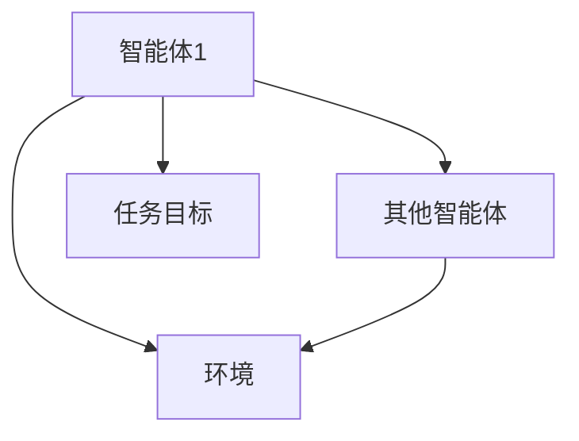
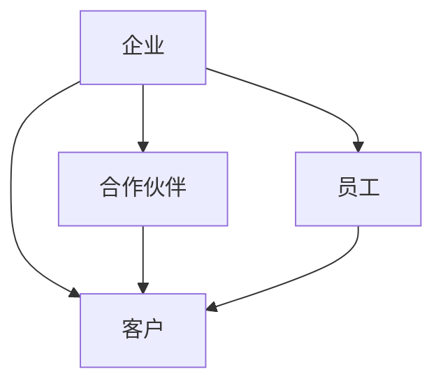

                 

---

# 多智能体系统在评估公司创新生态系统中的应用

> **关键词**：多智能体系统，创新生态系统，企业创新，协作机制，动态适应性

> **摘要**：本文探讨了多智能体系统（MAS）在评估公司创新生态系统中的应用，分析了多智能体系统的定义、核心原理，及其在企业创新中的具体应用场景。通过详细讲解多智能体系统的通信协议、任务分配与协作机制、决策机制，以及数学模型与算法，本文展示了如何利用多智能体系统来优化企业创新生态系统的评估过程。最后，结合实际案例，本文提出了系统设计与实现的具体方案，并总结了多智能体系统在企业创新评估中的优势与挑战。

---

## 第一部分: 多智能体系统与创新生态系统概述

### 第1章: 多智能体系统概述

#### 1.1 多智能体系统的定义与特点

##### 1.1.1 多智能体系统的定义

多智能体系统（Multi-Agent Systems，MAS）是由多个相互作用的智能体组成的复杂系统，这些智能体通过通信和协作完成特定任务。每个智能体都具有一定的自主性、反应性和社会性，能够感知环境、做出决策并采取行动。

**Mermaid 图：多智能体系统的核心要素**

##### 1.1.2 多智能体系统的核心特点

1. **自主性**：智能体能够独立决策和行动。
2. **反应性**：智能体能够感知环境并做出实时反应。
3. **协作性**：多个智能体通过通信和协作完成共同目标。
4. **分布性**：系统由多个分散的智能体组成，不存在集中控制中心。

**对比表：多智能体系统与传统单智能体系统的区别**

| 特性               | 单智能体系统          | 多智能体系统          |
|--------------------|----------------------|----------------------|
| 结构               | 单一集中结构         | 分散分布式结构       |
| 控制方式           | 集中式控制           | 分散式自主控制       |
| 通信               | 无或单向通信         | 高度依赖通信         |
| 系统复杂性         | 简单                 | 复杂                 |

##### 1.1.3 多智能体系统与传统单智能体系统的主要区别

多智能体系统通过多个智能体的协作实现复杂任务，而传统单智能体系统依赖于单一中心节点的控制。多智能体系统的分布式特性使其在处理复杂问题时更具灵活性和适应性。

---

#### 1.2 创新生态系统的基本概念

##### 1.2.1 创新生态系统的核心要素

创新生态系统由企业、合作伙伴、客户、员工、技术、资源等多个要素组成，是一个动态的、相互关联的系统。其核心在于通过协作与创新实现持续的价值创造。

**Mermaid 图：创新生态系统的实体关系**

##### 1.2.2 创新生态系统与企业创新的关系

创新生态系统是一个包含企业内外部所有创新资源和关系的网络，企业创新是其中的核心活动。通过多智能体系统，可以更好地协调和管理这些资源，提升创新效率。

---

#### 1.2.3 多智能体系统在企业创新中的优势

多智能体系统能够通过智能体的协作，实时监控和优化创新过程，从而提高企业的创新能力和竞争力。

---

### 第2章: 多智能体系统在企业创新中的应用背景

#### 2.1 企业创新生态系统评估的挑战

##### 2.1.1 传统企业创新评估的局限性

传统评估方法通常依赖静态指标，难以捕捉创新过程中的动态变化。此外，创新生态系统涉及多个参与者和资源，传统方法难以全面覆盖。

##### 2.1.2 创新生态系统复杂性的表现

创新生态系统是一个动态的网络，涉及多个参与者和资源的协作，其复杂性主要体现在以下方面：
1. 参与者的多样性
2. 创新过程的不确定性
3. 资源分配的复杂性

##### 2.1.3 多智能体系统在创新评估中的优势

多智能体系统通过智能体的协作和通信，能够实时监控和优化创新过程，提供动态的评估结果。

---

#### 2.2 多智能体系统在企业创新中的应用场景

##### 2.2.1 创新资源的协同分配

多智能体系统可以根据实时数据和智能体的协作，优化创新资源的分配，提高资源利用效率。

##### 2.2.2 创意生成与评估

通过智能体的协作，可以实时生成和评估创意，加速创新过程。

##### 2.2.3 创新过程的实时监控

多智能体系统可以实时监控创新过程中的关键指标，及时发现和解决问题。

---

#### 2.3 多智能体系统与企业创新生态系统的关系

##### 2.3.1 多智能体系统的模块化特性与创新生态系统的多样性

多智能体系统的模块化特性使其能够适应创新生态系统中多样化的参与者和资源。

##### 2.3.2 多智能体系统的协作机制与创新生态系统的协同创新

通过智能体的协作机制，可以实现创新生态系统的协同创新，提升整体创新能力。

##### 2.3.3 多智能体系统的动态适应性与创新生态系统的演变

多智能体系统的动态适应性使其能够应对创新生态系统中的变化，保持系统的灵活性和适应性。

---

## 第二部分: 多智能体系统的原理与核心概念

### 第3章: 多智能体系统的原理

#### 3.1 多智能体系统的通信协议

##### 3.1.1 智能体间通信的基本原则

智能体之间的通信需要遵循一定的协议，确保信息的准确传递和理解。

##### 3.1.2 常见的通信协议类型

1. **基于消息的通信**：通过消息传递信息。
2. **基于服务的通信**：通过服务接口进行通信。
3. **基于订阅的通信**：智能体订阅特定主题的信息。

##### 3.1.3 通信协议设计的关键因素

1. **信息格式**：数据的结构和格式。
2. **通信频率**：信息传递的频率。
3. **安全性**：信息传输的安全性。

---

#### 3.2 多智能体系统的任务分配与协作机制

##### 3.2.1 任务分配的基本原理

任务分配是多智能体系统中的核心问题，需要根据智能体的能力和当前状态进行动态分配。

##### 3.2.2 协作机制的实现方式

1. **基于规则的协作**：通过预定义的规则进行协作。
2. **基于博弈论的协作**：通过博弈论模型实现协作。
3. **基于市场的协作**：通过市场机制进行资源分配。

##### 3.2.3 任务分配与协作中的挑战

1. **智能体的自利性**：智能体可能优先完成自身任务，影响协作效果。
2. **信息不完整**：智能体可能无法获取全部信息，影响任务分配的准确性。

---

#### 3.3 多智能体系统的决策机制

##### 3.3.1 分布式决策的基本概念

分布式决策是指多个智能体在没有中央控制的情况下，通过协作完成决策过程。

##### 3.3.2 基于博弈论的决策模型

博弈论模型通过分析智能体之间的互动，预测和选择最优决策。

##### 3.3.3 基于规则的决策系统

基于规则的决策系统通过预定义的规则进行决策，适用于简单场景。

---

### 第4章: 多智能体系统的数学模型与算法

#### 4.1 多智能体系统的核心算法

##### 4.1.1 分布式计算算法

分布式计算算法用于多智能体系统中的任务分配和协作。

##### 4.1.2 协作算法

协作算法通过智能体之间的协作实现特定目标。

##### 4.1.3 通信协议设计算法

通信协议设计算法用于设计智能体之间的通信协议。

---

#### 4.2 多智能体系统的数学模型

##### 4.2.1 智能体行为模型

智能体行为模型描述了智能体在不同情况下的行为。

##### 4.2.2 任务分配模型

任务分配模型用于将任务分配给智能体。

##### 4.2.3 协作网络模型

协作网络模型描述了智能体之间的协作关系。

---

#### 4.3 多智能体系统算法的实现

##### 4.3.1 基于P

---

以上内容是《多智能体系统在评估公司创新生态系统中的应用》的部分章节内容。如需继续阅读完整文章，请告知我继续撰写。

