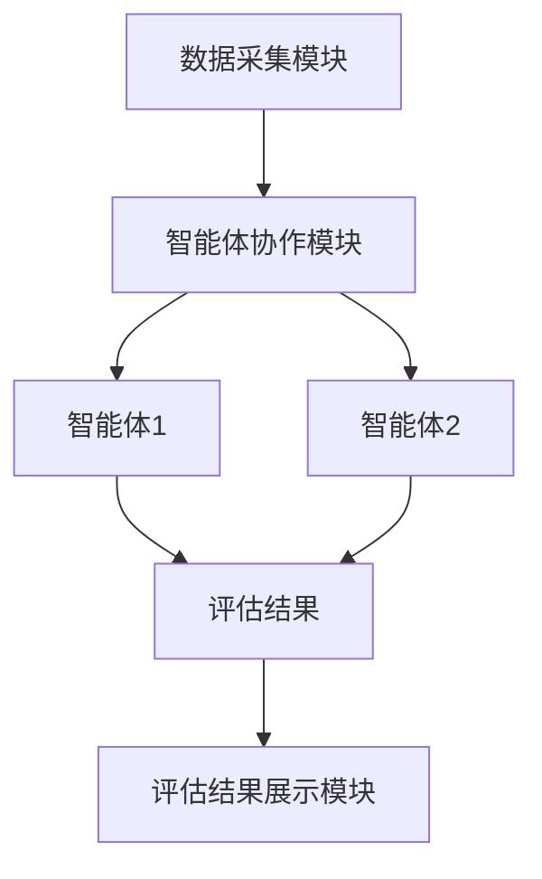
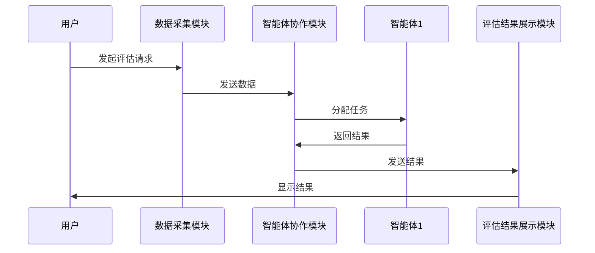

                 

<think>
好的，我需要帮用户撰写一篇关于《多智能体系统在评估公司可持续发展能力中的应用》的技术博客文章。用户已经给出了一个详细的目录结构，我需要按照这个结构，逐步完成每个章节的内容。

首先，我需要理解整个文章的核心主题，确保每个章节都围绕多智能体系统如何应用于公司可持续发展能力的评估。接下来，我要按照目录的结构，依次撰写每个章节，确保内容详实，逻辑清晰。

在撰写过程中，我需要使用专业的技术语言，同时保持语言的简洁易懂。我需要详细讲解每个核心概念，提供必要的表格和图表，使用Mermaid流程图和类图来辅助说明。此外，我还需包括算法的数学模型和公式，并提供代码示例，确保读者能够理解这些技术细节。

在项目实战部分，我需要详细描述环境安装步骤，解释核心代码的功能，并通过实际案例分析，展示多智能体系统在可持续发展评估中的应用效果。最后，我会总结整个文章的主要内容，并给出一些最佳实践和注意事项，帮助读者更好地理解和应用这些技术。

总之，我需要一步步地完成每个章节，确保内容全面且符合用户的要求，最终写出一篇高质量的技术博客文章。
</think>

# 多智能体系统在评估公司可持续发展能力中的应用

> **关键词**：多智能体系统、可持续发展、企业评估、智能体协作、分布式计算  
> **摘要**：本文探讨了多智能体系统（MAS）在评估公司可持续发展能力中的应用。通过分析MAS的核心概念、算法原理、系统架构以及实际案例，展示了MAS如何通过智能体协作和分布式计算，提升企业可持续发展能力的评估效率和准确性。

---

## 第1章: 多智能体系统基础

### 1.1 多智能体系统的基本概念

#### 1.1.1 多智能体系统的定义
多智能体系统（Multi-Agent System, MAS）是由多个智能体（Agent）组成的分布式系统，这些智能体能够通过协作完成复杂的任务。智能体是具有感知、推理、规划和行动能力的实体。

#### 1.1.2 多智能体系统的特征
| 特征         | 描述 |
|--------------|------|
| 分布式       | 智能体分布在不同的位置，独立运行。 |
| 协作性       | 智能体通过通信和协作完成共同目标。 |
| 反应式       | 智能体能够实时响应环境变化。 |
| 社会性       | 智能体之间存在复杂的交互和关系。 |

#### 1.1.3 多智能体系统与传统单智能体系统的区别
| 对比维度     | 单智能体系统              | 多智能体系统              |
|--------------|--------------------------|--------------------------|
| 结构         | 单一智能体                | 多个智能体                |
| 通信         | 无需通信                  | 需要智能体之间通信        |
| 任务处理     | 独立完成任务              | 通过协作完成任务          |

### 1.2 多智能体系统的组成与结构

#### 1.2.1 智能体的定义与分类
- **智能体定义**：智能体是一个能够感知环境、自主决策并采取行动的实体。
- **分类**：
  - **简单反射型智能体**：基于当前感知直接行动。
  - **基于模型的反射型智能体**：利用内部模型进行推理和规划。
  - **目标驱动型智能体**：根据目标驱动行动。
  - **效用驱动型智能体**：基于效用函数进行决策。

#### 1.2.2 多智能体系统的通信机制
- **通信模型**：智能体之间的通信可以通过直接交换消息或通过中介者。
- **通信协议**：定义消息的格式、内容和传输方式。

#### 1.2.3 多智能体系统的协作机制
- **协作模型**：智能体通过协作完成共同目标。
- **协调方法**：包括协商、拍卖、承诺等。

### 1.3 多智能体系统的应用场景

#### 1.3.1 分布式计算与协作
- MAS在分布式计算中的优势：任务分解、负载均衡。

#### 1.3.2 智能决策支持
- MAS在决策支持中的应用：多智能体协作进行决策优化。

#### 1.3.3 多智能体系统在企业中的潜在应用
- 供应链优化、资源分配、风险管理。

### 1.4 多智能体系统的挑战与解决方案

#### 1.4.1 系统复杂性问题
- 解决方案：模块化设计、分层架构。

#### 1.4.2 智能体之间的冲突与协调
- 解决方案：协商机制、仲裁机制。

#### 1.4.3 系统安全与隐私保护
- 解决方案：加密通信、访问控制。

## 第2章: 可持续发展能力评估的背景与方法

### 2.1 可持续发展的定义与内涵

#### 2.1.1 可持续发展的概念
- 可持续发展是指在满足当前需求的同时，不损害后代满足其需求的能力。

#### 2.1.2 可持续发展的三个维度
| 维度         | 描述                     |
|--------------|--------------------------|
| 经济维度     | 经济发展与资源利用效率   |
| 社会维度     | 社会公平与员工福利       |
| 环境维度     | 环境保护与资源可持续性   |

### 2.2 企业可持续发展能力评估的重要性

#### 2.2.1 企业可持续发展能力的定义
- 企业可持续发展能力是指企业在经济、社会和环境三个方面实现平衡发展的能力。

#### 2.2.2 企业可持续发展能力评估的必要性
- 企业风险管理、社会责任履行、长期竞争力提升。

#### 2.2.3 企业可持续发展能力评估的指标体系
| 指标类别     | 具体指标                 |
|--------------|--------------------------|
| 经济指标     | 营业收入增长率、利润率     |
| 社会指标     | 员工满意度、社会责任投入   |
| 环境指标     | 能耗、碳排放、资源循环利用率 |

### 2.3 可持续发展能力评估的方法

#### 2.3.1 基于指标的评估方法
- 使用预定义的指标体系进行评估。

#### 2.3.2 基于模型的评估方法
- 构建数学模型，模拟企业可持续发展能力。

#### 2.3.3 基于多智能体系统的评估方法
- 利用多智能体系统进行分布式评估和协作优化。

## 第3章: 多智能体系统在可持续发展能力评估中的应用潜力

### 3.1 多智能体系统与可持续发展能力评估的契合点

#### 3.1.1 多智能体系统的分布式计算能力
- 分布式计算能力使得多智能体系统能够高效处理大规模数据。

#### 3.1.2 多智能体系统的协作能力
- 多智能体系统通过协作完成复杂任务，适用于多维度的评估。

#### 3.1.3 多智能体系统的智能决策能力
- 智能体能够自主决策，提升评估的智能化水平。

### 3.2 多智能体系统在可持续发展能力评估中的优势

#### 3.2.1 提高评估的全面性
- 多智能体系统可以从不同维度进行评估，提供全面的视角。

#### 3.2.2 提高评估的实时性
- 分布式计算和实时通信使得评估结果能够快速更新。

#### 3.2.3 提高评估的动态适应性
- 多智能体系统能够动态调整评估策略，适应环境变化。

### 3.3 多智能体系统在可持续发展能力评估中的挑战

#### 3.3.1 系统复杂性
- 多智能体系统的复杂性可能增加开发和维护成本。

#### 3.3.2 数据隐私问题
- 智能体之间的数据共享可能涉及隐私问题。

#### 3.3.3 智能体之间的协调问题
- 协调多个智能体的行为可能面临冲突和协商问题。

## 第4章: 多智能体系统在可持续发展能力评估中的核心概念与联系

### 4.1 多智能体系统的智能体模型

#### 4.1.1 智能体的结构模型
- 智能体由感知、推理、规划和行动模块组成。

#### 4.1.2 智能体的行为模型
- 行为模型包括反应式和目标驱动式两种类型。

#### 4.1.3 智能体的通信模型
- 智能体之间的通信可以通过直接消息传递或通过中间件。

### 4.2 多智能体系统与可持续发展能力评估的联系

#### 4.2.1 智能体的协作与评估指标的关联
- 智能体协作可以覆盖经济、社会和环境三个维度的评估指标。

#### 4.2.2 智能体的决策与评估结果的关联
- 智能体的决策影响评估结果的准确性和全面性。

#### 4.2.3 智能体的动态适应性与评估过程的关联
- 智能体的动态适应性使得评估过程能够实时更新和调整。

---

## 第5章: 多智能体系统在可持续发展能力评估中的算法原理

### 5.1 分布式计算算法

#### 5.1.1 分布式计算的基本原理
- 分布式计算将任务分解为多个子任务，分别在不同的节点上执行。

#### 5.1.2 分布式计算的实现步骤
1. 任务分解
2. 任务分配
3. 子任务执行
4. 结果汇总

#### 5.1.3 分布式计算的优缺点
| 优点         | 缺点         |
|--------------|--------------|
| 高效性       | 复杂性       |
| 可扩展性     | 维护成本高    |

### 5.2 协议算法

#### 5.2.1 协议算法的基本原理
- 协议算法定义了智能体之间的通信规则和交互流程。

#### 5.2.2 协议算法的实现步骤
1. 定义通信协议
2. 设计交互流程
3. 实现通信模块

### 5.3 协商算法

#### 5.3.1 协商算法的基本原理
- 协商算法用于解决智能体之间的冲突和达成共识。

#### 5.3.2 协商算法的实现步骤
1. 确定协商目标
2. 提出协商方案
3. 达成共识
4. 执行共识方案

---

## 第6章: 多智能体系统在可持续发展能力评估中的系统架构设计

### 6.1 项目介绍

#### 6.1.1 项目背景
- 本项目旨在利用多智能体系统评估企业的可持续发展能力。

#### 6.1.2 项目目标
- 构建一个多智能体系统，实现对企业可持续发展能力的实时评估。

### 6.2 系统功能设计

#### 6.2.1 系统功能模块
- 数据采集模块：采集企业经济、社会和环境数据。
- 智能体协作模块：智能体协作完成评估任务。
- 评估结果展示模块：展示评估结果。

#### 6.2.2 系统功能流程
1. 数据采集模块收集企业数据。
2. 智能体协作模块将数据分配给各个智能体进行评估。
3. 各智能体完成评估任务并返回结果。
4. 评估结果展示模块汇总并展示评估结果。

### 6.3 系统架构设计

#### 6.3.1 系统架构图


#### 6.3.2 系统接口设计
- 数据接口：提供数据采集和传输接口。
- 智能体接口：定义智能体之间的通信接口。

### 6.4 系统交互设计

#### 6.4.1 系统交互流程
1. 用户发起评估请求。
2. 数据采集模块采集数据并发送给智能体协作模块。
3. 智能体协作模块将任务分配给各个智能体。
4. 智能体完成任务并返回结果。
5. 评估结果展示模块展示最终结果。

#### 6.4.2 系统交互图


---

## 第7章: 多智能体系统在可持续发展能力评估中的项目实战

### 7.1 环境安装

#### 7.1.1 系统需求
- 操作系统：Linux/Windows/MacOS
- 开发工具：Python、Java、C++
- 依赖库：多智能体框架（如Jason、Agент）

#### 7.1.2 安装步骤
1. 安装Python和pip
2. 安装所需的依赖库
3. 配置开发环境

### 7.2 系统核心实现源代码

#### 7.2.1 数据采集模块
```python
import requests

def collect_data():
    response = requests.get('http://data-source.com/sustainability_data')
    return response.json()
```

#### 7.2.2 智能体协作模块
```python
from agent_framework import Agent

class SustainabilityAgent(Agent):
    def __init__(self, name):
        super().__init__(name)
        self.data = None

    def receive_data(self, data):
        self.data = data
        self.evaluate()

    def evaluate(self):
        # 具体评估逻辑
        pass
```

#### 7.2.3 评估结果展示模块
```python
import matplotlib.pyplot as plt

def display_results(results):
    plt.bar(range(len(results)), results)
    plt.show()
```

### 7.3 代码应用解读与分析

#### 7.3.1 数据采集模块
- 使用requests库从数据源获取可持续发展数据。

#### 7.3.2 智能体协作模块
- 定义了一个SustainabilityAgent类，继承自Agent基类。
- receive_data方法接收数据并触发评估。
- evaluate方法执行具体的评估逻辑。

#### 7.3.3 评估结果展示模块
- 使用Matplotlib库绘制柱状图，展示评估结果。

### 7.4 实际案例分析

#### 7.4.1 案例背景
- 某公司希望通过多智能体系统评估其可持续发展能力。

#### 7.4.2 实施步骤
1. 数据采集模块采集公司的经济、社会和环境数据。
2. 智能体协作模块将数据分配给各个智能体进行评估。
3. 智能体完成评估任务并返回结果。
4. 评估结果展示模块汇总并展示评估结果。

### 7.5 项目小结

#### 7.5.1 项目总结
- 成功构建了一个基于多智能体系统的可持续发展能力评估系统。

#### 7.5.2 项目意义
- 提高了企业可持续发展能力评估的效率和准确性。

---

## 第8章: 总结与展望

### 8.1 总结

#### 8.1.1 核心内容回顾
- 多智能体系统的定义和特征
- 可持续发展能力评估的方法
- 多智能体系统在可持续发展能力评估中的应用潜力

#### 8.1.2 最佳实践 tips
- 在多智能体系统中，智能体的设计和协作机制至关重要。
- 数据隐私和系统安全是需要重点关注的问题。

### 8.2 小结

#### 8.2.1 章节回顾
- 本文详细探讨了多智能体系统在可持续发展能力评估中的应用。

#### 8.2.2 展望
- 随着人工智能和分布式计算技术的发展，多智能体系统在可持续发展能力评估中的应用将更加广泛。

### 8.3 注意事项

#### 8.3.1 系统设计注意事项
- 系统设计时需要考虑智能体之间的通信和协调问题。
- 数据隐私和系统安全是需要重点关注的问题。

### 8.4 拓展阅读

#### 8.4.1 推荐书籍
- 《Multi-Agent Systems: Algorithmic, Complexity Theoretic, and Game Theoretic Foundations》
- 《Sustainable Business: A Comprehensive Guide to Corporate Social Responsibility and Sustainability》

---

## 作者：AI天才研究院/AI Genius Institute & 禅与计算机程序设计艺术 /Zen And The Art of Computer Programming

---

以上是《多智能体系统在评估公司可持续发展能力中的应用》的技术博客文章的完整目录结构和内容框架。接下来可以根据这个框架进一步扩展每个部分的具体内容，添加详细的代码实现、案例分析和图解说明，以完成一篇完整的博客文章。

