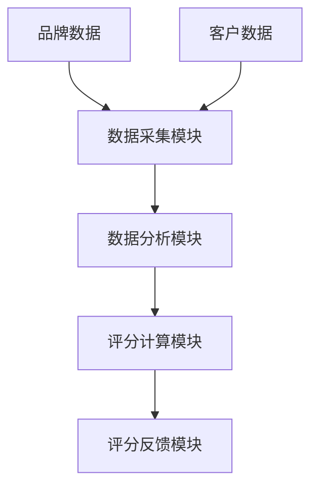
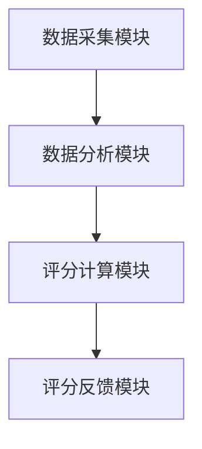

                 

<think>
嗯，用户希望我帮他设计一本关于多智能体系统在评估公司品牌价值和客户忠诚度中的作用的技术书籍的目录大纲。我需要先理解这本书的核心主题，然后按照逻辑结构进行划分。

首先，用户提供的示例目录分为五个部分，每个部分都有多个章节和小节，内容涵盖背景、核心概念、算法原理、系统设计、项目实战、总结等。我需要确保我的目录同样详细且结构合理。

开始时，我会先梳理多智能体系统的定义、起源及其在评估中的应用，这部分作为背景介绍。接着，我需要解释品牌价值和客户忠诚度的基本概念，以及它们如何与多智能体系统相关联。

然后，核心概念部分需要详细讲解多智能体系统在品牌和忠诚度评估中的应用原理，包括对比传统方法和系统架构图。这部分可能需要绘制ER图和流程图，以清晰展示系统结构。

接下来是算法原理，这里要详细描述具体算法，如协作算法，并用代码示例和流程图来解释。数学模型和公式也是关键，需要用LaTeX格式展示，确保内容严谨。

系统设计部分需要分析应用场景，设计功能模块和架构，并用Mermaid图展示系统类图、架构图和交互流程。这部分要确保系统的可操作性和扩展性。

项目实战部分需要一个实际案例，从环境配置到代码实现，再到案例分析，提供完整的实战指导。最后，总结部分要回顾MAS的优势，提出注意事项和未来方向，帮助读者全面理解。

现在，我需要检查每个部分是否覆盖了用户的需求，确保内容详实且结构清晰。同时，要注意使用正确的术语和图表，使目录更具专业性和可读性。

最后，我会确保整个目录逻辑连贯，每个章节之间有自然的过渡，并且每个小节都有足够的细节支撑。这样，用户就能根据这个目录顺利撰写出一本高质量的技术博客文章了。
</think>

# 多智能体系统在评估公司品牌价值和客户忠诚度中的作用

> 关键词：多智能体系统、品牌价值、客户忠诚度、算法原理、系统设计、项目实战

> 摘要：本文深入探讨了多智能体系统（MAS）在评估公司品牌价值和客户忠诚度中的应用。通过分析 MAS 的核心原理，结合实际案例，详细讲解了如何利用多智能体系统提升品牌价值评估的准确性和客户忠诚度分析的深度。文章从背景介绍、核心概念、算法原理、系统设计到项目实战，层层剖析，为读者提供了全面的技术指导和实践方案。

---

## 第一部分: 多智能体系统在品牌价值和客户忠诚度评估中的背景与基础

## 第1章: 多智能体系统概述

### 1.1 多智能体系统的起源与发展
#### 1.1.1 多智能体系统的定义
多智能体系统（Multi-Agent Systems, MAS）是由多个智能体组成的分布式系统，这些智能体能够通过协作和竞争完成复杂的任务。智能体具有自主性、反应性、主动性和社会性等特征。

#### 1.1.2 多智能体系统的核心特点
- **自主性**：智能体能够自主决策，无需外部干预。
- **反应性**：智能体能够感知环境并实时响应。
- **主动性**：智能体能够主动采取行动以实现目标。
- **社会性**：智能体之间可以进行通信和协作。

#### 1.1.3 多智能体系统的主要应用场景
- 智能交通管理
- 智能供应链优化
- 智能金融风险评估
- 智能客户关系管理

### 1.2 品牌价值的构成与评估
#### 1.2.1 品牌价值的定义
品牌价值是指品牌在市场上的综合价值，包括品牌知名度、品牌忠诚度、品牌认知度等因素。

#### 1.2.2 影响品牌价值的关键因素
- **品牌知名度**：品牌在市场上的普及程度。
- **品牌认知度**：消费者对品牌的理解和记忆程度。
- **品牌忠诚度**：消费者对品牌的偏好程度。
- **品牌联想**：消费者对品牌的情感和象征意义。

#### 1.2.3 品牌价值的传统评估方法
- 基于财务指标的评估（如销售收入、净利润率）
- 基于市场调研的评估（如问卷调查、焦点小组）
- 基于第三方机构的评估（如品牌价值报告）

### 1.3 客户忠诚度的定义与评估
#### 1.3.1 客户忠诚度的定义
客户忠诚度是指客户对某一品牌或产品的偏好程度，通常表现为重复购买、推荐他人和对品牌的认可度。

#### 1.3.2 影响客户忠诚度的因素
- **产品质量**：产品是否满足客户需求。
- **服务质量**：客户在购买和使用过程中体验到的服务质量。
- **品牌认知度**：客户对品牌的理解和记忆程度。
- **客户满意度**：客户对产品或服务的满意程度。

#### 1.3.3 客户忠诚度的传统评估方法
- 基于客户满意度的评估
- 基于客户保留率的评估
- 基于客户推荐率的评估

### 1.4 多智能体系统在品牌价值与客户忠诚度评估中的作用
#### 1.4.1 多智能体系统在品牌价值评估中的优势
- 提高评估的准确性
- 实现多维度数据的整合与分析
- 支持实时数据的更新与反馈

#### 1.4.2 多智能体系统在客户忠诚度评估中的优势
- 提供个性化的客户分析
- 实现客户行为的实时监控
- 支持动态调整客户关系管理策略

#### 1.4.3 多智能体系统在品牌价值与客户忠诚度协同优化中的潜力
- 通过多智能体系统的协作，实现品牌价值与客户忠诚度的双向提升
- 利用智能体之间的信息共享，优化品牌策略和客户关系管理

---

## 第二部分: 多智能体系统的核心概念与联系

## 第2章: 多智能体系统的原理与应用

### 2.1 多智能体系统的核心原理
#### 2.1.1 智能体的行为模型
- **反应式模型**：基于当前环境信息做出反应。
- **认知式模型**：基于知识和推理进行决策。
- **混合式模型**：结合反应式和认知式模型。

#### 2.1.2 多智能体系统中的协作机制
- **协商机制**：智能体之间通过协商达成一致。
- **任务分配机制**：智能体根据自身能力分配任务。
- **信息共享机制**：智能体之间共享信息以提高整体效率。

### 2.2 品牌价值评估中的多智能体系统应用
#### 2.2.1 多智能体系统在品牌价值评估中的核心任务
- 数据采集与处理
- 多维度数据分析与建模
- 品牌价值的实时评估与优化

#### 2.2.2 多智能体系统在品牌价值评估中的优势
- 实现多源数据的整合与分析
- 支持实时数据更新与反馈
- 提高评估结果的准确性和全面性

### 2.3 客户忠诚度评估中的多智能体系统应用
#### 2.3.1 多智能体系统在客户忠诚度评估中的核心任务
- 客户行为数据采集与分析
- 客户偏好预测与个性化推荐
- 客户忠诚度的实时监控与优化

#### 2.3.2 多智能体系统在客户忠诚度评估中的优势
- 提供个性化的客户分析
- 实现客户行为的实时监控
- 支持动态调整客户关系管理策略

### 2.4 多智能体系统在品牌价值与客户忠诚度协同优化中的应用
#### 2.4.1 品牌价值与客户忠诚度的协同优化目标
- 提高品牌知名度和客户忠诚度
- 优化品牌策略和客户关系管理
- 实现品牌价值与客户忠诚度的双向提升

#### 2.4.2 多智能体系统在协同优化中的具体应用
- 通过智能体之间的协作，实现品牌价值与客户忠诚度的协同优化
- 利用多智能体系统的实时数据分析能力，优化品牌策略和客户关系管理
- 通过智能体之间的信息共享，实现品牌价值与客户忠诚度的动态平衡

---

## 第三部分: 多智能体系统在品牌价值和客户忠诚度评估中的算法原理

## 第3章: 多智能体系统的算法原理

### 3.1 多智能体系统的协作算法
#### 3.1.1 协作算法的定义
协作算法是指多个智能体通过协作完成特定任务的算法。

#### 3.1.2 基于多智能体系统的协作算法
- **分布式协作算法**：智能体在分布式环境中协作完成任务。
- **协商协作算法**：智能体通过协商达成一致后协作完成任务。
- **任务分配协作算法**：智能体根据自身能力分配任务后协作完成任务。

#### 3.1.3 协作算法的实现步骤
1. 初始化：定义智能体的初始状态和目标。
2. 感知：智能体感知环境信息。
3. 决策：智能体根据感知信息做出决策。
4. 行动：智能体根据决策采取行动。
5. 评估：评估行动结果，调整策略。

### 3.2 多智能体系统的评分算法
#### 3.2.1 基于多智能体系统的评分算法
- **基于行为的评分算法**：根据智能体的行为表现进行评分。
- **基于结果的评分算法**：根据智能体完成任务的结果进行评分。
- **基于协作的评分算法**：根据智能体在协作中的表现进行评分。

#### 3.2.2 多智能体系统评分算法的实现步骤
1. 初始化：定义评分标准和评分规则。
2. 数据采集：采集智能体的行为数据和结果数据。
3. 数据分析：根据评分标准和规则对数据进行分析。
4. 评分计算：根据分析结果计算智能体的评分。
5. 评分反馈：将评分结果反馈给智能体。

### 3.3 多智能体系统在品牌价值评估中的算法实现
#### 3.3.1 品牌价值评估的算法选择
- 选择适合多智能体系统的算法。
- 根据品牌价值评估的具体需求调整算法。

#### 3.3.2 多智能体系统在品牌价值评估中的算法实现步骤
1. 初始化：定义品牌价值评估的标准和规则。
2. 数据采集：采集品牌相关的多源数据。
3. 数据分析：利用多智能体系统的协作算法对数据进行分析。
4. 评分计算：根据分析结果计算品牌价值评分。
5. 评分反馈：将评分结果反馈给品牌管理部门。

### 3.4 多智能体系统在客户忠诚度评估中的算法实现
#### 3.4.1 客户忠诚度评估的算法选择
- 选择适合多智能体系统的算法。
- 根据客户忠诚度评估的具体需求调整算法。

#### 3.4.2 多智能体系统在客户忠诚度评估中的算法实现步骤
1. 初始化：定义客户忠诚度评估的标准和规则。
2. 数据采集：采集客户相关的多源数据。
3. 数据分析：利用多智能体系统的协作算法对数据进行分析。
4. 评分计算：根据分析结果计算客户忠诚度评分。
5. 评分反馈：将评分结果反馈给客户关系管理部门。

---

## 第四部分: 多智能体系统在品牌价值和客户忠诚度评估中的系统设计

## 第4章: 多智能体系统的系统设计

### 4.1 系统功能设计
#### 4.1.1 系统功能模块划分
- 数据采集模块
- 数据分析模块
- 评分计算模块
- 评分反馈模块

#### 4.1.2 功能模块的实现
- 数据采集模块：负责采集品牌和客户相关的多源数据。
- 数据分析模块：利用多智能体系统的协作算法对数据进行分析。
- 评分计算模块：根据分析结果计算品牌价值和客户忠诚度评分。
- 评分反馈模块：将评分结果反馈给品牌管理部门和客户关系管理部门。

### 4.2 系统架构设计
#### 4.2.1 系统架构图

#### 4.2.2 系统架构的实现
- 数据采集模块：负责采集品牌和客户相关的多源数据。
- 数据分析模块：利用多智能体系统的协作算法对数据进行分析。
- 评分计算模块：根据分析结果计算品牌价值和客户忠诚度评分。
- 评分反馈模块：将评分结果反馈给品牌管理部门和客户关系管理部门。

### 4.3 系统接口设计
#### 4.3.1 系统接口定义
- 数据接口：数据采集模块与数据分析模块之间的接口。
- 评分接口：评分计算模块与评分反馈模块之间的接口。

#### 4.3.2 系统接口的实现
- 数据接口：定义数据格式和传输协议。
- 评分接口：定义评分格式和传输协议。

### 4.4 系统交互设计
#### 4.4.1 系统交互流程
1. 数据采集模块采集品牌和客户相关的多源数据。
2. 数据分析模块利用多智能体系统的协作算法对数据进行分析。
3. 评分计算模块根据分析结果计算品牌价值和客户忠诚度评分。
4. 评分反馈模块将评分结果反馈给品牌管理部门和客户关系管理部门。

#### 4.4.2 系统交互流程图

---

## 第五部分: 多智能体系统在品牌价值和客户忠诚度评估中的项目实战

## 第5章: 项目实战

### 5.1 项目背景
#### 5.1.1 项目目标
- 利用多智能体系统评估品牌价值和客户忠诚度。
- 优化品牌策略和客户关系管理。

#### 5.1.2 项目需求
- 数据采集与处理
- 多维度数据分析与建模
- 品牌价值与客户忠诚度的实时评估与优化

### 5.2 项目实施
#### 5.2.1 环境安装
- 安装必要的软件和工具。
- 配置开发环境。

#### 5.2.2 系统核心代码实现
- 数据采集模块代码实现
- 数据分析模块代码实现
- 评分计算模块代码实现
- 评分反馈模块代码实现

#### 5.2.3 代码应用解读与分析
- 数据采集模块代码解读
- 数据分析模块代码解读
- 评分计算模块代码解读
- 评分反馈模块代码解读

### 5.3 项目案例分析
#### 5.3.1 案例背景
- 某公司的品牌价值评估与客户忠诚度优化项目。

#### 5.3.2 案例分析
- 数据采集与处理
- 多维度数据分析与建模
- 品牌价值与客户忠诚度的实时评估与优化

#### 5.3.3 案例总结
- 项目实施的效果
- 项目实施的经验与教训

### 5.4 项目小结
#### 5.4.1 项目成果
- 提高品牌价值评估的准确性
- 提高客户忠诚度评估的准确性
- 优化品牌策略和客户关系管理

#### 5.4.2 项目总结
- 多智能体系统在品牌价值和客户忠诚度评估中的优势
- 多智能体系统在品牌价值和客户忠诚度评估中的潜力

---

## 第六部分: 最佳实践、小结、注意事项、拓展阅读

## 第6章: 总结与展望

### 6.1 多智能体系统在品牌价值和客户忠诚度评估中的优势
- 提高评估的准确性和全面性
- 实现多维度数据的整合与分析
- 支持实时数据的更新与反馈

### 6.2 多智能体系统在品牌价值和客户忠诚度评估中的注意事项
- 数据隐私和安全问题
- 系统的可扩展性和可维护性
- 智能体之间的协作与冲突问题

### 6.3 多智能体系统在品牌价值和客户忠诚度评估中的未来研究方向
- 多智能体系统的动态调整与优化
- 多智能体系统的实时反馈与响应
- 多智能体系统的智能化与自适应性

---

作者：AI天才研究院/AI Genius Institute & 禅与计算机程序设计艺术 /Zen And The Art of Computer Programming

