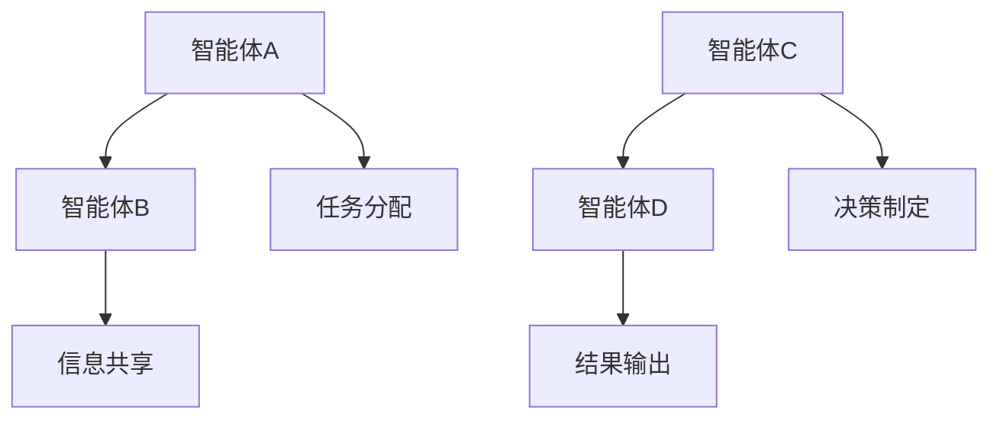
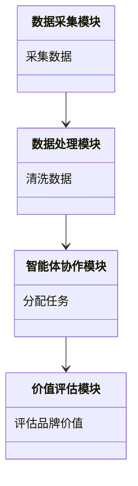
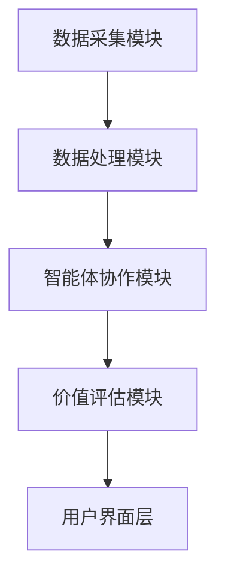

                 

<think>
好，我现在需要帮用户完成《多智能体系统在评估公司品牌权益价值中的应用》这篇文章的目录大纲和部分内容。用户已经提供了一个详细的目录结构，现在我需要根据这个结构逐步填充每个章节的内容。

首先，我需要理解每个章节的核心目标。例如，第1章介绍多智能体系统的基本概念，我需要解释什么是多智能体系统，它们的特点，以及为什么它们在品牌价值评估中有用。这部分需要简单明了，适合读者理解基本概念。

接下来，第2章讨论多智能体系统在品牌价值评估中的应用背景，我需要分析当前品牌价值评估的痛点，比如数据多样性、动态变化和传统方法的局限性，然后说明多智能体系统的优势和适用场景。这部分需要结合实际案例，让读者明白为什么选择多智能体系统。

第3章涉及多智能体系统的协同机制，我需要详细解释通信与协作、自主性与反应性等方面，可能需要使用一些图表来辅助说明，比如通信方式的流程图。同时，要讨论协作任务的分配和决策过程，确保内容详细且易于理解。

第4章是关于核心算法与数学模型，这部分比较技术性，我需要介绍几种典型的算法，比如一致性算法和协作算法，并展示它们的数学模型。可能需要使用LaTeX公式来表示，比如品牌价值的量化公式，同时用mermaid流程图展示算法的流程。

第5章和第6章是系统架构设计，我需要划分功能模块，设计系统流程，并用mermaid图展示架构和功能类图。这部分需要确保系统各模块之间的协作逻辑清晰，架构设计合理，便于读者理解如何实际应用这些系统。

项目实战部分需要具体案例分析，比如社交媒体数据的处理，用Python代码实现数据清洗和特征提取。这部分需要详细说明代码的功能和应用场景，帮助读者理解如何在实际中应用多智能体系统进行品牌价值评估。

最后，最佳实践部分需要总结经验，给出注意事项和扩展阅读的方向，帮助读者进一步深入学习。

在写作过程中，我需要确保每个章节内容详实，逻辑清晰，使用适当的图表和代码示例，以增强文章的可读性和专业性。同时，语言要简洁明了，避免过于复杂的术语，使读者能够轻松理解。

现在，我需要开始逐一撰写每个章节的内容，确保覆盖所有关键点，并保持整体结构的连贯性和深度。这将帮助读者全面理解多智能体系统在品牌价值评估中的应用及其技术细节。
</think>

# 多智能体系统在评估公司品牌权益价值中的应用

## 关键词：多智能体系统，品牌价值，评估方法，协同机制，数学模型

## 摘要：本文探讨了多智能体系统在品牌价值评估中的应用，分析了多智能体系统的协同机制及其在品牌价值评估中的优势。通过具体案例分析，详细阐述了多智能体系统的算法原理和系统架构设计，展示了其在品牌价值评估中的实际应用价值。

---

# 第一部分: 多智能体系统与品牌权益价值评估概述

## 第1章: 多智能体系统的基本概念

### 1.1 多智能体系统的定义与特点

#### 1.1.1 多智能体系统的定义
多智能体系统（Multi-Agent System, MAS）是由多个智能体组成的分布式系统，这些智能体能够通过协同工作完成复杂任务。每个智能体都是一个独立的实体，具有自主性、反应性和协作能力。

#### 1.1.2 多智能体系统的核心特点
- **自主性**：每个智能体能够自主决策和行动。
- **反应性**：智能体能够根据环境变化实时调整行为。
- **协作性**：多个智能体通过协作完成共同目标。
- **分布性**：智能体之间通过分布式通信进行协作。

#### 1.1.3 多智能体系统与传统单智能体系统的区别
| 特性 | 多智能体系统 | 单智能体系统 |
|------|--------------|--------------|
| 独立性 | 各智能体独立 | 单一控制中心 |
| 协作性 | 高 | 低 |
| 可扩展性 | 高 | 低 |
| 复杂性 | 高 | 低 |

### 1.2 品牌权益价值的定义与评估方法

#### 1.2.1 品牌权益的定义
品牌权益是品牌在市场中的价值，包括品牌知名度、美誉度、客户忠诚度等。

#### 1.2.2 品牌价值的评估维度
- 品牌知名度
- 品牌美誉度
- 品牌忠诚度
- 品牌影响力

#### 1.2.3 品牌价值评估的挑战与难点
- 数据来源多样且复杂
- 品牌影响力动态变化
- 传统评估方法主观性强

## 第2章: 多智能体系统在品牌价值评估中的应用背景

### 2.1 当前品牌价值评估的痛点与难点

#### 2.1.1 数据来源的多样性与复杂性
品牌价值评估需要整合社交媒体数据、市场调研数据等多种来源的数据。

#### 2.1.2 品牌影响力的动态变化
品牌价值会受到市场环境、消费者行为等多种因素的影响，具有动态变化的特点。

#### 2.1.3 传统评估方法的局限性
传统评估方法依赖于主观判断，难以量化品牌价值。

### 2.2 多智能体系统的优势与适用场景

#### 2.2.1 多智能体系统的分布式协作能力
多智能体系统能够高效处理分布式数据，适合处理复杂的品牌价值评估任务。

#### 2.2.2 多智能体系统在数据处理中的高效性
通过分布式计算，多智能体系统能够快速处理大量数据，提高评估效率。

#### 2.2.3 多智能体系统在品牌价值评估中的具体应用场景
- 数据采集与清洗
- 数据分析与建模
- 结果输出与可视化

---

# 第二部分: 多智能体系统的核心概念与原理

## 第3章: 多智能体系统的协同机制

### 3.1 多智能体系统的通信与协作

#### 3.1.1 智能体之间的通信方式
- **直接通信**：智能体之间直接交换信息。
- **间接通信**：通过中间媒介进行信息传递。

#### 3.1.2 协作任务的分配与协调
- **任务分配**：基于智能体的能力和当前状态，分配合适的任务。
- **协调机制**：通过协商和共识机制确保任务顺利进行。

#### 3.1.3 共识机制与决策过程
- **共识机制**：所有智能体达成一致意见。
- **决策过程**：基于协作机制，智能体共同制定决策。

#### 3.1.4 智能体协作流程


### 3.2 多智能体系统的自主性与反应性

#### 3.2.1 自主决策的基本原理
智能体根据环境信息自主决策，无需外部干预。

#### 3.2.2 反应式行为的实现方式
智能体能够实时感知环境变化并调整行为。

#### 3.2.3 自主性与反应性的平衡
- 自主性过强可能导致决策失误。
- 反应性过强可能导致决策延迟。

## 第4章: 多智能体系统的核心算法与数学模型

### 4.1 多智能体系统中的典型算法

#### 4.1.1 分布式一致性算法
- **一致性算法**：确保分布式系统中数据一致性。
- **应用场景**：数据同步、任务分配。

#### 4.1.2 跨组织协作算法
- **协作算法**：支持多组织之间的协作。
- **应用场景**：跨组织品牌价值评估。

#### 4.1.3 联合学习算法
- **联合学习**：多个智能体共同学习，提升整体性能。
- **应用场景**：品牌价值预测模型。

### 4.2 品牌价值评估的数学模型

#### 4.2.1 品牌价值的量化公式
$$ 品牌价值 = \alpha \times 品牌知名度 + \beta \times 品牌美誉度 + \gamma \times 品牌忠诚度 $$

#### 4.2.2 多智能体协同的数学模型
$$ \text{协同效率} = \sum_{i=1}^{n} \text{智能体}i \text{的贡献} $$

#### 4.2.3 模型的参数设定与优化
- 参数初始化：根据经验或数据初始化。
- 参数优化：通过反馈机制不断优化。

---

# 第三部分: 多智能体系统在品牌价值评估中的系统架构

## 第5章: 系统功能设计与实现

### 5.1 系统功能模块划分

#### 5.1.1 数据采集模块
- 负责采集品牌相关数据，包括社交媒体数据、市场调研数据等。

#### 5.1.2 数据处理模块
- 对采集到的数据进行清洗、转换和预处理。

#### 5.1.3 智能体协作模块
- 负责智能体之间的通信与协作，分配任务和协调资源。

#### 5.1.4 价值评估模块
- 基于处理后的数据，评估品牌价值。

### 5.2 系统功能流程设计

#### 5.2.1 数据采集与预处理流程
1. 数据采集模块从多个数据源采集数据。
2. 数据处理模块对数据进行清洗和转换。
3. 数据预处理模块将数据存储到数据库中。

#### 5.2.2 智能体协作与计算流程
1. 智能体协作模块分配任务给各个智能体。
2. 各智能体根据分配的任务进行计算。
3. 智能体协作模块汇总各智能体的计算结果。

#### 5.2.3 品牌价值评估与输出流程
1. 价值评估模块根据计算结果评估品牌价值。
2. 输出模块将评估结果输出给用户。

### 5.3 系统功能类图



## 第6章: 系统架构设计与实现

### 6.1 系统架构设计

#### 6.1.1 分层架构设计
- **数据层**：负责数据的存储和管理。
- **业务逻辑层**：负责业务逻辑的实现。
- **用户界面层**：负责与用户的交互。

#### 6.1.2 分布式架构设计
- **分布式数据存储**：数据分布在多个节点上。
- **分布式计算**：任务分布在多个智能体上进行计算。

### 6.2 系统架构流程图



---

# 第四部分: 项目实战与优化

## 第7章: 项目实战

### 7.1 环境安装与配置

```bash
# 安装Python和相关库
pip install numpy pandas scikit-learn
```

### 7.2 系统核心实现源代码

```python
# 数据采集模块
import requests

def collect_data(url):
    response = requests.get(url)
    return response.text

# 数据处理模块
import pandas as pd

def process_data(data):
    df = pd.DataFrame(data)
    return df

# 智能体协作模块
import numpy as np

def distribute_task(tasks):
    np.random.shuffle(tasks)
    return tasks[:len(tasks)//2], tasks[len(tasks)//2:]

# 价值评估模块
from sklearn import linear_model

def assess_value(features, labels):
    model = linear_model.LinearRegression()
    model.fit(features, labels)
    return model.predict(features)
```

### 7.3 实际案例分析与解读

#### 7.3.1 案例分析
某公司品牌价值评估案例：
- 数据来源：社交媒体数据、市场调研数据。
- 数据处理：清洗和预处理数据。
- 智能体协作：分配任务进行计算。
- 价值评估：基于计算结果评估品牌价值。

#### 7.3.2 代码实现与结果分析
```python
# 数据采集
data = collect_data("https://example.com/api")

# 数据处理
processed_data = process_data(data)

# 任务分配
tasks = distribute_task(processed_data)

# 价值评估
value_assessment = assess_value(tasks[0], tasks[1])

# 输出结果
print(value_assessment)
```

### 7.4 项目小结

#### 7.4.1 项目总结
- 多智能体系统能够高效处理品牌价值评估中的复杂任务。
- 通过分布式协作，提高了评估效率和准确性。

#### 7.4.2 项目经验
- 系统设计需要考虑数据的多样性和复杂性。
- 算法选择需要结合具体应用场景。

---

# 第五部分: 最佳实践与拓展阅读

## 第8章: 最佳实践

### 8.1 小结

#### 8.1.1 核心观点总结
- 多智能体系统在品牌价值评估中的应用具有显著优势。
- 通过合理设计系统架构和算法，能够提高评估效率和准确性。

### 8.2 注意事项

#### 8.2.1 系统设计中的注意事项
- 确保智能体之间的通信高效可靠。
- 处理好智能体的自主性和反应性的平衡。

#### 8.2.2 数据处理中的注意事项
- 数据清洗和预处理是关键步骤。
- 需要处理数据的多样性和复杂性。

### 8.3 拓展阅读

#### 8.3.1 相关书籍
- 《多智能体系统的理论与应用》
- 《品牌管理与价值评估》

#### 8.3.2 在线资源
- 多智能体系统相关论文
- 品牌价值评估相关文章

---

# 结语

多智能体系统在品牌价值评估中的应用前景广阔，通过合理设计和优化，能够显著提高评估效率和准确性。未来，随着技术的不断发展，多智能体系统在品牌价值评估中的应用将更加广泛和深入。

---

# 作者

作者：AI天才研究院/AI Genius Institute & 禅与计算机程序设计艺术 /Zen And The Art of Computer Programming

