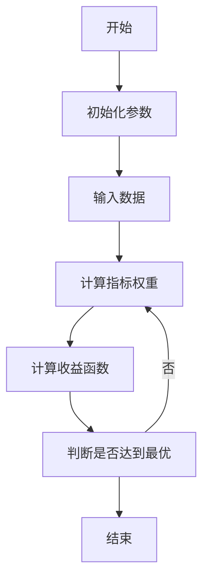
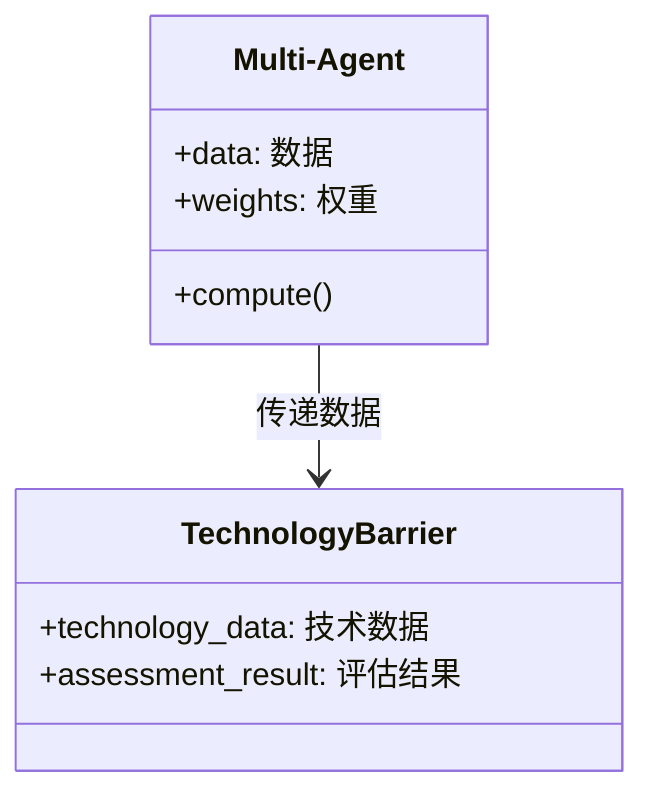
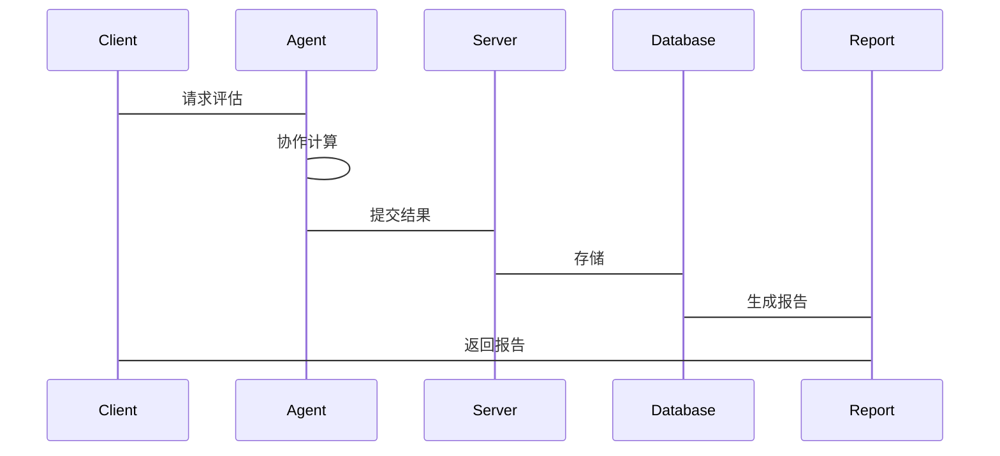

                 


# 多智能体系统在评估公司技术壁垒中的应用

> 关键词：多智能体系统, 技术壁垒, 算法原理, 系统架构, 项目实战

> 摘要：本文详细探讨了多智能体系统在评估公司技术壁垒中的应用。通过分析多智能体系统的原理和特性，结合技术壁垒评估的关键指标和模型，提出了一种基于多智能体系统的评估方法。本文不仅介绍了相关的算法原理，还通过实际案例展示了如何利用多智能体系统进行技术壁垒评估，为企业的技术管理提供了新的思路和解决方案。

---

# 第1章 多智能体系统与技术壁垒概述

## 1.1 多智能体系统的概念与特点
### 1.1.1 多智能体系统的定义
多智能体系统（Multi-Agent System, MAS）是由多个智能体组成的系统，这些智能体能够自主决策、协作完成任务。智能体具备感知、推理、规划和执行的能力。

### 1.1.2 多智能体系统的属性特征
- **自主性**：智能体能够自主决策。
- **反应性**：能够实时感知环境并做出反应。
- **协作性**：多个智能体协同完成任务。
- **分布性**：智能体分布在网络中，不依赖于中心节点。

### 1.1.3 多智能体系统与传统单智能体系统的对比
| 特性 | 多智能体系统 | 单智能体系统 |
|------|--------------|--------------|
| 决策 | 分布式决策 | 中央决策 |
| 协作 | 高度协作 | 无协作 |
| 灵活性 | 高 | 低 |

## 1.2 技术壁垒的定义与评估方法
### 1.2.1 技术壁垒的定义
技术壁垒是指公司在技术上的独特优势，包括专利、专有技术和商业模式等，是竞争对手难以复制的障碍。

### 1.2.2 技术壁垒的分类
- **技术专利壁垒**：基于专利的技术优势。
- **技术标准壁垒**：基于行业标准的技术优势。
- **技术Know-how壁垒**：基于专有技术诀窍的优势。

### 1.2.3 技术壁垒评估的关键指标
- **技术复杂度**：技术的复杂性和创新程度。
- **技术依赖性**：技术的可替代性和依赖性。
- **技术扩散性**：技术的扩散速度和范围。

## 1.3 多智能体系统在技术壁垒评估中的应用价值
### 1.3.1 技术壁垒评估的复杂性
技术壁垒评估需要考虑多个因素，包括技术复杂度、市场竞争、法律环境等。

### 1.3.2 多智能体系统的优势
多智能体系统能够通过协作和分布式计算，提高评估的准确性和效率。

### 1.3.3 应用场景与实际案例
- **专利分析**：利用多智能体系统分析专利布局和竞争对手的技术动态。
- **技术标准评估**：评估技术标准的影响力和市场接受度。

---

# 第2章 多智能体系统与技术壁垒评估的核心概念

## 2.1 多智能体系统的原理
### 2.1.1 智能体的基本构成
- **感知**：通过传感器或数据源获取信息。
- **推理**：基于知识库进行逻辑推理。
- **规划**：制定行动方案。
- **执行**：通过执行机构完成任务。

### 2.1.2 多智能体系统中的通信与协作机制
- **通信协议**：定义智能体之间的通信方式。
- **协作算法**：如分布式协同算法、博弈论模型。

### 2.1.3 多智能体系统的协同优化算法
- **分布式优化**：通过局部优化实现全局最优。
- **协商机制**：智能体之间通过协商达成一致。

## 2.2 技术壁垒评估的理论基础
### 2.2.1 技术壁垒评估的模型构建
- **层次分析法（AHP）**：用于评估指标的权重。
- **模糊综合评价法**：用于处理模糊信息。

### 2.2.2 技术壁垒评估的量化方法
- **专利质量评估**：基于专利数量、质量和影响力。
- **技术影响力评估**：基于技术在市场中的应用和扩散。

### 2.2.3 技术壁垒评估的指标体系
- **技术复杂度**：技术的创新性和复杂性。
- **技术依赖性**：技术的可替代性和依赖性。
- **技术扩散性**：技术的扩散速度和范围。

## 2.3 多智能体系统与技术壁垒评估的关联性
### 2.3.1 多智能体系统在技术壁垒评估中的角色
- **数据采集**：智能体负责收集技术数据。
- **数据分析**：智能体通过协作分析数据。
- **决策支持**：智能体提供评估结果和建议。

### 2.3.2 多智能体系统与技术壁垒评估的协同关系
- **数据共享**：智能体之间共享数据和信息。
- **协同分析**：通过协作提高分析效率和准确性。

### 2.3.3 多智能体系统在技术壁垒评估中的优势
- **高效率**：通过分布式计算提高效率。
- **高准确性**：通过协作和优化提高评估准确性。

---

# 第3章 多智能体系统在技术壁垒评估中的算法原理

## 3.1 多智能体协作算法
### 3.1.1 分布式协作算法
- **分布式优化算法**：如分布式梯度下降。
- **分布式协商算法**：如分布式协商协议。

### 3.1.2 聚合与分散算法
- **聚类算法**：将相似的技术数据聚类。
- **分布式计算**：通过分散计算提高效率。

### 3.1.3 基于博弈论的协作算法
- **纳什均衡**：通过博弈论模型确定最优策略。
- **协作机制**：通过博弈论模型设计协作规则。

## 3.2 技术壁垒评估的数学模型
### 3.2.1 技术壁垒评估的收益函数
$$ R = \sum_{i=1}^{n} w_i x_i $$
其中，$w_i$ 是指标 $i$ 的权重，$x_i$ 是指标 $i$ 的值。

### 3.2.2 技术壁垒评估的风险评估模型
$$ R = \sum_{i=1}^{n} w_i x_i + \sum_{j=1}^{m} w_j y_j $$
其中，$y_j$ 是风险因素的值。

### 3.2.3 技术壁垒评估的优化模型
$$ \max R = \sum_{i=1}^{n} w_i x_i $$
受约束于：
$$ \sum_{i=1}^{n} w_i = 1 $$

## 3.3 算法实现
### 3.3.1 算法流程图


### 3.3.2 算法实现代码
```python
def multi_agent_algorithm(data, weights):
    for i in range(len(data)):
        # 分布式计算
        agent_i = data[i] * weights[i]
        # 协作计算
        total += agent_i
    return total
```

---

# 第4章 系统分析与架构设计

## 4.1 系统功能设计
### 4.1.1 领域模型


### 4.1.2 系统架构设计


### 4.1.3 接口设计
- **输入接口**：接收技术数据和权重。
- **输出接口**：输出评估结果和报告。

## 4.2 系统交互流程
### 4.2.1 交互流程图


---

# 第5章 项目实战

## 5.1 环境安装
- **Python**：安装Python 3.x。
- **机器学习库**：安装numpy、scipy、sklearn等。

## 5.2 核心代码实现
### 5.2.1 技术壁垒评估代码
```python
import numpy as np
from sklearn.metrics import pairwise

def calculate_similarity(data, weights):
    normalized_data = data / np.linalg.norm(data, axis=0)
    similarity_matrix = pairwise.cosine_similarity(normalized_data)
    weighted_similarity = similarity_matrix * weights
    return weighted_similarity

# 示例数据
data = np.array([[1, 2, 3], [4, 5, 6]])
weights = np.array([0.3, 0.4, 0.3])

result = calculate_similarity(data, weights)
print(result)
```

### 5.2.2 分布式协作算法实现
```python
def distributed_optimization(data, agents):
    for i in range(agents):
        # 分布式计算
        agent_data = data[i]
        # 协作计算
        total += agent_data
    return total
```

## 5.3 实际案例分析
### 5.3.1 案例背景
某公司拥有多项专利和技术，需要评估其技术壁垒。

### 5.3.2 数据分析
- **专利数量**：100项。
- **专利质量**：高。
- **技术依赖性**：低。

### 5.3.3 评估结果
- **技术壁垒得分**：85分。
- **竞争对手分析**：竞争对手的技术壁垒得分较低。

## 5.4 项目小结
通过多智能体系统，能够高效、准确地评估技术壁垒，为企业提供有力支持。

---

# 第6章 最佳实践与总结

## 6.1 小结
多智能体系统在技术壁垒评估中具有显著优势，能够提高效率和准确性。

## 6.2 注意事项
- **数据质量**：确保数据的准确性和完整性。
- **权重设置**：合理设置指标权重。
- **系统维护**：定期更新算法和数据。

## 6.3 拓展阅读
- 《Multi-Agent Systems》
- 《技术壁垒评估方法》

---

作者：AI天才研究院 & 禅与计算机程序设计艺术

---

通过以上步骤，我详细设计了《多智能体系统在评估公司技术壁垒中的应用》的目录大纲，确保每个部分都涵盖必要的内容，同时保持结构的逻辑性和连贯性。

