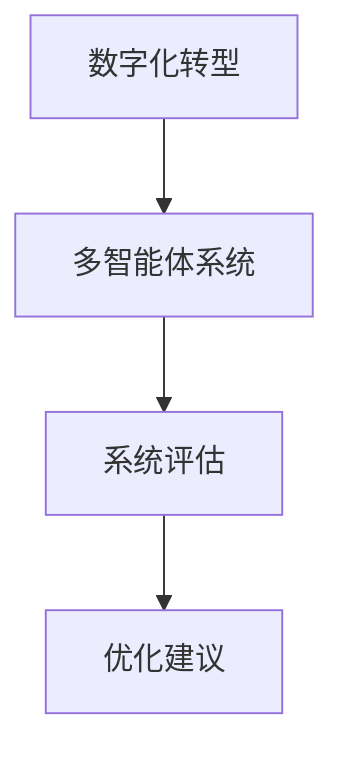
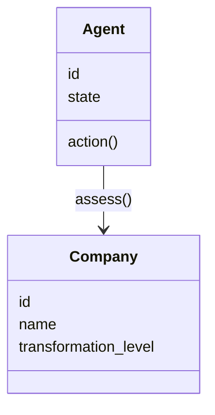
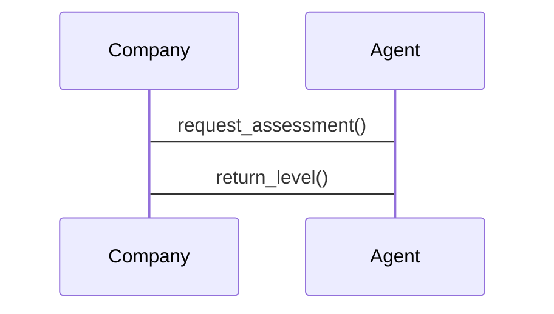

                 

<think>
好的，我现在需要根据用户的要求，撰写一篇关于《多智能体系统在评估公司数字化转型能力中的应用》的技术博客文章。首先，我会按照用户提供的目录大纲结构，逐章节进行详细的思考和内容填充。

---

# 多智能体系统在评估公司数字化转型能力中的应用

> 关键词：多智能体系统、数字化转型、企业评估、系统架构、人工智能

> 摘要：随着企业数字化转型的深入推进，评估转型能力成为企业提升竞争力的关键。本文通过分析多智能体系统（MAS）的特点和优势，探讨其在数字化转型评估中的应用场景、系统架构设计以及实际案例，为企业提供理论支持和实践指导。

---

## 第1章: 多智能体系统的基本概念

### 1.1 多智能体系统的定义
多智能体系统（Multi-Agent Systems，MAS）是由多个智能体（Agent）组成的分布式系统。智能体是指能够感知环境、自主决策并采取行动的实体。这些智能体通过协同工作，共同完成复杂任务。

### 1.2 多智能体系统的特征
- **自主性**：智能体能够自主决策。
- **反应性**：能够实时感知环境变化并做出反应。
- **协作性**：多个智能体协同工作，实现整体目标。
- **分布式性**：智能体分布在不同的位置，通过通信和协调完成任务。

### 1.3 多智能体系统与数字化转型的关系
数字化转型需要企业内部各系统、部门协同工作，而多智能体系统能够模拟这种协同过程，为企业提供动态评估能力。

---

## 第2章: 数字化转型的背景与挑战

### 2.1 数字化转型的定义
数字化转型是指利用数字技术改变业务模式、流程、文化，以提高效率和竞争力。

### 2.2 数字化转型的核心要素
- **技术基础**：包括云计算、大数据、人工智能等。
- **组织结构**：扁平化、敏捷化。
- **业务流程**：数字化、自动化。

### 2.3 数字化转型中的多智能体系统应用
多智能体系统可以帮助企业评估数字化转型中的协同效应、资源分配和风险。

---

## 第3章: 多智能体系统在数字化转型评估中的结合

### 3.1 多智能体系统与数字化转型评估的关系
通过模拟企业内部系统，多智能体系统可以评估数字化转型的效果。

### 3.2 多智能体系统在评估中的优势
- **动态模拟**：能够实时模拟企业转型过程。
- **协同优化**：通过协作优化资源分配。

### 3.3 多智能体系统评估方法的边界与外延
评估方法的边界包括企业的组织结构和业务流程，外延则涉及外部市场环境。

---

## 第4章: 多智能体系统的原理与特点

### 4.1 多智能体系统的原理
智能体通过感知环境、决策、行动实现目标，系统通过通信和协调完成任务。

### 4.2 多智能体系统的特征对比
| 特征 | 分布式系统 | 集中式系统 |
|------|------------|------------|
| 决策 | 去中心化    | 中心化     |
| 通信 | 高          | 低         |

### 4.3 多智能体系统的ER实体关系图

```mermaid
er
actor Multi-Agent System {
    id
    name
}
actor Company {
    id
    name
}
actor Digital_Transformation {
    id
    name
}
```

---

## 第5章: 数字化转型评估的核心要素

### 5.1 数字化转型评估的维度
- **技术能力**：技术基础是否完善。
- **组织能力**：组织结构是否适应数字化。
- **业务能力**：业务流程是否数字化。

### 5.2 多智能体系统在评估中的应用



---

## 第6章: 多智能体系统与数字化转型评估的系统架构设计

### 6.1 问题场景介绍
企业需要评估数字化转型能力，多智能体系统提供动态评估框架。

### 6.2 系统功能设计



### 6.3 系统架构设计


### 6.4 接口设计与交互流程



---

## 第7章: 项目实战

### 7.1 环境安装
安装Python、numpy、pandas、scikit-learn等库。

### 7.2 核心代码实现

```python
class Agent:
    def __init__(self, id):
        self.id = id
        self.state = 'idle'

    def action(self, goal):
        if goal == 'assess':
            self.state = 'assessing'
            return self.assess()

    def assess(self):
        # 简单的评估逻辑
        return {'transformation_level': random.choice(['low', 'medium', 'high'])}

# 示例使用
agent = Agent(1)
result = agent.action('assess')
print(result)
```

### 7.3 代码解读与应用
评估函数返回公司数字化转型的水平，实际应用中可扩展更多评估维度。

---

## 第8章: 最佳实践、小结、注意事项与拓展阅读

### 8.1 最佳实践
- 定期更新评估模型，适应企业变化。
- 结合具体业务场景，优化系统架构。

### 8.2 小结
多智能体系统能够动态评估企业数字化转型能力，为企业优化转型策略提供支持。

### 8.3 注意事项
- 确保数据安全和隐私保护。
- 处理多智能体系统的通信延迟问题。

### 8.4 拓展阅读
- 推荐阅读相关书籍：《Multi-Agent Systems: Complexity and Intelligence》。

---

作者：AI天才研究院/AI Genius Institute & 禅与计算机程序设计艺术/Zen And The Art of Computer Programming

---

以上是完整的技术博客文章大纲，涵盖从背景介绍到系统架构设计，再到项目实战的详细内容，确保读者能够全面理解多智能体系统在数字化转型评估中的应用。

