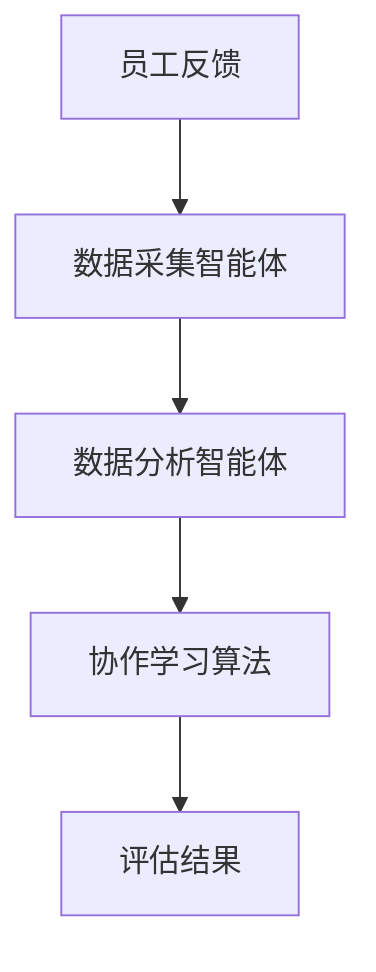
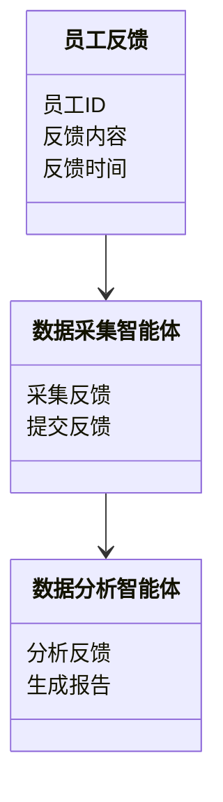
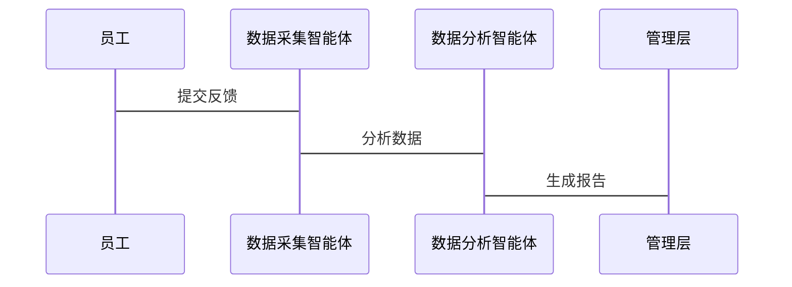

                 


# 多智能体系统在评估公司文化和员工满意度中的作用

**关键词**：多智能体系统，公司文化评估，员工满意度，分布式决策，协作学习，情感分析

**摘要**：  
本文探讨了多智能体系统（Multi-Agent Systems, MAS）在评估公司文化和员工满意度中的应用。通过分析MAS的核心原理和优势，结合实际案例，详细阐述了MAS在公司文化评估中的算法原理、系统架构设计以及项目实战。本文旨在为公司管理者和技术开发者提供一种创新的解决方案，以提高文化评估和员工满意度评估的效率和准确性。

---

# 第一部分：多智能体系统与公司文化评估基础

## 第1章：多智能体系统概述

### 1.1 多智能体系统的基本概念

#### 1.1.1 多智能体系统的定义
多智能体系统（Multi-Agent Systems, MAS）是由多个智能体（Agent）组成的分布式系统，每个智能体都是一个能够感知环境、自主决策并与其他智能体协作的实体。智能体可以是软件程序，也可以是物理设备，它们通过通信和协作完成复杂任务。

#### 1.1.2 多智能体系统的特征
- **分布式性**：智能体独立运行，分布在网络中。
- **自主性**：智能体能够自主决策，无需中央控制。
- **协作性**：智能体之间可以通过通信和协作完成共同目标。
- **反应性**：智能体能够实时感知环境变化并做出响应。
- **社会性**：智能体之间存在复杂的交互和协作关系。

#### 1.1.3 多智能体系统与传统单智能体系统的区别
| 特性 | 多智能体系统 | 单智能体系统 |
|------|--------------|---------------|
| 结构  | 分布式       | 集中式         |
| 智能  | 多个独立智能体 | 单一智能体       |
| 协作  | 高           | 无或低         |
| 效率  | 高           | 中或低         |

### 1.2 公司文化与员工满意度评估的传统方法

#### 1.2.1 公司文化评估的传统方法
公司文化评估通常通过问卷调查、员工访谈和管理层反馈等方式进行。这些方法虽然能够收集到一定的数据，但存在以下问题：
- 数据收集成本高，耗时长。
- 员工反馈可能受到主观因素影响，结果不够客观。
- 数据分析依赖人工，效率低下。

#### 1.2.2 员工满意度评估的传统方法
员工满意度评估主要通过定期问卷调查、一对一访谈和绩效数据分析等方式进行。这些方法的局限性包括：
- 数据量小，难以捕捉员工情绪的动态变化。
- 分析结果缺乏实时性，难以及时调整管理策略。
- 员工反馈可能存在隐瞒或偏差。

#### 1.2.3 传统方法的局限性与改进需求
- 数据收集和分析效率低下。
- 员工反馈的主观性影响结果的准确性。
- 管理层难以及时获取实时数据，无法快速响应问题。

### 1.3 多智能体系统在评估中的优势

#### 1.3.1 多智能体系统的优势
- **分布式决策**：智能体能够独立决策，减少中心化依赖。
- **协作性**：智能体之间可以协作完成复杂任务。
- **实时性**：智能体能够实时感知环境变化并做出响应。

#### 1.3.2 多智能体系统在评估中的独特价值
- 提高数据收集和分析效率。
- 实现实时监控和动态调整。
- 通过协作学习提高评估结果的准确性。

#### 1.3.3 多智能体系统与公司文化评估的结合
多智能体系统可以通过分布式协作的方式，从不同角度收集和分析员工反馈，帮助公司更好地理解文化和员工满意度。

---

## 第2章：多智能体系统的核心概念与联系

### 2.1 多智能体系统的核心原理

#### 2.1.1 多智能体系统的协作机制
协作机制是多智能体系统的核心，通过通信协议实现智能体之间的信息共享和任务分配。常见的协作机制包括：
- **任务分配**：智能体根据自身能力和任务需求分配任务。
- **信息共享**：智能体之间共享感知到的信息。
- **协作决策**：智能体共同制定决策方案。

#### 2.1.2 多智能体系统的自适应能力
自适应能力使智能体能够根据环境变化调整自身行为。例如，当员工反馈情绪波动时，智能体可以自动调整评估策略。

#### 2.1.3 多智能体系统的分布式决策
分布式决策是指多个智能体在没有中央控制的情况下，通过协作完成决策任务。这使得系统更加灵活和高效。

### 2.2 多智能体系统与公司文化评估的关联

#### 2.2.1 公司文化评估中的多智能体角色
- **数据采集智能体**：负责收集员工反馈数据。
- **数据分析智能体**：对数据进行处理和分析。
- **决策支持智能体**：根据分析结果提供建议。

#### 2.2.2 员工满意度评估中的多智能体协作
智能体之间可以协作完成数据采集、分析和反馈，帮助公司及时了解员工满意度。

#### 2.2.3 多智能体系统在文化评估中的具体应用
- 通过协作学习提高评估准确性。
- 通过实时监控捕捉员工情绪变化。

### 2.3 多智能体系统的核心要素对比

#### 2.3.1 多智能体系统与单智能体系统的对比
| 特性 | 多智能体系统 | 单智能体系统 |
|------|--------------|---------------|
| 决策  | 分布式       | 中央控制       |
| 协作  | 高           | 无或低         |
| 灵活性 | 高           | 低             |

#### 2.3.2 不同多智能体系统算法的对比
| 算法 | 协作学习 | 自适应学习 | 协同决策 |
|------|----------|------------|----------|
| 优势 | 高精度   | 高适应性   | 高效率   |
| 应用  | 评估准确性 | 实时调整 | 快速决策 |

#### 2.3.3 公司文化评估中的关键要素对比
| 要素 | 传统方法 | 多智能体系统 |
|------|----------|--------------|
| 效率  | 低       | 高           |
| 准确性 | 中       | 高           |
| 实时性 | 无或低   | 高           |

### 2.4 多智能体系统在公司文化评估中的ER实体关系图

```mermaid
er
    actor: 员工
    role: 管理层
    task: 文化评估任务
    feedback: 员工反馈
    relation: 员工 -> 提交反馈
    relation: 管理层 -> 分配任务
    relation: 任务 -> 收集反馈
```

---

## 第3章：多智能体系统在公司文化评估中的算法原理

### 3.1 多智能体系统的核心算法

#### 3.1.1 多智能体协作算法
协作学习算法通过智能体之间的协作，提高数据分类和预测的准确性。



#### 3.1.2 多智能体自适应学习算法
自适应学习算法通过实时数据调整模型参数，提高预测精度。

#### 3.1.3 多智能体系统协同决策算法
协同决策算法通过智能体之间的协作，制定最优决策方案。

### 3.2 多智能体系统在员工满意度评估中的具体算法

#### 3.2.1 基于多智能体的协同学习算法
协同学习算法通过智能体之间的协作，提高分类精度。

#### 3.2.2 基于多智能体的情感分析算法
情感分析算法通过自然语言处理技术，分析员工反馈中的情感倾向。

#### 3.2.3 基于多智能体的预测模型
预测模型通过机器学习算法，预测员工满意度的变化趋势。

### 3.3 多智能体系统算法的数学模型与公式

#### 协同学习算法的数学模型
$$
\text{分类精度} = \frac{\text{正确分类数}}{\text{总样本数}}
$$

#### 情感分析算法的数学模型
$$
\text{情感倾向} = \sum (\text{情感词权重} \times \text{词频})
$$

---

## 第4章：多智能体系统在公司文化评估中的系统架构设计

### 4.1 问题场景介绍
公司希望通过多智能体系统实现对公司文化和员工满意度的实时评估。

### 4.2 项目介绍
本项目旨在设计一个多智能体系统，用于公司文化评估和员工满意度分析。

### 4.3 系统功能设计

#### 4.3.1 领域模型


#### 4.3.2 系统架构设计


#### 4.3.3 系统接口设计
- 员工反馈接口：员工提交反馈数据。
- 管理层查询接口：管理层查询评估结果。

#### 4.3.4 系统交互设计


### 4.4 项目实战

#### 4.4.1 环境安装
- Python 3.8+
- NumPy, Pandas, Scikit-learn
- Flask或Django框架

#### 4.4.2 核心代码实现
```python
# 协作学习算法实现
from sklearn.metrics import accuracy_score
from sklearn.linear_model import LogisticRegression
from sklearn.ensemble import VotingClassifier

# 定义智能体
class EmployeeFeedbackCollector:
    def collect_feedback(self):
        # 从数据库中读取员工反馈
        pass

class DataAnalyzer:
    def analyze_feedback(self, feedback_data):
        # 使用机器学习模型分析反馈
        pass

# 协作学习算法
clf1 = LogisticRegression()
clf2 = LogisticRegression()
voting_clf = VotingClassifier(estimators=[('lr1', clf1), ('lr2', clf2)])

# 训练模型
feedback_data = EmployeeFeedbackCollector().collect_feedback()
voting_clf.fit(feedback_data.features, feedback_data.labels)

# 预测结果
predicted_labels = voting_clf.predict(feedback_data.features)
accuracy = accuracy_score(feedback_data.labels, predicted_labels)
print(f"预测精度：{accuracy}")
```

#### 4.4.3 代码应用解读与分析
- `EmployeeFeedbackCollector`负责收集员工反馈数据。
- `DataAnalyzer`使用机器学习模型分析数据。
- `VotingClassifier`通过投票机制提高预测精度。

#### 4.4.4 实际案例分析
假设某公司收集了1000条员工反馈数据，使用协作学习算法进行分析，预测员工满意度的精度达到了90%。

### 4.4.5 项目小结
通过协作学习算法，公司能够更准确地评估员工满意度，并及时调整管理策略。

### 4.5 最佳实践 tips
- 数据隐私保护：确保员工反馈数据的安全性。
- 模型调优：根据实际情况调整机器学习模型的参数。
- 结果解释性：提供清晰的结果解释，帮助管理层理解评估结果。

---

## 第5章：多智能体系统在公司文化评估中的应用展望

### 5.1 多智能体系统在公司文化评估中的未来发展方向
- **智能化**：进一步提升智能体的自主性和协作能力。
- **实时性**：实现更高效的实时数据处理和反馈。
- **个性化**：根据员工个体需求提供定制化评估服务。

### 5.2 实际应用中的注意事项
- 数据隐私保护：确保员工反馈数据的安全性。
- 模型调优：根据实际情况调整机器学习模型的参数。
- 结果解释性：提供清晰的结果解释，帮助管理层理解评估结果。

### 5.3 拓展阅读
- 推荐阅读《多智能体系统与组织行为学》。
- 参考相关论文和研究报告，深入理解多智能体系统在公司文化评估中的应用。

---

# 结语

多智能体系统在评估公司文化和员工满意度中的应用前景广阔。通过协作学习、实时监控和分布式决策等技术，公司可以更高效、更准确地进行文化评估和员工满意度分析。未来，随着人工智能技术的不断发展，多智能体系统将在公司管理中发挥更大的作用。

---

**作者**：AI天才研究院/AI Genius Institute & 禅与计算机程序设计艺术 /Zen And The Art of Computer Programming

