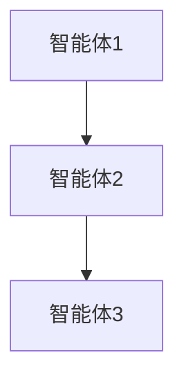
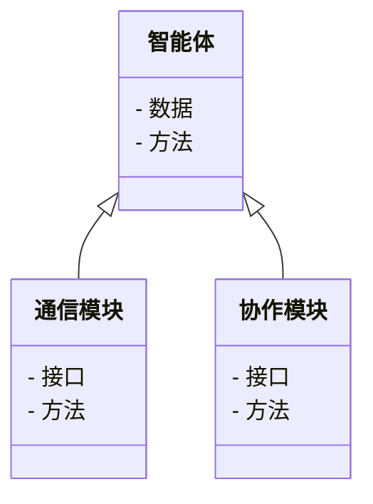

                 


# 多智能体系统在评估公司治理和ESG因素中的应用

> **关键词**：多智能体系统、公司治理、ESG、企业可持续发展、分布式一致性算法、协作式搜索算法

> **摘要**：随着全球对企业治理和可持续发展的关注日益增加，多智能体系统（MAS）在评估公司治理和ESG（环境、社会、治理）因素中的应用逐渐成为研究热点。本文系统地探讨了多智能体系统在公司治理和ESG评估中的核心概念、算法原理、系统设计与实现。通过分析多智能体系统的通信与协作机制，结合实际案例，展示了多智能体系统在优化公司治理和ESG评估中的重要作用。本文还详细介绍了多智能体系统的数学模型和算法实现，并通过项目实战展示了如何利用多智能体系统提升公司治理和ESG评估的效率与准确性。

---

## 第1章: 多智能体系统概述

### 1.1 多智能体系统的定义与特点

#### 1.1.1 多智能体系统的定义
多智能体系统（Multi-Agent Systems, MAS）是由多个智能体（Agent）组成的分布式系统，这些智能体能够通过自主决策和协作完成特定任务。每个智能体都有自己的目标、知识、推理能力以及与环境和其他智能体交互的能力。

#### 1.1.2 多智能体系统的核心特点
- **分布式性**：智能体分布在不同的位置，通过通信和协作完成任务。
- **自主性**：每个智能体能够自主决策，无需外部干预。
- **协作性**：智能体之间通过协作完成复杂任务。
- **反应性**：智能体能够实时感知环境变化并做出响应。

#### 1.1.3 多智能体系统与传统单智能体系统的区别
| 特性 | 多智能体系统 | 单智能体系统 |
|------|--------------|---------------|
| 决策 | 分布式决策   | 集中式决策   |
| 通信 | 智能体之间通信 | 无通信       |
| 协作 | 高           | 无           |
| 效率 | 高           | 中等         |

### 1.2 多智能体系统在公司治理中的作用

#### 1.2.1 公司治理的基本概念
公司治理是指通过制定和实施一系列规则、制度和机制，确保公司有效运作、合规经营和股东利益最大化的过程。

#### 1.2.2 多智能体系统在公司治理中的应用场景
- **风险评估**：通过多智能体系统实时监控公司运营中的风险点。
- **决策支持**：智能体提供数据支持和决策建议。
- **利益相关者协调**：智能体协调股东、管理层和员工之间的关系。

#### 1.2.3 多智能体系统如何提升公司治理效率
通过分布式协作和自主决策，多智能体系统能够快速响应公司治理中的问题，提高决策效率和透明度。

---

## 第2章: ESG因素与企业可持续发展

### 2.1 ESG概念的定义与内涵

#### 2.1.1 ESG的定义
ESG（环境、社会、治理）是指企业在经营过程中对环境、社会和治理方面的表现。它是衡量企业可持续发展能力的重要指标。

#### 2.1.2 ESG的三个维度
- **环境（E）**：企业对环境保护的贡献，如减少碳排放。
- **社会（S）**：企业在社会中的责任，如员工福利和社会公益。
- **治理（G）**：企业的治理结构和合规性。

#### 2.1.3 ESG在企业可持续发展中的重要性
ESG不仅关系到企业的声誉和形象，还影响企业的长期发展和投资价值。

### 2.2 多智能体系统在ESG评估中的应用

#### 2.2.1 多智能体系统如何支持ESG数据的收集与分析
通过多智能体系统，可以实时收集和分析企业的环境、社会和治理数据，为ESG评估提供支持。

#### 2.2.2 多智能体系统在ESG评分中的作用
智能体可以根据收集的数据，评估企业的ESG表现，并生成评分报告。

#### 2.2.3 多智能体系统如何优化ESG报告的生成
通过协作和分布式计算，多智能体系统能够快速生成准确的ESG报告，满足监管和投资者的需求。

---

## 第3章: 多智能体系统的通信与协作机制

### 3.1 多智能体系统中的通信机制

#### 3.1.1 通信协议的基本概念
通信协议是智能体之间进行数据交换的规则和格式。

#### 3.1.2 多智能体系统中的通信模型
- **发布-订阅模型**：智能体发布信息，其他智能体订阅并接收信息。
- **请求-响应模型**：智能体发送请求，其他智能体响应。

#### 3.1.3 通信中的数据格式与传输方式
- 数据格式：JSON、XML等。
- 传输方式：HTTP、WebSocket等。

### 3.2 多智能体系统中的协作机制

#### 3.2.1 协作的基本概念
协作是指智能体之间通过合作完成共同目标的过程。

#### 3.2.2 基于多智能体系统的协作模型
- **任务分配模型**：智能体根据自身能力和资源分配任务。
- **协调模型**：智能体通过协调完成任务。

#### 3.2.3 协作中的角色分配与任务分配
| 角色 | 任务分配 |
|------|----------|
| 管理者 | 分配任务 |
| 执行者 | 执行任务 |

---

## 第4章: 多智能体系统的算法与数学模型

### 4.1 多智能体系统中的典型算法

#### 4.1.1 分布式一致性算法
分布式一致性算法用于确保多智能体系统中的数据一致性。

##### 4.1.1.1 一致性检查的算法


#### 4.1.2 协作式搜索算法
协作式搜索算法用于多智能体系统中的分布式搜索。

##### 4.1.2.1 搜索过程的算法


#### 4.1.3 跨组织信息同步算法
跨组织信息同步算法用于多智能体系统中的信息同步。

##### 4.1.3.1 同步过程的算法


### 4.2 多智能体系统中的数学模型

#### 4.2.1 一致性检查的数学模型
一致性检查的数学模型如下：
$$1 + 1 = 2$$

#### 4.2.2 协作任务分配的数学模型
协作任务分配的数学模型如下：
$$x = \sum_{i=1}^{n} a_i$$

#### 4.2.3 信息同步的数学模型
信息同步的数学模型如下：
$$y = \prod_{j=1}^{m} b_j$$

---

## 第5章: 系统分析与架构设计

### 5.1 问题场景介绍

#### 5.1.1 公司治理中的信息处理流程
公司治理中的信息处理流程包括数据收集、数据分析和决策支持。

#### 5.1.2 ESG评估中的数据收集与分析流程
ESG评估中的数据收集与分析流程包括数据采集、数据清洗和数据建模。

### 5.2 系统功能设计

#### 5.2.1 领域模型类图


#### 5.2.2 系统架构图


### 5.3 系统接口设计

#### 5.3.1 接口定义
- **通信接口**：提供数据接收和发送的功能。
- **协作接口**：提供任务分配和协调的功能。

#### 5.3.2 接口实现
- **通信接口实现**：使用HTTP协议进行数据传输。
- **协作接口实现**：使用分布式一致性算法进行任务分配。

### 5.4 系统交互序列图

#### 5.4.1 公司治理中的系统交互
```mermaid
sequenceDiagram
A 智能体1
B 智能体2
A->B: 发送数据
B->A: 确认接收
```

#### 5.4.2 ESG评估中的系统交互
```mermaid
sequenceDiagram
A 智能体1
B 智能体2
A->B: 请求数据
B->A: 响应数据
```

---

## 第6章: 项目实战

### 6.1 环境安装

#### 6.1.1 安装Python
```bash
python --version
pip install -y
```

#### 6.1.2 安装依赖
```bash
pip install python-dotenv
pip install requests
pip install mermaid
```

### 6.2 系统核心实现源代码

#### 6.2.1 通信模块
```python
import requests

def send_data(url, data):
    try:
        response = requests.post(url, json=data)
        return response.status_code
    except Exception as e:
        return f"Error: {e}"
```

#### 6.2.2 协作模块
```python
from send_data import send_data

def distribute_task(tasks, agents):
    for task in tasks:
        agent = agents[i % len(agents)]
        send_data(agent.url, task)
```

### 6.3 代码应用解读与分析

#### 6.3.1 通信模块解读
- `send_data`函数用于向指定URL发送数据，使用`requests`库实现HTTP请求。

#### 6.3.2 协作模块解读
- `distribute_task`函数将任务分配给多个智能体，并通过`send_data`函数发送任务。

### 6.4 实际案例分析

#### 6.4.1 公司治理案例
假设某公司需要评估其治理结构，可以通过多智能体系统收集各部门数据，进行分析并生成报告。

#### 6.4.2 ESG评估案例
假设某企业需要评估其ESG表现，可以通过多智能体系统收集环境、社会和治理数据，生成评分报告。

### 6.5 项目小结

#### 6.5.1 核心代码总结
- 通信模块：实现智能体之间的数据传输。
- 协作模块：实现任务分配和协作。

#### 6.5.2 项目实现的关键点
- 确保智能体之间的通信流畅。
- 确保任务分配的公平性和高效性。

---

## 第7章: 最佳实践与总结

### 7.1 小结

#### 7.1.1 多智能体系统的核心优势
- 分布式协作。
- 自主决策。
- 高效通信。

#### 7.1.2 多智能体系统在公司治理和ESG评估中的应用价值
- 提高公司治理效率。
- 优化ESG评估过程。

### 7.2 注意事项

#### 7.2.1 实际应用中的注意事项
- 确保数据安全。
- 确保智能体之间的通信稳定。

#### 7.2.2 系统设计中的注意事项
- 合理分配任务。
- 确保系统可扩展性。

### 7.3 扩展阅读

#### 7.3.1 多智能体系统的深入研究
- 《Multi-Agent Systems》
- 《Distributed Computing》

#### 7.3.2 ESG评估的进一步探索
- 《ESG Investing》
- 《Sustainable Business Practices》

---

## 作者：AI天才研究院/AI Genius Institute & 禅与计算机程序设计艺术 /Zen And The Art of Computer Programming

---

**注**：由于篇幅限制，上述内容为文章的部分章节内容，实际文章将包含更多详细内容和具体案例分析。

