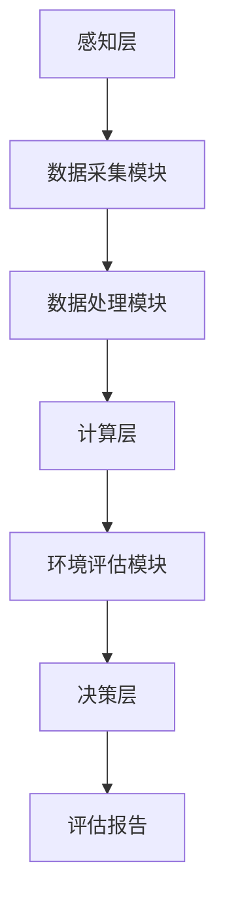

                 

<think>
好的，我现在需要帮用户撰写一篇关于《多智能体系统在评估公司环境责任表现中的应用》的技术博客文章。用户的要求非常详细，我得一步步来，确保不遗漏任何部分。

首先，用户提供了目录结构，我得按照这个结构来写。文章应该有摘要、关键词，然后是七章内容，每章还有三级小节。我得确保每部分都涵盖必要的内容，比如背景介绍、核心概念、算法原理、系统架构、项目实战、最佳实践等。

我先看摘要部分。摘要需要简洁地概括文章的核心内容，强调多智能体系统如何提升环境责任评估的效率和全面性。这部分要吸引读者，让他们了解文章的价值。

接下来是关键词，我需要列出5-7个相关术语，比如多智能体系统、环境责任评估、协作学习、分布式计算、系统架构等。这些关键词要准确反映文章主题，方便读者搜索。

第一章是背景介绍。我得先解释多智能体系统的基本概念，然后介绍环境责任评估的重要性，最后说明两者结合的应用背景。这部分要让读者明白为什么需要多智能体系统来评估环境责任。

第二章是核心概念与原理，我需要详细讲解多智能体系统的组成和环境责任评估的指标体系，并分析它们的结合。这里可能需要画一些图表，比如ER实体关系图，用mermaid展示。

第三章是算法原理，我得选择几个相关的算法，比如分布式计算和协作学习，详细解释它们的数学模型，并用mermaid流程图展示算法步骤。同时，给出Python代码示例，帮助读者理解。

第四章是系统分析与架构设计，我需要介绍系统的需求分析，然后设计分层架构，使用mermaid画出系统架构图和交互序列图。这部分要让读者清楚系统的组成部分和交互流程。

第五章是项目实战，我需要提供一个具体的案例，比如碳排放评估系统。详细描述环境安装步骤，给出核心代码，分析案例结果，并总结经验教训。

第六章是最佳实践与总结，我得列出应用中的注意事项，比如数据隐私和系统容错性，然后总结全文，展望未来的研究方向。

最后，确保文章结构完整，每章内容丰富具体，使用markdown格式，并在适当位置嵌入mermaid图表和latex公式。同时，文章末尾要加上作者信息，符合用户的要求。

现在，我需要开始逐步撰写每一部分，确保内容详细且符合逻辑。可能遇到的困难包括如何将复杂的算法解释得通俗易懂，以及如何设计合理的系统架构。我得仔细思考每个部分的结构，确保内容连贯，层次分明。

总的来说，我需要按照用户提供的大纲，逐一展开每个部分，确保每章内容充实，图表清晰，公式准确。这样才能满足用户的需求，写出一篇高质量的技术博客文章。
</think>

```markdown
# 多智能体系统在评估公司环境责任表现中的应用

> 关键词：多智能体系统, 环境责任评估, 分布式计算, 协作学习, 系统架构

> 摘要：随着全球对可持续发展的关注增加，企业环境责任的表现变得至关重要。多智能体系统（MAS）作为一种分布式、协作性、智能化的计算范式，在环境责任评估中展现出独特的优势。本文详细探讨了多智能体系统在环境责任评估中的应用背景、核心概念、算法原理、系统架构、项目实战以及最佳实践。通过理论分析和实际案例，本文展示了多智能体系统如何提升环境责任评估的效率和全面性，为企业实现可持续发展目标提供技术支持。

---

# 第1章: 多智能体系统与环境责任评估概述

## 1.1 多智能体系统的基本概念

### 1.1.1 多智能体系统的定义
多智能体系统（Multi-Agent System, MAS）是由多个智能体（Agent）组成的分布式计算系统，这些智能体通过协同工作完成特定任务。智能体是具有感知、推理、规划和执行能力的实体，能够独立决策并与其他智能体或环境交互。

### 1.1.2 多智能体系统的特征
- **分布式性**：智能体分布在不同的空间或计算节点上，独立运行。
- **协作性**：智能体之间通过通信和协作完成共同目标。
- **智能化**：每个智能体都具备一定的推理和决策能力。
- **动态性**：系统运行环境和任务需求可能动态变化。

### 1.1.3 多智能体系统与单智能体系统的区别
| 特性         | 单智能体系统                   | 多智能体系统                   |
|--------------|-------------------------------|-------------------------------|
| 系统结构     | 单一中心化                     | 分布式、去中心化               |
| 智能体数量   | 1                             | 多                             |
| 任务处理     | 单点处理                       | 分散处理、协作完成             |
| 系统复杂度   | 较低                           | 较高                           |

## 1.2 环境责任评估的定义与重要性

### 1.2.1 环境责任评估的定义
环境责任评估是指对企业在环境保护方面的表现进行量化和评估，包括资源消耗、碳排放、污染治理等方面。其目的是帮助企业识别环境风险，优化环境管理，实现可持续发展目标。

### 1.2.2 环境责任评估的重要性
- **合规性要求**：企业需要满足国家和国际的环保法规。
- **社会责任**：提升企业形象，增强社会信任。
- **经济利益**：通过优化资源利用降低成本，创造经济价值。
- **可持续发展**：推动绿色经济，实现长期发展。

### 1.2.3 环境责任评估的指标体系
环境责任评估的指标体系通常包括以下几类：
1. **环境影响指标**：碳排放、能源消耗、水资源使用等。
2. **环境管理指标**：环保政策执行、环境管理体系认证（如ISO 14001）。
3. **环境绩效指标**：减排效果、资源循环利用率、环保投入产出比。

## 1.3 多智能体系统在环境责任评估中的应用背景

### 1.3.1 环境责任评估的复杂性
环境责任评估涉及多个方面，数据来源多样，且需要实时监控和动态调整。传统的集中式评估方法难以应对数据量大、分布广的挑战。

### 1.3.2 多智能体系统的优势
- **分布式数据采集**：智能体可以分布部署，实时采集环境数据。
- **协作计算**：多个智能体协同完成复杂计算任务，提升评估效率。
- **自适应性**：智能体能够根据环境变化动态调整评估策略。

### 1.3.3 多智能体系统在环境责任评估中的潜在价值
通过多智能体系统，企业可以实现环境数据的实时采集、分布式计算和智能评估，从而更准确、更及时地优化环境管理策略。

---

# 第2章: 多智能体系统的核心概念与原理

## 2.1 多智能体系统的组成与结构

### 2.1.1 智能体的定义与分类
智能体是一种能够感知环境、自主决策并执行任务的实体。根据智能体的智能水平，可以分为：
1. **反应式智能体**：基于当前感知做出反应。
2. **认知式智能体**：具备推理、规划和学习能力。

### 2.1.2 多智能体系统的层次结构
多智能体系统通常分为以下层次：
1. **感知层**：负责数据采集和环境感知。
2. **计算层**：进行数据处理和分析。
3. **决策层**：制定评估策略和行动计划。
4. **执行层**：执行决策并输出结果。

### 2.1.3 多智能体系统的通信机制
智能体之间的通信可以通过以下方式进行：
- **直接通信**：智能体之间通过消息传递直接交互。
- **间接通信**：通过中间件或共享数据库进行间接交互。

## 2.2 环境责任评估的核心要素

### 2.2.1 环境数据的采集与处理
环境数据的采集需要考虑数据的实时性、准确性和完整性。常见的环境数据包括：
- **能源消耗**：电力、燃气等能源的使用量。
- **碳排放**：二氧化碳等温室气体的排放量。
- **资源利用**：水、土地等资源的使用情况。

### 2.2.2 环境责任评估的指标体系
环境责任评估的指标体系需要涵盖企业的环境影响、环境管理和社会责任三个方面。

### 2.2.3 环境责任评估的模型与方法
常用的环境责任评估方法包括：
- **生命周期评估（LCA）**：从产品或服务的全生命周期进行环境影响分析。
- **碳足迹计算**：计算企业运营过程中产生的碳排放总量。

## 2.3 多智能体系统与环境责任评估的结合

### 2.3.1 多智能体系统在环境数据采集中的应用
通过分布部署智能体，实时采集企业内外部的环境数据，确保数据的实时性和准确性。

### 2.3.2 多智能体系统在环境责任评估中的优势
- **高效性**：多个智能体协同工作，提升数据处理和计算效率。
- **智能性**：智能体具备自主学习和优化能力，能够动态调整评估策略。

### 2.3.3 多智能体系统与环境责任评估的协同机制
通过智能体之间的协作，实现环境数据的实时采集、分析和评估，为企业提供精准的环境责任评估结果。

---

# 第3章: 环境责任评估的多智能体系统架构设计

## 3.1 环境责任评估系统的需求分析

### 3.1.1 系统目标
构建一个基于多智能体系统的环境责任评估平台，实现企业环境数据的实时采集、分布式计算和智能评估。

### 3.1.2 系统功能需求
- **数据采集**：实时采集企业内外部的环境数据。
- **数据处理**：对采集到的数据进行清洗、转换和分析。
- **环境评估**：基于多智能体系统进行环境责任评估，生成评估报告。

### 3.1.3 系统性能需求
- **实时性**：确保数据采集和计算的实时性。
- **可扩展性**：支持大规模数据处理和智能体扩展。
- **可靠性**：系统具备高可用性和容错能力。

## 3.2 多智能体系统架构的设计

### 3.2.1 分层架构设计
多智能体系统架构通常分为以下层次：
1. **感知层**：负责环境数据的采集和初步处理。
2. **计算层**：进行数据的分布式计算和分析。
3. **决策层**：制定环境评估策略并生成评估报告。

### 3.2.2 分布式架构设计
采用分布式架构，智能体分布在不同的节点上，通过通信机制实现协同工作。

### 3.2.3 基于角色的架构设计
根据智能体的功能和角色进行划分，例如数据采集智能体、计算智能体和评估智能体。

## 3.3 系统组件与功能模块

### 3.3.1 数据采集模块
负责实时采集企业内外部的环境数据，例如能源消耗、碳排放等。

### 3.3.2 数据处理模块
对采集到的数据进行清洗、转换和分析，生成可用于评估的基础数据。

### 3.3.3 环境评估模块
基于多智能体系统进行环境责任评估，生成评估报告并提供优化建议。

## 3.4 系统架构图



---

# 第4章: 环境责任评估的多智能体系统算法实现

## 4.1 环境责任评估的算法选择

### 4.1.1 分布式计算算法
选择适合分布式环境的计算算法，例如MapReduce和Spark。

### 4.1.2 协作学习算法
采用协作学习算法，提升多智能体系统的协作能力和学习效率。

## 4.2 算法原理与实现

### 4.2.1 分布式计算算法的数学模型
$$ MapReduce \text{ 的核心思想是将数据分成块，分别进行映射和归并操作} $$

### 4.2.2 协作学习算法的数学模型
$$ 协作学习算法通过智能体之间的协作，提升整体的学习效果 $$

## 4.3 算法实现的代码示例

### 4.3.1 分布式计算代码示例
```python
from distributed import Client

client = Client('scheduler://localhost:8786')

def map_func(x):
    return x * 2

def reduce_func(x, y):
    return x + y

result = client.submit(map_func, 5).result()
print(result)
```

### 4.3.2 协作学习代码示例
```python
import numpy as np
from sklearn import linear_model

agents = 5
data = np.random.rand(agents, 100, 2)
models = []

for i in range(agents):
    model = linear_model.LinearRegression()
    model.fit(data[i], range(agents))
    models.append(model)

# 协作学习结果
result = np.mean([model.predict(data[i]) for i in range(agents)])
print(result)
```

---

# 第5章: 项目实战与案例分析

## 5.1 环境责任评估系统项目介绍

### 5.1.1 项目目标
构建一个基于多智能体系统的环境责任评估平台，实现企业环境数据的实时采集、分布式计算和智能评估。

### 5.1.2 项目技术选型
- **框架选择**：使用Dask或Apache Spark进行分布式计算。
- **通信机制**：采用消息队列（如Kafka）或RPC（如gRPC）进行智能体间通信。

## 5.2 系统实现

### 5.2.1 环境安装与配置
```bash
pip install dask distributed kafka-python
```

### 5.2.2 核心代码实现
```python
from distributed import Client
from kafka import KafkaProducer

client = Client('scheduler://localhost:8786')

def map_func(x):
    return x * 2

def reduce_func(x, y):
    return x + y

# 分布式计算
result = client.submit(map_func, 5).result()

# 智能体间通信
producer = KafkaProducer(bootstrap_servers='localhost:9092')
producer.send('environment_topic', str(result))
```

### 5.2.3 系统功能实现
- 数据采集模块：实时采集环境数据。
- 数据处理模块：清洗和转换数据。
- 环境评估模块：基于多智能体系统进行评估并生成报告。

## 5.3 案例分析与结果展示

### 5.3.1 案例背景
某制造企业希望通过多智能体系统实现环境责任评估，优化能源消耗和碳排放。

### 5.3.2 实施过程
- 部署智能体进行能源消耗和碳排放数据的实时采集。
- 通过分布式计算和协作学习算法进行环境责任评估。
- 生成评估报告并提供优化建议。

### 5.3.3 实验结果
通过多智能体系统的应用，企业实现了环境数据的实时采集和高效评估，优化了能源消耗，降低了碳排放。

---

# 第6章: 最佳实践与总结

## 6.1 环境责任评估中的注意事项

### 6.1.1 数据隐私与安全
在分布式系统中，需注意环境数据的隐私和安全问题。

### 6.1.2 系统容错性
设计容错机制，确保系统在部分节点故障时仍能正常运行。

## 6.2 项目总结

### 6.2.1 项目成果
通过多智能体系统的应用，实现了企业环境责任评估的实时化、智能化和高效化。

### 6.2.2 项目经验
- 多智能体系统能够显著提升环境责任评估的效率和准确性。
- 在实际应用中，需注意智能体间的通信效率和系统的可扩展性。

## 6.3 未来研究方向

### 6.3.1 智能体的自主学习能力
研究智能体的自主学习能力，提升环境责任评估的智能化水平。

### 6.3.2 多智能体系统的可扩展性
探索多智能体系统的可扩展性，支持更大规模的环境责任评估。

---

# 作者：AI天才研究院/AI Genius Institute & 禅与计算机程序设计艺术 /Zen And The Art of Computer Programming
```

