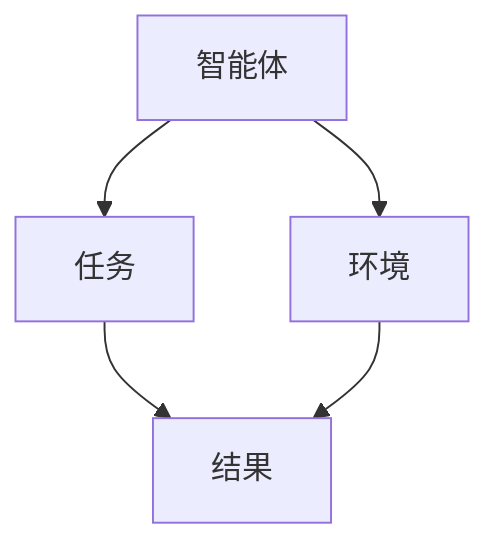
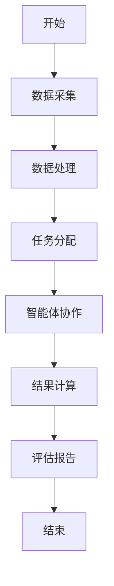
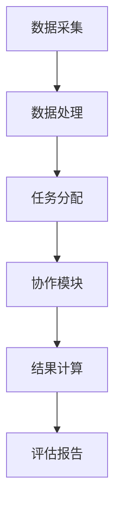
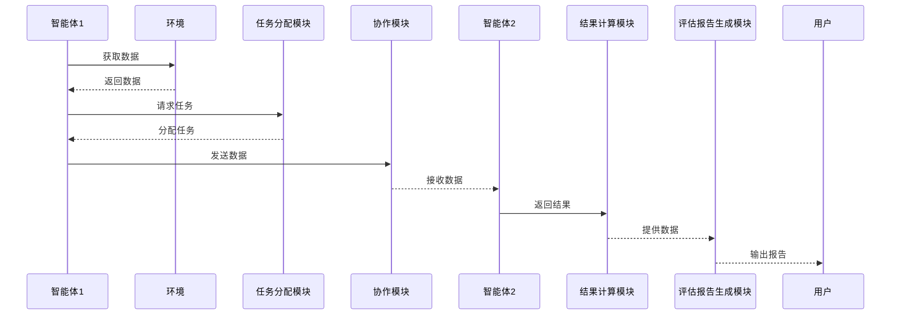

                 


# 多智能体系统在评估公司研发投资回报率中的应用

> 关键词：多智能体系统，研发投资回报率，系统架构，算法原理，项目实战

> 摘要：本文详细探讨了多智能体系统在评估公司研发投资回报率中的应用。通过分析多智能体系统的原理、算法、系统架构以及实际项目案例，本文为读者提供了从理论到实践的全面指导，展示了如何利用多智能体系统提高研发投资回报率评估的效率和准确性。

---

# 第一部分: 多智能体系统与研发投资回报率评估概述

## 第1章: 多智能体系统与研发投资回报率评估概述

### 1.1 问题背景与重要性

#### 1.1.1 研发投资回报率评估的挑战
研发投资回报率（ROI）评估是企业战略决策中的关键环节，但传统方法存在以下问题：
- 数据复杂性高，难以实时处理
- 需要考虑多个利益相关者的动态交互
- 评估过程缺乏智能化和自动化

#### 1.1.2 多智能体系统在评估中的应用潜力
多智能体系统（MAS）通过分布式协作和实时数据处理，能够有效解决研发投资回报率评估中的复杂问题。其优势包括：
- 支持多维度数据的实时分析
- 具备自适应性和灵活性，能够应对动态变化
- 可以通过多个智能体协同工作，提高评估的全面性和准确性

#### 1.1.3 问题解决的必要性与目标
通过引入多智能体系统，企业可以更高效地评估研发项目的回报率，从而优化资源配置，降低决策风险。

### 1.2 多智能体系统的核心概念

#### 1.2.1 多智能体系统的定义
多智能体系统是由多个智能体组成的分布式系统，每个智能体能够独立感知环境、做出决策并执行动作，且智能体之间通过通信和协作完成共同目标。

#### 1.2.2 多智能体系统的属性特征
- **分布式性**：智能体独立运行，任务分配灵活
- **协作性**：智能体之间通过通信和协作完成复杂任务
- **动态性**：系统能够适应环境变化和任务需求变化
- **自治性**：每个智能体具备自主决策能力

#### 1.2.3 多智能体系统与传统评估方法的区别
| 特性 | 多智能体系统 | 传统评估方法 |
|------|--------------|----------------|
| 数据处理 | 分布式、实时 | 集中式、离线 |
| 协作能力 | 高 | 低 |
| 灵活性 | 高 | 低 |

### 1.3 研发投资回报率评估的边界与外延

#### 1.3.1 评估的范围与限制
- **范围**：涵盖研发项目的立项、执行和总结阶段
- **限制**：数据质量和完整性可能影响评估结果

#### 1.3.2 多智能体系统的边界条件
- **输入数据**：研发项目的各项指标和市场数据
- **输出结果**：评估报告和优化建议

#### 1.3.3 评估结果的应用场景
- **内部决策支持**：帮助企业优化研发投资策略
- **外部合作评估**：用于与合作伙伴的协同决策

### 1.4 多智能体系统与研发投资回报率评估的概念结构

#### 1.4.1 系统组成要素
- **智能体**：负责数据采集、分析和决策
- **环境**：包含研发项目和市场数据
- **通信机制**：智能体之间的数据交换和协作接口

#### 1.4.2 概念结构图


### 1.5 本章小结
本章介绍了多智能体系统的基本概念及其在研发投资回报率评估中的应用潜力，明确了系统的核心要素和概念结构。

---

# 第二部分: 多智能体系统的核心原理与联系

## 第2章: 多智能体系统的核心原理

### 2.1 多智能体系统的原理

#### 2.1.1 智能体的基本原理
智能体具备以下特征：
- **感知**：通过传感器或数据接口获取环境信息
- **决策**：基于感知信息做出决策
- **执行**：根据决策执行动作

#### 2.1.2 多智能体系统中的通信机制
智能体之间的通信方式包括：
- **直接通信**：智能体之间通过共享内存或消息队列直接交换数据
- **间接通信**：通过中间层（如消息中间件）进行数据交换

#### 2.1.3 多智能体系统中的协作与竞争关系
- **协作**：智能体之间通过协作提高整体系统的性能
- **竞争**：智能体之间可能存在资源竞争，需要通过机制进行协调

### 2.2 多智能体系统的属性特征对比

#### 2.2.1 分布式计算与集中式计算的对比
| 特性 | 分布式计算 | 集中式计算 |
|------|------------|-------------|
| 数据处理 | 分散 | 集中 |
| 系统扩展性 | 易扩展 | 难扩展 |
| 故障容错性 | 高 | 低 |

#### 2.2.2 异步与同步的对比
| 特性 | 异步 | 同步 |
|------|------|------|
| 响应速度 | 高 | 低 |
| 资源利用率 | 高 | 低 |

#### 2.2.3 自适应与固定规则的对比
| 特性 | 自适应 | 固定规则 |
|------|--------|-----------|
| 灵活性 | 高 | 低 |
| 适应性 | 强 | 弱 |

### 2.3 多智能体系统的ER实体关系图

#### 2.3.1 实体关系图
```mermaid
er
  actor(智能体)
  actor(环境)
  actor(任务)
  actor(结果)
  relation(智能体-环境: 交互)
  relation(智能体-任务: 执行)
  relation(任务-结果: 生成)
```

#### 2.3.2 实体关系图解释
- 智能体与环境之间存在交互关系，智能体通过感知环境做出决策
- 智能体执行任务后生成结果，结果用于评估研发项目的回报率

### 2.4 本章小结
本章详细讲解了多智能体系统的核心原理及其在研发投资回报率评估中的应用，分析了其属性特征和实体关系图。

---

# 第三部分: 多智能体系统的算法原理

## 第3章: 多智能体系统的算法原理

### 3.1 算法原理概述

#### 3.1.1 算法的基本思想
多智能体系统的算法旨在通过协作和分布式计算，提高研发投资回报率评估的效率和准确性。

#### 3.1.2 算法的数学模型
$$ ROI = \frac{\text{净收益}}{\text{投资成本}} $$

#### 3.1.3 算法的流程图


### 3.2 算法的具体实现

#### 3.2.1 算法的核心代码
```python
def calculate ROI(investment, net_income):
    return net_income / investment
```

#### 3.2.2 算法的优化策略
- **数据预处理**：对数据进行清洗和特征提取
- **任务分配**：根据智能体的能力进行任务分配
- **协作机制**：通过消息队列实现智能体之间的协作

### 3.3 本章小结
本章通过数学模型和算法流程图，详细讲解了多智能体系统在研发投资回报率评估中的算法原理和实现方法。

---

# 第四部分: 多智能体系统的系统分析与架构设计

## 第4章: 多智能体系统的系统分析与架构设计

### 4.1 系统分析

#### 4.1.1 问题场景介绍
- 研发项目需要评估投资回报率
- 数据来源多样且复杂
- 需要实时分析和反馈

#### 4.1.2 系统功能需求
- 数据采集与处理
- 任务分配与协作
- 结果计算与评估报告生成

### 4.2 系统架构设计

#### 4.2.1 系统功能设计
- 数据采集模块：负责采集研发项目和市场数据
- 数据处理模块：对数据进行清洗和特征提取
- 任务分配模块：根据智能体能力分配任务
- 协作模块：实现智能体之间的通信与协作
- 结果计算模块：计算研发项目的回报率
- 评估报告生成模块：生成评估报告

#### 4.2.2 系统架构图


#### 4.2.3 接口设计
- 数据采集接口：负责从数据库或外部系统获取数据
- 任务分配接口：根据智能体的能力分配任务
- 协作接口：实现智能体之间的数据交换

#### 4.2.4 交互序列图


### 4.3 本章小结
本章通过系统分析和架构设计，详细描述了多智能体系统在研发投资回报率评估中的实现方案。

---

# 第五部分: 多智能体系统的项目实战

## 第5章: 多智能体系统的项目实战

### 5.1 项目实战概述

#### 5.1.1 环境安装
- 安装Python和相关库（如numpy、pandas、scikit-learn）
- 配置分布式计算环境（如Docker、Kubernetes）

#### 5.1.2 核心代码实现
```python
def calculate ROI(investment, net_income):
    return net_income / investment

def main():
    investment = 1000000
    net_income = 1500000
    ROI = calculate ROI(investment, net_income)
    print(f"ROI: {ROI}%")

if __name__ == "__main__":
    main()
```

#### 5.1.3 代码应用解读与分析
- 代码实现了计算研发项目的投资回报率
- ROI计算公式简单但实用

### 5.2 实际案例分析

#### 5.2.1 案例背景
某公司计划投资一个新研发项目，需要评估其回报率。

#### 5.2.2 案例分析
- 投资成本：100万元
- 预期收益：150万元
- 投资回报率：150/100 = 1.5，即150%

#### 5.2.3 案例结果
- ROI = 150%
- 项目具有较高的投资回报率，值得投资

### 5.3 本章小结
本章通过实际项目案例，展示了多智能体系统在研发投资回报率评估中的具体应用。

---

# 第六部分: 多智能体系统的优化与总结

## 第6章: 多智能体系统的优化与总结

### 6.1 优化策略

#### 6.1.1 系统优化
- 提高数据处理效率
- 优化任务分配算法
- 改善协作机制

#### 6.1.2 算法优化
- 使用更高效的数学模型
- 优化协作算法
- 提高智能体的自适应能力

### 6.2 本章总结

#### 6.2.1 核心内容回顾
- 多智能体系统的定义和核心概念
- 算法原理和实现方法
- 系统架构设计和项目实战
- 优化策略和未来发展方向

#### 6.2.2 注意事项
- 确保数据质量和完整性
- 合理分配任务和资源
- 定期优化系统和算法

#### 6.2.3 未来发展方向
- 研究更高效的多智能体协作算法
- 探索新的系统架构设计
- 拓展多智能体系统的应用场景

### 6.3 本章小结
本章总结了全文的核心内容，提出了优化策略和未来发展方向。

---

# 作者：AI天才研究院/AI Genius Institute & 禅与计算机程序设计艺术 /Zen And The Art of Computer Programming

