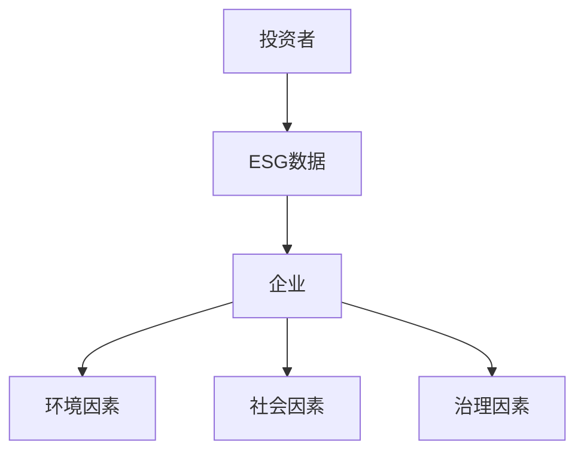
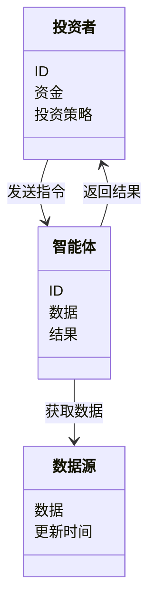
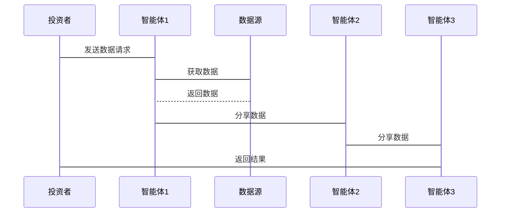

                 

<think>
嗯，用户让我设计一本关于多智能体系统在识别和评估ESG投资机会中的作用的书籍。首先，我需要理解ESG投资的基本概念，包括环境、社会和治理因素，以及多智能体系统在金融领域的应用。

接下来，我应该分析多智能体系统的核心概念，比如智能体的定义、协作机制和通信方式。然后，我需要将这些概念与ESG投资联系起来，看看它们如何协作来评估投资机会。

接下来，我需要详细讲解多智能体系统的算法原理，可能包括强化学习、博弈论等，展示这些算法如何应用于ESG数据的分析和决策。同时，我需要使用数学模型和公式，比如多目标优化模型，来解释如何平衡不同的ESG因素。

系统设计部分，我需要画出实体关系图和架构图，展示数据流和模块之间的交互。项目实战部分，我需要提供一个具体的案例，展示如何构建一个多智能体系统，并解释代码实现和结果分析。

最后，我需要总结整个系统的优缺点，讨论潜在的问题和未来的研究方向，比如数据隐私和多智能体系统的可扩展性。

现在，我需要将这些思考整理成一个结构清晰的目录，确保每个部分都涵盖必要的内容，并使用适当的图表和代码示例来支持讲解。这样，读者就能全面理解多智能体系统在ESG投资中的应用了。
</think>

# 多智能体系统在识别和评估ESG投资机会中的作用

## 关键词：
多智能体系统（Multi-Agent Systems）、ESG投资、环境、社会、治理、智能体协作、数据驱动决策

## 摘要：
本文探讨多智能体系统在识别和评估ESG投资机会中的作用。通过分析多智能体系统的概念、算法和架构，结合实际案例，详细阐述其在ESG数据收集、分析和投资决策中的应用。文章旨在为投资者和科技人员提供一个多维度的视角，理解如何利用多智能体系统提升ESG投资的效率和准确性。

---

# 第一部分：多智能体系统与ESG投资概述

## 第1章：ESG投资与多智能体系统概述

### 1.1 ESG投资的背景与意义
#### 1.1.1 ESG投资的定义与背景
ESG投资是一种基于环境、社会和公司治理因素的投资策略，旨在通过考虑这些非财务因素来优化投资组合的风险和回报。随着全球对可持续发展的关注增加，ESG投资逐渐成为金融市场的主流趋势。

#### 1.1.2 ESG投资的核心要素
- **环境（E）**：关注企业的碳排放、资源利用效率、环保合规性等。
- **社会（S）**：关注企业的社会责任、员工权益、社区贡献等。
- **治理（G）**：关注企业的董事会结构、高管薪酬、内部控制等。

#### 1.1.3 多智能体系统在ESG投资中的作用
多智能体系统通过分布式协作和信息共享，能够高效地处理海量ESG数据，识别潜在的投资机会，并优化投资决策。

### 1.2 多智能体系统的定义与特点
#### 1.2.1 多智能体系统的定义
多智能体系统（Multi-Agent Systems, MAS）是由多个智能体组成的分布式系统，每个智能体能够自主决策、感知环境并与其他智能体协作完成复杂任务。

#### 1.2.2 多智能体系统的核心特点
- **自主性**：智能体能够自主决策，无需外部干预。
- **反应性**：智能体能够实时感知环境并做出反应。
- **协作性**：多个智能体能够通过通信和协作共同完成任务。
- **分布性**：智能体分布在网络中，每个智能体只负责部分任务。

#### 1.2.3 多智能体系统与传统单智能体系统的区别
| 特性 | 多智能体系统 | 单智能体系统 |
|------|--------------|--------------|
| 决策 | 分布式决策   | 中央决策     |
| 通信 | 智能体之间通信 | 无通信       |
| 效率 | 高            | 中等          |

### 1.3 多智能体系统在金融领域的应用前景
#### 1.3.1 多智能体系统在金融投资中的潜在应用
- **量化交易**：通过多智能体协作优化交易策略。
- **风险管理**：通过智能体实时监控市场风险。
- **投资组合优化**：通过智能体协作优化投资组合。

#### 1.3.2 多智能体系统在ESG投资中的独特优势
- **分布式数据处理**：能够高效处理海量ESG数据。
- **协作决策**：多个智能体协作能够提高决策的准确性和全面性。
- **动态适应性**：能够实时适应市场变化和ESG数据更新。

#### 1.3.3 多智能体系统应用的挑战与机遇
- **挑战**：智能体之间的通信延迟、数据隐私问题、系统复杂性。
- **机遇**：提高投资效率、降低风险、实现可持续发展。

---

## 第2章：多智能体系统的核心概念与联系

### 2.1 多智能体系统的核心原理
#### 2.1.1 智能体的定义与属性
智能体是一种能够感知环境、自主决策并采取行动的实体。其核心属性包括：
- **感知**：通过传感器或数据源获取信息。
- **推理**：通过逻辑推理或机器学习算法处理信息。
- **决策**：基于推理结果做出决策。
- **行动**：执行决策并采取行动。

#### 2.1.2 多智能体系统中的协作机制
协作机制是多智能体系统的核心，主要通过以下方式实现：
- **直接通信**：智能体之间通过消息传递进行协作。
- **共享知识库**：所有智能体共享一个公共知识库。
- **分布式决策**：多个智能体共同参与决策过程。

#### 2.1.3 多智能体系统的通信与协调
通信与协调是多智能体系统的关键，主要通过以下方式实现：
- **消息传递**：智能体之间通过消息传递信息。
- **协议制定**：制定通信协议确保智能体之间能够有效协作。
- **协调机制**：通过协调机制确保智能体之间的协作一致。

### 2.2 ESG投资中的多智能体系统架构
#### 2.2.1 ESG投资的核心要素分析
在ESG投资中，多智能体系统需要处理以下核心要素：
- **环境数据**：企业的碳排放、能源消耗等。
- **社会数据**：企业的社会责任、员工福利等。
- **治理数据**：企业的董事会结构、高管薪酬等。

#### 2.2.2 多智能体系统在ESG评估中的实体关系图


#### 2.2.3 多智能体系统在ESG投资中的协作流程


### 2.3 多智能体系统与ESG投资的关联性
#### 2.3.1 多智能体系统在ESG数据收集中的作用
- **数据采集**：通过多个智能体分别采集环境、社会和治理数据。
- **数据整合**：将分散的数据整合到一个知识库中。

#### 2.3.2 多智能体系统在ESG数据分析中的应用
- **数据清洗**：通过智能体协作完成数据清洗和预处理。
- **数据分析**：通过智能体协作完成数据建模和分析。

#### 2.3.3 多智能体系统在ESG投资决策中的价值
- **多目标优化**：通过智能体协作实现环境、社会和治理目标的多目标优化。
- **动态适应**：通过智能体协作实现对市场变化的快速响应。

---

## 第3章：多智能体系统在ESG投资中的算法原理

### 3.1 基于多智能体系统的ESG评估算法
#### 3.1.1 算法概述
多智能体系统的ESG评估算法通过多个智能体协作完成数据处理、模型构建和投资决策。

#### 3.1.2 算法流程图


### 3.2 算法实现的数学模型
#### 3.2.1 多智能体系统协作的数学模型
$$ f(x) = \sum_{i=1}^{n} w_i x_i $$

#### 3.2.2 智能体协作的博弈论模型
$$ \text{收益} = \sum_{i=1}^{n} v_i $$

### 3.3 算法实现的代码示例
```python
class Agent:
    def __init__(self, id):
        self.id = id
        self.data = None

    def receive_data(self, data):
        self.data = data

    def process_data(self):
        # 数据处理逻辑
        pass

    def send_result(self):
        # 结果发送逻辑
        pass

class MAS:
    def __init__(self, agents):
        self.agents = agents

    def distribute_data(self, data):
        for agent in self.agents:
            agent.receive_data(data)

    def collect_results(self):
        results = []
        for agent in self.agents:
            results.append(agent.send_result())
        return results
```

---

## 第4章：系统分析与架构设计

### 4.1 系统分析
#### 4.1.1 问题场景介绍
在ESG投资中，投资者需要处理海量的环境、社会和治理数据，这些数据分布在不同的企业和数据源中。

#### 4.1.2 项目介绍
本项目旨在构建一个多智能体系统，用于识别和评估ESG投资机会。

### 4.2 系统功能设计
#### 4.2.1 领域模型


#### 4.2.2 系统架构


### 4.3 系统接口设计
- **智能体接口**：定义智能体之间的通信接口。
- **数据源接口**：定义数据获取接口。
- **投资者接口**：定义投资者与系统的交互接口。

### 4.4 系统交互设计


---

## 第5章：项目实战

### 5.1 环境安装
- **操作系统**：Linux/Windows/MacOS
- **编程语言**：Python
- **库与框架**：Multi-Agent Framework、NumPy、Pandas、Matplotlib

### 5.2 核心代码实现
```python
import numpy as np
import pandas as pd

class ESGAgent(Agent):
    def __init__(self, id):
        super().__init__(id)
        self.esg_score = 0

    def process_data(self):
        # 数据处理逻辑
        self.esg_score = np.mean(self.data)

class ESGSystem(MAS):
    def __init__(self, agents):
        super().__init__(agents)
        self.esg_scores = {}

    def calculate_esg_scores(self):
        for agent in self.agents:
            agent.process_data()
            self.esg_scores[agent.id] = agent.esg_score

    def get_top_agents(self, n=3):
        # 获取ESG评分最高的前n个智能体
        sorted_agents = sorted(self.esg_scores.items(), key=lambda x: x[1], reverse=True)
        return sorted_agents[:n]
```

### 5.3 系统测试与结果分析
- **测试数据**：模拟企业的ESG数据。
- **测试结果**：输出ESG评分最高的前3个智能体。

### 5.4 项目小结
通过本项目，我们成功构建了一个基于多智能体系统的ESG评估系统，能够高效地处理海量数据，识别潜在的投资机会，并优化投资决策。

---

## 第6章：总结与展望

### 6.1 总结
本文详细探讨了多智能体系统在识别和评估ESG投资机会中的作用，通过分析其核心概念、算法原理和系统架构，展示了其在ESG投资中的巨大潜力。

### 6.2 未来展望
未来，随着人工智能和大数据技术的不断发展，多智能体系统在ESG投资中的应用将更加广泛和深入。我们需要进一步研究如何提高系统的协作效率、降低数据隐私风险，并探索其在其他金融领域的应用。

---

## 作者：AI天才研究院/AI Genius Institute & 禅与计算机程序设计艺术/Zen And The Art of Computer Programming

