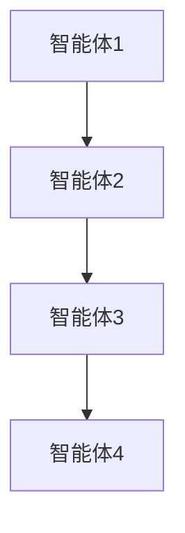
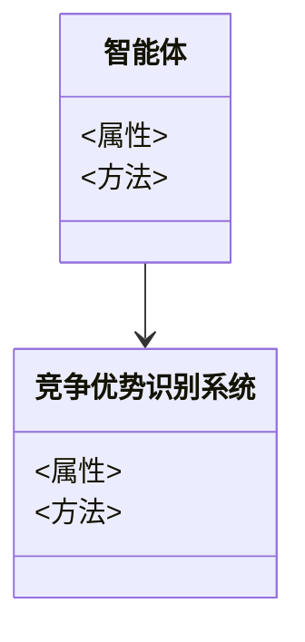

                 


# 多智能体系统在识别和评估公司竞争优势中的作用

> 关键词：多智能体系统，企业竞争优势，协作算法，博弈论模型，系统架构设计

> 摘要：多智能体系统（Multi-Agent System，MAS）是一种由多个智能体组成的分布式系统，通过协作和竞争实现复杂任务。本文探讨多智能体系统如何应用于识别和评估企业竞争优势，涵盖概念、算法、系统设计和实战案例。

---

# 第一章：多智能体系统的基本概念

## 1.1 多智能体系统的定义与特征

多智能体系统是由多个智能体组成的分布式系统，具备以下特征：
- **自主性**：智能体能够自主决策。
- **反应性**：能感知环境并实时响应。
- **协作性**：通过协作完成复杂任务。
- **分布式性**：各智能体独立运行，无集中控制。

## 1.2 多智能体系统的组成与结构

### 1.2.1 智能体的分类

| 类型     | 描述                         |
|----------|------------------------------|
| 反应式   | 基于当前感知做出反应           |
| 规划式   | 基于目标规划行动             |
| 学习式   | 通过学习提升性能             |

### 1.2.2 多智能体系统的组成要素

- **智能体**：系统的基本单元。
- **通信机制**：智能体间信息交换的方式。
- **协作协议**：定义智能体间的合作规则。

### 1.2.3 多智能体系统的通信机制



---

# 第二章：企业竞争优势的识别与评估

## 2.1 企业竞争优势的定义

### 2.1.1 核心要素

| 要素       | 描述                         |
|------------|------------------------------|
| 资源       | 企业拥有的资源               |
| 技术       | 企业的技术水平               |
| 战略       | 企业的战略规划               |
| 品质       | 产品的质量                   |

## 2.2 传统竞争优势识别方法的局限性

- **局限性**：传统方法通常依赖人工分析，耗时且主观。

## 2.3 基于多智能体系统的竞争优势识别方法

### 2.3.1 方法优势

- **高效性**：通过智能体协作快速分析数据。
- **准确性**：利用博弈论模型优化决策。

---

# 第三章：多智能体系统的核心算法与实现

## 3.1 协作算法

### 3.1.1 协作机制


### 3.1.2 博弈论模型

$$\text{收益} = \sum_{i=1}^{n} v_i$$

---

# 第四章：系统架构设计

## 4.1 应用场景

- **竞争分析**：识别市场中的竞争优势。
- **战略规划**：制定企业战略。

### 4.2 系统功能设计



---

# 第五章：项目实战

## 5.1 环境安装

- **工具**：Python、NumPy、Matplotlib。

## 5.2 核心代码实现

```python
def collaborative_algorithm(agents):
    for agent in agents:
        agent.collaborate()
    return result
```

## 5.3 案例分析

- **案例**：某公司通过多智能体系统识别竞争优势，提升市场份额。

---

# 第六章：总结与展望

## 6.1 本章小结

- 多智能体系统在企业竞争优势识别中发挥重要作用，通过协作和博弈论优化决策。

## 6.2 未来研究方向

- **智能体学习**：提升自主学习能力。
- **复杂场景应用**：扩展到更多领域。

---

# 作者：AI天才研究院 & 禅与计算机程序设计艺术

通过以上结构，文章系统地介绍了多智能体系统及其在企业竞争优势识别中的应用，结合理论与实践，为读者提供全面的视角。

