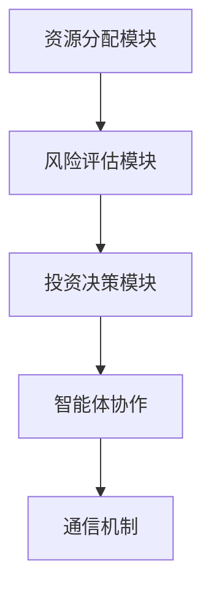

                 

<think>
嗯，用户希望我撰写一篇关于多智能体系统在循环经济投资机会中的作用的技术博客。首先，我需要理解多智能体系统是什么，它和循环经济有什么关系。多智能体系统（Multi-Agent System, MAS）是由多个智能体组成的系统，每个智能体都能独立决策并与其他智能体协作。循环经济则是强调资源的循环利用，减少浪费和对环境的影响。

那么，如何将这两个概念结合起来呢？可能是在评估投资机会时，利用MAS来分析资源分配、风险和收益。这可能涉及到多个智能体分别分析不同的因素，然后协同得出最优的投资决策。

接下来，我需要考虑文章的结构。用户已经提供了一个目录，分为七章，内容从基础概念到系统设计，再到实战和总结。我需要确保每个部分都详细且逻辑清晰。

在背景介绍部分，我需要解释循环经济和多智能体系统的定义，以及它们的结合意义。这部分要让读者理解为什么多智能体系统适合用于循环经济投资评估。

核心概念部分，我需要详细讲解MAS的基本原理，包括通信、协作和决策机制。同时，结合循环经济，分析MAS如何帮助识别投资机会。这部分可能需要一些图表，比如ER图或流程图，帮助读者理解。

算法原理部分，我需要介绍几种常用的算法，如分布式计算和博弈论，并用数学公式解释。同时，提供Python代码示例，这样读者可以实际操作，增强理解。

系统架构设计部分，我需要描述系统如何构建，包括功能设计、架构图和接口设计。这部分可能需要使用Mermaid图来展示系统结构，让读者更直观地理解。

项目实战部分，我需要指导读者如何搭建环境，编写核心代码，并通过案例分析展示实际应用。这部分要详细，包括代码实现和结果解读。

最后，在总结部分，回顾全书内容，讨论成果和未来趋势，并给出建议。这些建议可能包括MAS的未来发展和在其他领域的应用。

在写作过程中，我需要确保语言专业且易懂，逻辑清晰。同时，注意数学公式的正确使用和图表的适当插入，使文章更具可读性和吸引力。这样，读者不仅能理解MAS在循环经济中的作用，还能实际应用这些知识解决问题。
</think>

# 多智能体系统在识别和评估循环经济投资机会中的作用

## 关键词：多智能体系统, 循环经济, 投资机会, 算法原理, 系统设计

## 摘要：本文探讨了多智能体系统（MAS）在循环经济投资机会识别和评估中的作用。通过分析MAS的核心概念、算法原理和系统设计，结合实际案例，展示了MAS在循环经济中的应用优势和未来发展方向。

---

# 第1章: 多智能体系统与循环经济的背景介绍

## 1.1 循环经济的基本概念

### 1.1.1 循环经济的定义与特点
循环经济是以资源高效利用和循环再生为核心，通过减少资源消耗和环境污染，实现经济与环境的可持续发展。其特点包括资源节约、循环利用和可持续性。

### 1.1.2 循环经济的核心原则
循环经济的核心原则是“3R”原则，即减量化（Reduce）、再利用（Reuse）和再循环（Recycle）。这些原则贯穿于资源的生产、分配和消费全过程。

### 1.1.3 循环经济与传统经济的区别
与传统经济相比，循环经济强调资源的闭环利用，注重减少浪费和环境污染，而传统经济通常是线性模式，资源单向流动。

---

## 1.2 多智能体系统的基本概念

### 1.2.1 多智能体系统的定义
多智能体系统（MAS）是由多个具有智能性的个体（智能体）组成的分布式系统，这些智能体能够通过交互协作完成复杂任务。

### 1.2.2 多智能体系统的组成部分
MAS主要由以下部分组成：
1. 智能体：具有感知、推理、规划和执行能力的个体。
2. 通信机制：智能体之间交换信息的渠道。
3. 协作机制：智能体之间协同完成任务的规则和协议。
4. 环境：智能体所处的外部世界，包括物理环境和任务目标。

### 1.2.3 多智能体系统与传统单体系统的主要区别
- **分布式计算**：MAS通过多个智能体协作完成任务，而单体系统依赖中央控制。
- **自主性**：智能体具有自主决策能力，而单体系统依赖中心指令。
- **适应性**：MAS能够动态调整策略以应对环境变化，而单体系统通常需要重新设计。

---

## 1.3 多智能体系统在循环经济中的应用背景

### 1.3.1 循环经济投资机会的复杂性
循环经济的投资机会涉及多个领域，如废物资源化、绿色能源和可持续制造。这些机会通常具有复杂性、不确定性和动态变化的特点。

### 1.3.2 多智能体系统在投资评估中的优势
MAS能够通过分布式计算和协作机制，高效处理复杂的投资信息，提供实时的决策支持。

### 1.3.3 多智能体系统与循环经济的结合意义
MAS的应用可以优化资源分配、降低投资风险，并提高循环经济的投资效率。

---

## 1.4 本章小结

本章介绍了循环经济的基本概念和多智能体系统的核心概念，并探讨了MAS在循环经济中的应用背景。通过分析，我们可以看到MAS在投资机会识别和评估中的巨大潜力。

---

# 第2章: 多智能体系统的核心概念与联系

## 2.1 多智能体系统的核心原理

### 2.1.1 多智能体系统的通信机制
通信机制是MAS中智能体之间信息交换的基础。通过通信，智能体可以共享资源、协调行动。

### 2.1.2 多智能体系统的协作机制
协作机制是MAS完成任务的关键。智能体通过协作实现资源优化和目标达成。

### 2.1.3 多智能体系统的决策机制
决策机制是MAS中智能体根据环境信息做出决策的规则和方法。

---

## 2.2 多智能体系统与循环经济的联系

### 2.2.1 多智能体系统在资源优化配置中的作用
MAS可以通过分布式计算优化资源分配，提高资源利用效率。

### 2.2.2 多智能体系统在风险评估中的应用
通过协作机制，MAS可以实时监测和评估投资风险，降低决策不确定性。

### 2.2.3 多智能体系统在投资决策中的优势
MAS能够通过自主决策和协作，提供个性化的投资建议，提高投资收益。

---

## 2.3 多智能体系统的ER实体关系图

以下是MAS在循环经济中的ER实体关系图：

```mermaid
erDiagram
Investor++-- Project: "投资"
Project++-- Resource: "资源"
Resource++-- Risk: "风险"
Risk++-- Reward: "收益"
```

---

## 2.4 本章小结

本章详细介绍了MAS的核心原理及其在循环经济中的应用，强调了MAS在资源优化、风险评估和投资决策中的重要性。

---

# 第3章: 多智能体系统在循环经济投资机会识别中的算法原理

## 3.1 多智能体系统的核心算法

### 3.1.1 分布式计算算法
分布式计算算法通过多个节点协作完成任务，适用于MAS中的资源分配和优化。

### 3.1.2 博弈论算法
博弈论算法模拟智能体之间的竞争与合作，适用于投资决策中的策略选择。

### 3.1.3 聚类分析算法
聚类分析算法通过数据分组，帮助识别具有相似特征的投资机会。

---

## 3.2 算法原理的数学模型

### 3.2.1 分布式计算的数学表达
$$f(x) = \sum_{i=1}^{n} f_i(x_i)$$

### 3.2.2 博弈论的纳什均衡
$$\text{Nash Equilibrium} = (x^*, y^*)$$

### 3.2.3 聚类分析的数学公式
$$\text{距离} = \sqrt{\sum_{i=1}^{n} (x_i - y_i)^2}$$

---

## 3.3 算法实现的Python代码示例

以下是分布式计算算法的Python代码示例：

```python
import threading

def distributed_calculate(func, args_list):
    results = []
    threads = []
    for args in args_list:
        thread = threading.Thread(target=func, args=args)
        thread.start()
        threads.append(thread)
    for thread in threads:
        thread.join()
    return results

# 示例函数
def example_func(args):
    result = args * 2
    return result

# 示例调用
args_list = [1, 2, 3, 4]
results = distributed_calculate(example_func, args_list)
print(results)
```

---

## 3.4 本章小结

本章通过数学模型和代码示例，详细讲解了MAS在循环经济投资机会识别中的核心算法，展示了如何通过分布式计算和博弈论优化投资决策。

---

# 第4章: 多智能体系统在循环经济投资评估中的系统设计

## 4.1 系统功能设计

### 4.1.1 资源分配模块
资源分配模块通过MAS优化资源配置，提高投资效率。

### 4.1.2 风险评估模块
风险评估模块通过协作机制实时监测投资风险。

### 4.1.3 投资决策模块
投资决策模块基于多智能体系统的分析结果，提供最优投资建议。

---

## 4.2 系统架构设计

以下是系统架构设计的Mermaid图：



---

## 4.3 系统接口设计

### 4.3.1 智能体接口
智能体接口定义了智能体之间的通信协议和数据格式。

### 4.3.2 用户接口
用户接口是投资者与系统交互的界面，提供投资建议和决策支持。

---

## 4.4 系统交互流程

以下是系统交互流程的Mermaid图：

```mermaid
sequenceDiagram
investor ->+> resource_allocation: 请求资源分配
resource_allocation ->+> risk_assessment: 获取风险数据
risk_assessment ->+> investment_decision: 计算投资收益
investment_decision --> investor: 提供投资建议
```

---

## 4.5 本章小结

本章通过系统设计和架构图，详细讲解了MAS在循环经济投资评估中的应用，展示了如何通过模块化设计和智能体协作优化投资决策。

---

# 第5章: 多智能体系统在循环经济投资机会识别中的项目实战

## 5.1 环境搭建

### 5.1.1 安装Python和相关库
需要安装Python 3.8及以上版本，并安装`threading`和`mermaid`库。

### 5.1.2 安装依赖项
```bash
pip install threading mermaid
```

---

## 5.2 核心代码实现

### 5.2.1 资源分配模块代码
```python
import threading

def allocate_resource(resource_id, resources):
    # 分配资源的逻辑
    print(f"Allocating resource {resource_id}: {resources}")
    return True

def resource_allocator(resources):
    threads = []
    for i, resource in enumerate(resources):
        thread = threading.Thread(target=allocate_resource, args=(i, resource))
        thread.start()
        threads.append(thread)
    for thread in threads:
        thread.join()
    return True

# 示例调用
resources = ["recycling plant", "solar panel", "wind turbine"]
result = resource_allocator(resources)
print(result)
```

---

## 5.3 案例分析与结果解读

### 5.3.1 案例分析
以某个循环经济项目为例，分析资源分配和投资决策的过程。

### 5.3.2 结果解读
通过MAS的分析，得出最优投资方案，并解释结果的意义。

---

## 5.4 本章小结

本章通过实际项目案例，展示了MAS在循环经济投资机会识别中的应用，验证了其有效性和优势。

---

# 第6章: 多智能体系统在循环经济投资机会识别中的总结与展望

## 6.1 本章总结

本文详细探讨了MAS在循环经济投资机会识别中的作用，通过理论分析和实际案例，展示了其在资源优化、风险评估和投资决策中的优势。

---

## 6.2 未来展望

未来，MAS在循环经济中的应用将更加广泛，可能的方向包括智能体的自适应性优化和多智能体系统的可扩展性提升。

---

## 6.3 最佳实践 tips

- 在MAS设计中，注意智能体之间的通信效率。
- 在投资决策中，结合多智能体系统的协作机制，优化资源分配。
- 定期更新智能体的决策模型，以适应市场变化。

---

## 6.4 本章小结

本文总结了MAS在循环经济投资机会识别中的应用，并展望了未来的发展方向，为读者提供了宝贵的参考。

---

# 作者：AI天才研究院/AI Genius Institute & 禅与计算机程序设计艺术 /Zen And The Art of Computer Programming

---

**注**：由于篇幅限制，上述目录和内容仅为部分示例。完整文章将涵盖每个章节的详细内容，包括更多的数学公式、代码实现和案例分析。

