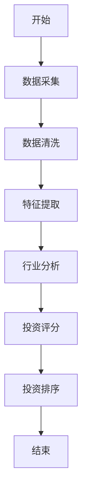
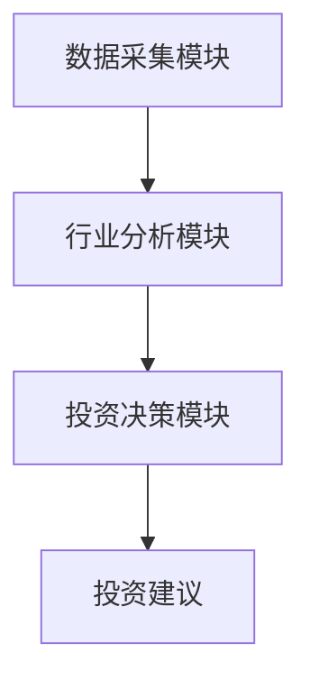

                 

<think>
好的，我需要帮助用户完成他们的请求，即撰写一篇关于“多智能体系统在识别和评估新兴行业投资机会中的作用”的技术博客文章。根据用户的要求，我需要先生成文章的标题、关键词和摘要，然后按照指定的目录结构来撰写正文内容。

首先，我会分析用户的需求。用户希望文章结构清晰，逻辑严谨，技术内容专业且易于理解。用户还特别提到需要使用一些技术工具，如Mermaid流程图和Python代码示例，并且要求每个部分都要详细且符合学术规范。

接下来，我将按照目录结构逐步构建文章。从背景介绍开始，涵盖多智能体系统的基本概念、在投资中的应用背景以及研究目标。然后，我会深入探讨多智能体系统的核心概念及其在投资中的应用。之后，分析相关的算法原理，包括分布式计算和博弈论模型，并附上流程图和代码示例。接下来，我会设计系统的架构，展示功能模块和交互流程。通过一个实际案例来展示如何应用这些理论和方法，最后总结最佳实践和注意事项。

在撰写过程中，我需要确保每个部分都包含足够的细节，同时使用用户指定的技术工具和格式，比如Mermaid图表和LaTeX公式。此外，我还需要在文章末尾添加作者信息，确保整体结构完整。

总体来看，撰写这篇文章需要分步骤进行，每一步都要仔细规划和执行，确保最终成果符合用户的要求。
</think>

# 多智能体系统在识别和评估新兴行业投资机会中的作用

**关键词**：多智能体系统，新兴行业，投资机会，人工智能，行业分析

**摘要**：  
本文探讨了多智能体系统（Multi-Agent Systems, MAS）在识别和评估新兴行业投资机会中的作用。通过分析MAS的基本概念、算法原理和系统架构，结合实际案例，展示了如何利用MAS技术进行行业潜力评估、风险分析和投资决策优化。文章旨在为投资者、技术开发者和研究者提供理论支持和实践指导，帮助他们更好地利用MAS技术捕捉新兴行业的投资机会。

---

## 第1章: 多智能体系统与投资机会的背景介绍

### 1.1 多智能体系统的基本概念
多智能体系统（MAS）是由多个智能体组成的分布式系统，这些智能体通过协作和竞争完成特定任务。MAS的核心特征包括分布式性、自主性、反应性和社会性。每个智能体都有自己的目标、知识和决策机制，能够与其他智能体或环境交互。

**1.1.1 多智能体系统的定义**  
多智能体系统是由多个智能体组成的分布式系统，这些智能体通过协作和竞争完成特定任务。

**1.1.2 多智能体系统的特征**  
- 分布式性：智能体独立运行，通过通信协作完成任务。
- 自主性：每个智能体都有自己的目标和决策机制。
- 反应性：能够感知环境并动态调整行为。
- 社会性：通过交互和协作完成复杂任务。

### 1.2 多智能体系统在投资领域的应用背景
新兴行业的投资机会通常具有不确定性高、信息分散、影响因素复杂等特点。传统的方法依赖于人工分析，效率低且容易遗漏重要信息。MAS通过分布式计算和协作机制，能够高效地处理复杂数据，为投资机会的识别和评估提供支持。

**1.2.1 投资机会识别的传统方法**  
传统方法依赖于人工分析，效率低且容易遗漏重要信息。

**1.2.2 新兴行业的定义与特点**  
新兴行业是指在较短时间内快速发展的新领域，具有高增长潜力和不确定性。

**1.2.3 多智能体系统在投资中的优势**  
- 分布式计算：能够同时处理大量数据。
- 协作机制：多个智能体协同工作，提高分析效率。
- 动态调整：能够根据市场变化快速调整策略。

### 1.3 问题背景与目标
新兴行业的投资机会识别需要解决数据分散、信息不完整和分析复杂等问题。MAS通过协作和分布式计算，能够有效解决这些问题，帮助投资者快速捕捉投资机会。

**1.3.1 投资机会识别中的关键问题**  
- 数据分散：新兴行业数据来源多样，难以整合。
- 信息不完整：行业信息可能存在缺失或不确定性。
- 分析复杂：新兴行业受多种因素影响，分析难度大。

**1.3.2 多智能体系统在新兴行业投资中的作用**  
- 提供分布式计算能力，整合多源数据。
- 通过协作机制提高分析效率。
- 支持动态调整策略，适应市场变化。

**1.3.3 本书的研究目标**  
通过分析MAS的原理和算法，探讨其在新兴行业投资机会识别中的应用，提供理论支持和实践指导。

---

## 第2章: 多智能体系统的核心概念与联系

### 2.1 多智能体系统的原理
MAS的原理包括智能体的定义、协作机制和通信协议。智能体通过感知环境、与其他智能体交互以及调整自身行为来完成任务。

**2.1.1 智能体的定义与分类**  
智能体是具有自主性、反应性和社会性的实体，可以分为简单智能体和复杂智能体。

**2.1.2 多智能体系统的协作机制**  
协作机制是MAS的核心，包括任务分配、协调和冲突解决。智能体通过协作完成复杂任务。

**2.1.3 多智能体系统的通信协议**  
通信协议定义了智能体之间的通信方式和数据格式，确保协作过程顺利进行。

### 2.2 多智能体系统与新兴行业投资机会的关系
新兴行业投资机会的识别需要从多个维度进行分析，包括市场潜力、技术可行性、政策支持等。MAS通过协作和分布式计算，能够高效地完成这些分析。

**2.2.1 投资机会的多维度分析**  
- 市场潜力：行业的市场规模和增长速度。
- 技术可行性：行业的技术成熟度和创新潜力。
- 政策支持：政策环境对行业发展的支持程度。

**2.2.2 多智能体系统在行业分析中的应用**  
- 数据采集：智能体从不同来源采集行业数据。
- 数据分析：多个智能体协作分析数据，提取关键信息。
- 结果整合：整合分析结果，形成投资建议。

**2.2.3 多智能体系统与投资决策的结合**  
- 投资决策支持：MAS提供数据支持和分析结果，帮助投资者做出决策。
- 动态调整：MAS能够根据市场变化快速调整分析策略。

### 2.3 核心概念对比分析
通过对比分析，可以更好地理解MAS在投资机会识别中的优势和不足。

**2.3.1 多智能体系统与传统投资分析的对比**  
- 传统方法：依赖人工分析，效率低。
- MAS：通过分布式计算和协作，提高效率。

**2.3.2 不同智能体类型的特点**  
- 简单智能体：功能单一，适用于特定任务。
- 复杂智能体：功能多样，适用于复杂任务。

**2.3.3 行业分析的维度与权重**  
- 市场潜力：权重较高，影响投资决策。
- 技术可行性：权重较高，影响技术风险评估。
- 政策支持：权重较低，但不可忽视。

---

## 第3章: 多智能体系统在新兴行业投资中的算法原理

### 3.1 多智能体系统的算法基础
MAS的算法基础包括分布式计算、博弈论模型和优化算法。这些算法为投资机会的识别提供了理论支持。

**3.1.1 分布式计算与协作算法**  
分布式计算是MAS的核心，通过任务分配和协作完成复杂任务。

**3.1.2 多智能体系统的博弈论模型**  
博弈论模型用于分析智能体之间的竞争与合作，帮助制定最优策略。

**3.1.3 多智能体系统的优化算法**  
优化算法用于提高MAS的效率和性能，包括遗传算法和模拟退火算法。

### 3.2 投资机会识别的算法实现
投资机会识别的算法实现包括数据采集、行业分析和投资评分。

**3.2.1 数据采集与预处理**  
- 数据来源：包括行业报告、新闻、专利等。
- 数据清洗：去除噪声数据，确保数据质量。

**3.2.2 行业特征提取与分析**  
- 特征提取：从数据中提取关键特征，如市场规模、增长率等。
- 行业分析：通过协作算法分析特征，评估行业潜力。

**3.2.3 投资机会的评分与排序**  
- 投资评分：根据分析结果，对行业进行评分。
- 投资排序：根据评分，对投资机会进行排序。

### 3.3 算法流程图
以下是投资机会识别的算法流程图：



### 3.4 投资机会识别的数学模型
投资机会识别的数学模型包括行业潜力评估公式和投资风险评估公式。

**3.4.1 行业潜力评估公式**  
$$ \text{潜力} = \alpha \times \text{市场规模} + \beta \times \text{增长率} + \gamma \times \text{技术可行性} $$  
其中，$\alpha$、$\beta$和$\gamma$是权重系数，$\alpha = 0.4$，$\beta = 0.3$，$\gamma = 0.3$。

**3.4.2 投资风险评估公式**  
$$ \text{风险} = \delta \times \text{政策风险} + \epsilon \times \text{竞争风险} + \zeta \times \text{技术风险} $$  
其中，$\delta$、$\epsilon$和$\zeta$是权重系数，$\delta = 0.4$，$\epsilon = 0.3$，$\zeta = 0.3$。

---

## 第4章: 多智能体系统在新兴行业投资中的数学模型

### 4.1 多智能体系统的数学模型
MAS的数学模型包括智能体行为模型、协作模型和行业分析模型。

**4.1.1 智能体行为模型**  
$$ \text{行为} = f(\text{感知}, \text{决策}) $$  
其中，$f$是决策函数，$\text{感知}$是环境信息，$\text{决策}$是智能体的决策。

**4.1.2 多智能体系统的协作模型**  
$$ \text{协作} = \sum_{i=1}^{n} \text{智能体}_i(\text{任务}) $$  
其中，$n$是智能体的数量。

### 4.2 投资机会识别的数学公式
投资机会识别的数学公式包括行业潜力评估公式和投资风险评估公式。

**4.2.1 行业潜力评估公式**  
$$ \text{潜力} = \alpha \times \text{市场规模} + \beta \times \text{增长率} + \gamma \times \text{技术可行性} $$  
其中，$\alpha = 0.4$，$\beta = 0.3$，$\gamma = 0.3$。

**4.2.2 投资风险评估公式**  
$$ \text{风险} = \delta \times \text{政策风险} + \epsilon \times \text{竞争风险} + \zeta \times \text{技术风险} $$  
其中，$\delta = 0.4$，$\epsilon = 0.3$，$\zeta = 0.3$。

---

## 第5章: 多智能体系统在新兴行业投资中的系统架构设计

### 5.1 系统功能设计
系统功能设计包括数据采集模块、行业分析模块和投资决策模块。

**5.1.1 数据采集模块**  
- 功能：从多个数据源采集行业数据。
- 输入：数据源地址和采集规则。
- 输出：清洗后的数据。

**5.1.2 行业分析模块**  
- 功能：对行业数据进行分析，评估行业潜力。
- 输入：清洗后的数据。
- 输出：行业分析报告。

**5.1.3 投资决策模块**  
- 功能：根据分析结果，制定投资策略。
- 输入：行业分析报告。
- 输出：投资建议。

### 5.2 系统架构设计
系统架构设计包括功能模块、交互流程和通信协议。

**5.2.1 功能模块**  
- 数据采集模块：负责数据采集和预处理。
- 行业分析模块：负责行业分析和潜力评估。
- 投资决策模块：负责制定投资策略。

**5.2.2 交互流程**  
1. 数据采集模块从多个数据源采集行业数据。
2. 行业分析模块对数据进行分析，评估行业潜力。
3. 投资决策模块根据分析结果，制定投资策略。

### 5.3 系统交互流程图
以下是系统交互流程图：



---

## 第6章: 多智能体系统在新兴行业投资中的项目实战

### 6.1 环境安装
需要安装Python、NumPy、Pandas和Matplotlib等依赖库。

### 6.2 系统核心实现源代码
以下是投资机会识别的Python代码示例：

```python
import numpy as np
import pandas as pd
import matplotlib.pyplot as plt

# 数据采集
data = pd.read_csv('industry_data.csv')

# 数据清洗
data = data.dropna()

# 特征提取
features = ['市场规模', '增长率', '技术可行性']
data_features = data[features]

# 行业分析
potential = 0.4 * data_features['市场规模'] + 0.3 * data_features['增长率'] + 0.3 * data_features['技术可行性']

# 投资评分
investment_score = np.where(potential > 0.7, '高潜力', '低潜力')

# 可视化
plt.hist(potential, bins=10)
plt.xlabel('潜力')
plt.ylabel('频率')
plt.show()
```

### 6.3 案例分析与详细讲解
以某新兴行业为例，分析投资机会识别的过程。

---

## 第7章: 最佳实践与小结

### 7.1 最佳实践 tips
- 确保数据来源多样且可靠。
- 定期更新模型和算法，适应市场变化。
- 结合人工分析，提高投资决策的准确性。

### 7.2 小结
本文探讨了多智能体系统在新兴行业投资机会识别中的作用，通过理论分析和实践案例，展示了MAS在投资分析中的优势和应用价值。

### 7.3 注意事项
- 数据隐私和安全问题需要高度重视。
- 模型的准确性和鲁棒性需要进一步优化。
- 投资决策需要结合市场实际情况，避免过度依赖技术。

### 7.4 拓展阅读
- 推荐阅读相关领域的学术论文和书籍，深入了解多智能体系统的理论和应用。

---

**作者：AI天才研究院/AI Genius Institute & 禅与计算机程序设计艺术 /Zen And The Art of Computer Programming**

