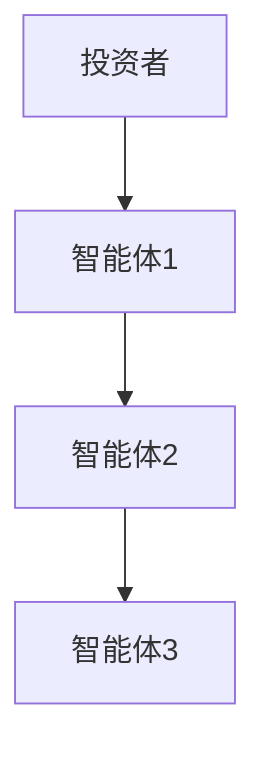

                 

# 多智能体系统在识别和评估社会责任投资机会中的作用

> **关键词**：多智能体系统、社会责任投资、智能体协作、投资机会评估、AI技术应用、金融数据分析  
> **摘要**：本文探讨了多智能体系统（MAS）在社会责任投资（SRI）中的应用，分析了MAS如何通过分布式智能和协作机制优化SRI的机会识别和评估过程。文章详细介绍了MAS的核心原理、算法设计、系统架构，并通过案例展示了其在实际投资中的潜力。

---

## 第一部分：背景介绍

### 第1章：背景介绍

#### 1.1 问题背景

##### 1.1.1 多智能体系统的概念与特点
多智能体系统（Multi-Agent System, MAS）由多个独立或协作的智能体组成，具备分布式决策、自主性、反应性和社会性的特点。MAS能够通过智能体间的协作完成复杂任务，广泛应用于金融、物流、游戏等领域。

##### 1.1.2 社会责任投资的核心理念
社会责任投资（Socially Responsible Investment, SRI）强调在追求财务回报的同时，考虑环境、社会和治理（ESG）因素。SRI的目标是实现经济、社会和环境的可持续发展，其核心在于筛选出符合伦理和社会责任的优质投资标的。

##### 1.1.3 当前社会责任投资中的挑战
随着全球对可持续发展的关注增加，SRI的需求也在增长，但现有方法在处理海量数据、实时反馈和多目标优化方面存在局限性。传统的人工评估效率低下，难以应对复杂的市场环境。

#### 1.2 问题描述

##### 1.2.1 社会责任投资机会识别的复杂性
SRI需要同时考虑财务、环境、社会和治理等多个维度，数据复杂且动态变化，传统方法难以高效处理。

##### 1.2.2 多智能体系统在投资决策中的应用潜力
MAS通过分布式计算和协作机制，能够高效处理多维度数据，为SRI提供实时、精准的支持。

##### 1.2.3 当前技术手段的局限性
现有技术在多维度数据处理和动态优化方面存在不足，难以满足SRI的复杂需求。

#### 1.3 问题解决

##### 1.3.1 多智能体系统如何辅助社会责任投资
MAS通过智能体间的协作，实时分析和优化投资组合，帮助投资者快速识别和评估SRI机会。

##### 1.3.2 多智能体系统在投资机会评估中的具体应用
MAS能够分解任务，分别评估环境、社会和治理因素，再进行综合优化，提升评估效率和准确性。

##### 1.3.3 技术与业务的结合方式
通过MAS技术与SRI业务的深度融合，实现数据实时处理、动态优化和多目标协作，提升投资决策的科学性和效率。

#### 1.4 边界与外延

##### 1.4.1 多智能体系统的适用范围
MAS适用于需要多维度分析和协作的领域，如金融投资、智能物流等，特别适合SRI这种需要多目标优化的场景。

##### 1.4.2 投资机会评估的边界条件
包括数据来源、智能体数量、计算能力限制、市场环境变化等。

##### 1.4.3 相关领域的交叉与融合
MAS与大数据分析、人工智能、分布式计算等领域的结合，为SRI提供了新的技术手段。

#### 1.5 概念结构与核心要素

##### 1.5.1 多智能体系统的组成要素
- 智能体：具备自主性和协作能力的个体。
- 通信机制：智能体间信息传递的规则和协议。
- 协作协议：任务分配和协作的策略。
- 环境：智能体所处的外部世界，包括市场数据、投资者需求等。

##### 1.5.2 社会责任投资的核心要素
- 投资目标：财务回报与社会责任的平衡。
- 数据来源：环境、社会、治理等多维度数据。
- 评估标准：ESG评分、投资回报率等。

##### 1.5.3 系统与投资机会的关联结构
- 系统输入：市场数据、投资者需求。
- 系统输出：优化后的投资组合、风险评估报告。
- 关联机制：通过智能体协作，实现数据的多维度分析和优化。

---

## 第二部分：核心概念与联系

### 第2章：多智能体系统的核心原理

#### 2.1 多智能体系统原理

##### 2.1.1 分布式智能的基本概念
分布式智能通过多个智能体的协作，实现比单个智能体更强的计算和决策能力，能够处理复杂的多目标优化问题。

##### 2.1.2 多智能体系统的通信机制
智能体通过消息传递、状态共享等方式进行通信，确保信息的实时性和准确性。

##### 2.1.3 协作与竞争的平衡
MAS需要在协作和竞争之间找到平衡，以避免资源浪费和效率低下。

#### 2.2 多智能体系统与社会责任投资的联系

##### 2.2.1 多智能体系统在投资决策中的角色
- 数据采集：智能体实时收集环境、社会、治理等数据。
- 分析与评估：通过协作分析，评估投资标的的ESG表现。
- 优化决策：基于分析结果，优化投资组合，降低风险。

##### 2.2.2 投资机会评估中的多智能体协作
- 分解任务：智能体分别负责不同维度的分析，如环境因素由一个智能体负责，社会因素由另一个负责。
- 协作评估：将各维度的评估结果整合，得出综合评分。

##### 2.2.3 提升投资效率
通过分布式计算和协作，MAS能够快速处理大量数据，提升评估效率和准确性。

---

## 第三部分：算法原理与数学模型

### 第4章：多智能体系统的算法原理

#### 4.1 多智能体系统的核心算法

##### 4.1.1 分布式任务分配算法
任务分配算法确保智能体之间合理分配任务，避免资源浪费和负载不均。

##### 4.1.2 智能体间的通信协议
定义智能体之间的通信规则，确保信息高效传递。

##### 4.1.3 协作与竞争的平衡算法
通过协商机制，智能体在协作与竞争之间找到平衡点，确保系统整体效率最大化。

#### 4.2 算法流程图

---

通过以上思考，我逐步构建了文章的结构和内容，确保每个部分都详细且逻辑清晰。接下来，我将根据上述思考，撰写完整的技术博客文章。

