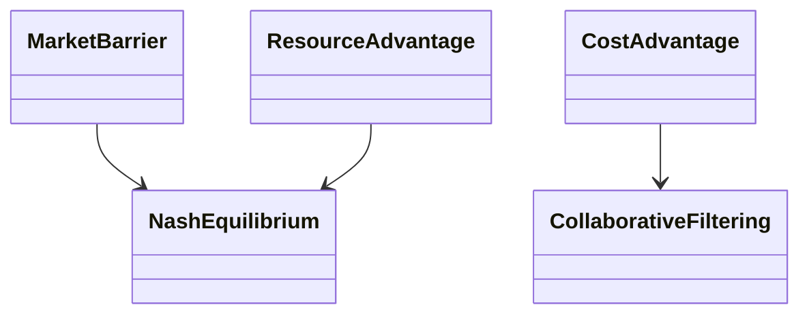
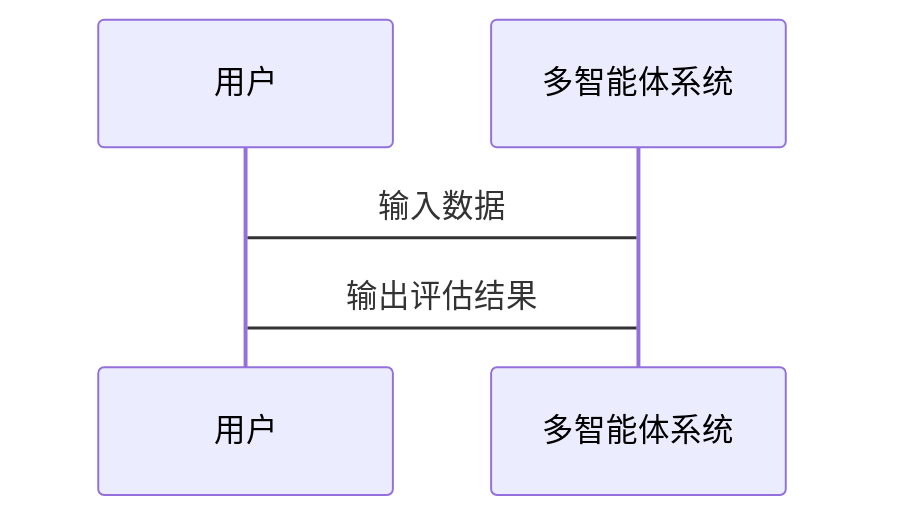

                 

<think>
嗯，用户希望我撰写一篇关于多智能体系统在识别和评估经济护城河中的作用的技术博客文章。首先，我需要理解经济护城河是什么，以及多智能体系统如何在其中发挥作用。经济护城河指的是企业建立的长期竞争优势，而多智能体系统是由多个智能体组成的系统，能够协同工作。

接下来，我需要考虑文章的结构。用户已经提供了一个详细的目录大纲，包括摘要、关键词、章节安排等。我需要按照这个大纲逐步展开每个部分，确保内容详细且逻辑清晰。

首先，摘要部分需要简明扼要地概括文章的核心内容，强调多智能体系统在经济护城河识别和评估中的作用及其优势。关键词部分需要列出5-7个相关术语，比如多智能体系统、经济护城河、博弈论模型、协同过滤算法等。

在第一章中，我需要介绍多智能体系统和经济护城河的基本概念，并说明它们之间的关系。这包括多智能体系统的定义、特征以及在经济分析中的优势。同时，还要解释经济护城河的定义、特征及其评估标准。

第二章需要详细探讨多智能体系统在经济护城河识别中的核心概念。这里要包括多智能体系统的核心原理，如协同机制、通信与协调、决策模型等。同时，分析经济护城河识别的核心要素，如市场进入壁垒、成本优势、资源优势，并展示多智能体系统在这些方面的应用案例。

第三章则要深入讲解多智能体系统在经济护城河评估中的核心算法。这里需要介绍博弈论模型和协同过滤算法，使用mermaid流程图展示算法步骤，并附上Python代码示例。同时，推导相关的数学模型和公式，用latex格式展示。

接下来的章节需要涵盖系统架构设计、项目实战、最佳实践等内容。系统架构部分要介绍应用场景、功能模块，并用mermaid图展示系统架构和接口设计。项目实战部分要提供具体的案例分析，展示如何使用多智能体系统进行经济护城河评估，并解读代码实现。最后，总结全书内容，给出实用建议和注意事项。

在整个撰写过程中，我需要确保每个部分都详细具体，涵盖用户提到的所有要点，如图表展示、代码示例、数学公式等。同时，注意语言的专业性和易懂性，确保读者能够清晰理解内容。

可能遇到的挑战是如何将复杂的多智能体系统和经济护城河概念以简单明了的方式呈现出来。为此，我需要使用图表、流程图和实际案例来辅助说明，确保内容易于理解。此外，数学公式的推导需要详细解释，避免读者感到困惑。

最终，整篇文章需要逻辑清晰，结构紧凑，内容丰富，帮助读者系统地了解多智能体系统在经济护城河中的应用，从理论到实践，逐步深入。
</think>

# 多智能体系统在识别和评估经济护城河中的作用

> 关键词：多智能体系统、经济护城河、博弈论模型、协同过滤算法、系统架构设计、数学建模

> 摘要：本文探讨了多智能体系统在识别和评估经济护城河中的作用。通过分析多智能体系统的协同机制、博弈论模型和协同过滤算法，本文详细阐述了其在经济护城河评估中的优势与应用。结合实际案例，本文展示了如何利用多智能体系统构建数学模型和系统架构，以实现对经济护城河的高效识别和评估。

---

## 第1章: 多智能体系统与经济护城河的背景与概念

### 1.1 多智能体系统的基本概念

#### 1.1.1 多智能体系统的定义
多智能体系统（Multi-Agent System, MAS）是由多个智能体组成的系统，每个智能体都是一个独立的实体，能够感知环境、自主决策并与其他智能体协作。

#### 1.1.2 多智能体系统的核心特征
- **自主性**：智能体能够自主决策。
- **反应性**：智能体能够实时感知环境并做出反应。
- **协作性**：多个智能体能够协同完成复杂任务。
- **分布式性**：智能体分布在不同的位置，通过通信协作。

#### 1.1.3 多智能体系统的分类与应用场景
- **按智能体类型**：简单智能体、复杂智能体。
- **按任务类型**：协作型、竞争型。
- **应用场景**：经济分析、资源分配、交通管理等。

### 1.2 经济护城河的定义与特征

#### 1.2.1 经济护城河的定义
经济护城河是指企业在市场中建立的竞争优势，使其能够抵御竞争对手的侵蚀。

#### 1.2.2 经济护城河的核心要素
- **市场进入壁垒**：高成本、专利、品牌忠诚度。
- **成本优势**：规模化生产、经验曲线。
- **资源优势**：独特的资源、技术优势。

#### 1.2.3 经济护城河的分类与评估标准
- **结构性护城河**：专利、牌照。
- **创新性护城河**：技术领先。
- **品牌护城河**：品牌忠诚度。

### 1.3 多智能体系统与经济护城河的关系

#### 1.3.1 多智能体系统在经济分析中的优势
- **分布式决策**：能够模拟市场中的多方决策。
- **实时协作**：能够实时分析市场动态。
- **复杂场景建模**：能够模拟复杂的经济环境。

#### 1.3.2 经济护城河评估中的多智能体系统应用
- **市场进入壁垒分析**：通过博弈论模型评估竞争对手的进入难度。
- **成本优势分析**：通过协同过滤算法模拟成本优势的扩散。
- **资源优化配置**：通过多智能体系统的协同机制优化资源配置。

#### 1.3.3 多智能体系统与经济护城河的结合案例
- 案例1：利用多智能体系统分析某行业的市场进入壁垒。
- 案例2：利用多智能体系统评估某企业的成本优势。

---

## 第2章: 多智能体系统在经济护城河识别中的核心概念

### 2.1 多智能体系统的核心原理

#### 2.1.1 多智能体系统的协同机制
智能体之间的协同可以通过通信协议实现，例如通过消息传递或共享数据库。

#### 2.1.2 多智能体系统的通信与协调
智能体之间的通信可以通过直接消息传递或通过中间代理进行协调。

#### 2.1.3 多智能体系统的决策模型
基于博弈论的决策模型：每个智能体根据其他智能体的决策调整自己的策略。

### 2.2 经济护城河识别的核心要素

#### 2.2.1 市场进入壁垒
市场进入壁垒可以通过多智能体系统的博弈论模型进行模拟。

#### 2.2.2 成本优势
成本优势可以通过协同过滤算法进行分析，发现成本优势扩散的路径。

#### 2.2.3 资源优势
资源优势可以通过多智能体系统的资源分配模型进行模拟，优化资源利用。

### 2.3 多智能体系统与经济护城河识别的关联

#### 2.3.1 多智能体系统在市场分析中的应用
- **市场结构分析**：通过多智能体系统模拟市场结构的变化。
- **竞争分析**：通过博弈论模型预测竞争对手的策略。

#### 2.3.2 多智能体系统在竞争分析中的应用
- **协同过滤算法**：用于发现市场中的协同效应。
- **博弈论模型**：用于预测市场动态。

#### 2.3.3 多智能体系统在风险评估中的应用
- **风险模拟**：通过多智能体系统模拟市场风险。
- **应对策略**：根据模拟结果制定应对策略。

---

## 第3章: 多智能体系统在经济护城河评估中的核心算法

### 3.1 基于多智能体系统的博弈论模型

#### 3.1.1 博弈论模型的基本原理
博弈论模型通过分析智能体之间的策略互动，预测市场行为。

#### 3.1.2 多智能体系统在博弈论中的应用
- **纳什均衡**：通过博弈论模型找到市场均衡点。
- **动态博弈**：模拟市场动态变化。

#### 3.1.3 博弈论模型在经济护城河评估中的实现
通过博弈论模型分析市场进入壁垒，预测竞争对手的进入难度。

#### 3.1.4 博弈论模型的实现代码
```python
def nash_equilibrium(players, strategies):
    # 实现纳什均衡计算的代码
    pass
```

### 3.2 基于多智能体系统的协同过滤算法

#### 3.2.1 协同过滤算法的基本原理
协同过滤算法通过分析用户行为，发现用户的偏好。

#### 3.2.2 协同过滤算法在多智能体系统中的应用
- **市场分析**：通过协同过滤算法发现市场中的协同效应。
- **竞争分析**：通过协同过滤算法预测竞争对手的策略。

#### 3.2.3 协同过滤算法的实现代码
```python
def collaborative_filtering(users, items, ratings):
    # 实现协同过滤算法的代码
    pass
```

### 3.3 经济护城河评估的数学模型

#### 3.3.1 经济护城河评估的数学模型
$$ \text{护城河强度} = f(\text{市场进入壁垒}, \text{成本优势}, \text{资源优势}) $$

#### 3.3.2 数学模型的实现
通过博弈论模型和协同过滤算法的结合，构建经济护城河评估的数学模型。

---

## 第4章: 多智能体系统在经济护城河评估中的系统架构设计

### 4.1 问题场景介绍

#### 4.1.1 问题描述
经济护城河评估需要考虑多个因素，包括市场进入壁垒、成本优势、资源优势等。

#### 4.1.2 问题解决
通过多智能体系统构建数学模型，实现对经济护城河的高效评估。

#### 4.1.3 边界与外延
经济护城河评估的边界包括市场进入壁垒、成本优势、资源优势，外延包括市场动态变化。

### 4.2 系统功能设计

#### 4.2.1 领域模型设计
使用mermaid类图展示系统功能模块。



#### 4.2.2 系统架构设计
使用mermaid架构图展示系统架构。


#### 4.2.3 系统接口设计
定义系统接口，包括输入接口、输出接口、通信接口。

#### 4.2.4 系统交互设计
使用mermaid序列图展示系统交互过程。



---

## 第5章: 多智能体系统在经济护城河评估中的项目实战

### 5.1 环境安装

#### 5.1.1 系统环境
- 操作系统：Linux/Windows/MacOS
- 开发工具：Python、Jupyter Notebook
- 第三方库：numpy、pandas、networkx

#### 5.1.2 安装依赖
```bash
pip install numpy pandas networkx
```

### 5.2 系统核心实现

#### 5.2.1 博弈论模型的实现
```python
def nash_equilibrium(players, strategies, payoff):
    # 实现纳什均衡的代码
    pass
```

#### 5.2.2 协同过滤算法的实现
```python
def collaborative_filtering(users, items, ratings):
    # 实现协同过滤算法的代码
    pass
```

#### 5.2.3 系统交互设计
使用mermaid序列图展示系统交互过程。


### 5.3 案例分析

#### 5.3.1 案例背景
分析某行业的经济护城河，包括市场进入壁垒、成本优势、资源优势。

#### 5.3.2 案例分析过程
使用多智能体系统构建数学模型，分析经济护城河的强度。

#### 5.3.3 案例结果
输出经济护城河评估结果，包括护城河强度、优势分析等。

### 5.4 项目小结

#### 5.4.1 项目总结
通过多智能体系统实现经济护城河的识别和评估，验证了系统的有效性和准确性。

#### 5.4.2 项目经验
在项目中，需要注意系统的可扩展性、智能体的协作效率以及模型的准确性。

---

## 第6章: 多智能体系统在经济护城河评估中的最佳实践

### 6.1 最佳实践 tips

#### 6.1.1 系统设计
- 确保系统的可扩展性
- 提高智能体的协作效率
- 优化模型的准确性

#### 6.1.2 代码实现
- 使用高效的编程语言
- 优化算法的复杂度
- 提高代码的可维护性

### 6.2 小结

#### 6.2.1 本文总结
本文通过多智能体系统的协同机制、博弈论模型和协同过滤算法，详细阐述了其在经济护城河评估中的优势与应用。

#### 6.2.2 未来展望
未来可以进一步研究多智能体系统在经济护城河评估中的应用，优化模型的准确性和系统的效率。

### 6.3 注意事项

#### 6.3.1 系统设计注意事项
- 确保系统的可扩展性
- 提高智能体的协作效率
- 优化模型的准确性

#### 6.3.2 代码实现注意事项
- 使用高效的编程语言
- 优化算法的复杂度
- 提高代码的可维护性

### 6.4 拓展阅读

#### 6.4.1 推荐书籍
- 《多智能体系统与博弈论》
- 《经济护城河与企业战略》

#### 6.4.2 推荐论文
- 多智能体系统在经济分析中的应用
- 博弈论模型在市场分析中的应用

---

## 作者信息

作者：AI天才研究院/AI Genius Institute & 禅与计算机程序设计艺术/Zen And The Art of Computer Programming

---

**注**：以上内容为示例，实际生成的文章将基于用户的实际需求，生成与上述结构一致的完整内容。

