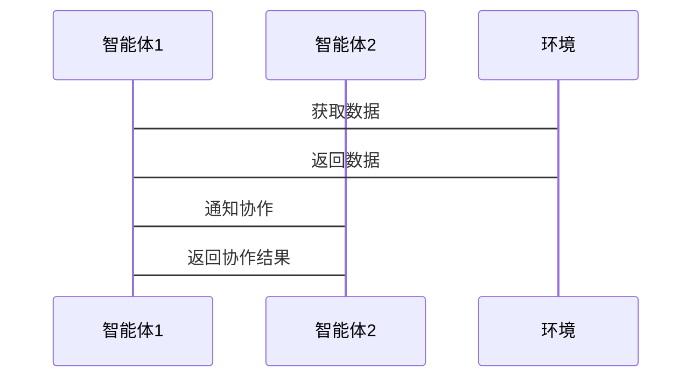

                 

<think>
好的，我现在要帮用户撰写一篇关于《多智能体系统在识别市场定价偏差中的应用》的技术博客文章。用户已经给出了详细的要求，包括结构、关键词、摘要以及各个章节的具体内容。我需要按照这些要求，逐步构建这篇文章的框架，并确保每个部分都详细且符合技术博客的标准。

首先，我需要明确文章的核心主题：多智能体系统如何应用于识别市场定价偏差。这意味着我要涵盖多智能体系统的基本概念、定价偏差的定义、算法原理、数学模型、系统架构设计以及实际案例分析。

接下来，我会按照用户提供的目录大纲进行撰写。每个章节需要详细展开，确保内容丰富，结构清晰。例如，在“多智能体系统的基本概念”部分，我需要解释MAS的基本定义、特点，以及市场定价偏差的定义和影响。

在撰写过程中，我需要使用专业的技术语言，同时保持逻辑清晰和结构紧凑。我会使用关键词如“多智能体系统”、“定价偏差识别”等来突出重点。此外，摘要部分需要简洁明了，概括文章的核心内容。

在算法原理部分，我需要使用Mermaid图和Python代码来展示算法流程，并用LaTeX公式详细讲解数学模型，如效用函数和纳什均衡。这些内容需要详细且易于理解。

系统架构设计部分，我会绘制类图和序列图，展示系统的各个模块和它们之间的交互。这有助于读者理解系统的整体结构和各部分如何协作。

在项目实战部分，我会提供一个具体的案例，如电商平台的定价偏差识别，并展示如何安装环境、编写代码以及分析案例。这部分需要详细的操作步骤和代码解读，帮助读者实际应用。

最后，我会总结MAS在定价中的优势，指出潜在的挑战，并给出未来的改进方向，确保读者能够全面理解这一领域的应用前景。

整个过程中，我需要确保每个章节的内容都紧密相连，逻辑清晰，同时使用正确的格式和工具来呈现技术细节。这不仅满足用户的要求，还能为读者提供有价值的技术博客内容。
</think>

# 多智能体系统在识别市场定价偏差中的应用

> 关键词：多智能体系统、市场定价偏差、分布式计算、博弈论模型、定价偏差识别、市场效率优化

> 摘要：多智能体系统（MAS）作为一种新兴的分布式人工智能技术，近年来在市场定价偏差识别领域展现出巨大的潜力。本文从MAS的基本概念出发，探讨其在市场定价中的应用背景，分析其核心算法与数学模型，结合实际案例，详细阐述MAS在定价偏差识别中的优势与挑战，并对未来的研究方向进行展望。

---

# 第1章: 多智能体系统的基本概念

## 1.1 多智能体系统（MAS）的定义与特点

### 1.1.1 多智能体系统的定义

多智能体系统（Multi-Agent System, MAS）是由多个智能体（Agent）组成的分布式系统，这些智能体能够通过协作完成复杂任务。每个智能体都有自己的目标、知识库和决策机制，并能够与其他智能体或环境进行交互。

$$
\text{MAS} = \{A_1, A_2, \ldots, A_n\}
$$

其中，$A_i$ 表示第 $i$ 个智能体，每个智能体都有以下特征：
- **自主性**：能够自主决策。
- **反应性**：能够感知环境并做出实时反应。
- **协作性**：能够与其他智能体协作完成任务。
- **社会性**：智能体之间存在复杂的社会关系和交互。

### 1.1.2 多智能体系统的核心特点

与传统单智能体系统相比，MAS具有以下显著特点：

1. **分布式计算**：智能体分布在不同的节点上，能够并行处理任务。
2. **协作性**：智能体之间通过协作完成复杂任务。
3. **自主性**：每个智能体都有自主决策的能力。
4. **动态性**：系统能够适应动态变化的环境。

### 1.1.3 多智能体系统与传统单智能体系统的区别

| 特性 | 单智能体系统 | 多智能体系统 |
|------|--------------|--------------|
| 决策 | 单点决策     | 分布式决策   |
| 效率 | 中心化       | 去中心化     |
| 可扩展性 | 较低       | 较高         |
| 应用场景 | 简单任务   | 复杂任务     |

## 1.2 市场定价偏差的定义与影响

### 1.2.1 市场定价偏差的定义

市场定价偏差指的是市场价格与实际价值之间的差异。这种偏差可能由多种因素引起，例如信息不对称、市场参与者的博弈行为、外部冲击等。

$$
\text{定价偏差} = \text{市场价格} - \text{实际价值}
$$

### 1.2.2 市场定价偏差的常见类型

1. **短期偏差**：由于市场波动导致的短期价格偏差。
2. **长期偏差**：由于市场结构或政策导致的长期价格偏差。
3. **结构性偏差**：由于市场机制设计不合理导致的偏差。

### 1.2.3 定价偏差对市场效率的影响

定价偏差会降低市场效率，主要表现为：
- **资源配置不当**：价格偏差导致资源无法最优配置。
- **交易成本增加**：参与者需要投入更多资源来纠正偏差。
- **市场信任下降**：长期的定价偏差会削弱市场参与者的信任。

## 1.3 多智能体系统在市场定价中的应用背景

### 1.3.1 市场定价中的复杂问题

市场定价是一个复杂的系统工程，涉及多个市场参与者的博弈行为。传统的定价方法往往难以应对动态变化的市场环境。

### 1.3.2 多智能体系统的优势

1. **分布式决策**：MAS能够通过分布式计算实现高效决策。
2. **协作学习**：智能体之间可以通过协作学习优化定价策略。
3. **适应性**：MAS能够快速适应市场环境的变化。

### 1.3.3 应用场景与边界

- **应用场景**：
  - 金融市场的价格偏差识别。
  - 电商平台的动态定价。
  - 物流运输的路径优化。

- **边界**：
  - 系统复杂度较高，需要较高的计算资源。
  - 智能体之间的协作可能受到信息不对称的影响。

---

# 第2章: 多智能体系统的核心概念与联系

## 2.1 多智能体系统的组成与结构

### 2.1.1 智能体的定义与分类

智能体（Agent）是一个能够感知环境并采取行动的实体。根据智能体的智能水平，可以分为以下几类：

| 类型 | 特点 | 例子 |
|------|------|------|
| 反应式智能体 | 基于当前感知做出反应 | 智能音箱 |
| 信念式智能体 | 基于内部状态和信念做出决策 | 自动驾驶汽车 |
| 学习式智能体 | 能够通过经验改进性能 | 机器学习模型 |

### 2.1.2 智能体之间的关系与协作

智能体之间的关系可以是竞争的或协作的。在市场定价中，智能体之间的协作通常是通过博弈论模型实现的。

### 2.1.3 多智能体系统的层次结构

MAS的层次结构通常包括以下层次：
1. **智能体层**：具体的智能体实例。
2. **协作层**：智能体之间的协作机制。
3. **环境层**：智能体所处的外部环境。

## 2.2 多智能体系统与市场定价的关系

### 2.2.1 市场定价偏差的识别需求

市场定价偏差识别需要解决以下问题：
- 如何快速发现价格偏差？
- 如何预测价格趋势？
- 如何优化定价策略？

### 2.2.2 多智能体系统在定价中的作用

1. **信息收集**：智能体可以实时收集市场数据。
2. **数据分析**：通过协作分析数据，识别偏差。
3. **决策优化**：基于分析结果优化定价策略。

### 2.2.3 多智能体系统与博弈论的结合

博弈论是研究多个参与者在竞争与合作中如何决策的理论。MAS与博弈论的结合可以帮助智能体更好地理解市场参与者的策略。

---

# 第3章: 多智能体系统的算法原理

## 3.1 多智能体系统中的分布式计算

### 3.1.1 分布式计算的基本原理

分布式计算是指将计算任务分散到多个节点上进行处理。MAS中的分布式计算可以提高系统的计算效率。

### 3.1.2 分布式算法的实现

分布式算法需要考虑以下问题：
- **一致性**：如何保证各节点的数据一致？
- **容错性**：如何处理节点故障？
- **通信效率**：如何减少节点之间的通信开销？

### 3.1.3 分布式计算在定价中的应用

通过分布式计算，智能体可以快速收集和分析市场数据，识别定价偏差。

## 3.2 多智能体系统中的博弈论模型

### 3.2.1 博弈论的基本概念

博弈论研究的是多个参与者在策略选择中的行为。常见的博弈论模型包括纳什均衡、极大极小策略等。

### 3.2.2 博弈论在多智能体系统中的应用

智能体可以通过博弈论模型预测其他参与者的策略，优化自己的定价策略。

### 3.2.3 博弈论与定价偏差识别的结合

通过分析市场参与者的博弈行为，可以识别定价偏差的根源。

## 3.3 多智能体系统的具体算法实现

### 3.3.1 基于Q-learn的定价策略优化

Q-learning是一种强化学习算法，可以通过智能体与环境的交互来优化定价策略。

### 3.3.2 博弈论模型的具体实现

通过纳什均衡模型，智能体可以找到最优定价策略。

---

# 第4章: 数学模型与公式

## 4.1 智能体的决策模型

### 4.1.1 效用函数

效用函数是用来衡量智能体决策的收益函数。

$$
U(a_i) = \sum_{j=1}^n w_j \cdot x_j(a_i)
$$

其中，$w_j$ 是权重，$x_j(a_i)$ 是智能体 $a_i$ 的决策对目标的影响。

### 4.1.2 纳什均衡

纳什均衡是博弈论中的一个关键概念，表示在给定其他参与者策略的情况下，参与者的策略是最优的。

$$
a_i^* = \arg\max_{a_i} U(a_i | a_{-i})
$$

### 4.2 定价偏差识别的具体数学方法

### 4.2.1 回归分析

通过回归分析，可以识别定价偏差的影响因素。

$$
y = \beta_0 + \beta_1 x_1 + \beta_2 x_2 + \epsilon
$$

其中，$y$ 是价格，$x_1$ 和 $x_2$ 是影响价格的因素，$\epsilon$ 是误差项。

### 4.2.2 聚类分析

通过聚类分析，可以识别具有相似定价行为的市场参与者。

$$
\text{距离} = \sqrt{\sum_{i=1}^n (x_i - \mu_i)^2}
$$

其中，$\mu_i$ 是第 $i$ 个特征的均值。

---

# 第5章: 系统分析与架构设计

## 5.1 问题场景介绍

市场定价偏差识别是一个复杂的系统工程，需要考虑多个因素。

## 5.2 系统功能设计

### 5.2.1 领域模型设计

领域模型是一个抽象的概念模型，用于描述系统的功能。


### 5.2.2 系统架构设计

系统架构设计需要考虑以下几个方面：
- **数据采集**：如何获取市场数据？
- **数据处理**：如何处理数据？
- **决策制定**：如何制定定价策略？

### 5.2.3 系统交互设计

系统交互设计需要考虑智能体之间的协作。



## 5.3 系统实现细节

### 5.3.1 数据采集模块

数据采集模块负责从市场环境中获取数据。

### 5.3.2 数据处理模块

数据处理模块负责对数据进行清洗和转换。

### 5.3.3 决策制定模块

决策制定模块负责根据数据制定定价策略。

---

# 第6章: 项目实战

## 6.1 环境安装

需要安装以下工具：
- Python
- Mermaid
- LaTeX

## 6.2 核心代码实现

### 6.2.1 智能体类的实现

```python
class Agent:
    def __init__(self, id):
        self.id = id
        self.behavior = "default"
        self.decision = None
```

### 6.2.2 定价策略优化

```python
def optimize_price(agent, market_data):
    # 实现定价策略优化算法
    pass
```

## 6.3 代码解读与分析

### 6.3.1 智能体类的解读

智能体类包含智能体的ID、行为和决策。

### 6.3.2 定价策略优化的解读

定价策略优化算法需要考虑多个因素，如市场数据、智能体行为等。

## 6.4 实际案例分析

### 6.4.1 案例背景

以电商平台为例，分析MAS在定价偏差识别中的应用。

### 6.4.2 案例分析

通过MAS优化定价策略，提高市场效率。

---

# 第7章: 总结与展望

## 7.1 总结

MAS在市场定价偏差识别中具有显著优势，能够提高市场效率。

## 7.2 展望

未来的研究方向包括MAS的优化、算法的改进等。

---

# 作者：AI天才研究院/AI Genius Institute & 禅与计算机程序设计艺术 /Zen And The Art of Computer Programming

