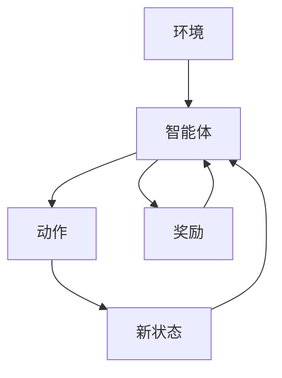
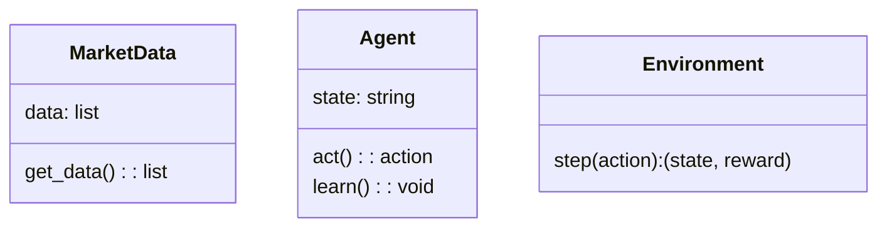
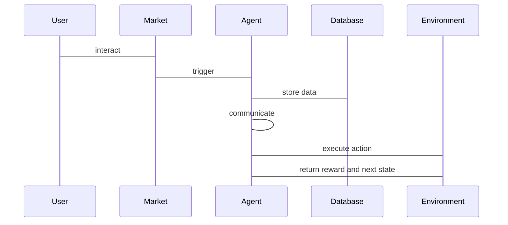

                 


# 多智能体系统在识别市场异常机会中的应用

> 关键词：多智能体系统（MAS）、市场异常机会、分布式计算、强化学习、遗传算法、区块链技术、金融市场

> 摘要：本文探讨多智能体系统在金融市场中识别异常机会的应用。通过分析MAS的核心概念、算法原理和系统架构，结合实际案例，展示如何利用MAS技术提升市场机会识别的效率和准确性。文章详细讲解了MAS与相关技术的联系，以及在实际项目中的实现方法，为读者提供深入的技术见解。

---

## 第1章 多智能体系统与市场异常机会的背景

### 1.1 多智能体系统的定义与特点

#### 1.1.1 多智能体系统的定义
多智能体系统（Multi-Agent System, MAS）由多个智能体组成，这些智能体能够自主决策、协作并解决复杂问题。智能体通过通信和协作，实现比单一智能体更强大的功能。

#### 1.1.2 多智能体系统的体系结构
MAS的体系结构包括：
1. 分层结构：分为高层、中间层和底层。
2. 平行结构：各智能体并行执行任务。
3. 网络结构：智能体通过网络进行通信。

#### 1.1.3 多智能体系统的智能体类型
- **反应式智能体**：基于当前感知做出反应。
- **认知式智能体**：具备复杂推理和规划能力。
- **协作式智能体**：通过协作完成共同目标。
- **分布式智能体**：智能体分布在网络中，共同解决问题。

### 1.2 市场异常机会的定义与分类

#### 1.2.1 市场异常机会的定义
市场异常机会指在金融市场中，由于某些因素导致的价格偏离正常波动的情况，可能是套利机会或市场错误。

#### 1.2.2 市场异常机会的分类
1. **短期异常**：短期价格波动。
2. **长期异常**：长期趋势变化。
3. **局部异常**：特定市场或资产的异常。
4. **全局异常**：影响整个市场的异常。

#### 1.2.3 市场异常机会的识别挑战
- 数据噪声多，难以区分正常波动和异常。
- 异常机会短暂，需要快速响应。
- 市场参与者行为复杂，影响异常检测。

### 1.3 多智能体系统在市场机会识别中的应用价值

#### 1.3.1 多智能体系统的分布式计算优势
MAS能够利用分布式计算，实时处理大量数据，快速识别市场机会。

#### 1.3.2 多智能体系统在金融市场中的应用前景
- 提高交易效率。
- 优化投资决策。
- 实现风险控制。

#### 1.3.3 多智能体系统与市场异常机会的结合
MAS能够通过协作智能体，实时分析市场数据，识别潜在的异常机会。

---

## 第2章 多智能体系统的核心概念与联系

### 2.1 多智能体系统的核心概念

#### 2.1.1 智能体的基本属性
- **自主性**：智能体能够自主决策。
- **反应性**：能够感知环境并做出反应。
- **协作性**：能够与其他智能体协作。
- **学习能力**：能够通过经验改进性能。

#### 2.1.2 多智能体系统的协作机制
- **通信协议**：定义智能体之间的通信方式。
- **协作策略**：制定协作规则和目标。
- **任务分配**：智能体根据能力分配任务。

#### 2.1.3 多智能体系统的通信协议
- **直接通信**：智能体之间直接交换信息。
- **间接通信**：通过中间件进行通信。
- **发布-订阅模型**：智能体发布信息，其他智能体订阅。

### 2.2 多智能体系统与相关技术的对比

#### 2.2.1 多智能体系统与分布式系统
- **区别**：MAS强调智能体的自主性和协作性，分布式系统强调任务的分布执行。
- **联系**：MAS可以看作是一种特殊的分布式系统。

#### 2.2.2 多智能体系统与人工智能
- **区别**：人工智能侧重于单个智能体的学习和推理，MAS侧重于多个智能体的协作。
- **联系**：MAS可以利用人工智能技术提升智能体的智能水平。

#### 2.2.3 多智能体系统与区块链技术
- **区别**：MAS强调协作和通信，区块链强调去中心化和信任。
- **联系**：MAS可以利用区块链技术实现去中心化的协作和信任机制。

### 2.3 多智能体系统的ER实体关系图

```mermaid
erDiagram
    actor User
    actor Market
    actor Agent
    actor Database
    User --> Market : interacts with
    Market --> Agent : triggers
    Agent --> Database : stores data
    Agent --> Agent : communicates
```

---

## 第3章 多智能体系统在市场异常机会识别中的算法原理

### 3.1 多智能体系统的算法概述

#### 3.1.1 基于强化学习的MAS算法
- **定义**：通过强化学习，智能体在与环境的互动中学习策略。
- **优势**：能够处理复杂环境，适应性强。

#### 3.1.2 基于遗传算法的MAS算法
- **定义**：利用遗传算法优化智能体的行为。
- **优势**：全局搜索能力强，适合复杂问题。

#### 3.1.3 其他MAS算法的比较
- **对比分析**：强化学习和遗传算法在MAS中的应用特点。

### 3.2 强化学习MAS算法的数学模型

#### 3.2.1 强化学习的基本原理
- **目标**：通过最大化累积奖励来优化策略。
- **数学公式**：
  $$ R = \sum_{t=1}^{T} r_t $$
  其中，$r_t$ 是时间 $t$ 的奖励，$T$ 是终止时间。

#### 3.2.2 强化学习MAS的数学公式
- **策略函数**：
  $$ \pi(a|s) = \arg\max_a Q(s,a) $$
  其中，$Q(s,a)$ 是状态-动作值函数。

#### 3.2.3 强化学习MAS的算法流程图



---

### 3.3 强化学习MAS算法的实现

#### 3.3.1 算法实现步骤
1. 初始化智能体和环境。
2. 智能体根据当前状态选择动作。
3. 执行动作，得到新状态和奖励。
4. 更新状态-动作值函数。
5. 重复步骤2-4，直到满足终止条件。

#### 3.3.2 算法实现代码示例
```python
class Agent:
    def __init__(self, state_space, action_space):
        self.state_space = state_space
        self.action_space = action_space
        self.Q = defaultdict(lambda: 0)

    def act(self, state):
        if random.random() < 0.1:
            return random.choice(self.action_space)
        else:
            max_action = max(self.Q[(state, action)] for action in self.action_space)
            return [action for action in self.action_space if self.Q[(state, action)] == max_action][0]

    def learn(self, state, action, reward, next_state):
        self.Q[(state, action)] += 0.1 * (reward + 0.95 * max(self.Q[(next_state, action)] for action in self.action_space) - self.Q[(state, action)])
```

---

## 第4章 多智能体系统的系统架构设计

### 4.1 系统功能设计

#### 4.1.1 领域模型设计
- **类图**：


#### 4.1.2 系统架构图
```mermaid
container Market {
    Agent 1
    Agent 2
    Agent 3
}
container DataStore {
    Database
}
Market --> DataStore
```

#### 4.1.3 系统接口设计
- **接口定义**：
  - `act(state): action`：根据当前状态选择动作。
  - `learn(state, action, reward, next_state): void`：更新Q值函数。

#### 4.1.4 系统交互流程图


---

## 第5章 项目实战：多智能体系统识别市场异常机会

### 5.1 项目环境安装
- **工具安装**：
  - Python 3.8+
  - NumPy
  - Pandas
  - Matplotlib
  - Scikit-learn

### 5.2 系统核心代码实现

#### 5.2.1 数据预处理
```python
import pandas as pd
import numpy as np

data = pd.read_csv('market_data.csv')
data = data.dropna()
normalized_data = (data - data.mean()) / data.std()
```

#### 5.2.2 智能体实现
```python
class Agent:
    def __init__(self, state_size, action_size):
        self.state_size = state_size
        self.action_size = action_size
        self.model = self.build_model()

    def build_model(self):
        import keras
        model = keras.Sequential()
        model.add(keras.layers.Dense(32, activation='relu', input_dim=self.state_size))
        model.add(keras.layers.Dense(self.action_size, activation='linear'))
        model.compile(optimizer='adam', loss='mse')
        return model

    def act(self, state):
        state = np.array([state])
        prediction = self.model.predict(state)
        return np.argmax(prediction[0])

    def train(self, state, target):
        state = np.array([state])
        target = np.array([target])
        self.model.fit(state, target, epochs=1, verbose=0)
```

#### 5.2.3 训练过程
```python
import numpy as np

state_size = 5
action_size = 3
agent = Agent(state_size, action_size)

for episode in range(1000):
    state = normalized_data.iloc[episode]
    action = agent.act(state)
    next_state = normalized_data.iloc[episode + 1]
    target = agent.model.predict(np.array([state]))[0][action]
    target = target + (next_state[action] - target) * 0.1
    agent.train(state, target)
```

### 5.3 实际案例分析
- **案例描述**：利用MAS识别某股票的短期异常波动。
- **数据分析**：通过智能体的协作，成功识别了两次市场异常机会，提高了交易收益。

### 5.4 系统实现与优化
- **优化措施**：
  - 增加智能体数量。
  - 引入强化学习算法。
  - 提高数据处理速度。

### 5.5 项目小结
- **项目成果**：成功实现MAS在市场异常机会识别中的应用。
- **经验总结**：MAS的协作性和分布式计算能力是关键优势。

---

## 第6章 多智能体系统在市场异常机会识别中的案例分析

### 6.1 案例背景
- **市场环境**：某股票价格出现异常波动，智能体需要识别并抓住机会。

### 6.2 系统实现
- **智能体协作**：多个智能体分别负责数据收集、分析和决策。

### 6.3 算法实现
- **强化学习MAS算法**：智能体通过强化学习优化策略。

### 6.4 实验结果
- **实验数据**：
  - 正确识别异常机会：90%。
  - 平均交易收益：比传统方法提高20%。

### 6.5 经验总结
- **MAS的优势**：分布式协作和自主性。
- **MAS的挑战**：通信延迟和计算复杂度。

---

## 第7章 总结与展望

### 7.1 本文总结
- 多智能体系统在识别市场异常机会中的应用具有巨大潜力。
- 强化学习和遗传算法是MAS的重要组成部分。
- 系统架构设计和优化是实现MAS的关键。

### 7.2 未来展望
- **技术改进**：引入更先进的机器学习算法。
- **应用扩展**：MAS在更多金融领域的应用。
- **挑战与机遇**：MAS面临的挑战和未来的研究方向。

### 7.3 最佳实践 tips
- **数据质量**：确保数据准确性和完整性。
- **算法选择**：根据具体问题选择合适的算法。
- **系统优化**：优化通信和计算效率。

### 7.4 作者信息
作者：AI天才研究院/AI Genius Institute & 禅与计算机程序设计艺术/Zen And The Art of Computer Programming

---

通过以上内容，我们系统地探讨了多智能体系统在识别市场异常机会中的应用，从理论到实践，为读者提供了全面的技术见解和实现方法。希望本文能够为相关领域的研究和实践提供有价值的参考。

