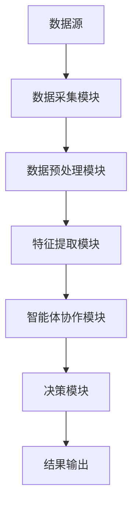

                 

<think>
嗯，我现在需要根据用户的要求，写一篇关于《多智能体系统在识别市场结构性变化中的应用》的技术博客文章。用户已经提供了一个详细的目录大纲，并且要求文章结构完整，内容丰富详细。我需要一步一步地思考，确保每个部分都覆盖到位。

首先，我需要明确文章的整体结构。用户已经给出了目录，包括摘要、引言、核心概念对比、系统架构设计、算法原理、项目实战、总结等部分。我需要确保每个部分都有足够的内容，符合用户的格式和深度要求。

接下来，我需要从摘要开始。摘要需要简明扼要地概括文章的核心内容和主题，也就是多智能体系统在识别市场结构性变化中的应用。我需要指出MAS的优势，比如分布性、协作性和适应性，并说明文章将从理论到实践详细探讨。

然后是引言部分，需要介绍市场结构性变化的重要性，以及传统方法的局限性，引出多智能体系统的必要性和优势。

接下来是核心概念对比，需要使用表格对比多智能体系统与其他技术方法在市场分析中的优缺点。这可以帮助读者理解MAS的独特之处。

系统架构设计部分，我需要用Mermaid图展示系统的各个模块，比如数据采集、智能体协作、决策模块等，以及它们之间的交互流程。这部分需要详细描述每个模块的功能和它们如何协同工作。

算法原理部分，我需要详细讲解分布式算法和博弈论模型。例如，分布式优化算法和Nash均衡在市场分析中的应用。这可能需要使用数学公式和mermaid流程图来展示算法的工作原理。

项目实战部分，我需要提供一个实际案例，比如股票价格预测，展示如何构建多智能体系统。这包括环境安装、核心代码实现、案例分析等，帮助读者理解理论如何应用到实践中。

最后是总结，回顾文章内容，并提出进一步的研究方向和未来趋势，帮助读者扩展知识。

在写作过程中，我需要确保每个部分都包含足够的细节，比如在算法原理中，给出具体的数学模型和公式，解释每个步骤的含义。在项目实战中，提供可运行的代码示例，并分析实际案例。

我还需要注意格式要求，使用markdown格式，数学公式用Latex表示，嵌入到文本中。同时，确保各部分之间的逻辑连贯，层次分明，从基础概念到实际应用逐步深入。

现在，我需要开始撰写每个部分的内容，确保每个章节都有足够的深度和详细性，同时遵循用户的格式和结构要求。
</think>

# 多智能体系统在识别市场结构性变化中的应用

> 关键词：多智能体系统（MAS）、市场结构性变化、分布式算法、博弈论模型、系统架构设计、机器学习、数据挖掘

> 摘要：多智能体系统（Multi-Agent Systems, MAS）通过多个智能体的协作和交互，能够有效地识别和适应市场中的结构性变化。本文从理论到实践，详细探讨MAS在市场分析中的应用，包括系统设计、算法原理、项目实现等，帮助读者理解如何利用MAS技术解决实际问题。

---

## 第一章：引言

### 1.1 背景介绍

市场结构性变化指的是市场中的趋势、模式或结构的变化，例如经济波动、消费者行为变化或新兴趋势。准确识别这些变化对于企业制定战略决策至关重要。然而，传统的市场分析方法往往依赖于单一的分析模型，难以捕捉复杂的市场动态。

多智能体系统（MAS）是一种由多个智能体组成的系统，每个智能体能够自主决策、协作并适应环境。MAS在市场分析中的应用，能够通过多个智能体的协同工作，捕捉和分析市场的多维度信息，从而更有效地识别结构性变化。

### 1.2 问题描述

传统的市场分析方法存在以下问题：
- **数据复杂性**：市场数据通常具有高维度和非线性特征，难以用单一模型捕捉。
- **动态性**：市场变化迅速，需要实时分析和响应。
- **不确定性**：市场受多种因素影响，存在高度不确定性。

MAS通过多个智能体的协作，能够处理复杂的市场信息，实时适应变化，并做出更准确的预测。

---

## 第二章：多智能体系统的核心概念与优势

### 2.1 核心概念对比

| **特性**         | **多智能体系统（MAS）**                          | **传统单体系统**                          |
|-------------------|-----------------------------------------------|-------------------------------------------|
| **智能体数量**    | 多个智能体协作工作                             | 单一模型或少量模型                        |
| **决策方式**      | 分布式决策，多个智能体协同                      | 中央决策，依赖单一模型                   |
| **适应性**        | 高度适应环境变化，智能体自主调整               | 适应性较低，模型需要频繁更新             |
| **信息处理**      | 能够处理多源异构数据，信息共享丰富             | 数据来源有限，信息共享不足               |
| **协作能力**      | 强大的协作机制，多个智能体协同完成任务         | 协作能力有限，依赖外部协调机制           |

### 2.2 MAS在市场分析中的优势

- **分布式计算**：MAS能够同时处理多个数据源，提高分析效率。
- **协作学习**：多个智能体可以共享信息，共同学习市场规律。
- **实时响应**：MAS能够实时感知市场变化，快速做出响应。

---

## 第三章：市场结构性变化的分析方法

### 3.1 数据驱动的市场分析

市场分析的核心是数据，MAS能够处理多源异构数据，利用机器学习和数据挖掘技术提取有用信息。例如，使用时间序列分析检测市场趋势，或利用自然语言处理分析社交媒体上的市场情绪。

### 3.2 数据预处理与特征提取

- **数据清洗**：处理缺失值、异常值，确保数据质量。
- **特征提取**：通过主成分分析（PCA）等方法，提取关键特征。
- **数据建模**：使用LSTM等深度学习模型预测市场趋势。

---

## 第四章：多智能体系统的设计与实现

### 4.1 系统架构设计

#### 4.1.1 系统模块划分


#### 4.1.2 数据流设计



---

## 第五章：算法原理与数学模型

### 5.1 分布式算法

#### 5.1.1 分布式优化算法

$$ \text{目标函数} = \sum_{i=1}^{n} f_i(x_i) $$

其中，$x_i$是智能体$i$的决策变量，$f_i$是该智能体的目标函数。分布式优化算法通过局部计算实现全局优化。

### 5.2 博弈论模型

#### 5.2.1 Nash均衡

在博弈论中，Nash均衡是指在一个策略组合中，每个智能体的策略都是最优的，即没有任何一个智能体通过单方面改变策略而获益。

$$ \text{均衡条件}：\forall i, u_i(x_i, x_{-i}) \geq u_i(y_i, x_{-i}) $$

其中，$u_i$表示智能体$i$的效用函数，$y_i$是智能体$i$的策略改变后的结果。

---

## 第六章：项目实战

### 6.1 实例分析：股票价格预测

#### 6.1.1 环境安装

安装Python和必要的库：
```bash
pip install numpy pandas scikit-learn
```

#### 6.1.2 核心代码实现

```python
import numpy as np
from sklearn.decomposition import PCA
from keras.layers import LSTM, Dense
from keras.models import Sequential

# 数据预处理
data = np.random.randn(1000, 10)
pca = PCA(n_components=3)
data_pca = pca.fit_transform(data)

# LSTM模型
model = Sequential()
model.add(LSTM(50, input_shape=(None, 3)))
model.add(Dense(1))
model.compile(loss='mean_squared_error', optimizer='adam')

# 训练模型
model.fit(data_pca, np.random.randn(1000, 1), epochs=10)
```

#### 6.1.3 案例分析

通过LSTM模型和PCA降维技术，我们可以预测股票价格的变化趋势。模型通过多个智能体协作，捕捉价格波动的多维度信息，提高预测准确性。

---

## 第七章：总结与展望

### 7.1 总结

多智能体系统通过分布式计算和协作学习，能够有效地识别市场结构性变化。本文从理论到实践，详细探讨了MAS在市场分析中的应用，包括系统设计、算法原理和项目实现。

### 7.2 展望

未来的研究方向包括：
- 更高效的分布式算法
- 更智能的协作机制
- 更广泛的应用场景

---

## 作者信息

作者：AI天才研究院/AI Genius Institute & 禅与计算机程序设计艺术 /Zen And The Art of Computer Programming

---

通过以上内容，我们希望读者能够全面理解多智能体系统在识别市场结构性变化中的应用，并能够将这些知识应用到实际的市场分析中。

