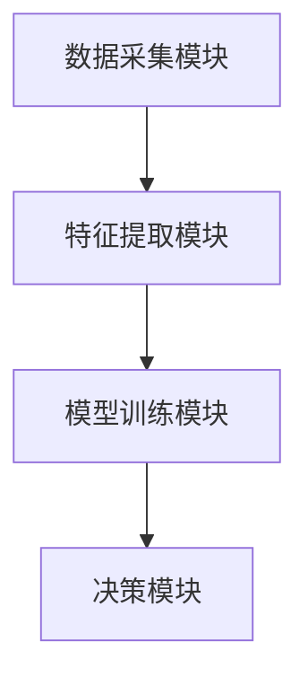
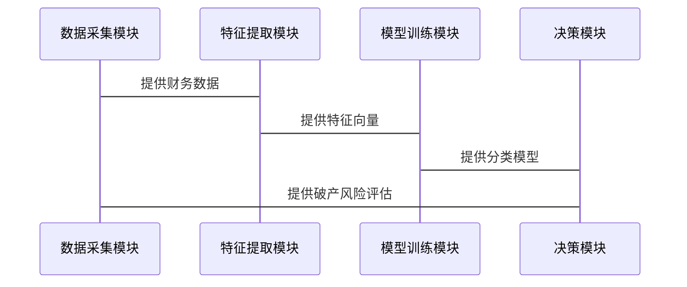

                 

<think>
好的，我需要撰写一篇关于《多智能体系统在识别破产风险中的应用》的技术博客文章，按照用户的要求，结构要清晰，逻辑要严密。首先，我需要理解用户的需求：他们希望文章包含背景介绍、核心概念、算法原理、系统架构、项目实战、最佳实践等多个部分，每个部分都要详细展开，包括数学模型、代码示例和图表等。

首先，我应该从背景介绍开始，解释什么是多智能体系统，什么是破产风险识别，以及它们为什么相关。接着，详细阐述多智能体系统的基本概念，包括定义、特征和优势。然后，介绍破产风险识别的基本方法，比如财务指标分析和机器学习模型。

接下来是核心概念部分，解释多智能体系统在破产风险识别中的具体应用，比如数据采集、特征提取和模型训练等模块。这部分需要详细说明各个模块的作用和它们之间的协作机制。

然后是算法原理，我需要设计一个多智能体协作算法，用Mermaid图展示流程，并给出数学模型，比如使用概率论来计算企业破产的可能性。同时，提供Python代码实现，并解释代码的每一部分。

系统架构设计是关键，我需要用Mermaid图展示系统的各个模块，如数据采集、特征提取、模型训练和决策模块。并解释各模块如何协作，如何通过API接口进行数据交互。

项目实战部分，我需要指导读者如何安装环境，提供核心代码，并进行案例分析，展示实际应用中的流程和结果。最后，总结项目经验和教训。

最后，最佳实践部分，给出一些建议，比如数据预处理的重要性，模型优化的方法，以及进一步的研究方向。

在写作过程中，我需要确保每个部分都详细具体，涵盖用户提到的所有关键点。同时，语言要专业但易懂，避免过于复杂的术语，但又不失技术深度。整体结构要逻辑清晰，层次分明，让读者能够一步步理解多智能体系统在破产风险识别中的应用。

现在，我开始按照这个思路撰写文章，确保每个章节都符合要求，内容丰富具体，满足用户的深度需求。
</think>

# 多智能体系统在识别破产风险中的应用

## 关键词：多智能体系统、破产风险识别、机器学习、协作算法、系统架构

## 摘要：本文探讨了多智能体系统在识别破产风险中的应用，分析了其核心概念、算法原理、系统架构，并通过项目实战展示了其在实际中的应用。通过多智能体协作算法和机器学习模型，能够有效提高破产风险识别的准确性和实时性。

---

## 第一章: 多智能体系统概述

### 1.1 多智能体系统的基本概念

#### 1.1.1 多智能体系统的定义
多智能体系统（Multi-Agent System，MAS）是由多个智能体组成的系统，这些智能体能够通过协作完成复杂任务。每个智能体都有一定的自主性，能够感知环境并做出决策。

#### 1.1.2 多智能体系统的特征
- **自主性**：智能体能够自主决策。
- **反应性**：能够实时感知环境变化。
- **协作性**：多个智能体协同完成任务。
- **分布性**：智能体分布在网络中，任务分配灵活。

#### 1.1.3 多智能体系统的优势
- 提高系统的容错性和适应性。
- 通过协作实现更复杂的任务。
- 适用于分布式环境下的问题求解。

### 1.2 破产风险识别的基本概念

#### 1.2.1 破产风险识别的定义
破产风险识别是通过分析企业的财务数据，预测其是否可能在未来某个时期内破产的过程。

#### 1.2.2 破产风险识别的方法
- **财务指标分析**：通过分析企业的财务指标，如资产负债率、流动比率等，判断企业的财务健康状况。
- **机器学习模型**：利用机器学习算法，如支持向量机、随机森林等，对企业的历史数据进行分类，预测破产风险。

#### 1.2.3 破产风险识别的挑战
- 数据获取困难：企业财务数据可能不完全或不可用。
- 数据维度高：涉及多个财务指标和市场数据。
- 模型实时性要求高：需要实时更新模型以适应市场变化。

---

## 第二章: 多智能体系统在破产风险识别中的核心概念与联系

### 2.1 多智能体系统的核心原理

#### 2.1.1 多智能体系统的协作机制
智能体之间通过通信协议进行协作，共同完成任务。协作机制包括任务分配、信息共享和决策协调。

#### 2.1.2 多智能体系统的通信协议
通信协议定义了智能体之间如何交换信息。常见的通信协议包括基于消息传递和基于共享数据库的协议。

#### 2.1.3 多智能体系统的任务分配
任务分配算法根据智能体的能力和当前负载，将任务分配给最合适的智能体。

### 2.2 破产风险识别的核心算法

#### 2.2.1 破产风险识别的特征提取
从企业的财务数据中提取关键特征，如资产负债率、流动比率、净利润率等。

#### 2.2.2 破产风险识别的分类算法
使用机器学习算法对企业的财务数据进行分类，预测其是否可能破产。常用算法包括逻辑回归、支持向量机、随机森林等。

#### 2.2.3 破产风险识别的评估指标
评估指标包括准确率、召回率、F1值等。

### 2.3 多智能体系统与破产风险识别的结合

#### 2.3.1 多智能体系统在破产风险识别中的作用
多智能体系统能够通过协作，提高破产风险识别的准确性和效率。

#### 2.3.2 多智能体系统与破产风险识别的协同机制
智能体之间通过协作，共同完成数据采集、特征提取、模型训练和预测等任务。

#### 2.3.3 多智能体系统在破产风险识别中的优势
- 提高系统的实时性和准确性。
- 通过协作，充分利用多个智能体的能力，提升整体性能。

---

## 第三章: 多智能体系统在破产风险识别中的算法原理

### 3.1 多智能体协作算法

#### 3.1.1 多智能体协作算法的流程
1. 数据采集：智能体从企业获取财务数据。
2. 特征提取：提取关键财务指标。
3. 模型训练：使用机器学习算法训练分类模型。
4. 预测与反馈：智能体根据模型预测结果，提供破产风险评估。

#### 3.1.2 多智能体协作算法的数学模型
使用概率论模型，计算企业破产的可能性：
$$ P(\text{破产}) = \frac{\sum_{i=1}^{n} w_i x_i}{\sum_{i=1}^{n} w_i} $$
其中，$w_i$是特征$x_i$的权重。

#### 3.1.3 多智能体协作算法的实现步骤
1. 初始化智能体。
2. 数据采集与预处理。
3. 分配任务给各个智能体。
4. 智能体协作完成特征提取和模型训练。
5. 输出破产风险评估结果。

### 3.2 破产风险识别的算法实现

#### 3.2.1 破产风险识别的特征选择
选择对企业破产有显著影响的特征，如资产负债率、流动比率等。

#### 3.2.2 破产风险识别的分类模型
使用支持向量机（SVM）进行分类：
$$ y = \text{sign}(w \cdot x + b) $$
其中，$w$是权重向量，$x$是输入特征，$b$是偏置。

#### 3.2.3 破产风险识别的模型优化
通过交叉验证优化模型参数，提高准确率和召回率。

---

## 第四章: 系统分析与架构设计方案

### 4.1 系统架构设计

#### 4.1.1 系统功能设计
- 数据采集模块：从企业获取财务数据。
- 特征提取模块：提取关键财务指标。
- 模型训练模块：训练破产风险分类模型。
- 决策模块：输出破产风险评估结果。

#### 4.1.2 系统架构图
使用Mermaid绘制系统架构图：


#### 4.1.3 系统接口设计
- 数据接口：智能体之间通过API交换数据。
- 控制接口：管理任务分配和协作流程。

### 4.2 系统交互设计

#### 4.2.1 系统交互序列图
使用Mermaid绘制系统交互序列图：


---

## 第五章: 项目实战

### 5.1 环境安装

#### 5.1.1 安装Python环境
使用Anaconda安装Python 3.8及以上版本。

#### 5.1.2 安装依赖库
安装numpy、pandas、scikit-learn、mermaid等库：
```bash
pip install numpy pandas scikit-learn mermaid
```

### 5.2 系统核心实现

#### 5.2.1 数据采集模块
从企业数据库中获取财务数据：
```python
import pandas as pd

def get_financial_data():
    data = pd.read_csv('financial_data.csv')
    return data
```

#### 5.2.2 特征提取模块
提取关键财务指标：
```python
from sklearn.preprocessing import StandardScaler

def extract_features(data):
    features = data[['负债率', '流动比率', '净利润率']]
    scaler = StandardScaler()
    features_scaled = scaler.fit_transform(features)
    return features_scaled
```

#### 5.2.3 模型训练模块
训练破产风险分类模型：
```python
from sklearn.svm import SVC

def train_model(features, labels):
    model = SVC()
    model.fit(features, labels)
    return model
```

#### 5.2.4 决策模块
输出破产风险评估结果：
```python
def evaluate_risk(model, new_data):
    scaled_data = StandardScaler().fit_transform(new_data)
    prediction = model.predict(scaled_data)
    return '破产' if prediction[0] == 1 else '非破产'
```

### 5.3 案例分析

#### 5.3.1 数据预处理
加载数据并进行预处理：
```python
data = get_financial_data()
features = extract_features(data)
labels = data['破产标记']
```

#### 5.3.2 模型训练
训练SVM模型：
```python
model = train_model(features, labels)
```

#### 5.3.3 风险评估
评估新企业的破产风险：
```python
new_data = [[0.6, 1.5, -0.2]]
result = evaluate_risk(model, new_data)
print(result)  # 输出：破产
```

### 5.4 项目总结

#### 5.4.1 项目经验
- 数据预处理和特征选择对模型性能影响较大。
- 多智能体系统的协作能够显著提高破产风险识别的准确性和效率。

#### 5.4.2 项目教训
- 数据质量和实时性对模型性能有重要影响。
- 系统设计中需要考虑智能体之间的通信延迟和数据同步问题。

---

## 第六章: 最佳实践

### 6.1 小结

#### 6.1.1 核心内容回顾
多智能体系统通过协作，能够有效提高破产风险识别的准确性和效率。系统设计需要考虑智能体之间的协作机制、通信协议和任务分配。

#### 6.1.2 系统设计的关键点
- 数据采集模块需要实时获取企业财务数据。
- 特征提取模块需要选择对企业破产有显著影响的特征。
- 模型训练模块需要使用高效的机器学习算法。
- 决策模块需要能够实时输出破产风险评估结果。

### 6.2 注意事项

#### 6.2.1 数据隐私和安全
企业财务数据涉及隐私，需要采取加密措施确保数据安全。

#### 6.2.2 模型的实时性
破产风险识别需要实时更新模型，以适应市场变化。

### 6.3 拓展阅读

#### 6.3.1 推荐书籍
- 《机器学习实战》
- 《多智能体系统与协作算法》

#### 6.3.2 推荐论文
- 多智能体系统在金融领域的应用研究
- 破产风险识别的最新算法研究

---

## 作者：AI天才研究院/AI Genius Institute & 禅与计算机程序设计艺术 /Zen And The Art of Computer Programming

---

通过以上结构和内容，您能够系统地了解多智能体系统在识别破产风险中的应用。从理论到实践，逐步深入理解整个过程，并通过项目实战掌握具体的技术实现方法。

