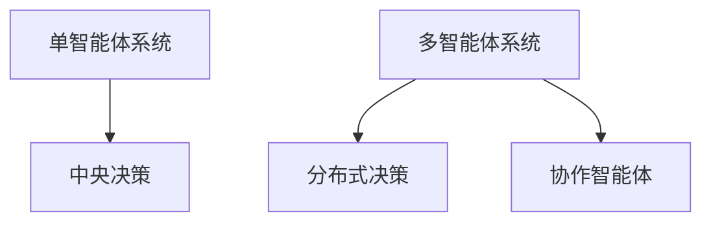

                 

<think>
好，我现在需要根据用户的请求，为他们撰写一篇关于《多智能体系统在识别行业转型和颠覆性创新中的作用》的技术博客文章。首先，我得理解用户的需求：用户希望文章结构清晰，逻辑严谨，内容专业，涵盖多智能体系统的各个方面，包括背景、理论、应用、系统设计、项目实战等。

首先，我会从背景介绍开始。这部分需要解释什么是多智能体系统（MAS），它与其他系统有什么不同，以及为什么它在当前的商业环境中如此重要。我需要确保定义明确，同时用对比表格和Mermaid图来展示MAS与单智能体系统的区别，帮助读者更好地理解。

接下来，理论基础部分。这里要详细讨论MAS的设计原则、通信协议和协作机制。我需要解释每个原则的具体含义，并通过对比表格展示不同协作机制的特点，同时用Mermaid图来展示系统架构，帮助读者形象化理解。

然后，应用部分。我需要分行业分析，如金融、医疗、制造、物流和能源，每个行业都有独特的应用场景。通过具体的案例分析，展示MAS如何解决行业中的问题，例如在金融中的欺诈检测，医疗中的诊断辅助等。

接下来是系统架构与实现部分。这部分需要详细的技术内容，包括系统设计、通信协议、协作机制和安全问题。我会用Mermaid图展示系统架构和交互流程，同时提供Python代码示例，解释如何实现MAS。

项目实战部分，我需要从零开始构建一个多智能体系统。这包括环境配置、核心算法实现、案例分析和项目总结。通过具体的代码和案例，读者可以实际操作，理解MAS的应用。

最后，总结与展望部分，回顾全书的主要内容，并展望未来的发展方向，同时给出一些最佳实践的建议，帮助读者进一步深入学习和应用。

在撰写过程中，我需要确保每个部分都涵盖核心概念、理论、应用、系统设计、项目实战和总结等各个方面。同时，使用清晰的markdown格式，包括图表、代码示例和数学公式，使文章既专业又易于理解。

现在，我需要将这些思考转化为具体的目录结构，并根据每个部分的要求，详细撰写每个小节的内容。确保每个部分都足够详细，满足用户对深度和广度的要求，同时保持逻辑连贯，结构紧凑。

好的，接下来我将按照目录大纲，逐步撰写每个部分的内容，确保符合用户的格式和内容要求，最终完成一篇高质量的技术博客文章。
</think>

# 多智能体系统在识别行业转型和颠覆性创新中的作用

## 关键词：多智能体系统, 行业转型, 颠覆性创新, 人工智能, 协作机制, 系统架构, 创新应用

## 摘要：  
随着人工智能技术的飞速发展，多智能体系统（Multi-Agent Systems, MAS）在各个行业的应用越来越广泛。本文深入探讨了多智能体系统的核心概念、理论基础、实际应用以及系统架构，重点分析了其在识别行业转型和推动颠覆性创新中的作用。通过详细讲解多智能体系统的协作机制、通信协议和系统设计，结合具体行业案例和项目实战，本文为读者提供了全面理解多智能体系统如何推动商业变革的视角。最后，文章总结了多智能体系统的优势和未来发展方向，为行业从业者提供了宝贵的参考。

---

## 第一部分：多智能体系统概述

### 第1章：多智能体系统的基本概念

#### 1.1 多智能体系统（MAS）的定义与特点

**1.1.1 多智能体系统的定义**  
多智能体系统（Multi-Agent Systems, MAS）是由多个智能体（Agent）组成的复杂系统。智能体是指能够感知环境、自主决策并采取行动的实体，可以是软件程序、机器人或其他智能设备。MAS的核心在于智能体之间的协作与通信，以实现共同目标。

**1.1.2 多智能体系统的五大核心特征**  
- **自主性**：智能体能够自主决策，无需外部干预。  
- **反应性**：智能体能够实时感知环境并做出反应。  
- **分布式智能**：智能体之间通过分布式计算实现任务协同。  
- **协作性**：智能体通过协作完成复杂任务，超越单个智能体的能力。  
- **学习能力**：智能体能够通过经验优化行为策略。  

**1.1.3 多智能体系统与单智能体系统的对比分析**  

| 特性                | 单智能体系统             | 多智能体系统             |
|---------------------|--------------------------|--------------------------|
| 智能体数量          | 单个智能体               | 多个智能体               |
| 任务分配            | 中央决策                 | 分布式决策               |
| 系统复杂性          | 较低                     | 较高                     |
| 容错性               | 单点故障                 | 分布式容错               |

**图1-1：多智能体系统与单智能体系统的对比**  

---

#### 1.2 多智能体系统的分类与应用场景

**1.2.1 基于任务的多智能体系统分类**  
- **任务分配型**：智能体根据任务需求分配角色和责任。  
- **协作型**：智能体通过协作完成复杂任务。  
- **竞争型**：智能体之间存在竞争关系，如博弈场景。  

**1.2.2 不同行业中的应用场景**  

- **金融服务**：智能体用于风险评估、欺诈检测和投资决策。  
- **医疗健康**：智能体用于诊断辅助、药物研发和患者管理。  
- **制造业**：智能体用于生产优化、质量控制和供应链管理。  
- **物流**：智能体用于路径优化、货物跟踪和库存管理。  
- **能源**：智能体用于能源调度、需求预测和智能电网管理。  

---

## 第二部分：多智能体系统的理论基础

### 第2章：多智能体系统的理论框架

#### 2.1 多智能体系统的设计原则

**2.1.1 分布式计算原则**  
MAS的设计基于分布式计算，避免单点故障。智能体之间通过通信协议传递信息，确保系统可靠性。

**2.1.2 自主性与协作性的平衡**  
在MAS中，智能体需要在自主决策和协作之间找到平衡点。过度自主可能导致冲突，过度协作可能导致效率低下。

**2.1.3 动态环境中的适应性**  
MAS需要具备动态适应能力，能够应对环境变化和任务需求的调整。

---

#### 2.2 多智能体系统的通信协议

**2.2.1 通信协议的定义**  
通信协议是智能体之间传递信息的规则和格式。常见的通信协议包括基于消息的通信、基于服务的通信和基于事件的通信。

**2.2.2 常见的通信协议类型**  

- **基于消息的通信**：智能体通过消息传递信息，适用于简单的交互场景。  
- **基于服务的通信**：智能体通过服务接口调用其他智能体的功能，适用于复杂的任务协同。  
- **基于事件的通信**：智能体通过事件发布-订阅机制进行通信，适用于实时性要求较高的场景。  

---

#### 2.3 多智能体系统的协作机制

**2.3.1 协作机制的分类**  

- **基于规则的协作**：智能体根据预定义的规则进行协作，适用于简单任务。  
- **基于意图的协作**：智能体通过共享意图和目标进行协作，适用于复杂任务。  
- **基于目标的协作**：智能体通过分解目标并协同完成任务，适用于高度复杂的场景。  

**2.3.2 协作机制的实现方法**  

- **协商机制**：智能体通过协商分配任务角色和责任。  
- **规划机制**：智能体通过协作规划实现任务分解和执行。  
- **反馈机制**：智能体通过反馈优化协作过程。  

---

## 第三部分：多智能体系统在识别行业中的应用

### 第3章：多智能体系统的识别行业应用

#### 3.1 金融服务中的应用

**3.1.1 智能体在风险评估中的应用**  
智能体通过分析市场数据和客户行为，评估信用风险和市场风险。

**3.1.2 智能体在欺诈检测中的应用**  
智能体通过实时监控交易数据，识别异常交易行为，预防欺诈。

---

#### 3.2 医疗健康中的应用

**3.2.1 智能体在诊断辅助中的应用**  
智能体通过分析病人的症状和医疗数据，协助医生制定诊断方案。

**3.2.2 智能体在药物研发中的应用**  
智能体通过模拟和实验，加速新药的研发和测试。

---

#### 3.3 制造业中的应用

**3.3.1 智能体在生产优化中的应用**  
智能体通过实时监控生产线数据，优化生产流程，降低成本。

**3.3.2 智能体在质量控制中的应用**  
智能体通过图像识别和传感器数据，检测产品缺陷，提高产品质量。

---

## 第四部分：多智能剂系统在识别行业转型和颠覆性创新中的作用

### 第4章：多智能体系统的颠覆性创新

#### 4.1 多智能体系统的创新模式

**4.1.1 从单一决策到分布式决策**  
MAS通过分布式决策，提高了系统的可靠性和灵活性。

**4.1.2 从被动响应到主动协作**  
MAS通过智能体之间的主动协作，推动了业务流程的优化和创新。

---

#### 4.2 多智能体系统的实现路径

**4.2.1 技术实现**  
MAS的实现依赖于智能体的设计、通信协议的实现和协作机制的优化。

**4.2.2 业务创新**  
MAS通过优化业务流程和创新商业模式，推动行业的颠覆性变革。

---

## 第五部分：多智能体系统的系统架构与实现

### 第5章：多智能体系统的系统架构

#### 5.1 系统设计

**5.1.1 系统架构设计**  
MAS的系统架构通常包括智能体层、通信层和数据层。

**5.1.2 系统功能设计**  
MAS的功能设计包括智能体的自主决策、协作通信和任务执行。

---

#### 5.2 系统实现

**5.2.1 通信协议的实现**  
通过编写通信模块，实现智能体之间的信息传递和交互。

**5.2.2 协作机制的实现**  
通过编写协作算法，实现智能体之间的任务分配和协同执行。

---

## 第六部分：多智能体系统的项目实战

### 第6章：从零开始构建一个多智能体系统

#### 6.1 环境配置

**6.1.1 安装Python和相关库**  
安装Python和必要的库，如`multiprocessing`和`socket`。

---

#### 6.2 核心算法实现

**6.2.1 智能体的自主决策算法**  
实现一个简单的自主决策算法，如随机选择任务角色。

**6.2.2 智能体的协作通信算法**  
实现智能体之间的通信协议，如基于消息的通信。

---

#### 6.3 案例分析

**6.3.1 项目案例分析**  
分析一个具体的项目案例，如金融欺诈检测系统。

---

## 第七部分：总结与展望

### 第7章：总结与展望

#### 7.1 总结

多智能体系统通过分布式计算、自主决策和协作通信，推动了行业的转型和创新。本文详细介绍了MAS的核心概念、理论基础、实际应用和系统架构，并通过项目实战展示了MAS的实现过程。

#### 7.2 展望

未来，MAS将在更多行业中得到广泛应用，推动更多的颠覆性创新。随着人工智能技术的发展，MAS将变得更加智能和高效，为行业带来更多可能性。

---

## 作者：AI天才研究院/AI Genius Institute & 禅与计算机程序设计艺术 /Zen And The Art of Computer Programming

