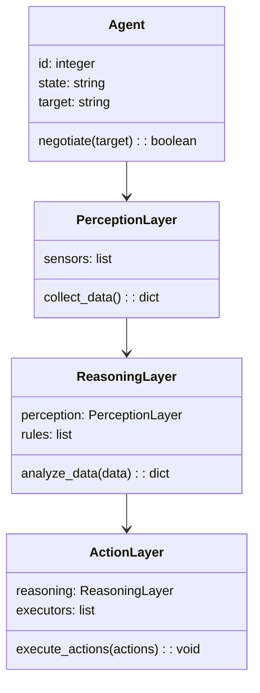

                 


# 多智能体系统在识别行业颠覆性创新中的应用

> 关键词：多智能体系统，颠覆性创新，创新识别，人工智能，系统架构

> 摘要：本文探讨了多智能体系统在识别行业颠覆性创新中的应用。通过分析多智能体系统的原理、算法和架构，结合实际案例，展示了如何利用多智能体系统的优势来识别和预测颠覆性创新，为企业和技术开发者提供理论支持和实践指导。

---

## 第一部分：多智能体系统与颠覆性创新概述

### 第1章：多智能体系统概述

#### 1.1 多智能体系统的基本概念

多智能体系统（Multi-Agent System，MAS）是由多个智能体（Agent）组成的分布式系统，每个智能体都是一个能够感知环境、自主决策、并与其他智能体协作的实体。与传统的单智能体系统不同，多智能体系统强调智能体之间的交互和协作，能够在复杂环境中完成单个智能体无法完成的任务。

**多智能体系统的特点：**

- **分布性**：智能体分布在网络中，每个智能体负责特定的任务。
- **自主性**：智能体能够自主决策，无需外部干预。
- **协作性**：智能体之间通过通信和协商完成共同目标。
- **反应性**：智能体能够实时感知环境并做出反应。

**多智能体系统与其他技术的区别：**

- **与分布式系统**：多智能体系统强调智能体的自主性和协作性，而分布式系统更关注资源的分配和任务的执行。
- **与人工智能**：人工智能侧重于单个智能体的学习和推理，而多智能体系统注重多个智能体的协作和交互。

#### 1.2 多智能体系统的核心要素

**智能体的结构与功能：**

- **感知层**：通过传感器或数据接口获取环境信息。
- **推理层**：基于感知信息进行逻辑推理和决策。
- **行动层**：根据推理结果执行具体动作。

**智能体之间的通信机制：**

- **直接通信**：智能体之间通过共享内存或消息传递进行通信。
- **间接通信**：通过中间媒介（如数据库或消息队列）进行通信。

**多智能体系统的协作机制：**

- **任务分配**：根据智能体的能力和当前状态分配任务。
- **协商与冲突解决**：通过协商解决资源分配和任务优先级的冲突。

#### 1.3 多智能体系统在颠覆性创新中的应用场景

- **传统行业的颠覆性创新**：如共享经济、数字化转型等。
- **新兴技术领域的颠覆性创新**：如人工智能、区块链等。
- **多智能体系统的优势**：通过协作和数据共享，快速识别潜在的创新趋势。

---

### 第2章：颠覆性创新的识别与分析

#### 2.1 颠覆性创新的定义与特征

**颠覆性创新的定义：**

颠覆性创新是指通过引入新技术或新的商业模式，对现有市场格局产生根本性改变的创新。它通常针对非主流市场的需求，随着时间推移，逐渐成为主流市场的主流产品或服务。

**颠覆性创新的特征：**

- **技术突破性**：引入了新技术或新的方法。
- **市场破坏性**：对现有市场格局产生重大影响。
- **用户需求导向**：通常满足了被忽视的用户需求。

#### 2.2 颠覆性创新的识别方法

**基于数据分析的识别方法：**

通过分析市场数据、用户反馈和行业趋势，识别潜在的颠覆性创新。

**基于市场反馈的识别方法：**

通过观察市场的反应，判断某项创新是否具有颠覆性。

**基于技术趋势的识别方法：**

通过技术预测和趋势分析，识别可能引发颠覆性创新的技术。

#### 2.3 多智能体系统在创新识别中的作用

**多智能体系统在数据采集中的应用：**

通过分布式智能体实时采集市场数据和用户反馈。

**多智能体系统在数据分析中的应用：**

利用多智能体的协作能力，分析数据中的潜在模式和趋势。

**多智能体系统在决策支持中的应用：**

通过智能体的协作和推理，为创新识别提供决策支持。

---

## 第二部分：多智能体系统的核心概念与原理

### 第3章：多智能体系统的原理与架构

#### 3.1 多智能体系统的原理

**智能体的行为模型：**

智能体的行为模型通常包括感知、推理和行动三个阶段。感知阶段通过传感器获取环境信息，推理阶段基于感知信息进行决策，行动阶段根据决策结果执行动作。

**智能体的决策机制：**

智能体的决策机制通常基于状态空间和动作空间，通过构建状态转移模型和动作选择模型来实现。

**智能体的协作机制：**

智能体之间的协作机制包括任务分配、协商和冲突解决。通过协商机制，智能体可以达成一致，避免冲突。

#### 3.2 多智能体系统的架构设计

**分层架构：**

分层架构将系统划分为多个层次，每个层次负责特定的功能。例如，感知层、推理层和行动层。

**分布式架构：**

分布式架构强调智能体的分布性和协作性，每个智能体独立运行，通过通信机制进行协作。

**集中式架构：**

集中式架构通过中央控制节点协调智能体的协作，适用于任务简单且需要集中控制的场景。

#### 3.3 多智能体系统的通信协议

**智能体之间的通信方式：**

- **直接通信**：智能体之间通过共享内存或消息队列进行通信。
- **间接通信**：通过中间媒介（如数据库或消息队列）进行通信。

**通信协议的设计原则：**

- **可靠性**：确保通信的准确性和及时性。
- **安全性**：防止通信中的数据泄露和篡改。
- **高效性**：减少通信的延迟和资源消耗。

---

## 第三部分：多智能体系统的算法与实现

### 第4章：多智能体系统的算法基础

#### 4.1 分布式计算算法

**分布式计算算法**用于多智能体系统中任务的分配和协调。常见的分布式计算算法包括：

- **任务分配算法**：根据智能体的能力和当前状态分配任务。
- **负载均衡算法**：通过动态调整任务分配，确保系统负载均衡。

#### 4.2 协商算法

**协商算法**用于智能体之间的任务分配和资源分配。常见的协商算法包括：

- **拍卖算法**：通过拍卖机制分配任务。
- **协商协议**：通过协商解决冲突和达成一致。

#### 4.3 一致性算法

**一致性算法**用于确保多个智能体之间的状态一致性。常见的一致性算法包括：

- **一致性协议**：通过同步智能体的状态，确保系统的一致性。

---

### 第5章：多智能体系统的实现

#### 5.1 算法实现

**协商算法的实现：**

协商算法的实现通常包括以下几个步骤：

1. **初始化**：智能体初始化状态和目标。
2. **协商阶段**：智能体通过协商机制达成一致。
3. **执行阶段**：智能体根据协商结果执行任务。

**协商算法的代码实现：**

```python
class Agent:
    def __init__(self, id):
        self.id = id
        self.state = None
        self.target = None

    def negotiate(self, target):
        # 简单协商算法，实际应用中可能需要更复杂的逻辑
        if self.state == 'idle':
            self.target = target
            return True
        else:
            return False

# 示例用法
agent1 = Agent(1)
agent2 = Agent(2)
# 协商分配任务
task = 'analyze_data'
if agent1.negotiate(task):
    print(f"Agent {agent1.id} 获得任务 {task}")
elif agent2.negotiate(task):
    print(f"Agent {agent2.id} 获得任务 {task}")
else:
    print("任务分配失败")
```

#### 5.2 系统架构实现

**分层架构的实现：**

分层架构通常包括以下几个层次：

- **感知层**：负责数据的采集和初步处理。
- **推理层**：负责数据的分析和推理。
- **行动层**：负责根据推理结果执行动作。

**分层架构的代码实现：**

```python
class PerceptionLayer:
    def __init__(self):
        self.sensors = []

    def collect_data(self):
        # 收集感知数据
        data = {}
        for sensor in self.sensors:
            data[sensor.id] = sensor.read_data()
        return data

class ReasoningLayer:
    def __init__(self, perception_layer):
        self.perception = perception_layer
        self.rules = []

    def analyze_data(self, data):
        # 根据规则分析数据
        result = {}
        for rule in self.rules:
            if rule.apply(data):
                result[rule.name] = rule.result
        return result

class ActionLayer:
    def __init__(self, reasoning_layer):
        self.reasoning = reasoning_layer
        self.executors = []

    def execute_actions(self, actions):
        # 执行动作
        for action in actions:
            for executor in self.executors:
                if executor.can_execute(action):
                    executor.execute(action)
                    break
```

---

## 第四部分：系统分析与架构设计

### 第6章：系统分析与设计

#### 6.1 问题场景介绍

**颠覆性创新识别的挑战：**

- **数据多样性**：需要处理不同类型的数据。
- **实时性要求**：需要快速识别潜在的创新趋势。
- **协作性需求**：需要多个智能体协作完成任务。

#### 6.2 系统功能设计

**系统功能模块：**

- **数据采集模块**：负责采集市场数据和用户反馈。
- **数据分析模块**：负责分析数据，识别潜在的创新趋势。
- **决策支持模块**：负责为创新识别提供决策支持。

**领域模型（Mermaid 类图）：**



#### 6.3 系统架构设计

**系统架构图（Mermaid 架构图）：**

```mermaid
archi
    title Multi-Agent System Architecture
    node [] 多智能体系统 {
        PerceptionLayer
        ReasoningLayer
        ActionLayer
    }
    node [] 通信机制 {
        DirectCommunication
        IndirectCommunication
    }
    多智能体系统 --> 通信机制
```

---

## 第五部分：项目实战

### 第7章：项目实战

#### 7.1 环境配置

**开发环境：**

- **编程语言**：Python
- **开发工具**：PyCharm 或 VSCode
- **依赖库**：如 `numpy`, `pandas`, `networkx` 等。

#### 7.2 核心代码实现

**协商算法的实现：**

```python
class NegotiationProtocol:
    def __init__(self, agents):
        self.agents = agents

    def negotiate(self, target):
        # 简单协商算法，实际应用中可能需要更复杂的逻辑
        for agent in self.agents:
            if agent.state == 'idle':
                agent.target = target
                return agent
        return None

# 示例用法
agent1 = Agent(1)
agent2 = Agent(2)
negotiation = NegotiationProtocol([agent1, agent2])
assigned_agent = negotiation.negotiate('analyze_data')
if assigned_agent:
    print(f"Agent {assigned_agent.id} 获得任务 analyze_data")
else:
    print("任务分配失败")
```

---

## 第六部分：总结与展望

### 7.3 总结

多智能体系统在识别行业颠覆性创新中具有重要的应用价值。通过协作和数据共享，多智能体系统能够快速识别潜在的创新趋势，并为决策者提供支持。本文详细探讨了多智能体系统的原理、算法和架构，并通过实际案例展示了其在创新识别中的应用。

### 7.4 展望

未来的研究可以进一步探讨多智能体系统在复杂环境下的协作机制，以及如何通过强化学习等技术提升系统的自主性和智能性。同时，还需要进一步研究多智能体系统在不同行业中的应用，探索其在颠覆性创新识别中的潜力。

---

## 作者：AI天才研究院/AI Genius Institute & 禅与计算机程序设计艺术 /Zen And The Art of Computer Programming

---

**注**：以上内容为框架示例，实际撰写时需要根据具体需求补充详细内容。

