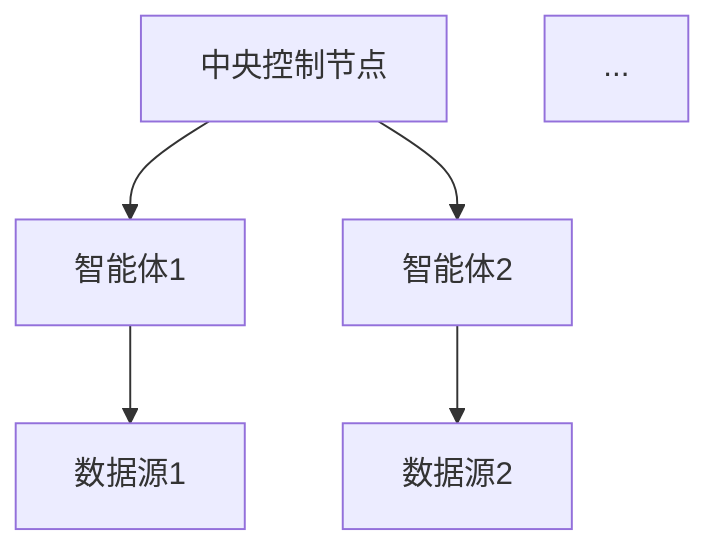

                 


# 多智能体系统在费雪成长股筛选中的创新应用

## 关键词：多智能体系统、费雪成长股、投资策略、算法优化、金融数据分析

## 摘要：  
本文探讨了多智能体系统在费雪成长股筛选中的创新应用。通过分析多智能体系统的原理和费雪成长股的核心特征，提出了一种基于多智能体的分布式计算和协作学习算法，优化了传统费雪成长股筛选方法的局限性。本文详细阐述了系统的架构设计、算法实现、案例分析以及项目实战，为金融投资领域的智能化决策提供了新的思路。

---

# 第一部分: 多智能体系统与费雪成长股筛选的背景与基础

## 第1章: 多智能体系统与费雪成长股概述

### 1.1 多智能体系统的定义与特点  
多智能体系统（Multi-Agent System, MAS）是由多个智能体（Agent）组成的分布式系统，每个智能体能够独立感知环境、自主决策并与其他智能体协作完成任务。其特点包括：

- **分布式性**：智能体独立运行，无中央控制节点。
- **协作性**：智能体之间通过通信和协作完成复杂任务。
- **反应性**：能够实时感知环境变化并做出响应。
- **适应性**：能够根据环境变化调整自身行为。

### 1.2 费雪成长股的基本概念  
费雪成长股是指那些具有持续盈利能力和较高成长潜力的股票。其核心特征包括：

- **高ROE（净资产收益率）**：反映公司盈利能力。
- **稳定的收益增长**：收入和利润持续增长。
- **合理的估值**：市盈率、市净率等指标处于合理区间。

### 1.3 多智能体系统在投资领域的应用前景  
多智能体系统在金融投资中的应用前景广阔，尤其是在费雪成长股筛选中，其分布式计算和协作学习能力能够显著提升筛选效率和准确性。通过结合多智能体系统的优势，可以优化传统筛选方法的不足。

## 第2章: 多智能体系统与费雪成长股的核心概念与联系  

### 2.1 多智能体系统的原理与架构  
多智能体系统的核心原理是通过智能体之间的协作完成复杂任务。其架构通常包括以下组件：

- **智能体**：负责数据采集、分析和决策。
- **通信机制**：智能体之间的信息交互。
- **协作协议**：定义智能体之间的协作规则。

### 2.2 费雪成长股筛选的核心要素  
费雪成长股筛选的关键要素包括：

- **财务指标**：如ROE、收入增长率等。
- **市场表现**：如股价波动率、成交量等。
- **公司基本面**：如行业地位、管理团队等。

### 2.3 多智能体系统与费雪成长股的关联性分析  
多智能体系统通过分布式计算和协作学习，能够同时分析海量数据，捕捉潜在的成长股。其优势在于：

- **高效性**：多智能体并行处理数据，提升筛选速度。
- **准确性**：通过协作学习优化筛选模型。
- **适应性**：能够动态调整筛选策略以应对市场变化。

---

# 第二部分: 多智能体系统在费雪成长股筛选中的算法原理  

## 第3章: 多智能体系统的算法实现  

### 3.1 分布式计算算法  
多智能体系统通过分布式计算实现数据处理。每个智能体负责处理一部分数据，并通过通信机制将结果汇总。其流程如下：

1. 数据分发：将数据集分发给多个智能体。
2. 并行处理：每个智能体独立处理分配的数据。
3. 结果汇总：智能体将结果汇总到中央节点。

### 3.2 协作学习算法  
协作学习算法通过智能体之间的协作优化模型。具体步骤如下：

1. 数据采集：智能体从不同数据源获取信息。
2. 模型训练：每个智能体训练本地模型。
3. 模型融合：智能体将本地模型参数发送给其他智能体，进行模型融合。
4. 模型优化：通过融合后的模型参数优化整体模型。

### 3.3 自适应优化算法  
自适应优化算法能够根据市场变化动态调整筛选策略。其关键在于实时更新模型参数，以适应市场波动。

---

## 第4章: 费雪成长股筛选的算法流程  

### 4.1 数据采集与预处理  
数据采集包括从多个数据源获取股票信息，如财务报表、市场数据等。预处理步骤包括数据清洗和特征提取。

### 4.2 指标筛选与权重分配  
根据费雪成长股的核心指标，如ROE、收入增长率等，进行指标筛选和权重分配。权重分配可以通过机器学习方法实现。

### 4.3 模型训练与优化  
通过机器学习算法训练筛选模型，并通过优化算法提升模型性能。

---

# 第三部分: 系统分析与架构设计方案  

## 第5章: 系统架构设计  

### 5.1 项目背景与目标  
本项目旨在通过多智能体系统优化费雪成长股筛选过程，提高筛选效率和准确性。

### 5.2 系统功能设计  
系统功能包括数据采集、筛选模型训练、结果展示等。

### 5.3 系统架构图  


### 5.4 接口设计与交互流程  
系统通过API接口实现智能体之间的通信和数据交互。

---

## 第6章: 项目实战  

### 6.1 环境安装  
需要安装Python、TensorFlow等工具。

### 6.2 核心代码实现  
```python
class Agent:
    def __init__(self, data):
        self.data = data
        self.model = None

    def train(self):
        # 训练模型
        pass

    def communicate(self, other_agent):
        # 通信并更新模型
        pass
```

### 6.3 案例分析  
通过实际案例分析，验证系统的有效性和准确性。

---

## 第7章: 总结与展望  

### 7.1 本章小结  
总结了多智能体系统在费雪成长股筛选中的应用及其优势。

### 7.2 未来展望  
展望了多智能体系统在金融投资领域的进一步应用，如实时交易、风险控制等。

---

# 作者  
作者：AI天才研究院 & 禅与计算机程序设计艺术

