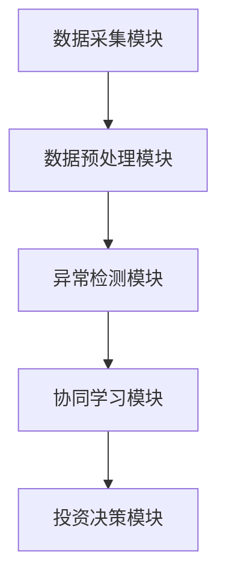

                 

<think>
嗯，用户希望我写一篇关于《多智能体系统增强价值投资的市场异常因子识别》的技术博客，而且他们已经给出了详细的大纲，包括摘要、关键词和各个章节的结构。看来用户对技术博客的要求很高，需要结构清晰、内容详实，并且每个部分都要有具体的分析和例子。

首先，我需要确保每个章节都覆盖到核心内容，包括背景、理论、算法、系统架构、项目实战和最佳实践。用户还特别提到要使用Mermaid图表和数学公式，所以我得确保这些部分都包含进去，甚至给出Python代码示例。

接下来，我需要检查每个章节的小节是否足够详细。比如，在介绍多智能体系统时，我需要解释基本概念，并与传统系统进行对比，这样读者能更好地理解其优势。在价值投资部分，我需要结合实际的金融理论，说明多智能体系统如何增强投资决策。

然后，市场异常因子的识别方法是关键部分，我需要详细说明统计学、机器学习和多智能体系统的方法，可能还需要提供具体的算法流程图和代码示例。系统架构设计部分，我需要使用Mermaid图来展示系统的各个模块和它们之间的交互，这有助于读者理解系统的整体结构。

在项目实战部分，我需要指导读者如何安装环境，提供核心代码，并通过实际案例展示系统的应用。最后，在最佳实践部分，我需要总结学习内容，并给出一些注意事项和扩展阅读的建议，帮助读者进一步深入学习。

总之，我需要按照用户的要求，逐步展开每个部分，确保内容详实，结构清晰，并且符合技术博客的专业性。这样才能满足用户的需求，写出一篇高质量的技术博客文章。
</think>

# 多智能体系统增强价值投资的市场异常因子识别

> **关键词**: 多智能体系统, 价值投资, 市场异常因子, 协同学习, 金融市场, 异常检测

> **摘要**: 本文探讨了多智能体系统在价值投资中的应用，特别是如何通过多智能体系统的协同学习机制，增强市场异常因子的识别能力。文章从理论基础、算法原理、系统架构到实际应用，详细分析了多智能体系统在金融市场的优势，并通过具体案例展示了其在价值投资中的实际应用效果。本文还提出了基于多智能体系统的异常检测模型，并给出了实现该模型的具体步骤和代码示例。

---

# 第一部分: 多智能体系统与价值投资背景

## 第1章: 多智能体系统与价值投资背景

### 1.1 多智能体系统的基本概念

#### 1.1.1 多智能体系统的定义
多智能体系统（Multi-Agent System, 简称MAS）是由多个智能体（Agent）组成的分布式系统，这些智能体能够通过自主决策和协同合作完成复杂任务。与传统的单智能体系统相比，多智能体系统具有更强的分布式计算能力和协同决策能力。

#### 1.1.2 多智能体系统的特征
- **自主性**: 每个智能体都具有自主决策的能力，能够独立完成部分任务。
- **反应性**: 智能体能够实时感知环境变化并做出相应的反应。
- **协作性**: 智能体之间可以通过通信和协作完成复杂的任务。
- **分布式性**: 智能体之间的任务分配和计算是分布式的，不存在中心化的控制节点。

#### 1.1.3 多智能体系统与传统单智能体系统的区别
| 特性         | 多智能体系统             | 单智能体系统             |
|--------------|--------------------------|--------------------------|
| 结构         | 分布式                   | 集中式                   |
| 智能体数量   | 多个                     | 单个                     |
| 协作能力     | 强                       | 弱                       |
| 灵活性       | 高                       | 低                       |

### 1.2 价值投资的基本原理

#### 1.2.1 价值投资的定义
价值投资是一种投资策略，旨在通过分析企业的基本面（如财务状况、盈利能力、行业地位等），找到市场价格低于其内在价值的股票进行投资。

#### 1.2.2 价值投资的核心理念
- **内在价值**: 企业的真实价值，与市场价格可能长期偏离。
- **安全边际**: 投资价格低于内在价值的安全范围。
- **长期视角**: 价值投资强调长期持有优质资产，而非短期交易。

#### 1.2.3 价值投资在金融市场中的应用
价值投资广泛应用于股票、基金、房地产等多种金融资产的投资中，尤其在股票市场中表现尤为突出。

### 1.3 市场异常因子的定义与分类

#### 1.3.1 市场异常因子的定义
市场异常因子是指在金融市场中，由于市场参与者的行为偏差、信息不对称或其他因素导致的市场价格偏离其内在价值的现象。

#### 1.3.2 市场异常因子的分类
- **短期波动**: 由于市场情绪、突发事件等引起的短期价格波动。
- **长期偏差**: 由于市场参与者的行为偏差、信息不对称等引起的长期价格偏差。
- **结构性异常**: 由于市场结构、制度设计等引起的异常现象。

#### 1.3.3 市场异常因子的识别方法
市场异常因子的识别方法包括统计学方法、机器学习方法和多智能体系统方法等。

---

## 第2章: 多智能体系统在价值投资中的应用

### 2.1 多智能体系统在金融市场的优势

#### 2.1.1 多智能体系统的分布式计算能力
多智能体系统通过分布式计算能够高效处理金融市场中的海量数据，并快速做出决策。

#### 2.1.2 多智能体系统的协同决策能力
多智能体系统能够通过智能体之间的协作，实现更优的决策效果，尤其是在复杂金融市场环境中。

#### 2.1.3 多智能体系统的自适应能力
多智能体系统能够根据市场环境的变化自适应调整智能体的行为策略，从而提高系统的鲁棒性。

### 2.2 多智能体系统与价值投资的结合

#### 2.2.1 多智能体系统在价值投资中的角色
- **数据采集与分析**: 智能体负责采集和分析企业的财务数据、市场数据等。
- **价值评估**: 智能体通过协同学习完成对企业的内在价值评估。
- **异常检测**: 智能体能够识别市场价格与内在价值的偏离，即市场异常因子。

#### 2.2.2 多智能体系统如何增强价值投资的决策能力
- **分布式计算**: 多智能体系统能够高效处理海量数据，提高价值评估的准确性。
- **协同学习**: 智能体之间的协同学习能够提升系统的整体决策能力。
- **自适应性**: 系统能够根据市场环境的变化动态调整决策策略。

#### 2.2.3 多智能体系统在价值投资中的具体应用场景
- **股票筛选**: 通过多智能体系统的协同学习，筛选出具有投资价值的股票。
- **风险控制**: 通过智能体之间的协作，识别和控制投资风险。
- **市场预测**: 通过多智能体系统的自适应能力，预测市场价格走势。

### 2.3 市场异常因子的识别方法

#### 2.3.1 基于统计学的异常检测方法
统计学方法通过分析数据的分布特征，识别异常值。例如，使用z-score方法或t分布方法。

#### 2.3.2 基于机器学习的异常检测方法
机器学习方法通过训练模型，识别数据中的异常模式。例如，使用Isolation Forest算法或One-Class SVM算法。

#### 2.3.3 基于多智能体系统的异常检测方法
多智能体系统通过智能体之间的协作，实现对市场异常因子的识别。例如，使用协同学习算法，多个智能体共同完成异常检测任务。

---

## 第3章: 多智能体系统增强价值投资的市场异常因子识别

### 3.1 多智能体系统的协同学习机制

#### 3.1.1 协同学习的定义
协同学习是指多个智能体通过协作完成共同任务的学习方法。

#### 3.1.2 协同学习的核心机制
- **通信机制**: 智能体之间通过通信模块共享信息。
- **协作机制**: 智能体通过协作策略共同完成任务。
- **学习机制**: 智能体通过学习算法不断优化自身模型。

#### 3.1.3 协同学习的数学模型
协同学习的数学模型可以通过以下公式表示：
$$
y_i = f_i(x_i) + \sum_{j \neq i} \alpha_{ij}f_j(x_j)
$$
其中，$y_i$ 表示智能体 $i$ 的输出，$f_i(x_i)$ 表示智能体 $i$ 的局部模型，$\alpha_{ij}$ 表示智能体 $j$ 对智能体 $i$ 的影响权重。

### 3.2 多智能体系统的通信与协作

#### 3.2.1 智能体之间的通信方式
- **直接通信**: 智能体之间直接交换信息。
- **间接通信**: 智能体通过中间媒介交换信息。

#### 3.2.2 智能体之间的协作策略
- **协商策略**: 智能体通过协商确定任务分工。
- **分配策略**: 系统根据任务特点分配智能体的角色。
- **协调策略**: 智能体之间通过协调实现任务的同步。

#### 3.2.3 智能体之间的冲突解决机制
- **仲裁机制**: 通过仲裁者解决智能体之间的冲突。
- **协商机制**: 通过协商达成一致意见。
- **优先级机制**: 根据任务优先级自动解决冲突。

### 3.3 多智能体系统在价值投资中的应用

#### 3.3.1 基于多智能体系统的异常检测模型
多智能体系统通过协同学习机制，能够有效识别市场异常因子。例如，多个智能体分别负责分析不同的市场数据，通过协作完成异常检测任务。

#### 3.3.2 多智能体系统的异常检测流程
1. 数据采集: 智能体采集市场数据，包括股票价格、财务数据等。
2. 数据预处理: 对数据进行清洗和特征提取。
3. 异常检测: 智能体通过协同学习算法识别异常因子。
4. 结果分析: 分析异常因子的原因，并制定相应的投资策略。

#### 3.3.3 多智能体系统的异常检测案例
假设某股票的价格在短时间内大幅波动，多智能体系统通过协同学习识别出该股票存在市场异常因子，并提示投资者注意风险。

---

## 第4章: 价值投资中的多智能体协同决策

### 4.1 多智能体系统的决策模型

#### 4.1.1 多智能体决策模型的构建
多智能体决策模型需要考虑智能体之间的协作关系，以及智能体的自主决策能力。

#### 4.1.2 多智能体决策模型的优化
通过优化智能体之间的通信机制和协作策略，提高系统的整体决策效率。

#### 4.1.3 多智能体决策模型的评估
评估模型的性能指标包括准确率、召回率、F1值等。

### 4.2 多智能体系统在价值投资中的决策流程

#### 4.2.1 数据采集与分析
智能体采集企业的财务数据、市场数据等，并进行初步分析。

#### 4.2.2 价值评估
通过多智能体系统的协同学习，评估企业的内在价值。

#### 4.2.3 投资决策
根据价值评估结果和市场异常因子识别结果，制定投资策略。

### 4.3 多智能体系统的投资决策案例

#### 4.3.1 案例背景
某企业财务数据异常，但市场价格未反映其内在价值。

#### 4.3.2 系统分析
多智能体系统通过协同学习识别出该企业存在潜在风险。

#### 4.3.3 投资决策
系统建议投资者谨慎投资，避免市场异常因子带来的风险。

---

## 第5章: 市场异常因子的识别与应用

### 5.1 市场异常因子的识别方法

#### 5.1.1 基于统计学的异常检测
使用z-score方法或t分布方法识别异常值。

#### 5.1.2 基于机器学习的异常检测
使用Isolation Forest算法或One-Class SVM算法识别异常模式。

#### 5.1.3 基于多智能体系统的异常检测
使用协同学习算法，多个智能体共同完成异常检测任务。

### 5.2 市场异常因子的识别流程

#### 5.2.1 数据采集与预处理
采集市场数据，清洗数据并提取特征。

#### 5.2.2 异常检测模型的构建
选择合适的异常检测算法，构建检测模型。

#### 5.2.3 异常检测结果的分析
分析异常因子的原因，并制定相应的投资策略。

### 5.3 市场异常因子的识别案例

#### 5.3.1 案例背景
某股票价格在短时间内大幅波动，可能存在市场异常因子。

#### 5.3.2 系统分析
多智能体系统通过协同学习识别出该股票存在异常因子。

#### 5.3.3 投资决策
系统建议投资者注意该股票的风险，避免盲目投资。

---

## 第6章: 多智能体系统增强价值投资的系统架构

### 6.1 系统架构设计

#### 6.1.1 系统功能模块
- **数据采集模块**: 负责采集市场数据。
- **数据预处理模块**: 负责清洗和特征提取。
- **异常检测模块**: 负责识别市场异常因子。
- **协同学习模块**: 负责智能体之间的协作学习。

#### 6.1.2 系统架构图


#### 6.1.3 系统交互流程
1. 数据采集模块采集市场数据。
2. 数据预处理模块清洗数据并提取特征。
3. 异常检测模块识别市场异常因子。
4. 协同学习模块优化异常检测结果。
5. 投资决策模块制定投资策略。

### 6.2 系统实现细节

#### 6.2.1 系统环境搭建
- 操作系统: Linux
- 开发工具: Python、Jupyter Notebook
- 依赖库: numpy、pandas、scikit-learn、networkx

#### 6.2.2 系统核心代码
```python
import numpy as np
import pandas as pd
from sklearn.ensemble import IsolationForest

# 数据采集模块
def data_collection():
    # 从数据库中采集市场数据
    data = pd.read_sql(...)
    return data

# 数据预处理模块
def data_preprocessing(data):
    # 数据清洗和特征提取
    data.dropna(inplace=True)
    return data

# 异常检测模块
def anomaly_detection(data):
    model = IsolationForest(n_estimators=100, random_state=42)
    model.fit(data)
    anomalies = model.predict(data)
    return anomalies

# 协同学习模块
def collaborative_learning(data, anomalies):
    # 多智能体协同学习算法实现
    pass

# 投资决策模块
def investment_decision(data, anomalies):
    # 根据异常检测结果制定投资策略
    pass
```

---

## 第7章: 项目实战与总结

### 7.1 项目实战

#### 7.1.1 环境安装
```bash
pip install numpy pandas scikit-learn
```

#### 7.1.2 核心代码实现
```python
import numpy as np
import pandas as pd
from sklearn.ensemble import IsolationForest

# 数据采集模块
def data_collection():
    # 从数据库中采集市场数据
    data = pd.read_sql(...)
    return data

# 数据预处理模块
def data_preprocessing(data):
    # 数据清洗和特征提取
    data.dropna(inplace=True)
    return data

# 异常检测模块
def anomaly_detection(data):
    model = IsolationForest(n_estimators=100, random_state=42)
    model.fit(data)
    anomalies = model.predict(data)
    return anomalies

# 协同学习模块
def collaborative_learning(data, anomalies):
    # 多智能体协同学习算法实现
    pass

# 投资决策模块
def investment_decision(data, anomalies):
    # 根据异常检测结果制定投资策略
    pass
```

#### 7.1.3 项目总结
通过多智能体系统的协同学习机制，能够有效识别市场异常因子，提高价值投资的决策能力。本文通过具体案例展示了多智能体系统在金融市场的实际应用效果。

---

## 第8章: 最佳实践与展望

### 8.1 最佳实践

#### 8.1.1 小结
多智能体系统通过协同学习机制，能够有效识别市场异常因子，提高价值投资的决策能力。

#### 8.1.2 注意事项
- 数据采集模块需要保证数据的准确性和完整性。
- 数据预处理模块需要选择合适的特征提取方法。
- 异常检测模块需要选择合适的异常检测算法。
- 协同学习模块需要优化智能体之间的通信和协作机制。

#### 8.1.3 拓展阅读
- 多智能体系统的协同学习算法研究。
- 金融市场中的异常检测方法。
- 价值投资的理论与实践。

---

**作者：AI天才研究院/AI Genius Institute & 禅与计算机程序设计艺术 /Zen And The Art of Computer Programming**

