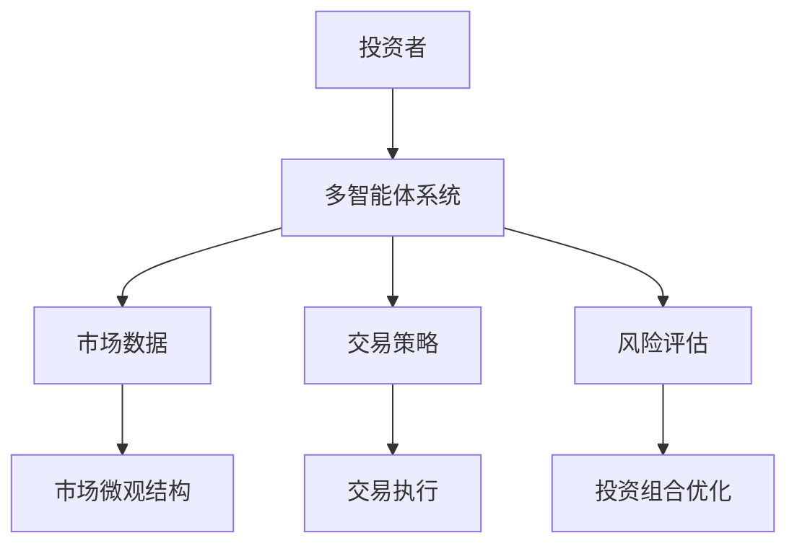
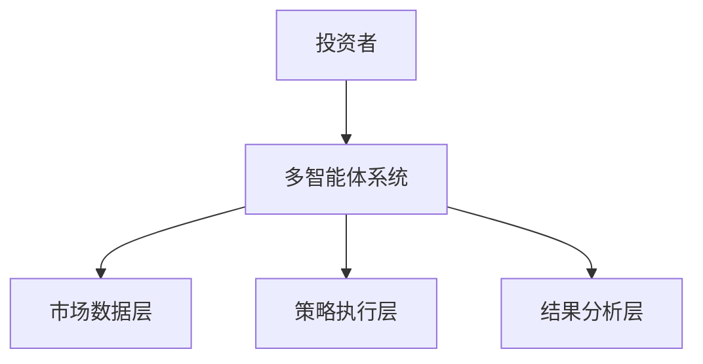
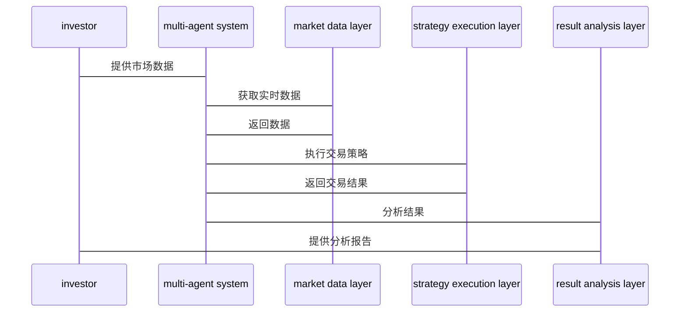

                 


# 多智能体系统增强价值投资的市场微观结构分析

## 关键词：多智能体系统、价值投资、市场微观结构、强化学习、分布式决策

## 摘要：本文系统地探讨了多智能体系统在价值投资中的应用，分析了市场微观结构的特点，提出了基于多智能体系统的价值评估和投资决策框架，结合强化学习算法和数学模型，深入剖析了多智能体系统在金融领域的潜力和实际应用案例。

---

## 第一部分: 多智能体系统与价值投资概述

### 第1章: 多智能体系统与价值投资的背景介绍

#### 1.1 多智能体系统的定义与特点

##### 1.1.1 多智能体系统的定义
多智能体系统（Multi-Agent System, MAS）是由多个相互作用的智能体组成的系统，每个智能体都有独立的目标和决策机制，能够感知环境、自主决策并与其他智能体协作或竞争。多智能体系统的典型特征包括分布性、协作性、反应性和动态性。

| 特性 | 定义 | 示例 |
|------|------|------|
| 分布性 | 智能体独立运行 | 每个投资者独立决策 |
| 协作性 | 智能体之间协作 | 投资者之间通过信息共享优化投资组合 |
| 反应性 | 系统实时响应 | 系统根据市场变化动态调整策略 |
| 动态性 | 系统状态变化 | 市场波动影响智能体决策 |

##### 1.1.2 多智能体系统的属性特征对比
多智能体系统与单智能体系统在决策独立性、信息共享和协作能力上存在显著差异。例如，在金融领域，多个投资者作为智能体，各自根据市场信息做出决策，形成复杂的市场微观结构。

##### 1.1.3 多智能体系统的边界与外延
多智能体系统的边界包括智能体的数量、决策范围和协作方式。其外延涉及分布式计算、人工智能和博弈论等多个领域。

#### 1.2 价值投资的基本概念

##### 1.2.1 价值投资的定义
价值投资是一种投资策略，强调以低于内在价值的价格买入优质资产。其核心在于发现市场定价的偏差，通过深入分析企业基本面，寻找被低估的投资标的。

##### 1.2.2 价值投资的核心要素
价值投资的关键要素包括内在价值评估、安全边际和长期视角。内在价值是资产的公允价值，安全边际是价格与价值的差距，长期视角强调持续关注和投资。

##### 1.2.3 价值投资与市场微观结构的关系
市场微观结构涉及订单簿、交易流和价格动态等细节。价值投资者通过分析这些微观结构，识别定价偏差，做出投资决策。

### 第2章: 多智能体系统在金融中的应用

#### 2.1 多智能体系统在金融市场的核心概念

##### 2.1.1 多智能体系统与金融市场的关系
金融市场由投资者、交易场所和金融工具组成，是一个复杂的动态系统。多智能体系统可以模拟市场参与者的决策过程，帮助理解市场行为。

##### 2.1.2 多智能体系统在金融中的具体应用
多智能体系统在金融中的应用包括高频交易、风险管理和投资组合优化。例如，高频交易算法可以在毫秒级别做出决策，而风险管理算法可以实时监控市场风险。

##### 2.1.3 多智能体系统与价值投资的结合
通过多智能体系统，价值投资者可以模拟市场参与者的决策，分析价格与价值的偏差，优化投资策略。

#### 2.2 多智能体系统的ER实体关系图



---

## 第二部分: 多智能体系统的核心算法与数学模型

### 第3章: 多智能体系统的算法原理

#### 3.1 多智能体协作算法

##### 3.1.1 分散式决策算法
分散式决策算法允许每个智能体独立做出决策，同时通过局部信息进行协调。例如，每个投资者根据自己的信息做出交易决策，同时与其他投资者的信息共享。

##### 3.1.2 协作学习算法
协作学习算法通过智能体之间的信息共享和经验交流，优化整体决策。例如，投资者通过分享市场分析结果，优化投资策略。

##### 3.1.3 跨主体通信协议
跨主体通信协议定义了智能体之间信息交换的格式和规则。例如，投资者之间可以通过API接口共享市场数据和交易信号。

#### 3.2 价值评估算法

##### 3.2.1 基于多智能体的实时估值算法
实时估值算法通过动态调整参数，反映市场变化。例如，投资者可以根据最新的市场数据，实时更新对股票的估值。

##### 3.2.2 基于强化学习的价值评估模型
强化学习模型通过奖励机制优化决策。例如，投资者通过选择不同的交易策略，获得奖励或惩罚，优化投资决策。

### 第4章: 数学模型与公式

#### 4.1 多智能体协作的数学模型

##### 4.1.1 多智能体状态空间模型
$$ s_i = (s_1, s_2, ..., s_n) $$
其中，$s_i$ 表示第$i$个智能体的状态，$s_j$ 表示第$j$个智能体的状态。

##### 4.1.2 多智能体动作空间模型
$$ a_i = (a_1, a_2, ..., a_n) $$
其中，$a_i$ 表示第$i$个智能体的动作，$a_j$ 表示第$j$个智能体的动作。

#### 4.2 价值评估的数学公式

##### 4.2.1 基于CAPM模型的价值评估
$$ E(r_i) = r_f + β_i (E(r_m) - r_f) $$
其中，$E(r_i)$ 是第$i$个资产的期望回报率，$r_f$ 是无风险利率，$β_i$ 是第$i$个资产的贝塔系数，$E(r_m)$ 是市场期望回报率。

##### 4.2.2 基于强化学习的价值函数
$$ V(s) = \max_{a} [r(s,a) + V(s',a')] $$
其中，$s$ 是当前状态，$a$ 是动作，$s'$ 是下一个状态，$V(s',a')$ 是下一个状态的价值函数。

---

## 第三部分: 市场微观结构分析与系统设计

### 第5章: 市场微观结构的系统分析

#### 5.1 问题场景介绍

##### 5.1.1 金融市场中的微观结构问题
金融市场中的微观结构问题包括订单簿分析、交易流建模和价格动态预测。这些问题需要多智能体系统进行实时监控和分析。

##### 5.1.2 多智能体系统在市场微观结构中的应用
多智能体系统可以模拟投资者行为，分析市场参与者的互动，优化投资策略。

### 第6章: 系统架构与接口设计

#### 6.1 系统架构设计

##### 6.1.1 分层架构


#### 6.2 系统接口设计

##### 6.2.1 多智能体系统接口
多智能体系统接口包括数据输入接口、策略执行接口和结果输出接口。数据输入接口接收市场数据，策略执行接口执行交易策略，结果输出接口提供分析结果。

##### 6.2.2 系统交互流程


---

## 第四部分: 项目实战

### 第7章: 项目实战

#### 7.1 环境安装
需要安装Python、NumPy、Pandas、TensorFlow和OpenAI库。安装命令如下：
```bash
pip install numpy pandas tensorflow openai
```

#### 7.2 系统核心实现源代码

##### 7.2.1 多智能体系统实现
```python
class Agent:
    def __init__(self, id):
        self.id = id
        self.state = None
        self.action = None

    def set_state(self, state):
        self.state = state

    def get_action(self):
        # 示例：随机选择动作
        import random
        return random.choice(['buy', 'sell', 'hold'])
```

##### 7.2.2 价值评估模型实现
```python
import tensorflow as tf
from tensorflow.keras import layers

model = tf.keras.Sequential([
    layers.Dense(64, activation='relu', input_shape=(input_dim,)),
    layers.Dense(1, activation='linear')
])

model.compile(optimizer='adam', loss='mse')
```

#### 7.3 代码应用解读与分析
通过上述代码，我们可以实现一个多智能体系统，每个智能体根据市场数据做出交易决策。价值评估模型使用神经网络预测资产的内在价值，帮助投资者做出投资决策。

#### 7.4 实际案例分析
以股票市场为例，投资者使用多智能体系统分析市场微观结构，优化投资策略。通过实时数据和神经网络模型，投资者可以识别定价偏差，做出更明智的投资决策。

#### 7.5 项目小结
通过本项目，我们展示了多智能体系统在价值投资中的应用，验证了其在市场微观结构分析中的潜力。

---

## 第五部分: 最佳实践

### 第8章: 最佳实践

#### 8.1 小结
多智能体系统通过模拟市场参与者的决策，优化价值投资策略。其在市场微观结构分析中的应用，为投资者提供了新的工具和方法。

#### 8.2 注意事项
- 数据质量：确保市场数据的准确性和实时性。
- 模型优化：不断优化算法和模型，提高预测精度。
- 风险管理：制定有效的风险管理策略，降低投资风险。

#### 8.3 拓展阅读
- 多智能体系统在金融中的应用研究。
- 强化学习在投资决策中的应用。
- 市场微观结构分析的最新进展。

---

## 作者：AI天才研究院/AI Genius Institute & 禅与计算机程序设计艺术 /Zen And The Art of Computer Programming

