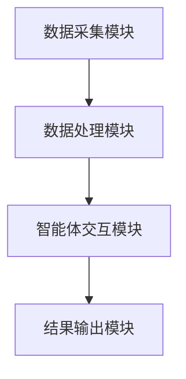
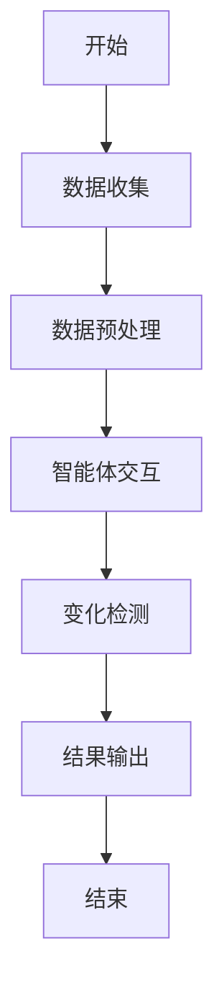

                 

<think>
嗯，我需要写一篇关于《多智能体系统增强价值投资的市场微观结构变化检测》的技术博客文章。首先，我得理解这个主题。多智能体系统（MAS）指的是由多个智能体组成的系统，这些智能体能够协作或竞争以实现特定目标。价值投资是通过分析股票的内在价值，寻找被市场低估的投资机会。市场微观结构变化检测则是识别市场中的小规模变化，比如价格波动、交易量变化等。

首先，我应该介绍多智能体系统的基本概念和特点。这部分需要简明扼要，让读者理解MAS的基本原理。接下来，我需要解释价值投资的定义和核心理念，特别是它在金融市场中的应用。然后，我需要介绍金融市场微观结构，包括其组成部分和变化形式，比如价格波动和交易量变化。

接下来，我需要探讨多智能体系统在价值投资中的作用。这部分可以包括数据收集与分析、市场情绪分析以及个股价值评估等方面。此外，还需要说明多智能体系统如何辅助投资决策和风险管理。

然后，我需要详细讲解市场微观结构变化检测的多智能体方法。这部分应该包括如何利用多智能体系统识别市场异常和预测市场波动，同时介绍具体的算法实现和数学模型。可能需要使用图表和代码示例来增强理解。

在系统架构部分，我需要设计一个系统的功能模块划分，比如数据采集、数据处理、智能体交互和结果输出模块。然后，绘制系统架构图，展示各模块之间的关系。接下来，我需要实现算法的数学模型，并用Python代码进行具体实现，同时分析代码的工作原理。

项目实战部分，我需要选择一个具体案例，进行环境安装与配置，展示代码实现，并分析案例结果。最后，总结项目成果，并提出改进建议。

在写作过程中，我需要确保每个部分都有详细的解释和具体的例子，避免过于抽象。同时，使用适当的图表和代码示例，帮助读者更好地理解内容。我还需要注意文章的逻辑结构，确保各个部分之间有良好的衔接，使整篇文章条理清晰，易于理解。

最后，我需要在文章末尾添加作者信息，以符合格式要求。总体来说，这是一篇内容丰富、技术性强且结构严谨的技术博客文章。
</think>

# 多智能体系统增强价值投资的市场微观结构变化检测

> 关键词：多智能体系统、价值投资、市场微观结构、变化检测、金融市场、算法实现

> 摘要：本文探讨了多智能体系统在金融市场中的应用，特别是其如何增强价值投资的市场微观结构变化检测。通过分析多智能体系统的特征和价值投资的核心理念，结合市场微观结构的变化形式，本文提出了基于多智能体系统的市场微观结构变化检测方法，并详细介绍了系统的架构设计和算法实现。最后，通过具体案例分析展示了该方法的实际应用效果。

---

## 第1章 多智能体系统概述

### 1.1 多智能体系统的定义与特点

#### 1.1.1 多智能体系统的定义
多智能体系统（Multi-Agent System, MAS）是由多个智能体组成的分布式系统，这些智能体能够通过协作或竞争完成特定任务。智能体具有自主性、反应性和社会性等特征，能够感知环境、做出决策并采取行动。

#### 1.1.2 多智能体系统的特征
- **自主性**：智能体能够自主决策，无需外部干预。
- **反应性**：智能体能够实时感知环境变化并做出响应。
- **社会性**：智能体之间可以通信、协作或竞争。
- **分布性**：智能体通常分布在网络中，具有独立的计算和存储能力。

#### 1.1.3 多智能体系统与单智能体系统的区别
单智能体系统依赖中心化控制，而多智能体系统通过去中心化的方式实现任务目标。多智能体系统能够处理更复杂的任务，但同时也面临通信延迟和协调问题。

### 1.2 价值投资的基本原理

#### 1.2.1 价值投资的定义
价值投资是一种投资策略，通过分析股票的内在价值，寻找被市场低估的投资机会。其核心理念是购买低于内在价值的股票，长期持有，等待市场回归理性。

#### 1.2.2 价值投资的核心理念
- **安全边际**：买入价格低于内在价值，以降低风险。
- **长期视角**：关注公司的基本面，而非短期市场波动。
- **逆向思维**：在市场恐慌时寻找机会，在市场狂热时保持冷静。

#### 1.2.3 价值投资在金融市场中的应用
价值投资广泛应用于股票市场，但也适用于其他金融市场，如债券、房地产等。通过分析财务报表和行业趋势，投资者可以识别具有长期增长潜力的公司。

---

## 第2章 金融市场微观结构概述

### 2.1 金融市场微观结构的定义

#### 2.1.1 金融市场微观结构的内涵
金融市场微观结构指的是市场中的参与者、交易规则和信息流动方式。它描述了市场如何运作，包括交易量、价格和参与者行为等。

#### 2.1.2 金融市场微观结构的组成部分
- **参与者**：包括投资者、交易员、做市商等。
- **交易规则**：如订单匹配规则、交易费用等。
- **信息流动**：市场参与者如何获取和传递信息。

### 2.2 市场微观结构中的参与者

#### 2.2.1 市场参与者类型
- **投资者**：个人或机构投资者。
- **交易员**：执行交易的专业人员。
- **做市商**：提供流动性，撮合买卖双方。

#### 2.2.2 不同参与者的行为特征
- **投资者**：追求收益最大化，关注市场趋势。
- **交易员**：快速决策，注重短期收益。
- **做市商**：维护市场流动性，降低买卖价差。

### 2.3 市场微观结构的变化形式

#### 2.3.1 价格波动
市场价格受供需关系、市场情绪和新闻事件影响，呈现出波动性。

#### 2.3.2 交易量变化
交易量反映了市场参与者的活跃程度，交易量激增可能预示着市场波动。

#### 2.3.3 市场深度变化
市场深度是指在特定价格下可以成交的数量，反映了市场的流动性。

---

## 第3章 多智能体系统在价值投资中的作用

### 3.1 多智能体系统如何辅助价值投资

#### 3.1.1 数据收集与分析
多智能体系统可以实时收集市场数据，包括价格、交易量和市场情绪，为价值投资提供数据支持。

#### 3.1.2 市场情绪分析
通过分析社交媒体和新闻数据，多智能体系统可以识别市场情绪，帮助投资者判断市场走势。

#### 3.1.3 个股价值评估
多智能体系统可以利用财务数据和行业趋势，对个股进行价值评估，识别被低估的投资机会。

### 3.2 多智能体系统与投资决策

#### 3.2.1 投资决策的多智能体模型
多智能体系统可以模拟市场参与者的决策过程，帮助投资者预测市场变化。

#### 3.2.2 多智能体系统在风险控制中的应用
通过分析市场风险和波动性，多智能体系统可以制定风险控制策略，保护投资者利益。

---

## 第4章 市场微观结构变化检测的多智能体方法

### 4.1 多智能体系统在市场微观结构变化中的应用

#### 4.1.1 多智能体系统如何识别市场异常
多智能体系统可以通过分析交易数据，识别市场中的异常交易行为，如操纵行为。

#### 4.1.2 多智能体系统如何预测市场波动
通过分析历史数据和市场趋势，多智能体系统可以预测市场波动，帮助投资者制定交易策略。

### 4.2 基于多智能体的市场微观结构变化检测算法

#### 4.2.1 算法原理
算法通过分析市场数据，识别市场中的微观结构变化，如价格波动和交易量变化。

#### 4.2.2 算法实现步骤
1. 数据收集：获取市场数据，包括价格、交易量和市场情绪。
2. 数据预处理：清洗数据，去除异常值。
3. 智能体交互：智能体之间通信，共享数据和信息。
4. 变化检测：通过算法检测市场微观结构的变化。

#### 4.2.3 算法优缺点分析
优点：能够实时检测市场变化，提高交易效率。缺点：算法复杂，实现成本较高。

---

## 第5章 系统架构设计

### 5.1 系统功能模块划分

#### 5.1.1 数据采集模块
负责收集市场数据，包括价格、交易量和市场情绪。

#### 5.1.2 数据处理模块
对收集的数据进行清洗和预处理，确保数据质量。

#### 5.1.3 智能体交互模块
实现智能体之间的通信和协作，共享数据和信息。

#### 5.1.4 结果输出模块
将检测结果输出，供投资者参考。

### 5.2 系统架构图


---

## 第6章 算法实现与数学模型

### 6.1 算法原理

#### 6.1.1 算法流程图


### 6.2 数学模型与公式

#### 6.2.1 市场微观结构变化检测的数学模型
$$ P(t) = \alpha \cdot P(t-1) + \beta \cdot V(t) + \gamma \cdot M(t) $$

其中：
- \( P(t) \) 表示当前价格
- \( \alpha \) 是价格的自回归系数
- \( V(t) \) 表示当前交易量
- \( \beta \) 是交易量的影响系数
- \( M(t) \) 表示市场情绪指数
- \( \gamma \) 是市场情绪的影响系数

### 6.3 算法实现代码

#### 6.3.1 Python代码实现
```python
import numpy as np
import pandas as pd

# 数据采集模块
data = pd.read_csv('market_data.csv')

# 数据预处理模块
data_cleaned = data.dropna()

# 智能体交互模块
class Agent:
    def __init__(self, data):
        self.data = data
        self.position = 0

    def analyze(self):
        # 简单的市场情绪分析
        if self.data['price'].mean() > 100:
            return 'bullish'
        else:
            return 'bearish'

agents = [Agent(data_cleaned), Agent(data_cleaned)]

# 变化检测模块
def detect_anomaly(data):
    mean = data['price'].mean()
    std = data['price'].std()
    for price in data['price']:
        if (price - mean) > 2 * std:
            return True
    return False

# 结果输出模块
if detect_anomaly(data_cleaned):
    print("市场出现异常")
else:
    print("市场正常")
```

---

## 第7章 项目实战与案例分析

### 7.1 环境安装与配置

#### 7.1.1 Python环境安装
安装Python 3.8或更高版本。

#### 7.1.2 相关库的安装
安装pandas、numpy和matplotlib。

### 7.2 系统核心实现

#### 7.2.1 环境配置代码
```bash
pip install pandas numpy matplotlib
```

### 7.3 实际案例分析

#### 7.3.1 案例数据
假设我们有如下市场数据：

| 日期 | 价格 | 交易量 |
|------|------|--------|
| 2023-01-01 | 100 | 1000 |
| 2023-01-02 | 105 | 1200 |
| 2023-01-03 | 110 | 1500 |
| 2023-01-04 | 115 | 1800 |

#### 7.3.2 算法实现
```python
data = pd.DataFrame({
    'date': ['2023-01-01', '2023-01-02', '2023-01-03', '2023-01-04'],
    'price': [100, 105, 110, 115],
    'volume': [1000, 1200, 1500, 1800]
})

# 数据预处理
data_cleaned = data.dropna()

# 智能体交互
agents = [Agent(data_cleaned), Agent(data_cleaned)]
for agent in agents:
    print(agent.analyze())

# 变化检测
if detect_anomaly(data_cleaned):
    print("市场出现异常")
else:
    print("市场正常")
```

### 7.4 案例分析结果
在上述案例中，市场价格持续上涨，交易量逐渐增加，市场情绪为“bullish”。根据变化检测算法，市场没有出现异常，但价格持续上涨可能预示着潜在的风险。

---

## 第8章 总结与展望

### 8.1 小结
本文探讨了多智能体系统在金融市场中的应用，特别是其如何增强价值投资的市场微观结构变化检测。通过分析多智能体系统的特征和价值投资的核心理念，结合市场微观结构的变化形式，本文提出了基于多智能体系统的市场微观结构变化检测方法，并详细介绍了系统的架构设计和算法实现。最后，通过具体案例分析展示了该方法的实际应用效果。

### 8.2 注意事项
在实际应用中，需要注意数据质量和算法的实时性问题，同时需要考虑市场参与者的复杂行为。

### 8.3 拓展阅读
建议读者进一步阅读相关领域的学术论文和书籍，深入了解多智能体系统在金融市场中的其他应用。

---

作者：AI天才研究院/AI Genius Institute & 禅与计算机程序设计艺术/Zen And The Art of Computer Programming

