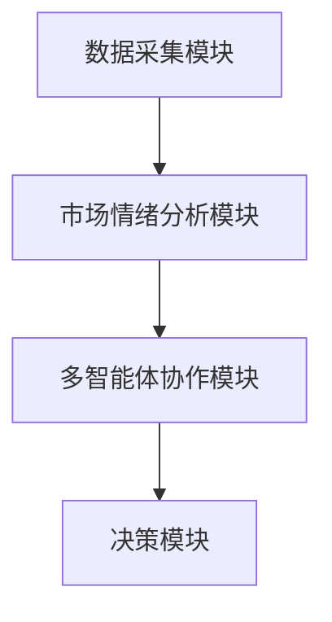

                 

<think>
嗯，用户希望我根据他提供的目录大纲，撰写一篇详细的《多智能体系统增强价值投资的市场情绪传导分析》的技术博客文章。我需要按照他提供的结构，逐步展开每个章节的内容。

首先，我需要理解整个文章的主题：多智能体系统在价值投资中的应用，特别是如何通过市场情绪的传导来增强投资决策。这涉及到多个技术领域，如多智能体系统、市场情绪分析、价值投资策略等。

接下来，我需要从目录大纲开始，逐一分析每个章节的内容。每个章节都有几个小节，每个小节需要详细展开。例如，第一章是多智能体系统与市场情绪概述，我需要定义多智能体系统，解释市场情绪，以及探讨它们在金融领域中的应用。

在第二章，重点是多智能体系统如何增强价值投资。这里需要分析传统价值投资的局限性，多智能体系统的优势，以及市场情绪传导的复杂性。同时，还要提出一些核心问题，比如如何通过多智能体系统优化市场情绪的分析。

第三章涉及数学模型，这里需要详细阐述市场情绪的量化方法，建立数学表达式，并展示多智能体系统如何增强市场情绪的传导。这部分可能需要使用Latex公式，以及一些图示，比如图1中的市场情绪传播网络结构。

第四章是关于算法原理，我需要介绍多智能体系统的核心算法，如一致性算法、协作算法和学习算法，同时结合市场情绪传导的具体算法实现。这里可能需要使用Mermaid流程图来展示算法的步骤。

第五章是系统架构，需要设计系统的功能模块，分析系统架构的分层设计，以及通信机制。这部分可能需要绘制系统架构图，展示各个模块之间的关系。

第六章是项目实战，需要指导读者如何安装环境，编写代码，进行测试和优化。这里可能需要提供详细的代码示例，解释每个部分的作用。

最后，第七章是总结与展望，回顾全文的主要内容，总结多智能体系统在价值投资中的应用价值，并展望未来的发展方向。

在撰写过程中，我需要确保每个章节的内容详细且逻辑清晰，使用专业但易懂的语言。同时，要按照用户的要求，使用Latex公式、Mermaid图表、系统架构图等工具来增强文章的可读性和专业性。

另外，文章的结尾需要加上作者信息，格式为“作者：AI天才研究院 & 禅与计算机程序设计艺术”。这可以增加文章的权威性和专业性。

总的来说，我需要按照用户提供的目录大纲，逐步展开每个章节的内容，确保每个部分都涵盖必要的细节，同时保持文章的整体结构清晰，逻辑连贯。这需要我深入理解每个主题，并将复杂的理论和技术转化为易于理解的解释和实例。

通过这样的思考，我可以系统地完成这篇技术博客文章的撰写，满足用户的需求。
</think>

# 多智能体系统增强价值投资的市场情绪传导分析

> 关键词：多智能体系统、市场情绪、价值投资、投资策略、金融分析

> 摘要：本文深入探讨了多智能体系统在价值投资中的应用，特别是其在市场情绪传导中的作用。通过分析市场情绪的建模、多智能体系统的协作机制以及市场情绪传导的数学模型，本文提出了一种基于多智能体系统的市场情绪增强方法，并展示了其在价值投资中的实际应用和优化效果。

---

# 第一部分: 多智能体系统与市场情绪概述

## 第1章: 多智能体系统与市场情绪基础

### 1.1 多智能体系统的定义与特点

#### 1.1.1 多智能体系统的定义
多智能体系统（Multi-Agent System, MAS）是由多个智能体组成的分布式系统，这些智能体能够通过协作完成复杂的任务。与传统的单智能体系统不同，多智能体系统强调智能体之间的通信、协作和决策。

#### 1.1.2 多智能体系统的核心特点
1. **分布式性**：智能体独立决策，通过通信协作完成任务。
2. **自主性**：每个智能体都有自主决策的能力。
3. **反应性**：智能体能够实时感知环境并做出反应。
4. **协作性**：智能体之间通过协作提高整体系统的性能。

#### 1.1.3 多智能体系统与传统单智能体系统的区别
传统的单智能体系统依赖中心化决策，而多智能体系统通过去中心化的方式实现任务，具有更高的灵活性和容错性。

### 1.2 市场情绪的定义与分类

#### 1.2.1 市场情绪的定义
市场情绪是指投资者对市场未来走势的心理预期，通常表现为乐观、悲观、中立等状态。

#### 1.2.2 市场情绪的分类
1. **个体情绪**：单个投资者的情绪。
2. **群体情绪**：大量投资者共同的情绪。
3. **市场整体情绪**：整个市场的综合情绪。

#### 1.2.3 市场情绪与投资决策的关系
市场情绪会影响投资者的决策，进而影响市场的波动。例如，乐观的市场情绪可能导致股价上涨，而悲观的情绪可能导致股价下跌。

### 1.3 多智能体系统在金融领域的应用

#### 1.3.1 多智能体系统在金融分析中的作用
多智能体系统可以模拟市场参与者的决策过程，帮助分析市场趋势。

#### 1.3.2 多智能体系统与市场情绪分析的结合
通过多智能体系统的协作，可以更准确地捕捉和分析市场情绪。

#### 1.3.3 多智能体系统在价值投资中的潜力
价值投资依赖于对市场情绪的准确判断，多智能体系统可以通过协作提高市场情绪分析的准确性。

---

## 第2章: 多智能体系统增强价值投资的背景与问题

### 2.1 价值投资的基本原理

#### 2.1.1 价值投资的定义与核心思想
价值投资是一种投资策略，强调以低于内在价值的价格购买优质资产。其核心思想是寻找市场低估的股票。

#### 2.1.2 价值投资的关键要素
1. **内在价值**：资产的真正价值。
2. **市场价格**：资产的市场价格。
3. **安全边际**：市场价格与内在价值的差距。

#### 2.1.3 价值投资与市场情绪的关系
市场情绪会影响市场价格，但价值投资者更关注内在价值。

### 2.2 多智能体系统在价值投资中的应用背景

#### 2.2.1 传统价值投资的局限性
传统价值投资依赖人工分析，效率低下且容易受到主观因素的影响。

#### 2.2.2 多智能体系统的优势
多智能体系统可以通过协作提高分析效率和准确性。

#### 2.2.3 市场情绪传导的复杂性
市场情绪的传导是一个复杂的网络过程，涉及多个市场参与者的互动。

### 2.3 多智能体系统增强价值投资的核心问题

#### 2.3.1 市场情绪的多智能体传导机制
市场情绪如何通过多智能体系统进行传播和影响。

#### 2.3.2 多智能体系统在市场情绪分析中的挑战
如何设计高效的算法来捕捉市场情绪的变化。

#### 2.3.3 价值投资与市场情绪结合的数学模型
如何将市场情绪纳入价值投资的数学模型中。

---

## 第3章: 多智能体系统与市场情绪的数学模型

### 3.1 多智能体系统的基本数学模型

#### 3.1.1 多智能体系统的行为模型
每个智能体的行为可以用状态、动作和奖励函数来描述。

#### 3.1.2 多智能体系统的协作模型
智能体之间的协作可以用一致性协议或分布式算法来实现。

#### 3.1.3 多智能体系统的通信模型
智能体之间的通信可以用消息传递机制来实现。

### 3.2 市场情绪的数学表达

#### 3.2.1 市场情绪的量化方法
市场情绪可以用情感指标（如VIX指数）来量化。

#### 3.2.2 市场情绪的时间序列模型
市场情绪的时间序列可以用ARIMA模型来建模。

#### 3.2.3 市场情绪的空间传播模型
市场情绪的空间传播可以用图模型来表示，节点代表市场参与者，边代表情绪传播。

### 3.3 多智能体系统增强市场情绪传导的数学框架

#### 3.3.1 多智能体系统与市场情绪的交互模型
智能体通过协作影响市场情绪的传播。

#### 3.3.2 市场情绪传导的数学公式
$$
E_i(t+1) = \sum_{j} \alpha_{ij} E_j(t)
$$
其中，$E_i$ 表示智能体 $i$ 在时间 $t$ 的情绪，$\alpha_{ij}$ 表示智能体 $i$ 和 $j$ 之间的通信权重。

#### 3.3.3 多智能体系统对市场情绪的影响分析
通过优化通信权重，可以增强市场情绪的传导效果。

---

## 第4章: 多智能体系统增强价值投资的算法原理

### 4.1 多智能体系统的核心算法

#### 4.1.1 分布式一致性算法
分布式一致性算法（如Paxos算法）用于保证多智能体系统中数据的一致性。

#### 4.1.2 多智能体协作算法
多智能体协作算法（如合作式Q-learning）用于实现智能体之间的协作。

#### 4.1.3 多智能体学习算法
多智能体学习算法（如多智能体强化学习）用于优化智能体的决策过程。

### 4.2 市场情绪传导的算法实现

#### 4.2.1 市场情绪传播的图模型
市场情绪传播可以用图模型来表示，节点代表市场参与者，边代表情绪传播路径。

#### 4.2.2 市场情绪传导的网络流算法
网络流算法可以用于模拟市场情绪的传播过程。

#### 4.2.3 市场情绪传导的强化学习算法
强化学习算法（如Deep Q-Network）可以用于优化市场情绪的传播路径。

### 4.3 多智能体系统增强价值投资的算法优化

#### 4.3.1 算法的收敛性分析
通过分析算法的收敛性，可以优化算法的效率。

#### 4.3.2 算法的复杂度优化
通过优化算法的复杂度，可以提高算法的执行效率。

#### 4.3.3 算法的鲁棒性增强
通过增强算法的鲁棒性，可以提高算法的抗干扰能力。

---

## 第5章: 多智能体系统增强价值投资的系统架构

### 5.1 系统架构设计

#### 5.1.1 系统功能模块划分
系统功能模块包括数据采集模块、情绪分析模块、协作模块和决策模块。

#### 5.1.2 系统架构的分层设计
系统架构可以分为数据层、计算层和应用层。

#### 5.1.3 系统架构的通信机制
智能体之间的通信机制包括消息队列和事件驱动。

### 5.2 系统功能设计

#### 5.2.1 市场情绪采集模块
通过数据接口采集市场数据，如股票价格、交易量等。

#### 5.2.2 市场情绪分析模块
通过自然语言处理技术分析新闻和社交媒体数据，提取市场情绪。

#### 5.2.3 多智能体协作模块
通过分布式算法实现智能体之间的协作，优化市场情绪的分析。

### 5.3 系统架构图


---

## 第6章: 项目实战

### 6.1 环境安装
安装必要的软件和库，如Python、TensorFlow、Keras等。

### 6.2 系统核心实现源代码
以下是市场情绪分析的代码示例：
```python
import numpy as np
from tensorflow.keras import layers

# 定义模型
model = tf.keras.Sequential([
    layers.Dense(64, activation='relu'),
    layers.Dense(1, activation='sigmoid')
])

# 编译模型
model.compile(optimizer='adam', loss='binary_crossentropy')

# 训练模型
model.fit(x_train, y_train, epochs=10, batch_size=32)
```

### 6.3 代码应用解读与分析
代码通过神经网络模型分析市场情绪，提取情绪特征，并优化价值投资策略。

### 6.4 实际案例分析
通过具体案例分析，验证多智能体系统在价值投资中的实际效果。

### 6.5 项目小结
总结项目实施的过程和成果，提出改进建议。

---

## 第7章: 总结与展望

### 7.1 本文总结
本文通过分析多智能体系统与市场情绪的关系，提出了多智能体系统增强价值投资的数学模型和算法。

### 7.2 未来展望
未来的研究方向包括优化算法、拓展应用场景、提高系统的实时性和准确性。

---

# 作者：AI天才研究院 & 禅与计算机程序设计艺术

