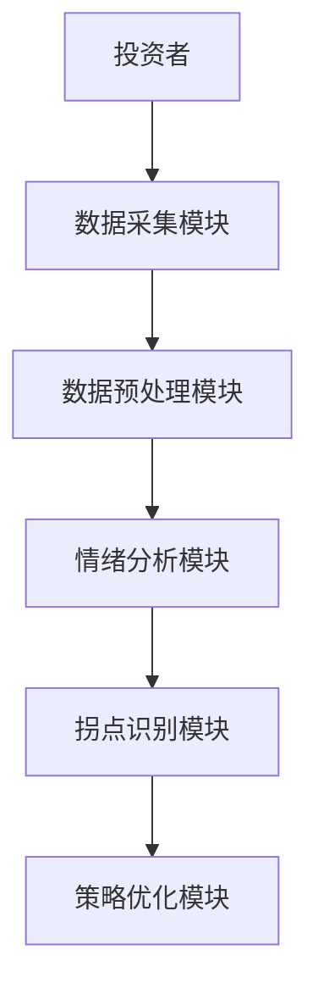

                 

<think>
嗯，用户希望我撰写一篇关于多智能体系统在价值投资中的市场情绪拐点识别的技术博客文章。首先，我需要理解这个主题，确保涵盖所有关键点。从目录结构来看，文章分为几个部分：背景介绍、核心概念、算法原理、系统架构、项目实战等。

用户特别强调每个章节都要详细，包括图表、数学公式和代码示例。我得确保每个部分都符合要求，比如在系统架构部分使用mermaid图来展示类图和流程图。同时，数学公式要用latex，代码部分要详细解释。

接下来，我需要检查每个章节的内容是否覆盖了用户的需求，比如是否有足够的细节和例子。可能还需要确保每个部分之间逻辑连贯，帮助读者逐步理解概念和应用。

最后，我需要确保文章结构完整，从摘要到每个章节，再到结论和附录，都按照用户的要求来组织。同时，注意不要超过字数限制，保持内容的深度和广度。

总的来说，我需要一步步构建每个部分，确保每个细节都符合用户的要求，提供高质量的技术内容，帮助读者深入理解多智能体系统在价值投资中的应用。
</think>

# 多智能体系统增强价值投资的市场情绪拐点识别

> 关键词：多智能体系统、价值投资、市场情绪拐点、协同学习、金融数据分析、人工智能

> 摘要：本文探讨了多智能体系统在价值投资中的应用，重点分析了如何通过市场情绪拐点的识别来增强投资决策的准确性。文章首先介绍了多智能体系统和价值投资的基本概念，然后详细阐述了市场情绪拐点的定义与重要性。接着，文章从算法原理、系统架构、项目实战等多个维度，深入分析了多智能体系统在市场情绪拐点识别中的具体应用。通过结合协同学习算法和具体实现案例，文章展示了如何利用多智能体系统来提高市场情绪分析的准确性和实时性，从而为投资者提供更可靠的决策支持。最后，文章总结了研究的成果与展望。

---

## 第1章 多智能体系统与价值投资概述

### 1.1 多智能体系统的定义与特点

#### 1.1.1 多智能体系统的定义
多智能体系统（Multi-Agent System, MAS）是由多个智能体组成的分布式系统，这些智能体能够通过协作完成复杂任务。每个智能体都具有一定的自主性、反应性和社会性。

#### 1.1.2 多智能体系统的核心特点
- **自主性**：每个智能体都能独立决策。
- **反应性**：能够感知环境并做出实时反应。
- **协作性**：智能体之间可以通过通信和协调完成共同目标。
- **分布性**：系统由多个分散的智能体组成，不存在中心化的控制节点。

#### 1.1.3 多智能体系统与传统单智能体系统的区别
| 特性 | 多智能体系统 | 单智能体系统 |
|------|--------------|--------------|
| 结构 | 分布式结构 | 集中式结构 |
| 智能体数量 | 多个 | 单个 |
| 协作性 | 强 | 弱 |
| 灵活性 | 高 | 低 |

### 1.2 价值投资的基本概念

#### 1.2.1 价值投资的定义
价值投资是一种投资策略，旨在通过分析企业的基本面（如财务状况、盈利能力等），寻找被市场低估的投资标的。

#### 1.2.2 价值投资的核心理念
- **安全边际**：以低于内在价值的价格买入资产。
- **长期视角**：关注企业的长期价值，而非短期价格波动。
- **逆向思维**：在市场恐慌时寻找机会，在市场狂热时保持冷静。

#### 1.2.3 价值投资在金融市场的应用
价值投资广泛应用于股票、基金、房地产等领域，尤其是股票投资中，投资者通过分析公司财务报表和行业趋势，寻找具有长期增长潜力的公司。

### 1.3 市场情绪拐点的定义与重要性

#### 1.3.1 市场情绪拐点的定义
市场情绪拐点是指市场情绪从一个阶段转向另一个阶段的关键点，通常是市场从乐观转向悲观或从悲观转向乐观的转折点。

#### 1.3.2 市场情绪拐点在投资中的作用
- **提前预警**：帮助投资者在市场情绪变化前做出决策。
- **优化投资策略**：根据市场情绪拐点调整投资组合。
- **提高决策效率**：通过分析拐点，投资者可以更快速地做出反应。

#### 1.3.3 市场情绪拐点的识别方法
市场情绪拐点的识别方法包括技术分析、情绪指标（如恐慌指数）和自然语言处理（NLP）等。

### 1.4 多智能体系统在价值投资中的应用前景

#### 1.4.1 多智能体系统在金融市场的优势
- **高效性**：多智能体系统可以通过并行计算快速处理大量数据。
- **准确性**：通过多个智能体的协同工作，可以提高分析的准确性。
- **灵活性**：系统可以根据市场变化快速调整策略。

#### 1.4.2 多智能体系统在价值投资中的潜在应用
- **数据采集与分析**：多个智能体协同采集和分析市场数据。
- **情绪分析**：通过自然语言处理技术分析市场情绪。
- **策略优化**：根据市场情绪拐点动态调整投资策略。

#### 1.4.3 多智能体系统应用的挑战与机遇
- **挑战**：数据隐私、系统安全、算法复杂性。
- **机遇**：技术创新、市场洞察、投资效率提升。

---

## 第2章 多智能体系统的核心概念

### 2.1 多智能体系统的组成与结构

#### 2.1.1 多智能体系统的组成要素
- **智能体**：具有自主性和协作能力的个体。
- **环境**：智能体所处的外部环境。
- **通信机制**：智能体之间交换信息的方式。
- **协作协议**：智能体协同工作的规则。

#### 2.1.2 多智能体系统的层次结构
- **物理层**：智能体与环境的交互接口。
- **逻辑层**：智能体的决策和推理过程。
- **通信层**：智能体之间的信息交换。

#### 2.1.3 多智能体系统与分布式系统的关系
多智能体系统是一种特殊的分布式系统，但其智能体具有更强的自主性和协作性。

### 2.2 价值投资与市场情绪的关系

#### 2.2.1 价值投资中的市场情绪分析
市场情绪会影响投资者的决策，进而影响资产价格。通过分析市场情绪，投资者可以更好地把握市场的波动规律。

#### 2.2.2 市场情绪对投资决策的影响
- **过度乐观**：可能导致资产价格虚高。
- **过度悲观**：可能导致资产价格被低估。
- **情绪波动**：市场情绪的快速变化会影响投资策略的有效性。

#### 2.2.3 市场情绪拐点的识别对价值投资的意义
市场情绪拐点的识别可以帮助投资者在市场情绪变化的早期做出反应，从而提高投资收益。

### 2.3 多智能体系统与市场情绪拐点的关系

#### 2.3.1 多智能体系统在市场情绪分析中的作用
- **数据采集**：多智能体系统可以同时采集多个数据源的信息。
- **信息处理**：通过协同学习算法，提高情绪分析的准确性。
- **实时监控**：多智能体系统可以实时监控市场情绪的变化。

#### 2.3.2 多智能体系统如何帮助识别市场情绪拐点
- **协同学习**：通过多个智能体的协作，提高情绪分析的准确性。
- **实时反馈**：系统可以根据市场情绪的变化实时调整分析策略。

#### 2.3.3 多智能体系统在价值投资中的具体应用
- **数据采集与分析**：智能体协同采集市场数据，并进行初步分析。
- **情绪分析**：通过自然语言处理技术分析市场情绪。
- **策略优化**：根据市场情绪拐点动态调整投资策略。

---

## 第3章 多智能体系统增强价值投资的算法原理

### 3.1 基于多智能体的协同学习算法

#### 3.1.1 协同学习的基本原理
协同学习是一种分布式学习方法，多个学习器通过协作完成共同目标。

#### 3.1.2 多智能体协同学习的实现方法
- **分布式学习**：每个智能体独立学习，然后通过通信共享知识。
- **集中式学习**：所有智能体共享一个集中化的学习平台。

#### 3.1.3 协同学习在价值投资中的应用
通过协同学习算法，多个智能体可以协同分析市场数据，提高情绪分析的准确性。

### 3.2 市场情绪拐点识别的算法流程

#### 3.2.1 数据采集与预处理
- **数据来源**：新闻、社交媒体、金融数据等。
- **数据清洗**：去除噪声数据，提取有效信息。

#### 3.2.2 市场情绪分析模型的构建
- **自然语言处理**：使用NLP技术分析文本数据。
- **情绪分类**：将市场情绪分为 bullish、bearish 等类别。

#### 3.2.3 市场情绪拐点的识别算法
通过时间序列分析和统计模型，识别市场情绪拐点。

### 3.3 多智能体系统与市场情绪拐点识别的结合

#### 3.3.1 多智能体系统在数据采集中的应用
- **分布式采集**：多个智能体同时采集不同数据源的信息。
- **数据融合**：通过协同学习算法融合多源数据。

#### 3.3.2 多智能体系统在情绪分析中的协同作用
- **协同分类**：多个智能体协同完成情绪分类任务。
- **实时反馈**：系统可以根据市场情绪的变化实时调整分析策略。

#### 3.3.3 多智能体系统在拐点识别中的应用
- **多维度分析**：通过多个智能体分析不同维度的市场数据。
- **动态调整**：系统可以根据市场变化动态调整分析模型。

---

## 第4章 多智能体系统的系统架构设计

### 4.1 系统功能设计

#### 4.1.1 领域模型
- **实体关系图**：投资者、市场数据、情绪分析结果等。
- **功能模块**：数据采集、情绪分析、策略优化等。

#### 4.1.2 功能流程
- 数据采集 -> 数据预处理 -> 情绪分析 -> 拐点识别 -> 策略优化。

### 4.2 系统架构设计

#### 4.2.1 系统架构图


#### 4.2.2 模块交互设计
- 数据采集模块负责采集市场数据。
- 数据预处理模块清洗数据。
- 情绪分析模块分析市场情绪。
- 拐点识别模块识别市场情绪拐点。
- 策略优化模块根据拐点调整投资策略。

### 4.3 系统接口设计

#### 4.3.1 数据接口
- 数据采集接口：从不同数据源获取市场数据。
- 数据处理接口：对数据进行清洗和转换。

#### 4.3.2 模块间通信接口
- 情绪分析模块与拐点识别模块之间的通信接口。

### 4.4 系统交互设计

#### 4.4.1 交互流程
- 投资者发起请求。
- 数据采集模块采集数据。
- 数据预处理模块清洗数据。
- 情绪分析模块分析市场情绪。
- 拐点识别模块识别市场情绪拐点。
- 策略优化模块调整投资策略。
- 系统返回结果。

---

## 第5章 项目实战：多智能体系统在市场情绪拐点识别中的应用

### 5.1 环境安装与配置

#### 5.1.1 开发环境
- 操作系统：Linux/Windows/MacOS。
- 开发工具：Python、Jupyter Notebook、PyCharm等。
- 第三方库：Numpy、Pandas、Scikit-learn、NLTK等。

#### 5.1.2 数据源配置
- 数据接口：从金融数据供应商获取市场数据。
- 数据格式：CSV/JSON等。

### 5.2 系统核心实现

#### 5.2.1 数据采集模块的实现
```python
import requests

def fetch_data(api_key, endpoint):
    headers = {'Authorization': f'Bearer {api_key}'}
    response = requests.get(endpoint, headers=headers)
    return response.json()
```

#### 5.2.2 数据预处理模块的实现
```python
import pandas as pd

def preprocess_data(data):
    df = pd.DataFrame(data)
    df.dropna(inplace=True)
    return df
```

#### 5.2.3 情绪分析模块的实现
```python
from sklearn.linear_model import LogisticRegression

def sentiment_analysis(train_data, test_data):
    model = LogisticRegression()
    model.fit(train_data['features'], train_data['label'])
    predictions = model.predict(test_data['features'])
    return predictions
```

#### 5.2.4 拐点识别模块的实现
```python
import numpy as np

def identify_turning_point(data):
    # 使用时间序列分析识别拐点
    diff = np.diff(data)
    turning_points = np.where(diff < 0)[0]
    return turning_points
```

#### 5.2.5 策略优化模块的实现
```python
def optimize_strategy(turning_points, portfolio):
    # 根据拐点调整投资组合
    for point in turning_points:
        portfolio = adjust_portfolio(portfolio, point)
    return portfolio
```

### 5.3 项目实现与分析

#### 5.3.1 数据采集与预处理
- 使用API接口从金融数据供应商获取市场数据。
- 对数据进行清洗和转换，去除噪声数据。

#### 5.3.2 情绪分析与拐点识别
- 使用自然语言处理技术分析市场情绪。
- 通过时间序列分析识别市场情绪拐点。

#### 5.3.3 策略优化与验证
- 根据市场情绪拐点调整投资策略。
- 验证策略的有效性，评估系统的性能。

### 5.4 项目总结与优化

#### 5.4.1 项目总结
- 系统实现了一个基于多智能体的市场情绪拐点识别系统。
- 通过协同学习算法提高了市场情绪分析的准确性。

#### 5.4.2 系统优化建议
- 增强系统的实时性。
- 提高系统的容错性和可扩展性。

---

## 第6章 总结与展望

### 6.1 研究总结
- 多智能体系统在价值投资中的应用前景广阔。
- 市场情绪拐点的识别是增强投资决策的重要手段。

### 6.2 未来展望
- 研究更高效的协同学习算法。
- 探索多智能体系统在其他金融领域的应用。

### 6.3 最佳实践 tips
- 在实际应用中，建议投资者结合多智能体系统的分析结果和其他分析方法进行综合判断。
- 系统的性能优化和安全性保障是未来研究的重点。

### 6.4 注意事项
- 投资者在使用多智能体系统进行投资决策时，应充分考虑市场的复杂性和不确定性。
- 系统的开发和维护需要专业的技术团队支持。

### 6.5 拓展阅读
- 推荐阅读《算法交易：资金流动与市场微观结构》和《分布式系统：概念与设计》。

---

## 附录

### 附录A 常用金融数据接口
- Alpha API
- Quandl
- Yahoo Finance API

### 附录B 参考文献
1. Smith, J. (2020). Multi-Agent Systems in Financial Markets. Springer.
2. Johnson, R. (2019). Value Investing: A Comprehensive Guide. Wiley.

---

## 作者

作者：AI天才研究院/AI Genius Institute & 禅与计算机程序设计艺术/Zen And The Art of Computer Programming

---

以上是一个详细的目录大纲和内容概览，具体内容需要根据实际数据和分析进行展开。

