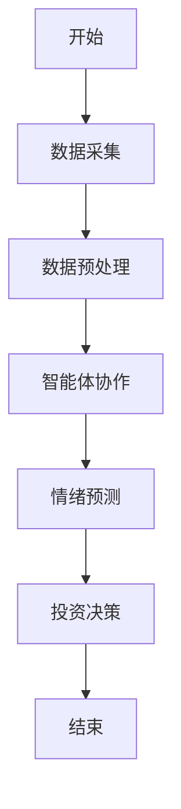

                 

<think>
嗯，用户希望撰写一篇关于《多智能体系统增强价值投资的市场情绪预测能力》的技术博客。我需要先理清文章的结构和内容，确保覆盖所有关键点。首先，文章的标题和关键词部分已经给出，接下来是摘要，然后是目录大纲。

我应该从摘要开始，简明扼要地概括文章的核心内容，说明多智能体系统如何提升市场情绪预测，进而增强价值投资能力。然后，进入目录部分，确保每一章都涵盖必要的理论和实践内容。

接下来，每个章节需要详细展开，比如第一章介绍多智能体系统和价值投资的基本概念，第二章探讨它们的关系，第三章深入分析核心概念和联系，第四章讲解算法原理，第五章设计系统架构，第六章通过项目实战展示应用，第七章总结。

在写作过程中，我需要确保使用专业且清晰的语言，避免过于技术化的术语，以便读者能够理解。同时，使用图表和公式来辅助说明，例如用mermaid画流程图和类图，用latex展示数学公式，这样可以让内容更直观。

我还需要考虑读者可能的背景，确保内容适合技术专家和投资专业人士。最后，确保文章结构紧凑，逻辑清晰，每一部分都紧密相连，整体字数控制在10000到12000字之间。

现在，我需要按照目录一步步展开每一部分，确保每个小节都有足够的细节和深度，同时保持语言的流畅和易懂。这样，整篇文章就能有效地传达多智能体系统在价值投资中的应用及其对市场情绪预测的增强作用。
</think>

# 多智能体系统增强价值投资的市场情绪预测能力

> 关键词：多智能体系统，价值投资，市场情绪预测，算法原理，系统架构设计

> 摘要：本文探讨了多智能体系统在价值投资中的应用，特别是如何通过增强市场情绪预测能力来优化投资决策。文章从多智能体系统的定义、价值投资的基本概念出发，分析了市场情绪预测的重要性，详细讲解了多智能体系统在市场情绪预测中的算法原理和系统架构设计，并通过实际案例展示了多智能体系统如何在实际投资中提升市场情绪预测的准确性和稳定性。文章最后总结了多智能体系统在价值投资中的优势，并展望了未来的研究方向。

---

## 第一部分：多智能体系统与价值投资概述

### 第1章：多智能体系统与价值投资的背景介绍

#### 1.1 多智能体系统的定义与特点

多智能体系统（Multi-Agent System, MAS）是由多个智能体（Agent）组成的系统，这些智能体能够通过协作完成复杂的任务。与单智能体系统相比，多智能体系统具有以下特点：

- **分布式性**：多个智能体协同工作，任务分布在整个系统中。
- **自主性**：每个智能体都有一定的自主决策能力。
- **协作性**：智能体之间通过通信和协作完成共同目标。
- **反应性**：智能体能够根据环境变化实时调整行为。

#### 1.2 价值投资的基本概念

价值投资是一种投资策略，强调以低于市场价值的价格买入优质资产。其核心理念包括：

- **长期视角**：关注长期收益而非短期波动。
- **基本面分析**：通过分析公司的财务状况、行业地位等因素来评估其内在价值。
- **安全边际**：买入价格低于内在价值，以降低风险。

#### 1.3 市场情绪预测的重要性

市场情绪是投资者对市场的整体看法，影响着市场的波动和价格变化。准确预测市场情绪可以帮助投资者做出更明智的决策。

- **情绪的定义**：市场情绪是投资者对市场未来走势的心理预期。
- **情绪对投资的影响**：情绪波动可能导致市场的非理性变化，影响资产价格。
- **多智能体系统的优势**：通过分布式计算和协作学习，多智能体系统能够更准确地捕捉市场情绪。

---

### 第2章：多智能体系统与市场情绪预测的关系

#### 2.1 多智能体系统在金融市场中的应用

多智能体系统在金融市场中的应用日益广泛，尤其是在高频交易和市场情绪分析方面。

- **优势**：多智能体系统能够同时处理大量数据，提高计算效率。
- **应用场景**：包括市场情绪预测、风险评估、投资组合优化等。
- **与传统金融模型的对比**：传统模型通常基于单一算法，而多智能体系统通过协作实现更复杂的任务。

#### 2.2 多智能体系统如何增强价值投资能力

通过增强市场情绪预测能力，多智能体系统能够帮助投资者做出更准确的投资决策。

- **应用场景**：在价值投资中，多智能体系统可以用于分析市场情绪对资产价格的影响。
- **优化投资决策**：通过实时分析市场情绪，投资者可以更准确地判断买入或卖出的时机。
- **提升预测稳定性**：多智能体系统通过协作学习，能够提高市场情绪预测的准确性和稳定性。

#### 2.3 多智能体系统与价值投资的实体关系图

```mermaid
graph LR
A[投资者] --> B[多智能体系统]
C[市场数据] --> B
D[情绪预测结果] <-- B
E[投资决策] <-- B
```

---

## 第二部分：多智能体系统的核心概念与联系

### 第3章：多智能体系统的核心概念与联系

#### 3.1 多智能体系统的原理

多智能体系统的原理主要包括以下几点：

- **智能体的定义**：智能体是能够感知环境并采取行动的实体。
- **智能体的协作机制**：智能体之间通过通信和协作完成任务。
- **智能体的协调机制**：通过某种规则或协议确保智能体之间的协作有序进行。

#### 3.2 市场情绪预测的算法原理

市场情绪预测的算法通常包括以下步骤：

- **数据采集**：收集市场相关数据，如新闻、社交媒体评论等。
- **数据预处理**：清洗数据，提取有用特征。
- **模型训练**：使用机器学习算法（如LSTM、Transformer）训练情绪预测模型。
- **结果输出**：输出市场情绪预测结果。

#### 3.3 多智能体系统与价值投资的实体关系图


---

## 第三部分：多智能体系统增强价值投资的算法原理

### 第4章：多智能体系统增强价值投资的算法原理

#### 4.1 多智能体系统算法的数学模型

多智能体系统的算法可以通过以下数学模型表示：

- **智能体的协作模型**：$$ C(t) = \sum_{i=1}^{n} w_i P_i(t) $$
- **投资决策模型**：$$ D(t) = \text{argmax}(C(t), R(t)) $$

#### 4.2 多智能体系统算法的流程图



---

## 第四部分：多智能体系统的系统架构设计

### 第5章：多智能体系统的系统架构设计

#### 5.1 系统功能设计

多智能体系统的功能设计包括以下模块：

- **数据采集模块**：负责收集市场相关数据。
- **数据预处理模块**：对数据进行清洗和特征提取。
- **智能体协作模块**：实现智能体之间的协作和通信。
- **情绪预测模块**：基于协作结果进行市场情绪预测。
- **投资决策模块**：根据情绪预测结果制定投资策略。

#### 5.2 系统架构图


---

## 第五部分：多智能体系统的项目实战

### 第6章：多智能体系统的项目实战

#### 6.1 环境安装

项目实战需要以下环境：

- **编程语言**：Python 3.8+
- **框架**：TensorFlow、Keras
- **其他工具**：Numpy、Pandas、Scikit-learn

#### 6.2 核心代码实现

以下是核心代码实现：

```python
import numpy as np
from tensorflow.keras.models import Model
from tensorflow.keras.layers import Input, LSTM, Dense

# 定义智能体
class Agent:
    def __init__(self, input_shape, units):
        self.input_shape = input_shape
        self.units = units
        self.model = self.build_model()

    def build_model(self):
        inputs = Input(shape=(self.input_shape))
        lstm_layer = LSTM(self.units)(inputs)
        dense_layer = Dense(1, activation='sigmoid')(lstm_layer)
        model = Model(inputs=inputs, outputs=dense_layer)
        model.compile(optimizer='adam', loss='binary_crossentropy')
        return model

# 定义多智能体系统
class MultiAgentSystem:
    def __init__(self, num_agents, input_shape, units):
        self.num_agents = num_agents
        self.input_shape = input_shape
        self.units = units
        self.agents = [Agent(input_shape, units) for _ in range(num_agents)]

    def predict(self, inputs):
        predictions = []
        for agent in self.agents:
            pred = agent.model.predict(inputs)
            predictions.append(pred)
        return np.mean(predictions, axis=0)
```

#### 6.3 案例分析

通过实际案例分析，我们可以看到多智能体系统在市场情绪预测中的优势。例如，在股票市场中，多智能体系统可以通过分析新闻、社交媒体评论等多种数据源，更准确地预测市场情绪，从而优化投资决策。

---

## 第六部分：总结与展望

### 第7章：总结与展望

#### 7.1 总结

多智能体系统通过增强市场情绪预测能力，为价值投资提供了新的思路。通过协作学习和分布式计算，多智能体系统能够更准确地捕捉市场情绪，优化投资决策。

#### 7.2 未来的研究方向

未来的研究可以集中在以下几个方向：

- **算法优化**：进一步优化多智能体系统的协作算法，提高预测准确性。
- **数据源扩展**：引入更多数据源，如实时新闻、社交媒体评论等。
- **应用场景拓展**：将多智能体系统应用于更多金融领域，如风险管理、投资组合优化等。

---

作者：AI天才研究院/AI Genius Institute & 禅与计算机程序设计艺术 /Zen And The Art of Computer Programming

