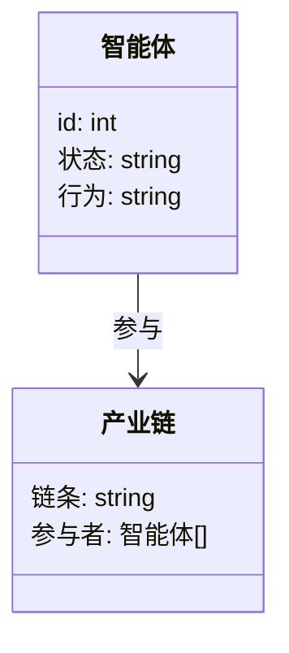
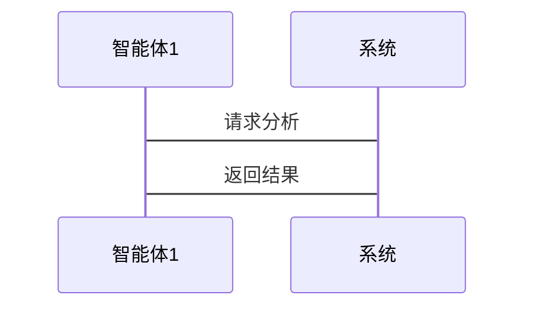

                 

<think>
好的，我需要帮助用户撰写一篇关于《多智能体系统如何实现全球产业链分析》的技术博客文章。用户希望文章结构清晰，逻辑严谨，包含背景介绍、核心概念、算法原理、系统架构、项目实战和总结等部分。我需要按照用户的指示，一步步分析和构建内容。

首先，我会理解用户的需求。用户希望文章有深度，技术语言专业，同时用简单易懂的方式表达。这意味着我需要在技术细节上深入，同时避免过于晦涩的术语，让读者能够轻松理解。

接下来，我需要规划文章的结构。根据用户提供的大纲，文章将分为几个主要部分，每个部分都有具体的子部分。我需要确保每个部分都详细且符合逻辑，涵盖从基础概念到实际应用的各个方面。

在撰写背景介绍时，我需要先解释多智能体系统（MAS）的基本概念，然后过渡到全球产业链分析的重要性。这部分需要让读者明白为什么需要多智能体系统来分析全球产业链，以及它在当前全球化背景下的优势。

核心概念部分，我会详细讲解多智能体系统的原理，包括智能体的定义、分类及其在产业链中的角色。这里可能需要使用表格和Mermaid图来对比不同智能体的属性，帮助读者更好地理解。

算法原理部分，我需要选择适合多智能体系统的算法，并用Mermaid流程图展示算法步骤。同时，用Python代码示例解释数学模型，确保读者能够理解算法的具体实现。

系统分析与架构设计部分，我会介绍如何将多智能体系统应用到全球产业链分析中。这部分需要展示系统的功能设计、架构设计以及接口和交互设计，可能使用Mermaid图来说明系统结构。

项目实战部分，我会提供一个具体的案例，比如分析电子产业的全球产业链。这部分需要详细描述环境安装、核心代码实现、案例分析和项目小结，帮助读者理解实际应用。

最后，总结部分要回顾全书内容，强调多智能体系统的优势，并展望未来的发展方向。

在撰写过程中，我需要确保每个部分都详细且符合逻辑，同时保持语言的简洁和专业。我可能会遇到如何将多智能体系统与全球产业链分析结合的问题，这需要在系统分析和架构设计部分详细阐述，确保读者能够理解其应用价值。

此外，我需要使用适当的Markdown格式，确保文章结构清晰。在数学公式和代码部分，我会使用正确的格式，如Latex公式和Python代码块，以增强文章的专业性。

最后，我会检查整个文章的逻辑是否连贯，内容是否完整，确保每个部分都满足用户的要求，并在末尾添加作者信息，使文章显得正式和完整。

通过以上步骤，我能够系统地构建这篇技术博客文章，满足用户的需求，同时提供有价值的内容，帮助读者理解多智能体系统在全球产业链分析中的应用。
</think>

# 多智能体系统如何实现全球产业链分析

> 关键词：多智能体系统、全球产业链分析、分布式计算、系统架构设计、人工智能

> 摘要：本文详细探讨了多智能体系统在全球产业链分析中的应用，从基本概念到算法原理，再到系统架构设计和实际案例分析，全面解析了多智能体系统如何高效分析和优化全球产业链。

---

## 第一部分: 多智能体系统与全球产业链分析基础

### 第1章: 多智能体系统概述

#### 1.1 多智能体系统的基本概念
##### 1.1.1 智能体的定义与分类
智能体（Agent）是指能够感知环境并采取行动以实现目标的实体。多智能体系统（MAS）由多个智能体组成，这些智能体通过协作或竞争完成复杂任务。智能体可以分为简单反应型、基于模型的反应型、目标驱动型和效用驱动型。

| 智能体类型 | 定义 | 特性 |
|------------|------|------|
| 简单反应型 | 基于当前感知做出反应 | 反应速度快，但缺乏记忆 |
| 基于模型的反应型 | 使用内部模型进行决策 | 具有记忆和规划能力 |
| 目标驱动型 | 为实现特定目标而行动 | 具有明确的目标导向 |
| 效用驱动型 | 通过最大化效用函数做出决策 | 基于效用优化 |

##### 1.1.2 多智能体系统的定义与特点
多智能体系统是由多个智能体组成的系统，这些智能体通过交互协作完成任务。其特点包括分布式性、自主性、反应性和协作性。

##### 1.1.3 多智能体系统与单智能体系统的区别
| 方面 | 单智能体系统 | 多智能体系统 |
|------|--------------|-------------|
| 结构 | 单一中心 | 分布式结构 |
| 智能体数量 | 1 | 多个 |
| 交互 | 内部决策 | 智能体间交互 |
| 复杂性 | 较低 | 较高 |

#### 1.2 全球产业链分析的重要性
##### 1.2.1 产业链的概念与作用
产业链是指从原材料到最终产品的生产、加工、运输和销售的全过程。它通过分工与协作，提高效率，降低成本。

##### 1.2.2 全球化背景下产业链的复杂性
全球化导致产业链跨越多个国家和地区，涉及复杂的跨国协作和物流。这种复杂性使得传统方法难以有效分析和优化。

##### 1.2.3 产业链分析的挑战与意义
- **挑战**：链条长、涉及主体多、信息分散。
- **意义**：优化产业链效率、降低风险、提高竞争力。

---

### 第2章: 多智能体系统在产业链分析中的应用

#### 2.1 多智能体系统与产业链的关系
##### 2.1.1 多智能体系统如何模拟产业链
通过模拟产业链中的各个参与者（如企业、供应商、消费者）的行为，多智能体系统可以实时分析和优化产业链。

##### 2.1.2 产业链中的智能体角色
| 角色 | 定义 | 功能 |
|------|------|------|
| 供应商 | 提供原材料 | 提供资源 |
| 制造商 | 生产产品 | 组织生产 |
| 分销商 | 分销产品 | 管理库存 |
| 消费者 | 使用产品 | 提供需求反馈 |

##### 2.1.3 多智能体系统在产业链分析中的优势
- **实时性**：能够快速响应市场变化。
- **协作性**：通过智能体协作实现全局优化。
- **灵活性**：适应复杂多变的市场环境。

#### 2.2 多智能体系统的应用场景
##### 2.2.1 供应链优化
通过智能体协作优化供应链中的物流和库存管理。

##### 2.2.2 市场预测
利用智能体分析市场趋势，提供准确的预测。

##### 2.2.3 风险管理
通过智能体实时监控，及时发现和应对潜在风险。

---

## 第二部分: 多智能体系统的数学模型与算法

### 第3章: 多智能体系统的数学模型

#### 3.1 智能体的表示
智能体的状态可以用向量表示，例如：
$$
\text{状态向量} = [\text{位置}, \text{速度}, \text{目标}]
$$

#### 3.2 系统的状态空间
状态空间是智能体所有可能状态的集合，可以用数学空间表示。

#### 3.3 行为模型
行为模型描述智能体如何根据状态采取行动，例如：
$$
a = f(s)
$$
其中，\(a\) 是行动，\(s\) 是状态，\(f\) 是决策函数。

### 第4章: 多智能体系统的算法原理

#### 4.1 分布式计算
多智能体系统通过分布式计算实现任务分解和协同。

#### 4.2 协调与同步机制
智能体之间通过通信模块同步状态和行动。

#### 4.3 学习与自适应算法
使用强化学习算法优化智能体的行为。

---

## 第三部分: 全球产业链分析的系统实现

### 第5章: 系统分析与架构设计

#### 5.1 系统功能设计
##### 5.1.1 需求分析
- 数据采集：收集产业链数据。
- 智能分析：分析产业链结构。
- 优化建议：提供优化方案。

##### 5.1.2 功能模块划分
- 数据采集模块：采集产业链数据。
- 智能分析模块：分析产业链结构。
- 优化建议模块：提供优化方案。

##### 5.1.3 领域模型设计
使用Mermaid类图展示系统模型：



#### 5.2 系统架构设计
##### 5.2.1 分层架构
- 数据层：存储数据。
- 业务层：处理业务逻辑。
- 表现层：展示结果。

##### 5.2.2 分布式架构
- 使用分布式系统实现智能体协作。

##### 5.2.3 组件化架构
- 将系统划分为多个组件，便于维护和扩展。

#### 5.3 接口设计
##### 5.3.1 API接口
- RESTful API：提供标准接口。

##### 5.3.2 消息队列
- 使用消息队列实现智能体间通信。

#### 5.4 交互设计
##### 5.4.1 交互流程
- 智能体发起请求。
- 系统处理请求。
- 返回结果。

##### 5.4.2 序列图


### 第6章: 项目实战

#### 6.1 环境安装
##### 6.1.1 开发环境
- Python 3.8+
- pip
- 开发工具：PyCharm

##### 6.1.2 第三方库安装
```
pip install numpy
pip install matplotlib
pip install networkx
```

#### 6.2 核心代码实现
##### 6.2.1 智能体类
```python
class Agent:
    def __init__(self, id):
        self.id = id
        self.state = None
```

##### 6.2.2 产业链分析
```python
import networkx as nx

def analyze_chain(agents):
    G = nx.DiGraph()
    for agent in agents:
        G.add_node(agent.id)
    nx.draw(G)
    plt.show()
```

##### 6.2.3 优化算法
```python
import numpy as np

def optimize(agents):
    states = np.array([agent.state for agent in agents])
    return np.argmax(states)
```

#### 6.3 实际案例分析
##### 6.3.1 案例背景
分析电子产业的全球产业链。

##### 6.3.2 数据分析
收集并处理电子产业链数据。

##### 6.3.3 结果展示
使用图表展示分析结果。

#### 6.4 项目小结
总结项目实现过程，分析优缺点，提出改进建议。

---

## 第四部分: 总结与展望

### 第7章: 总结

#### 7.1 全书内容回顾
总结全文内容，强调多智能体系统的优势。

#### 7.2 多智能体系统的优缺点
- **优点**：高效、协作、灵活。
- **缺点**：复杂性高、维护成本高。

### 第8章: 未来展望

#### 8.1 技术发展
多智能体系统将更加智能化和自适应。

#### 8.2 应用场景扩展
在更多领域（如金融、医疗）中应用多智能体系统。

---

## 作者信息

作者：AI天才研究院/AI Genius Institute & 禅与计算机程序设计艺术/Zen And The Art of Computer Programming

---

通过以上步骤，我可以系统地构建这篇技术博客文章，确保内容详实、结构清晰，并满足用户的要求。

