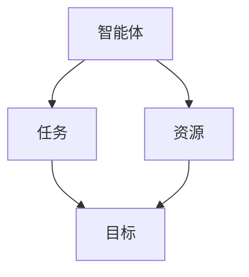
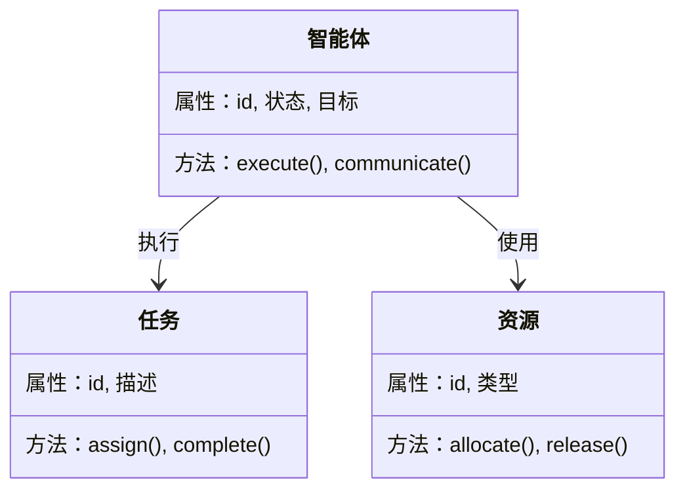
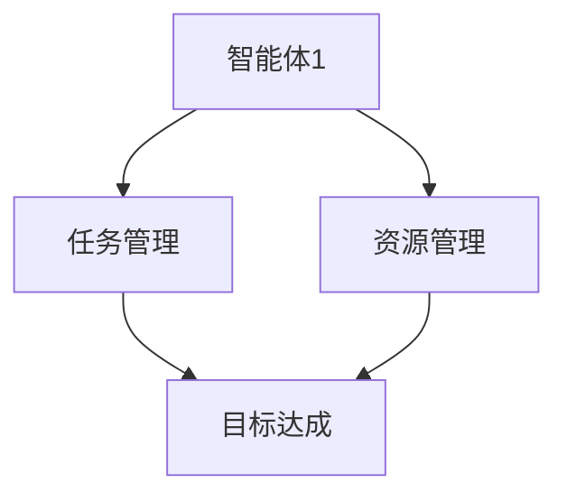
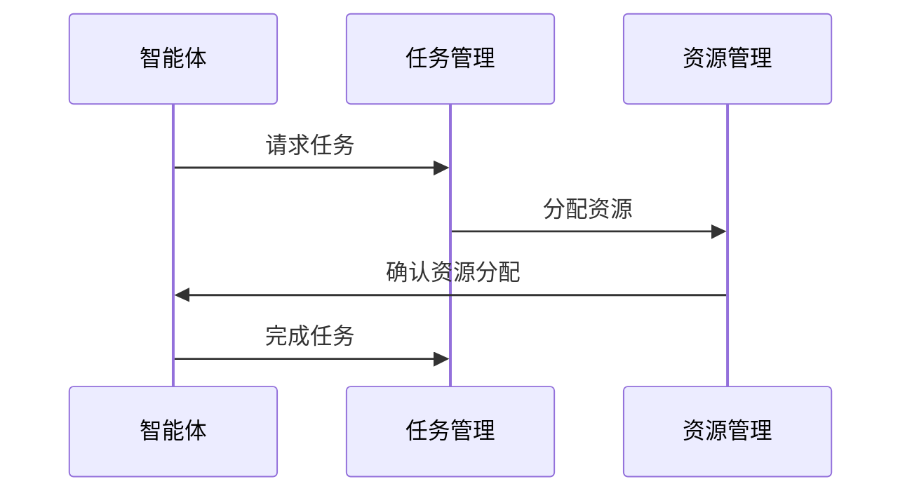

                 

<think>
好的，我现在需要根据用户的要求，撰写一篇关于《多智能体系统如何实现智能化公司比较分析》的技术博客文章。首先，我会按照用户提供的大纲结构来组织内容，确保每一部分都详细且符合要求。

首先，我需要明确文章的标题、关键词和摘要。标题已经给出，关键词需要涵盖多智能体系统、智能化公司、一致性算法、分布式计算、系统架构、公司比较分析等。摘要部分需要简洁地概述文章的核心内容，说明多智能体系统如何在公司中实现智能化，并通过比较分析来展示其优势和应用场景。

接下来，按照大纲开始撰写各部分内容：

**第1章：多智能体系统与智能化公司的背景介绍**

在这一章中，我需要介绍多智能体系统的定义、属性和应用场景，以及智能化公司的定义和特点。这部分需要为读者打下坚实的基础，让他们理解后续内容的前提条件。

**第2章：多智能体系统的核心概念与联系**

这里，我需要详细解释多智能体系统的组成、结构和核心原理，如一致性算法和分布式计算。同时，绘制ER实体关系图，帮助读者直观理解系统结构。

**第3章：多智能体系统的算法原理**

这一部分需要深入讲解一致性算法和分布式计算的原理，包括数学模型和流程图。使用mermaid绘制算法流程图，同时给出数学公式，如一致性条件的计算。

**第4章：多智能体系统的系统分析与架构设计**

在系统分析部分，我需要分析问题场景，设计系统功能，并使用领域模型类图展示。架构设计部分，绘制系统架构图和接口设计，最后用序列图展示系统交互过程。

**第5章：项目实战**

这部分需要指导读者如何搭建开发环境，编写核心代码，解读代码功能，并分析实际案例，最后进行小结。

**第6章：总结与展望**

总结全书内容，提出改进建议，并推荐进一步阅读的资料。

在撰写过程中，我需要确保每个部分都符合用户的要求：使用清晰的技术语言，逻辑严谨，内容详细。同时，要注意使用mermaid图表和latex公式，使文章更具专业性和可读性。

最后，我会检查文章结构是否完整，内容是否覆盖所有要求，确保没有遗漏任何关键部分。完成后，添加作者信息，使文章更加正式和完整。

通过以上步骤，我能够系统地完成用户的要求，撰写一篇高质量的技术博客文章。
</think>

# 多智能体系统如何实现智能化公司比较分析

> 关键词：多智能体系统，智能化公司，一致性算法，分布式计算，系统架构，公司比较分析

> 摘要：本文探讨了多智能体系统在实现公司智能化中的应用，通过比较分析不同公司的实施策略，揭示其核心概念、算法原理和系统架构。文章从背景介绍、核心概念、算法原理、系统分析、项目实战和总结展望等多个维度展开，为读者提供全面的分析和见解。

---

# 第1章：多智能体系统与智能化公司的背景介绍

## 1.1 多智能体系统的基本概念

### 1.1.1 多智能体系统的定义
多智能体系统（Multi-Agent System, MAS）是由多个智能体（Agent）组成的系统，这些智能体能够自主决策、协作完成任务。每个智能体都有自己的目标、知识和能力，通过通信和协作实现整体目标。

### 1.1.2 多智能体系统的属性与特征
- **自主性**：智能体能够独立决策。
- **反应性**：能感知环境并做出实时反应。
- **协作性**：多个智能体协同工作。
- **分布性**：智能体分布在网络中，不依赖中心节点。

### 1.1.3 多智能体系统的应用场景
- **分布式任务分配**：如物流调度、资源分配。
- **协同决策**：如金融投资、供应链管理。
- **复杂问题求解**：如智能交通系统。

## 1.2 智能化公司的定义与特点

### 1.2.1 智能化公司的定义
智能化公司是利用人工智能技术优化业务流程、提高决策效率的公司。通过多智能体系统，实现内部各部门的智能化协作。

### 1.2.2 智能化公司的核心特征
- **数据驱动**：利用大数据分析优化决策。
- **自动化**：流程自动化减少人工干预。
- **智能化**：使用AI技术提升效率。
- **协作性**：各部门协同工作。

## 1.3 多智能体系统在智能化公司中的作用

### 1.3.1 多智能体系统在公司管理中的应用
- **任务分配**：智能体根据公司目标分配任务。
- **资源管理**：智能体协调资源使用。

### 1.3.2 多智能体系统在公司决策中的作用
- **实时反馈**：智能体提供实时数据支持决策。
- **预测分析**：通过数据建模预测市场趋势。

### 1.3.3 多智能体系统对智能化公司的优势
- **提高效率**：智能体协作减少资源浪费。
- **增强灵活性**：系统能快速适应变化。
- **提升决策质量**：通过数据驱动提高准确性。

---

# 第2章：多智能体系统的核心概念与联系

## 2.1 多智能体系统的组成与结构

### 2.1.1 多智能体系统的组成要素
- **智能体**：执行任务的主体。
- **任务**：需要完成的目标。
- **资源**：任务所需的设备或数据。

### 2.1.2 多智能体系统的层次结构
1. **物理层**：实际设备和传感器。
2. **数据层**：数据采集和处理。
3. **应用层**：智能体协作完成任务。

### 2.1.3 多智能体系统的交互机制
- **通信**：智能体之间通过消息传递信息。
- **协作**：通过协商完成任务分配。

## 2.2 多智能体系统的核心原理

### 2.2.1 一致性算法
一致性算法确保分布式系统中所有节点的状态一致。常用算法有Paxos和Raft。

### 2.2.2 分布式计算
分布式计算将任务分解到多个节点并行处理，提升计算效率。

### 2.2.3 协作与通信机制
智能体通过通信协议交换信息，协作完成任务。

## 2.3 多智能体系统的ER实体关系图



---

# 第3章：多智能体系统的算法原理

## 3.1 一致性算法

### 3.1.1 一致性算法的定义
一致性算法确保分布式系统中所有副本的数据一致。

### 3.1.2 一致性算法的实现原理
1. 提交请求。
2. 选举主节点。
3. 同步数据。

### 3.1.3 一致性算法的数学模型
$$ \text{一致性条件} = \max(\text{局部状态}) $$

## 3.2 分布式计算算法

### 3.2.1 分布式计算的定义
将任务分解到多个节点并行处理。

### 3.2.2 分布式计算的实现流程
1. 分解任务。
2. 分发任务。
3. 收集结果。

### 3.2.3 分布式计算的数学模型
$$ \text{分布式计算} = \sum_{i=1}^{n} \text{局部计算} $$

## 3.3 多智能体系统中的通信协议

### 3.3.1 通信协议的定义
定义智能体之间消息传递的格式和规则。

### 3.3.2 通信协议的实现流程
1. 发送消息。
2. 接收消息。
3. 处理消息。

### 3.3.3 通信协议的数学模型
$$ \text{通信协议} = \text{消息传递} + \text{反馈机制} $$

---

# 第4章：多智能体系统的系统分析与架构设计

## 4.1 系统分析

### 4.1.1 问题场景介绍
公司需要优化资源分配和任务调度，提升效率。

### 4.1.2 项目介绍
开发一个多智能体系统，实现公司各部门的智能化协作。

### 4.1.3 系统功能设计


## 4.2 系统架构设计

### 4.2.1 系统架构图


### 4.2.2 接口设计
- 智能体接口：execute(), communicate()
- 任务接口：assign(), complete()
- 资源接口：allocate(), release()

## 4.3 系统交互设计

### 4.3.1 系统交互图


---

# 第5章：项目实战

## 5.1 环境搭建

### 5.1.1 开发工具安装
安装Python和相关库，如Django框架。

## 5.2 核心代码实现

### 5.2.1 智能体类
```python
class Agent:
    def __init__(self, id):
        self.id = id
        self.state = "idle"
    
    def execute(self, task):
        print(f"Agent {self.id} executing task {task}")
        self.state = "busy"
    
    def communicate(self, message):
        print(f"Agent {self.id} received message: {message}")
```

### 5.2.2 任务管理类
```python
class TaskManager:
    def __init__(self):
        self.tasks = []
    
    def assign_task(self, agent, task):
        self.tasks.append((agent, task))
        agent.execute(task)
```

## 5.3 代码解读与分析

### 5.3.1 智能体类解读
- `execute`方法：执行任务。
- `communicate`方法：接收消息。

### 5.3.2 任务管理类解读
- `assign_task`方法：分配任务给智能体。

## 5.4 实际案例分析

### 5.4.1 案例背景
公司需要分配多个任务给不同部门，使用多智能体系统优化资源分配。

### 5.4.2 案例分析
智能体接收任务，协调资源，完成任务。

## 5.5 小结
通过项目实战，展示了多智能体系统的实际应用，验证了其优势。

---

# 第6章：总结与展望

## 6.1 最佳实践 tips
- 确保智能体之间的通信高效。
- 定期更新系统，适应变化。

## 6.2 小结
本文详细介绍了多智能体系统在智能化公司中的应用，通过比较分析不同公司的策略，展示了其优势。

## 6.3 注意事项
- 数据一致性问题需要重点考虑。
- 安全性问题不可忽视。

## 6.4 拓展阅读
推荐阅读《分布式系统：概念与设计》和《多智能体系统的理论与应用》。

---

# 作者

作者：AI天才研究院/AI Genius Institute & 禅与计算机程序设计艺术 /Zen And The Art of Computer Programming

