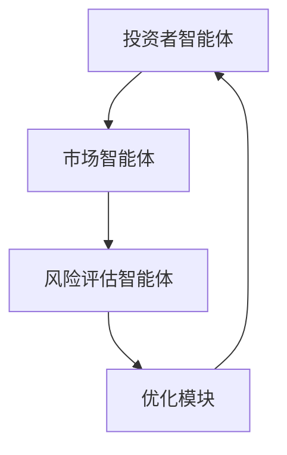
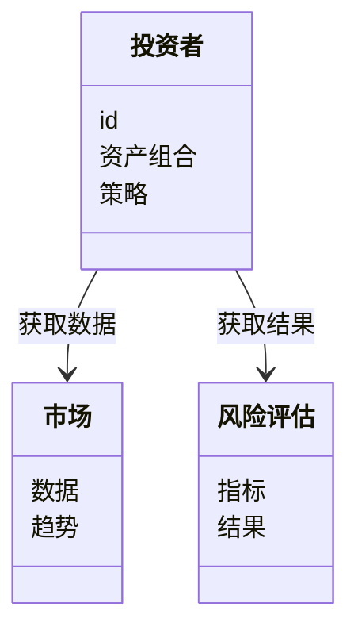
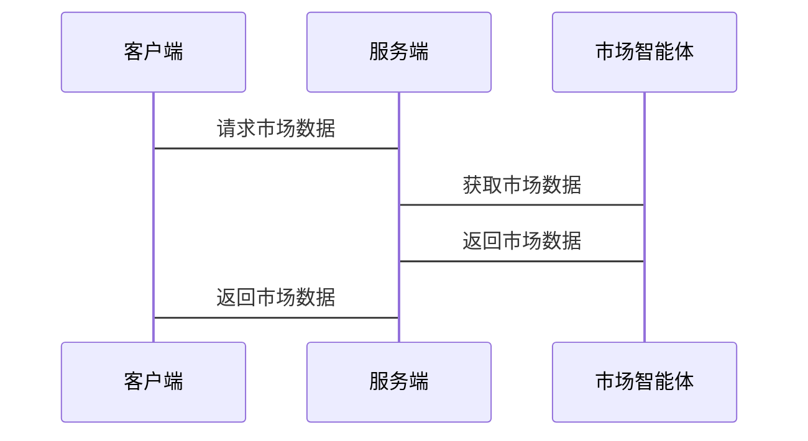

                 


# 多智能体系统如何实现智能投资组合保险

> 关键词：多智能体系统, 投资组合保险, 人工智能, 算法原理, 系统架构

> 摘要：本文深入探讨了多智能体系统在智能投资组合保险中的应用，分析了其核心概念、算法原理、系统架构，并通过实际案例展示了其在金融领域的优势。通过详细讲解，读者可以理解如何利用多智能体系统来优化投资组合，降低风险，实现智能保险策略。

---

# 第一部分：多智能体系统与智能投资组合保险的背景

# 第1章：多智能体系统与智能投资组合保险概述

## 1.1 多智能体系统的定义与特点
### 1.1.1 多智能体系统的定义
多智能体系统（Multi-Agent Systems, MAS）由多个智能体组成，这些智能体通过协作完成复杂任务。每个智能体都有自己的目标和行为，能够自主决策并与其他智能体交互。

### 1.1.2 多智能体系统的核心特点
- **分布式智能**：智能体独立决策，减少单点故障。
- **协作性**：智能体通过协作优化整体性能。
- **动态性**：适应环境变化，实时调整策略。

### 1.1.3 多智能体系统在投资组合保险中的应用场景
- **风险分散**：多个智能体分别监控不同资产，降低整体风险。
- **动态调整**：根据市场变化实时调整投资策略。

## 1.2 智能投资组合保险的定义与特点
### 1.2.1 投资组合保险的定义
投资组合保险是一种通过优化资产配置，平衡风险与收益的保险策略。

### 1.2.2 智能投资组合保险的核心优势
- **实时监控**：利用智能体实时跟踪市场变化。
- **自适应性**：根据市场动态自动调整投资组合。

### 1.2.3 智能投资组合保险的应用场景
- **风险管理**：通过智能体监控和预警，及时应对市场波动。
- **收益优化**：通过多智能体协作，最大化投资收益。

## 1.3 多智能体系统在智能投资组合保险中的优势
### 1.3.1 多智能体系统的分布式决策优势
通过分布式的决策机制，智能体能够独立处理部分任务，提高系统的容错性和效率。

### 1.3.2 多智能体系统的协作优化优势
智能体之间通过协作优化整体投资组合，实现收益与风险的最佳平衡。

### 1.3.3 多智能体系统的自适应性优势
系统能够根据市场变化快速调整策略，适应各种复杂的金融环境。

## 1.4 本章小结
本章介绍了多智能体系统的基本概念及其在智能投资组合保险中的优势，为后续章节奠定了基础。

---

# 第二部分：多智能体系统的核心概念与联系

# 第2章：多智能体系统的角色与关系

## 2.1 多智能体系统中的角色分析
### 2.1.1 投资者智能体
投资者智能体负责制定投资策略，监控资产表现，并根据市场变化调整投资组合。

### 2.1.2 市场智能体
市场智能体模拟市场行为，分析市场趋势，为投资者智能体提供实时数据支持。

### 2.1.3 风险评估智能体
风险评估智能体评估投资组合的风险，制定风险控制策略。

## 2.2 多智能体系统中的关系分析
### 2.2.1 智能体之间的交互关系
- 投资者智能体与市场智能体实时交互，获取市场数据。
- 风险评估智能体与投资者智能体交互，提供风险评估结果。

### 2.2.2 智能体之间的依赖关系
- 投资者智能体依赖市场智能体的数据支持。
- 风险评估智能体依赖投资者智能体的投资决策。

### 2.2.3 智能体之间的协同关系
- 投资者、市场和风险评估智能体协同工作，优化投资组合。

## 2.3 多智能体系统的ER实体关系图

```mermaid
erDiagram
    class 投资者智能体 {
        id
        策略
        资产组合
    }
    class 市场智能体 {
        id
        市场数据
        趋势分析
    }
    class 风险评估智能体 {
        id
        风险指标
        评估结果
    }
    投资者智能体 -- 市场智能体 : 获取市场数据
    投资者智能体 -- 风险评估智能体 : 获取风险评估
    市场智能体 -- 风险评估智能体 : 提供市场趋势
```

## 2.4 本章小结
本章详细分析了多智能体系统在智能投资组合保险中的角色及其关系，为后续的算法设计和系统实现奠定了基础。

---

# 第三部分：算法原理讲解

# 第3章：多智能体协同优化算法

## 3.1 多智能体协同优化算法概述
多智能体协同优化算法通过智能体之间的协作，实现全局优化目标。

## 3.2 算法实现步骤
### 3.2.1 初始化智能体
```python
class InvestorAgent:
    def __init__(self, id, portfolio):
        self.id = id
        self.portfolio = portfolio
```

### 3.2.2 交互与协作
```python
def interact(agents, market_data):
    for agent in agents:
        agent.update_portfolio(market_data)
```

### 3.2.3 优化与调整
```python
def optimize(agents, target):
    for agent in agents:
        agent.optimize_portfolio(target)
```

## 3.3 算法流程图


## 3.4 数学模型与公式
### 3.4.1 风险-收益模型
$$ \text{风险} = \sqrt{\text{方差}} $$
$$ \text{收益} = \sum w_i r_i $$

### 3.4.2 优化目标
$$ \text{最大化收益} = \sum w_i r_i $$
$$ \text{最小化风险} = \sqrt{\sum w_i^2 \sigma_i^2} $$

## 3.5 本章小结
本章详细讲解了多智能体协同优化算法的实现步骤和数学模型，为系统的实际应用提供了理论基础。

---

# 第四部分：系统分析与架构设计方案

# 第4章：智能投资组合管理系统架构设计

## 4.1 项目介绍
智能投资组合管理系统是一个基于多智能体系统的金融管理平台，旨在实现智能投资组合保险。

## 4.2 系统功能设计
### 4.2.1 领域模型


### 4.2.2 系统架构


## 4.3 系统接口设计
### 4.3.1 API接口
- `/api/market/data`：获取市场数据
- `/api/portfolio/optimization`：优化投资组合

### 4.3.2 交互流程图


## 4.4 本章小结
本章详细设计了智能投资组合管理系统的架构和接口，为系统的实现提供了清晰的指导。

---

# 第五部分：项目实战

# 第5章：智能投资组合保险系统实现

## 5.1 环境搭建
### 5.1.1 安装依赖
```bash
pip install tensorflow numpy pandas
```

## 5.2 核心代码实现
### 5.2.1 投资者智能体
```python
class InvestorAgent:
    def __init__(self, id, portfolio):
        self.id = id
        self.portfolio = portfolio

    def update_portfolio(self, market_data):
        # 根据市场数据调整资产配置
        pass
```

### 5.2.2 风险评估智能体
```python
class RiskEvaluator:
    def __init__(self):
        pass

    def evaluate(self, portfolio):
        # 计算风险指标
        pass
```

## 5.3 项目实战案例
### 5.3.1 案例分析
模拟市场波动下的投资组合调整，展示系统的实时响应和优化能力。

### 5.3.2 代码实现
```python
# 示例代码：投资者智能体获取市场数据并调整资产配置
agent = InvestorAgent(1, [0.5, 0.3, 0.2])
market_data = get_market_data()
agent.update_portfolio(market_data)
```

## 5.4 本章小结
本章通过实际案例展示了多智能体系统在智能投资组合保险中的应用，帮助读者理解系统的实际运行过程。

---

# 第六部分：最佳实践与总结

# 第6章：经验总结与最佳实践

## 6.1 项目开发中的经验总结
### 6.1.1 智能体设计的注意事项
- 确保智能体之间的高效协作
- 处理好智能体之间的依赖关系

### 6.1.2 系统优化的关键点
- 优化算法的计算效率
- 提高系统的可扩展性

## 6.2 最佳实践 tips
### 6.2.1 智能体数量的选择
- 根据具体需求选择合适的智能体数量
- 避免过多智能体导致的系统复杂性

### 6.2.2 数据处理的建议
- 使用高质量的市场数据
- 处理好数据噪声

## 6.3 本章小结
本章总结了项目开发中的经验和最佳实践，为读者提供了宝贵的指导。

---

# 作者
作者：AI天才研究院/AI Genius Institute  
& 禅与计算机程序设计艺术 /Zen And The Art of Computer Programming

