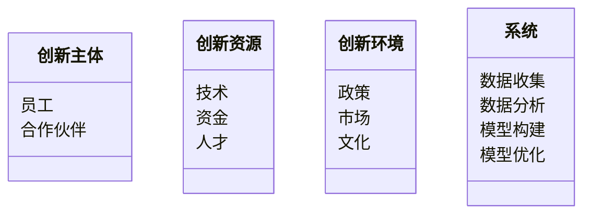

                 

<think>
好，我现在需要帮用户完成一篇关于《多智能体系统如何评估公司的创新生态系统》的技术博客文章。用户已经提供了详细的需求，包括目录大纲和一些示例内容，所以我需要按照这个结构一步步来完成。

首先，用户希望文章有七个主要部分，每个部分下还有三级子标题，覆盖从背景介绍到项目实战等多个方面。我需要确保每个部分都详细且有技术深度，同时语言要专业但易懂。

让我先从第一章开始。第一章是背景介绍，需要涵盖多智能体系统和创新生态系统的定义，以及它们在企业中的重要性。这部分需要让读者明白为什么多智能体系统在评估创新生态系统中如此有用。

接下来是第二章，核心概念。这里需要详细解释多智能体系统和创新生态系统的核心要素，以及它们之间的关系。可能需要一些图表来辅助说明，比如ER实体关系图和流程图。

第三章是算法原理，这部分需要讲解多智能体系统在评估中的具体算法，比如分布式计算和博弈论模型。我需要用数学公式和mermaid图来展示这些算法的工作原理。

第四章是系统架构设计，需要描述系统的功能模块和架构图。这部分要确保系统设计的合理性和可扩展性，同时也要考虑接口设计和交互流程。

第五章是项目实战，需要具体指导读者如何搭建环境、实现核心代码，并提供案例分析。代码示例是关键，需要详细解释每一步的操作。

第六章是最佳实践，总结项目中的经验和注意事项，同时指出未来的发展方向。

最后是总结部分，回顾全文并强调多智能体系统在评估创新生态系统中的重要性。

在写作过程中，我需要确保每个部分都有足够的细节，同时保持逻辑的连贯性。可能需要多次修改，确保内容既专业又易懂。

现在，我需要根据用户提供的示例内容，逐步完成每一章的详细内容。确保使用markdown格式，包含必要的图表和公式，并且语言简洁明了。
</think>

# 多智能体系统如何评估公司的创新生态系统

> 关键词：多智能体系统，创新生态系统，企业创新评估，分布式计算，系统架构设计

> 摘要：本文详细探讨了多智能体系统在评估公司创新生态系统中的应用。通过分析创新生态系统的构成要素和多智能体系统的分布式协作机制，提出了一种基于多智能体的创新评估框架。结合算法原理、系统架构设计和实际案例分析，本文为企业的创新评估提供了新的思路和方法。

---

## 第一章: 多智能体系统与创新生态系统背景介绍

### 1.1 多智能体系统的核心概念

#### 1.1.1 多智能体系统的定义与特点
多智能体系统（Multi-Agent Systems, MAS）是由多个智能体组成的分布式系统，每个智能体能够独立感知环境、自主决策并与其他智能体协作。MAS的特点包括分布式性、自主性、协作性、反应性和动态性。

#### 1.1.2 创新生态系统的定义与构成
创新生态系统是一个由企业、员工、合作伙伴、创新资源和技术等要素构成的复杂系统，旨在通过协作和资源整合实现持续创新。创新生态系统的核心在于创新主体之间的互动和资源的高效配置。

#### 1.1.3 多智能体系统与创新生态系统的关联
多智能体系统能够模拟创新生态系统中各主体的行为和交互，通过分布式协作机制优化创新资源的配置，提升企业的创新效率。

### 1.2 问题背景与描述

#### 1.2.1 传统企业创新评估的局限性
传统创新评估方法通常基于静态指标和单一视角，难以捕捉动态变化的创新过程和多主体协作的影响。

#### 1.2.2 多智能体系统在创新评估中的优势
MAS能够模拟创新生态系统的动态性和复杂性，通过多维度的数据分析和实时反馈优化创新策略。

#### 1.2.3 创新生态系统评估的边界与外延
创新生态系统评估的边界包括创新主体、资源和技术环境，外延则涉及创新文化、市场反馈和政策影响。

---

## 第二章: 多智能体系统的核心概念与联系

### 2.1 多智能体系统的核心原理

#### 2.1.1 分布式智能与协作机制
多智能体系统通过分布式计算实现协作，每个智能体负责特定任务，并通过通信协议共享信息。

#### 2.1.2 多智能体系统的通信与协调
智能体之间的通信通过消息传递机制完成，协调机制确保任务分配和资源优化。

#### 2.1.3 动态环境下的适应性
多智能体系统能够根据环境变化自适应调整策略，确保系统在动态环境中的稳定运行。

### 2.2 创新生态系统的核心要素

#### 2.2.1 创新主体
- 员工：创新的核心力量，包括研发团队和技术人员。
- 合作伙伴：外部资源，如供应商和顾问。
- 创新资源：技术、资金和人才。

#### 2.2.2 创新环境
- 政策：政府支持和法规影响。
- 市场：市场需求和技术趋势。
- 文化：企业文化和创新氛围。

### 2.3 多智能体系统与创新生态系统的ER实体关系图

```mermaid
erDiagram
    actor 公司 : 评估主体
    actor 员工 : 创新主体
    actor 合作伙伴 : 外部资源
    actor 创新资源 : 技术、资金、人才
    actor 创新环境 : 政策、市场、文化
    公司 --> 员工 : 创新行为
    公司 --> 合作伙伴 : 资源整合
    公司 --> 创新资源 : 资源分配
    公司 --> 创新环境 : 环境适应
```

---

## 第三章: 多智能体系统评估创新生态系统的算法原理

### 3.1 算法原理概述

#### 3.1.1 分布式计算与协作
多智能体系统通过分布式计算实现协作，每个智能体负责特定任务，通过通信协议共享信息。

#### 3.1.2 多智能体系统的博弈论模型
博弈论模型用于描述智能体之间的策略选择和利益冲突，确保系统在动态环境中的最优决策。

#### 3.1.3 动态环境下的适应性算法
适应性算法能够根据环境变化调整策略，确保系统在动态环境中的稳定运行。

### 3.2 创新生态系统评估的算法实现

#### 3.2.1 算法流程
1. 数据收集：获取创新生态系统中的各种数据，包括员工绩效、资源分配和市场反馈。
2. 数据分析：通过分布式计算分析数据，识别关键影响因素。
3. 模型构建：基于博弈论模型构建创新生态系统评估模型。
4. 模型优化：通过适应性算法优化模型，确保评估结果的准确性。

#### 3.2.2 算法代码示例
```python
def collect_data(subjects):
    data = {}
    for subject in subjects:
        data[subject] = gather(subject)
    return data

def analyze_data(data):
    results = {}
    for key, value in data.items():
        results[key] = analyze(value)
    return results

def build_model(results):
    model = {}
    for key, value in results.items():
        model[key] = build(value)
    return model

def optimize_model(model):
    optimized_model = {}
    for key, value in model.items():
        optimized_model[key] = optimize(value)
    return optimized_model
```

---

## 第四章: 创新生态系统评估的系统架构设计

### 4.1 系统功能设计

#### 4.1.1 领域模型设计


#### 4.1.2 系统架构设计
```mermaid
sequenceDiagram
    actor 用户 -> 系统: 请求评估
    系统 -> 创新主体: 收集数据
    创新主体 -> 系统: 返回数据
    系统 -> 创新资源: 分析数据
    创新资源 -> 系统: 返回分析结果
    系统 -> 创新环境: 构建模型
    创新环境 -> 系统: 返回模型
    系统 -> 用户: 提供评估结果
```

### 4.2 系统接口设计

#### 4.2.1 系统功能模块
- 数据收集模块：负责收集创新生态系统中的各种数据。
- 数据分析模块：对数据进行分析，识别关键影响因素。
- 模型构建模块：基于博弈论模型构建创新生态系统评估模型。
- 模型优化模块：通过适应性算法优化模型，确保评估结果的准确性。

#### 4.2.2 系统交互流程
用户通过界面请求评估，系统依次与创新主体、创新资源和创新环境交互，最终返回评估结果。

---

## 第五章: 项目实战

### 5.1 环境搭建

#### 5.1.1 环境要求
- 操作系统：Linux或Windows
- 编程语言：Python 3.8+
- 库：numpy, pandas, scikit-learn

### 5.2 核心代码实现

#### 5.2.1 数据收集模块
```python
import numpy as np
import pandas as pd

def collect_data(subjects):
    data = {}
    for subject in subjects:
        data[subject] = gather(subject)
    return data

def gather(subject):
    # 数据收集逻辑
    return np.random.rand(10, 5)
```

#### 5.2.2 数据分析模块
```python
def analyze_data(data):
    results = {}
    for key, value in data.items():
        results[key] = analyze(value)
    return results

def analyze(values):
    # 数据分析逻辑
    return pd.DataFrame(values)
```

### 5.3 案例分析

#### 5.3.1 案例背景
某科技公司希望评估其创新生态系统，包括员工绩效、资源分配和市场反馈。

#### 5.3.2 实施步骤
1. 数据收集：收集员工绩效、资源分配和市场反馈数据。
2. 数据分析：分析数据，识别关键影响因素。
3. 模型构建：基于博弈论模型构建创新生态系统评估模型。
4. 模型优化：通过适应性算法优化模型，确保评估结果的准确性。

#### 5.3.3 实施结果
通过多智能体系统评估，该公司识别出关键创新瓶颈，并优化了资源分配策略，提升了创新效率。

---

## 第六章: 最佳实践与总结

### 6.1 最佳实践

#### 6.1.1 系统设计
- 确保系统的可扩展性和可维护性。
- 使用成熟的框架和库，降低开发成本。

#### 6.1.2 项目实施
- 从小规模试点开始，逐步扩展。
- 确保数据质量和实时性。

### 6.2 小结

多智能体系统在评估公司创新生态系统中的应用，不仅提高了评估的准确性和实时性，还为企业提供了优化创新策略的有效工具。

### 6.3 注意事项

- 数据质量和隐私保护：确保数据的准确性和合法性。
- 系统安全：防止数据泄露和系统攻击。
- 用户培训：确保相关人员能够正确使用系统。

### 6.4 未来展望

随着人工智能和分布式计算技术的发展，多智能体系统在创新生态系统评估中的应用将更加广泛和深入，为企业创新管理提供更强大的支持。

---

## 总结

多智能体系统通过分布式协作和动态适应性，为评估公司创新生态系统提供了新的思路和方法。本文从背景介绍、核心概念、算法原理、系统架构设计到项目实战，全面探讨了多智能体系统在创新生态系统评估中的应用，为企业创新管理提供了理论和实践指导。

作者：AI天才研究院 & 禅与计算机程序设计艺术

