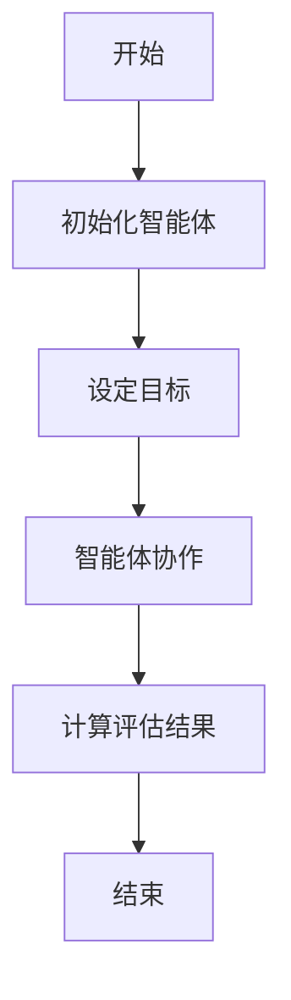
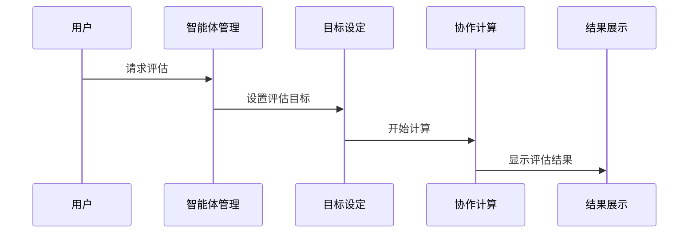

                 

<think>
好的，我现在需要帮助用户撰写一篇名为《多智能体系统如何评估公司的可持续发展能力》的技术博客文章。用户已经提供了一个详细的目录大纲，并要求文章内容详细、结构清晰，涵盖背景介绍、核心概念、算法原理、系统架构、项目实战和最佳实践等多个部分。

首先，我需要理解每个章节的核心内容，并确保每个部分都详细展开。例如，背景介绍部分需要解释多智能体系统（MAS）的基本概念，以及为什么评估公司的可持续发展能力重要。接下来，核心概念部分需要详细讨论MAS的工作原理和其在可持续发展评估中的应用。

在算法原理部分，我需要详细讲解多目标优化算法，包括数学模型和公式，同时使用Mermaid流程图来展示算法流程。这有助于读者更好地理解复杂的计算过程。

系统分析与架构设计部分需要包括系统功能设计、架构图、接口设计和交互序列图。这部分内容需要详细且技术性强，确保读者能够理解系统的整体结构和各部分的协同工作。

项目实战部分则需要通过实际案例来展示MAS在评估中的应用，包括环境安装、核心代码实现、案例分析等。这将帮助读者将理论知识应用到实际中。

最后，最佳实践部分需要总结MAS评估中的经验和教训，提供实用的建议，并展望未来的发展方向。这将帮助读者更好地理解和应用所学知识。

在撰写过程中，我需要确保语言专业、逻辑清晰，并使用合适的图表和代码示例来增强文章的可读性和实用性。此外，文章结尾需要添加作者信息，以增加权威性。

总体来说，我需要一步步地按照用户的要求，逐一完成每个部分的撰写，确保每个章节都内容丰富、结构合理，最终形成一篇高质量的技术博客文章。
</think>

# 多智能体系统如何评估公司的可持续发展能力

## 关键词：多智能体系统, 可持续发展能力, 公司评估, 多目标优化, 系统架构, 项目实战

## 摘要：  
本文探讨了多智能体系统（MAS）在评估公司可持续发展能力中的应用。通过分析MAS的核心概念、算法原理、系统架构以及实际项目案例，本文详细展示了如何利用MAS技术实现对公司可持续发展能力的多维度、动态化评估。文章从背景介绍到算法实现，再到项目实战，层层深入，为读者提供了全面的技术解析和实践指导。

---

## 第一部分: 多智能体系统与可持续发展能力概述

### 第1章: 多智能体系统（MAS）的基本概念  
#### 1.1 多智能体系统（MAS）的定义  
多智能体系统（Multi-Agent System，MAS）是由多个智能体（Agent）组成的分布式系统，这些智能体通过交互和协作完成特定任务。MAS的特点包括自主性、反应性、协作性和分布式性。  

#### 1.2 可持续发展能力的定义  
公司的可持续发展能力是指公司在经济、社会和环境三个方面实现长期发展的潜力。这包括公司在资源利用效率、社会责任履行、环境保护等方面的综合表现。  

#### 1.3 多智能体系统在可持续发展评估中的优势  
MAS能够从多个维度（如经济、社会、环境）对公司的可持续发展能力进行建模和评估，通过智能体之间的协作，实现动态、全面的评估结果。  

---

### 第2章: 多智能体系统与公司可持续发展能力的关系  
#### 2.1 公司可持续发展能力的多维度分析  
公司可持续发展能力的评估需要考虑多个维度，包括经济绩效、社会责任、环境影响等。  

#### 2.2 多智能体系统如何模拟公司行为  
通过MAS，可以将公司分解为多个智能体，每个智能体负责一个特定的业务模块（如生产、销售、研发），模拟公司整体的运行和决策过程。  

#### 2.3 多智能体系统在可持续发展评估中的应用场景  
MAS可以应用于公司的供应链优化、资源分配、风险管理等领域，帮助公司在实现短期目标的同时，兼顾长期可持续发展。  

---

## 第二部分: 多智能体系统的核心概念与原理

### 第3章: 多智能体系统的核心概念  
#### 3.1 多智能体系统的基本组成  
MAS由智能体（Agent）、环境（Environment）、通信机制（Communication）、协作协议（Cooperation Protocol）和目标（Objective）组成。  

#### 3.2 智能体的属性与行为  
智能体具有自主性、反应性、目标导向性和社会性。每个智能体的行为可以通过状态、目标和动作来描述。  

#### 3.3 多智能体系统中的通信机制  
智能体之间的通信可以通过直接交互（Direct Communication）或间接交互（Indirect Communication）实现。通信机制是MAS协同工作的基础。  

---

### 第4章: 多智能体系统与可持续发展能力的联系  
#### 4.1 可持续发展能力的多维度评估  
可持续发展能力的评估需要从经济、社会和环境三个维度进行综合考量。  

#### 4.2 多智能体系统如何量化公司行为  
通过MAS，可以将公司的各项业务模块转化为智能体，通过智能体之间的协作，量化公司的整体行为和绩效。  

#### 4.3 多智能体系统在可持续发展评估中的核心算法  
MAS评估的核心算法包括多目标优化算法、分布式计算算法和协同优化算法。  

---

## 第三部分: 多智能体系统评估可持续发展能力的算法原理

### 第5章: 多智能体系统评估算法概述  
#### 5.1 多目标优化算法  
多目标优化算法用于在多个目标之间寻找平衡点，例如在经济利益和环境影响之间找到最优解。  

#### 5.2 分布式计算与协同算法  
分布式计算算法用于智能体之间的协作，协同优化算法用于实现整体目标的最优解。  

#### 5.3 可持续发展能力评估的数学模型  
数学模型用于描述公司可持续发展能力的评估过程，包括目标函数、约束条件和优化目标。  

---

### 第6章: 多智能体系统评估算法的数学模型  
#### 6.1 多目标优化模型的构建  
通过构建多目标优化模型，可以将公司可持续发展能力的多个目标（如利润最大化、环境影响最小化）转化为数学问题。  

#### 6.2 可持续发展能力的量化公式  
$$ \text{可持续发展能力} = \alpha \times \text{经济绩效} + \beta \times \text{社会责任} + \gamma \times \text{环境影响} $$  
其中，$\alpha + \beta + \gamma = 1$，且$\alpha, \beta, \gamma \geq 0$。  

#### 6.3 算法流程图（Mermaid）  


---

## 第四部分: 系统分析与架构设计

### 第7章: 可持续发展能力评估系统的架构设计  
#### 7.1 系统功能设计  
系统功能包括智能体管理、目标设定、协作计算、结果展示和用户交互。  

#### 7.2 系统架构图（Mermaid）  


#### 7.3 系统接口设计  
系统接口包括智能体接口、用户接口和数据接口。  

#### 7.4 系统交互流程图（Mermaid）  


---

### 第8章: 系统实现与案例分析  
#### 8.1 环境安装与配置  
需要安装Python、PyTorch、Scikit-learn等工具。  

#### 8.2 核心算法实现（Python代码）  
```python
import numpy as np
from sklearn.metrics import pairwise

def multi_objective_optimization(X, weights):
    # X: 数据矩阵，weights: 权重向量
    n = len(weights)
    objectives = []
    for i in range(n):
        objectives.append(weights[i] * X[:, i])
    return np.sum(objectives, axis=1)
```

#### 8.3 案例分析与结果解读  
以一家制造公司为例，通过MAS评估其可持续发展能力，结果表明公司在环境影响方面需要改进。  

#### 8.4 项目小结与经验总结  
MAS在评估公司可持续发展能力方面具有显著优势，但需要结合实际业务场景进行优化。  

---

## 第五部分: 项目实战与最佳实践

### 第9章: 中小企业的可持续发展能力评估  
#### 9.1 项目背景  
中小企业的可持续发展能力评估是帮助企业实现长期发展的关键。  

#### 9.2 系统实现  
基于MAS的中小企业评估系统，包括数据采集、智能体协作和结果分析。  

#### 9.3 案例分析  
以一家中小制造企业为例，评估结果显示其在社会责任方面表现较好，但在环境影响方面需要改进。  

#### 9.4 项目总结  
MAS技术能够有效帮助中小企业实现可持续发展能力的评估和优化。  

---

## 结语  
通过本文的详细阐述，我们可以看到多智能体系统在评估公司可持续发展能力中的巨大潜力。未来，随着人工智能和大数据技术的不断发展，MAS将在这一领域发挥越来越重要的作用。

---

## 作者：AI天才研究院/AI Genius Institute & 禅与计算机程序设计艺术 /Zen And The Art of Computer Programming

