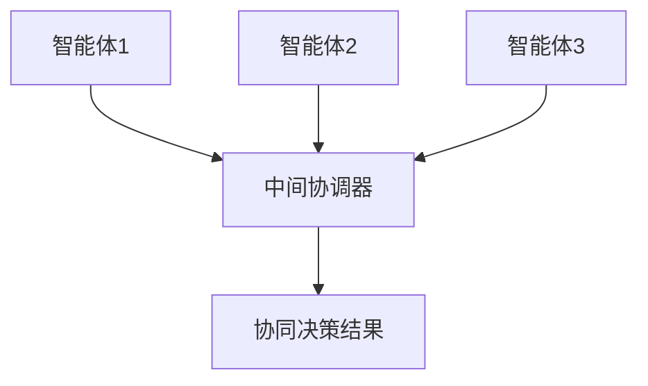
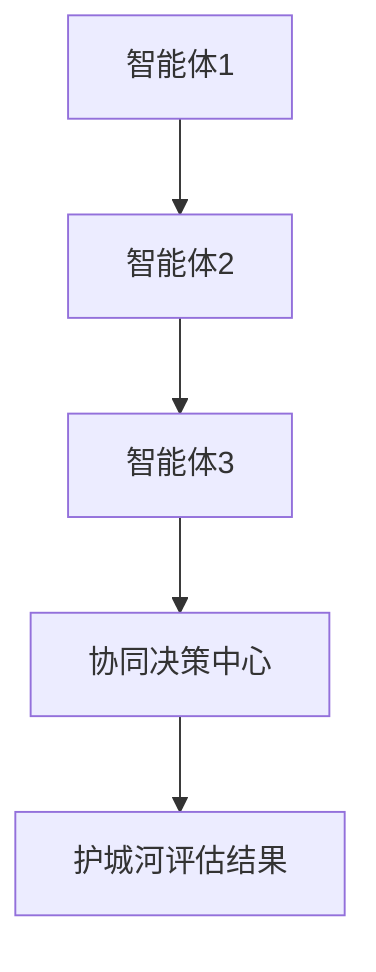
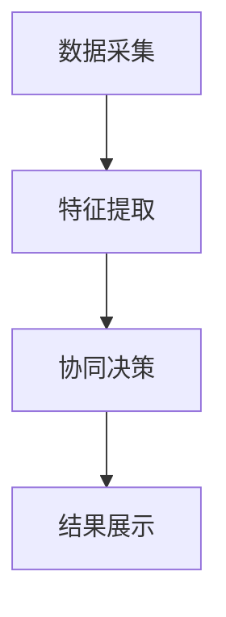
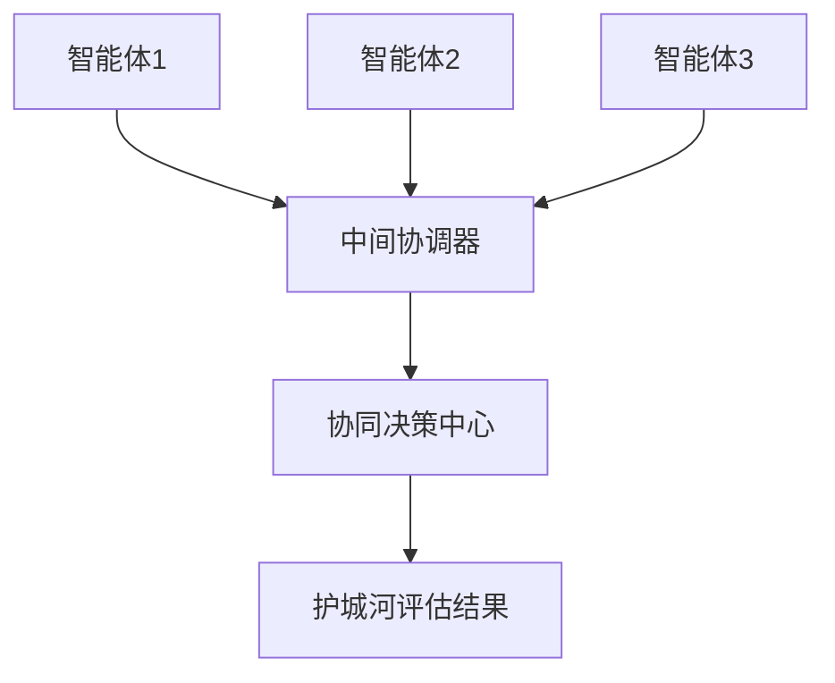
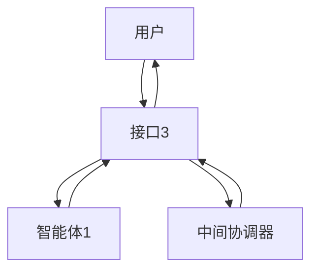

                 

<think>
好的，我现在需要帮助用户撰写一篇关于《多智能体系统如何评估公司的护城河》的技术博客文章。用户已经提供了详细的大纲，包括关键词、摘要和各个章节的内容，但文章还没有完成。我的任务是按照用户的要求，逐步完成各个章节的具体内容，确保文章逻辑清晰、结构紧凑、技术语言专业。

首先，我会从“关键词”和“摘要”开始，确保这些部分准确反映了文章的核心内容。然后，逐步完成每个章节的内容，包括背景介绍、核心概念、算法原理、系统架构设计、项目实战和最佳实践等部分。

在撰写过程中，我会确保每个章节都有详细的解释，使用清晰的结构和专业的术语。同时，我需要在适当的地方插入图表，如Mermaid流程图和类图，以及数学公式，以增强文章的可读性和技术深度。最后，我会检查整个文章，确保内容连贯，符合用户的要求，并进行必要的修改和润色。

现在，我会开始撰写每个章节的具体内容。
</think>

# 多智能体系统如何评估公司的护城河

## 关键词：
多智能体系统，公司护城河，协同决策，算法原理，系统架构，项目实战

## 摘要：
本文探讨了如何利用多智能体系统评估公司的护城河。通过分析多智能体系统的协同机制、算法原理和系统架构，本文提出了基于多智能体的护城河评估方法，并通过具体案例展示了其实现和应用。文章从背景介绍、核心概念、算法实现、系统设计到项目实战，全面解析了多智能体系统在护城河评估中的应用，为公司提供了一种新的竞争优势分析工具。

---

# 第一部分: 多智能体系统与公司护城河的背景介绍

## 第1章: 多智能体系统与公司护城河概述

### 1.1 多智能体系统的定义与特点

#### 1.1.1 多智能体系统的定义
多智能体系统（Multi-Agent System, MAS）是由多个智能体（Agent）组成的分布式系统，这些智能体通过协作完成复杂的任务。每个智能体都是一个能够感知环境、做出决策并采取行动的实体。

#### 1.1.2 多智能体系统的核心特点
| 特性 | 描述 |
|------|------|
| 分布式 | 智能体独立运行，协同完成任务 |
| 协作性 | 智能体之间通过通信和协调完成共同目标 |
| 反应性 | 智能体能够实时感知环境并做出反应 |
| 自适应性 | 系统能够根据环境变化动态调整 |

#### 1.1.3 多智能体系统与传统单智能体系统的区别
| 对比维度 | 多智能体系统 | 单智能体系统 |
|----------|--------------|---------------|
| 系统结构 | 分布式结构 | 集中式结构 |
| 协作性   | 高度依赖协作 | 独立运行 |
| 可扩展性 | 高 | 低 |

### 1.2 公司护城河的定义与分类

#### 1.2.1 公司护城河的定义
护城河是指公司拥有的竞争优势，使得竞争对手难以在相同或相似的领域内与之竞争。这种优势可以是技术、品牌、成本优势、网络效应等。

#### 1.2.2 护城河的分类与特点
| 类型 | 描述 |
|------|------|
| 技术护城河 | 依赖独特技术，形成壁垒 |
| 市场护城河 | 通过市场占有率和品牌忠诚度形成优势 |
| 成本护城河 | 通过成本优势降低竞争对手的盈利能力 |
| 网络效应护城河 | 用户数量增加，系统价值提升 |

### 1.3 多智能体系统与公司护城河的关系

#### 1.3.1 多智能体系统在公司护城河中的作用
多智能体系统可以通过协同决策、数据共享和分布式计算，帮助公司构建或强化护城河。

#### 1.3.2 多智能体系统如何增强公司的竞争优势
通过多智能体系统，公司可以更高效地整合资源、优化流程，从而增强技术、市场和成本等方面的竞争优势。

#### 1.3.3 多智能体系统在护城河评估中的应用前景
随着人工智能和分布式系统的不断发展，多智能体系统在护城河评估中的应用将越来越广泛，成为企业竞争力分析的重要工具。

### 1.4 本章小结
本章介绍了多智能体系统的定义、特点，以及公司护城河的分类与特点。通过分析两者的关系，阐述了多智能体系统在护城河评估中的重要性。

---

# 第二部分: 多智能体系统如何评估公司护城河的核心概念

## 第2章: 多智能体系统的核心原理

### 2.1 多智能体系统的协同机制

#### 2.1.1 协同目标的定义与实现
协同目标是指多个智能体共同完成的任务或目标。实现协同目标需要智能体之间进行通信、协调和协作。

#### 2.1.2 多智能体系统中的通信与协调
智能体之间的通信可以通过消息传递或中间件实现。协调机制包括任务分配、冲突解决和状态同步。

#### 2.1.3 协同决策的算法与模型
协同决策算法需要考虑多个智能体的决策偏好和目标，通过协商或投票机制达成共识。

#### 2.1.4 协同决策流程图


### 2.2 多智能体系统的智能体行为模型

#### 2.2.1 智能体的定义与属性
智能体具有自主性、反应性、目标导向性和社会性等属性。

#### 2.2.2 智能体的行为模式
智能体的行为模式包括反应式行为和目标导向行为，可以通过状态机模型进行描述。

#### 2.2.3 智能体之间的关系与交互
智能体之间的关系可以是竞争、合作或中立，交互方式包括直接通信和间接影响。

### 2.3 多智能体系统的数学模型

#### 2.3.1 多智能体系统的数学表达
多智能体系统的状态可以用向量表示，$s = (s_1, s_2, ..., s_n)$，其中$s_i$表示第i个智能体的状态。

#### 2.3.2 协同决策的数学模型
协同决策可以通过投票机制实现，每个智能体的决策权重为$w_i$，最终决策为$\sum_{i=1}^n w_i d_i$，其中$d_i$是第i个智能体的决策。

#### 2.3.3 智能体行为的数学描述
智能体的行为可以通过决策函数$f(s_i)$描述，其中$f$是基于当前状态$s_i$的决策规则。

### 2.4 本章小结
本章详细讲解了多智能体系统的协同机制、智能体行为模型和数学模型，为后续的护城河评估奠定了理论基础。

---

# 第三部分: 多智能体系统评估公司护城河的算法原理

## 第3章: 多智能体系统评估护城河的算法原理

### 3.1 多智能体系统评估护城河的基本算法

#### 3.1.1 基于协同决策的护城河评估算法
协同决策算法通过整合多个智能体的评估结果，得出公司的护城河评分。

#### 3.1.2 多智能体系统中的护城河特征提取算法
特征提取算法从公司数据中提取关键特征，如技术优势、市场份额等。

#### 3.1.3 护城河评估的数学模型与公式
护城河评估模型可以通过加权平均公式实现，即：
$$ 护城河评分 = \sum_{i=1}^n w_i x_i $$
其中，$w_i$ 是特征 $i$ 的权重，$x_i$ 是特征 $i$ 的值。

### 3.2 协同决策算法的实现

#### 3.2.1 协同决策算法的流程图


#### 3.2.2 协同决策算法的Python实现
```python
def协同决策算法(智能体列表):
    评估结果 = []
    for 智能体 in 智能体列表:
        特征 = 提取特征(智能体)
        评估结果.append(特征)
    return 综合评估结果
```

### 3.3 护城河评估的数学模型
护城河评估的数学模型通过加权平均的方式，整合多个特征的评估结果，得出最终的护城河评分。

### 3.4 本章小结
本章详细介绍了多智能体系统评估护城河的基本算法、协同决策算法的实现以及数学模型，为后续的系统设计提供了算法基础。

---

# 第四部分: 多智能体系统评估公司护城河的系统架构设计

## 第4章: 多智能体系统评估护城河的系统架构

### 4.1 系统功能设计

#### 4.1.1 系统功能模块划分
系统功能模块包括数据采集、特征提取、协同决策、结果展示和用户管理。

#### 4.1.2 系统功能流程图


### 4.2 系统架构设计

#### 4.2.1 系统架构图


### 4.3 系统接口设计

#### 4.3.1 系统接口描述
系统接口包括智能体通信接口、决策中心接口和用户界面接口。

#### 4.3.2 系统接口序列图


### 4.4 本章小结
本章详细设计了多智能体系统评估护城河的系统架构，包括功能模块划分、架构图和接口设计。

---

# 第五部分: 多智能体系统评估公司护城河的项目实战

## 第5章: 多智能体系统评估护城河的项目实战

### 5.1 环境安装与配置

#### 5.1.1 系统环境
需要安装Python、Java和相关开发工具。

#### 5.1.2 依赖库安装
安装必要的库，如numpy、pandas、matplotlib等。

### 5.2 系统核心实现

#### 5.2.1 协同决策算法实现
```python
def协同决策算法(智能体列表):
    评估结果 = []
    for 智能体 in 智能体列表:
        特征 = 提取特征(智能体)
        评估结果.append(特征)
    return 综合评估结果
```

#### 5.2.2 护城河评估模型实现
```python
def护城河评估模型(特征列表):
    护城河评分 = sum(w_i * x_i for i in range(len(特征列表)))
    return 护城河评分
```

### 5.3 案例分析与实现

#### 5.3.1 案例分析
以某公司为例，分析其护城河，并通过多智能体系统进行评估。

#### 5.3.2 实现步骤
1. 收集公司数据。
2. 提取护城河特征。
3. 运行协同决策算法。
4. 输出护城河评分。

### 5.4 本章小结
本章通过项目实战，详细展示了多智能体系统评估护城河的具体实现步骤和案例分析。

---

# 第六部分: 多智能体系统评估公司护城河的最佳实践

## 第6章: 最佳实践与注意事项

### 6.1 小结
多智能体系统在护城河评估中的应用前景广阔，可以通过协同决策和数据共享提升公司的竞争优势。

### 6.2 注意事项
1. 确保智能体之间的通信安全。
2. 合理分配决策权重。
3. 定期更新模型和算法。

### 6.3 拓展阅读
建议阅读相关领域的书籍和论文，深入理解多智能体系统和护城河评估的理论与实践。

### 6.4 本章小结
本章总结了多智能体系统评估护城河的应用价值，并提出了实际操作中的注意事项和拓展阅读建议。

---

# 作者

作者：AI天才研究院/AI Genius Institute & 禅与计算机程序设计艺术 /Zen And The Art of Computer Programming

---

本文通过系统地分析多智能体系统的协同机制、算法原理和系统架构，详细介绍了如何利用多智能体系统评估公司的护城河。从理论到实践，为读者提供了全面的技术指导和实践案例。

