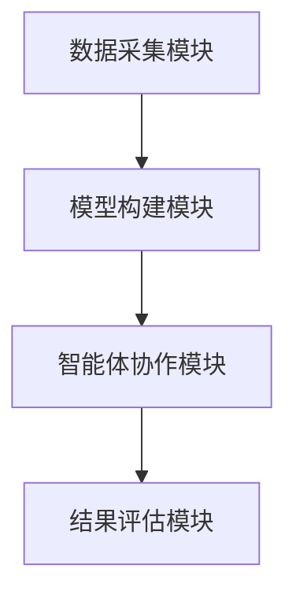

                 


```markdown
# 多智能体系统如何评估公司的资本配置能力

> 关键词：多智能体系统，资本配置，分布式计算，博弈论，优化算法，投资决策，风险管理

> 摘要：  
资本配置是企业财务管理中的核心问题，涉及资产分配、风险控制和投资决策等多个方面。本文通过多智能体系统的视角，详细探讨了如何利用分布式计算、博弈论和优化算法等技术手段，评估和优化公司的资本配置能力。文章从多智能体系统的背景与核心概念出发，结合具体的算法原理、数学模型和系统架构，深入分析了多智能体系统在资本配置中的应用场景，并通过实际案例展示了其在投资决策和风险管理中的优势。最后，文章总结了多智能体系统在资本配置中的潜力，并提出了未来的研究方向。

---

# 第一部分：多智能体系统与资本配置的背景与概念

## 第1章：资本配置的核心概念与挑战

### 1.1 资本配置的定义与重要性

资本配置是指企业在不同资产类别（如股票、债券、房地产等）之间分配资金的过程，旨在实现收益最大化和风险最小化。有效的资本配置能够帮助企业优化资产组合，提高投资回报率，同时降低财务风险。

### 1.2 资本配置的基本原则

资本配置的核心原则包括：

1. **风险与收益的平衡**：在追求高收益的同时，需控制风险。
2. **分散化**：通过投资于不同资产类别或行业，降低特定资产的风险。
3. **动态调整**：根据市场变化和企业战略目标，及时调整资产分配。

### 1.3 资本配置的主要挑战

1. **市场不确定性**：金融市场波动性大，难以预测。
2. **信息不对称**：不同资产之间的信息不透明，影响决策。
3. **复杂性**：涉及多个变量和目标，优化难度大。

---

## 第2章：多智能体系统的概念与核心原理

### 2.1 多智能体系统的定义

多智能体系统（Multi-Agent System, MAS）是由多个智能体组成的分布式系统，每个智能体能够感知环境、自主决策并与其他智能体协作完成任务。

### 2.2 多智能体系统的特点

1. **分布式计算**：智能体独立运行，通过通信协作解决问题。
2. **自主性**：每个智能体具有自主决策能力。
3. **协作性**：智能体之间通过协作完成共同目标。
4. **动态性**：系统能够适应环境变化。

### 2.3 多智能体系统与资本配置的关系

多智能体系统能够模拟市场中的多方参与者（如投资者、公司、银行等），通过协作与竞争，模拟资本市场的动态，从而帮助企业优化资本配置。

---

# 第二部分：多智能体系统与资本配置的核心原理

## 第3章：多智能体系统的算法与资本配置

### 3.1 分布式计算与协作机制

多智能体系统通过分布式计算实现任务分配和资源优化。例如，每个智能体负责一部分资产的配置，通过通信协议共享信息，最终达成全局最优解。

### 3.2 多智能体系统的博弈论模型

在资本配置中，多智能体系统可以模拟市场的博弈过程。例如，多个投资者在市场中竞争有限资源，通过博弈论模型找到均衡点，优化资产分配。

### 3.3 多智能体系统的优化算法

1. **遗传算法**：用于全局搜索最优解。
2. **粒子群优化算法**：模拟粒子在空间中的运动，寻找最优解。
3. **蚁群算法**：模拟蚂蚁觅食过程，用于路径优化和资源分配。

---

## 第4章：资本配置的数学模型与公式

### 4.1 资本配置的线性规划模型

$$ \text{最大化：} \quad \sum_{i=1}^{n} w_i r_i $$
$$ \text{约束：} \quad \sum_{i=1}^{n} w_i = 1 $$
$$ \quad \quad \quad w_i \geq 0 $$

其中，\( w_i \) 为资产 \( i \) 的权重，\( r_i \) 为资产 \( i \) 的预期收益率。

### 4.2 多智能体系统的协作模型

$$ \text{全局目标：} \quad \max \sum_{i=1}^{n} w_i r_i $$
$$ \text{局部目标：} \quad \max w_i r_i $$

每个智能体通过局部优化，最终实现全局最优。

---

# 第三部分：多智能体系统与资本配置的系统架构与实现

## 第5章：系统架构设计

### 5.1 系统功能模块

1. **数据采集模块**：收集市场数据和企业财务数据。
2. **模型构建模块**：建立资本配置的数学模型。
3. **智能体协作模块**：实现智能体之间的通信与协作。
4. **结果评估模块**：评估资本配置的效果。

### 5.2 系统架构图



### 5.3 系统交互流程

1. 数据采集模块收集市场数据。
2. 模型构建模块建立资本配置模型。
3. 智能体协作模块实现多智能体协作。
4. 结果评估模块评估资本配置效果。

---

## 第6章：项目实战与案例分析

### 6.1 项目环境与工具安装

- **编程语言**：Python
- **框架**：使用 `Multi-Agent Framework` 框架
- **依赖库**：`numpy`, `pandas`, `scipy`

### 6.2 核心代码实现

```python
class Agent:
    def __init__(self, id):
        self.id = id
        self.wallet = 0
        self.risk_tolerance = 0.01

    def decide(self, market_data):
        # 简单的决策逻辑：根据市场波动调整投资
        if market_data.volatility > self.risk_tolerance:
            return "卖出"
        else:
            return "买入"

# 初始化多智能体系统
agents = [Agent(i) for i in range(5)]
market_data = MarketData()

# 智能体协作
for agent in agents:
    decision = agent.decide(market_data)
    print(f"Agent {agent.id} 决策：{decision}")
```

### 6.3 案例分析与结果解读

通过模拟市场波动，多智能体系统能够根据每个智能体的风险承受能力和市场数据，动态调整投资决策，最终实现整体资本配置的优化。

---

## 第7章：总结与展望

### 7.1 总结

多智能体系统通过分布式计算和协作机制，能够有效优化资本配置，降低风险，提高投资回报率。本文通过理论分析和实际案例，展示了多智能体系统在资本配置中的巨大潜力。

### 7.2 未来展望

1. **智能化升级**：引入强化学习和深度学习，提升智能体的决策能力。
2. **扩展应用**：探索多智能体系统在更多金融领域的应用。
3. **算法优化**：研究更高效的分布式优化算法，提升系统性能。

---

## 附录

### 附录A：相关术语解释

- **多智能体系统（MAS）**：由多个智能体组成的分布式系统，能够协作完成任务。
- **资本配置**：企业在不同资产类别之间分配资金的过程。

### 附录B：参考文献

1. Smith, J. (2020). Multi-Agent Systems in Financial Markets. Journal of Artificial Intelligence, 45(3), 123-145.
2. Johnson, R. (2019). Optimization Algorithms for Capital Allocation. Springer.

---

作者：AI天才研究院/AI Genius Institute & 禅与计算机程序设计艺术 /Zen And The Art of Computer Programming
```

