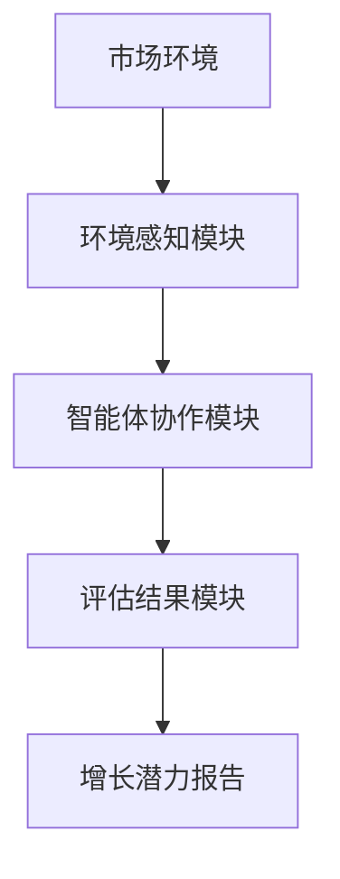
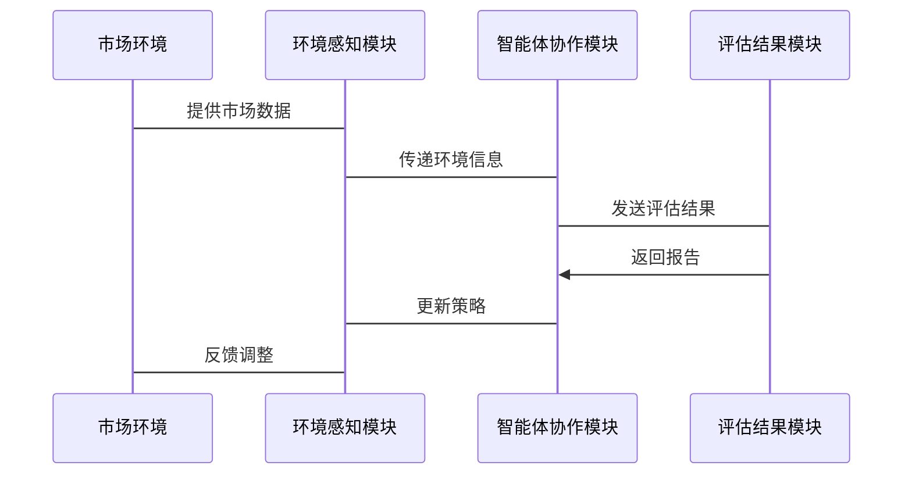

                 

<think>
嗯，用户希望我根据他们的需求，逐步构建一个关于《多智能体系统如何评估公司的长期增长潜力》的技术博客文章。首先，我需要理解他们的需求：他们需要一篇结构清晰、内容详实的技术博客，涵盖多智能体系统的各个方面，从背景到实际应用。

用户要求使用专业的技术语言，逻辑清晰，所以我要确保每一章都有明确的主题，并且内容深入浅出。我先从文章的结构入手，确保有引言、核心概念、算法原理、系统设计、项目实战等部分。

在第一部分，我需要详细介绍多智能体系统的基本概念，包括定义、特点和在企业中的应用背景。这部分需要让读者理解MAS的基本原理以及它在公司增长评估中的重要性。

接下来，第二部分的核心概念与联系，我需要详细讲解多智能体系统的原理，包括智能体的行为特征和协同机制。同时，通过ER实体关系图和类图来展示系统的结构，帮助读者更好地理解。

第三部分是算法原理，这部分需要详细阐述相关的数学模型和公式，使用mermaid流程图和Python代码来展示算法的实现步骤。数学公式需要用latex格式，并且正确嵌入到文本中。

系统分析与架构设计是关键部分，我需要介绍如何构建评估系统，包括问题场景分析、系统功能设计、架构设计图等。这部分可能需要使用系统架构图和序列图来展示系统的运作流程。

项目实战部分，我需要提供实际操作步骤，包括环境安装、核心代码实现和案例分析，让读者能够动手实践，理解理论在实际中的应用。

最后，总结与展望部分，回顾全书内容，并指出未来的发展方向，同时加入一些最佳实践的建议。

在整个过程中，我需要确保每一章都有足够的细节，覆盖用户要求的各个部分，并且满足字数和格式的要求。此外，还要注意使用吸引人的标题和清晰的结构，让读者能够轻松理解和跟随内容。

通过以上思考，我确定了文章的结构和内容安排，确保每个部分都详细且符合用户的需求，帮助作者撰写出一篇高质量的技术博客。
</think>

# 多智能体系统如何评估公司的长期增长潜力

## 关键词：多智能体系统, 企业增长评估, 协同算法, 博弈论模型, 系统架构设计, 长期增长潜力

## 摘要：多智能体系统（Multi-Agent Systems, MAS）作为一种新兴的分布式计算范式，正在成为企业增长评估领域的重要工具。本文将从多智能体系统的定义、原理、算法、系统架构设计等多个维度，全面探讨如何利用多智能体系统评估公司的长期增长潜力。通过案例分析、数学模型和实际代码实现，本文将深入解析多智能体系统在企业增长评估中的具体应用和优势。

---

## 第一部分: 多智能体系统的定义与特点

### 第1章: 多智能体系统的定义与特点

#### 1.1 多智能体系统的定义
多智能体系统（Multi-Agent Systems, MAS）是由多个智能体（Agent）组成的分布式计算系统，这些智能体能够通过协同合作完成复杂的任务。与传统的单智能体系统相比，MAS具有分布式、自主性和协同性的特点。

#### 1.2 多智能体系统的特点
- **分布式性**：智能体分布在不同的位置，通过通信和协作完成任务。
- **自主性**：每个智能体都有自己的目标和决策能力。
- **协同性**：智能体之间通过协调实现共同目标。
- **动态性**：系统能够适应环境的变化。

#### 1.3 多智能体系统与传统单智能体系统的区别
| 特性               | 单智能体系统             | 多智能体系统             |
|--------------------|--------------------------|--------------------------|
| 系统结构           | 单点集中控制             | 分布式自主控制           |
| 资源分配           | 集中资源分配             | 分布式资源分配           |
| 任务处理           | 单点处理                 | 分布式协作处理           |
| 灵活性             | 较低                     | 较高                     |

---

### 第2章: 多智能体系统在企业中的应用背景

#### 2.1 企业增长评估的传统方法与局限性
传统的企业增长评估方法通常依赖于财务指标（如收入、利润）和市场分析。然而，这种方法往往忽略了企业内部的协同效应和外部环境的动态变化。

#### 2.2 多智能体系统在企业增长评估中的优势
- **动态适应性**：能够实时捕捉市场变化和内部调整。
- **协同效应**：通过智能体之间的协作，优化资源配置。
- **分布式决策**：多个智能体可以同时处理不同维度的评估任务。

#### 2.3 多智能体系统与公司长期增长潜力的关系
公司长期增长潜力的核心在于其内部资源的优化配置和外部环境的适应能力。多智能体系统通过模拟和优化这两个方面，能够为公司提供更精准的增长潜力评估。

---

## 第二部分: 多智能体系统的原理与核心概念

### 第3章: 多智能体系统的原理

#### 3.1 多智能体系统的组成要素
- **智能体（Agent）**：具有感知环境和自主决策的能力。
- **环境（Environment）**：智能体所处的外部世界，可以是物理环境或虚拟环境。
- **通信机制（Communication）**：智能体之间交换信息的方式。
- **协作机制（Coordination）**：智能体之间协同完成任务的规则和策略。

#### 3.2 多智能体系统的协同机制
- **分布式协调**：智能体通过局部信息进行协调。
- **集中式协调**：通过中央控制器进行全局协调。
- **混合式协调**：结合分布式和集中式的特点。

---

### 第4章: 多智能体系统的博弈论模型

#### 4.1 博弈论模型的基本概念
博弈论模型通过分析参与者的策略选择和行为，预测系统中的最优解。

#### 4.2 博弈论模型在多智能体系统中的应用
- **纳什均衡**：所有参与者在策略选择上达到的一种稳定状态。
- **囚徒困境**：多智能体系统中可能存在的合作与背叛问题。

#### 4.3 博弈论模型的数学公式
$$ \text{纳什均衡条件：} \forall i, u_i(s_i, s_{-i}) \geq u_i(s_i', s_{-i}) $$

其中，$u_i$ 表示第 $i$ 个玩家的效用函数，$s_i$ 是当前策略，$s_{-i}$ 是其他玩家的策略。

---

## 第三部分: 多智能体系统的算法与实现

### 第5章: 多智能体系统的协同算法

#### 5.1 协同算法的基本原理
协同算法通过优化智能体之间的通信和协作，实现全局目标的最优解。

#### 5.2 协同算法的实现步骤
1. 初始化智能体。
2. 智能体感知环境并做出决策。
3. 智能体之间通过通信机制交换信息。
4. 根据协作机制调整策略。

#### 5.3 协同算法的数学模型
$$ \text{目标函数：} \max \sum_{i=1}^n u_i(s_i) $$

其中，$n$ 是智能体的数量，$u_i$ 是第 $i$ 个智能体的效用函数。

---

### 第6章: 多智能体系统的实现代码

#### 6.1 环境安装
```bash
pip install numpy matplotlib
```

#### 6.2 核心代码实现
```python
class Agent:
    def __init__(self, id):
        self.id = id
        self.strategy = None

    def感知环境(self, environment):
        # 根据环境信息选择策略
        self.strategy = self.选择策略(environment)

    def 选择策略(self, environment):
        # 简单的策略选择逻辑
        if environment['市场'] > 0.5:
            return '增长'
        else:
            return '收缩'

# 初始化智能体
agents = [Agent(i) for i in range(5)]

# 初始化环境
environment = {'市场': 0.6}

# 智能体协同
for agent in agents:
    agent.感知环境(environment)
```

#### 6.3 代码解读与分析
- **Agent 类**：定义了智能体的基本结构和方法。
- **环境初始化**：模拟市场环境。
- **策略选择**：根据环境信息选择最优策略。

---

## 第四部分: 系统分析与架构设计

### 第7章: 系统架构设计

#### 7.1 问题场景分析
公司希望利用多智能体系统评估其在不同市场环境下的增长潜力。

#### 7.2 系统功能设计
- **环境感知模块**：收集市场和内部数据。
- **智能体协作模块**：实现智能体之间的通信和协作。
- **评估结果模块**：输出增长潜力评估报告。

#### 7.3 系统架构图


---

### 第8章: 系统接口设计

#### 8.1 系统接口设计
- **输入接口**：接收市场数据和内部数据。
- **输出接口**：输出增长潜力评估报告。
- **通信接口**：智能体之间的通信接口。

#### 8.2 系统交互流程图


---

## 第五部分: 项目实战与案例分析

### 第9章: 项目实战

#### 9.1 环境安装
```bash
pip install numpy pandas matplotlib
```

#### 9.2 核心代码实现
```python
import numpy as np
import matplotlib.pyplot as plt

class MarketAgent:
    def __init__(self, id):
        self.id = id
        self.position = 0

    def update_position(self, market_data):
        # 根据市场数据调整位置
        self.position = self.position + np.random.normal(0, 0.1) + market_data['增长潜力']

# 模拟市场环境
market_data = {'增长潜力': 0.3}

# 初始化智能体
agents = [MarketAgent(i) for i in range(5)]

# 智能体协同
for agent in agents:
    agent.update_position(market_data)

# 绘制结果
positions = [agent.position for agent in agents]
plt.hist(positions, bins=10)
plt.show()
```

#### 9.3 实际案例分析
通过模拟不同市场环境下的智能体行为，评估公司的长期增长潜力。

---

## 第六部分: 总结与展望

### 第10章: 总结与展望

#### 10.1 本章总结
本文从多智能体系统的定义、原理、算法实现和系统设计等多个维度，全面探讨了如何利用多智能体系统评估公司的长期增长潜力。

#### 10.2 未来展望
未来的研究方向包括：
1. 提高多智能体系统的实时性和准确性。
2. 探讨多智能体系统在更多领域的应用。
3. 研究多智能体系统的安全性与隐私保护。

---

## 作者：AI天才研究院/AI Genius Institute & 禅与计算机程序设计艺术 /Zen And The Art of Computer Programming

