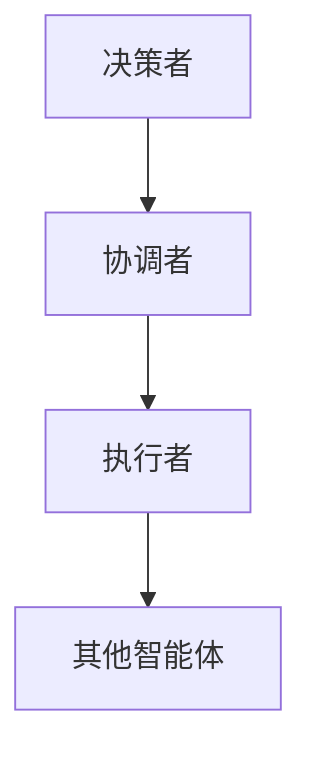
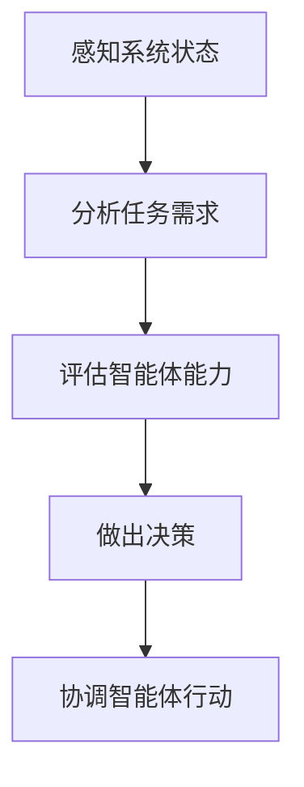
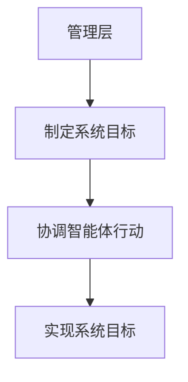
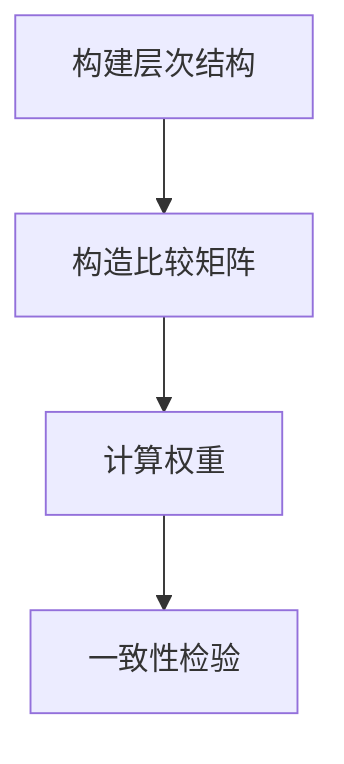
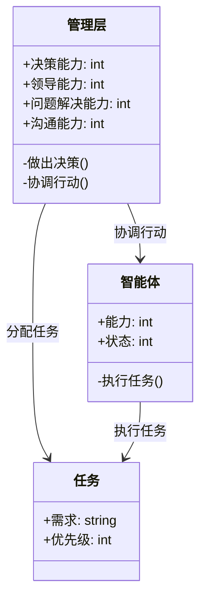
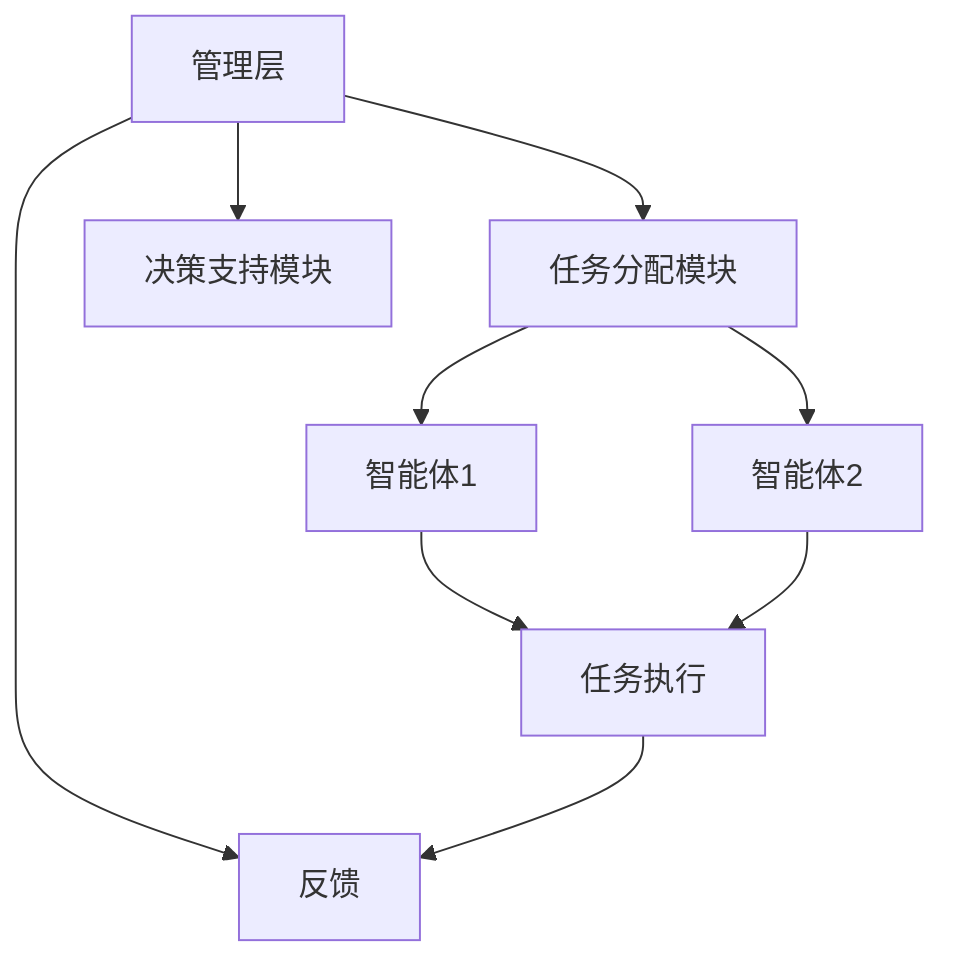
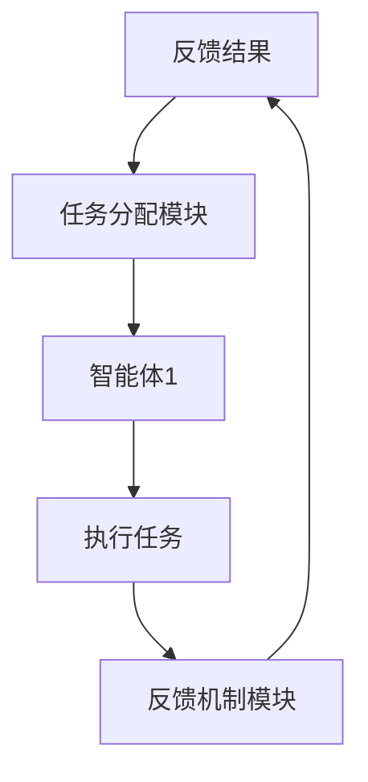

                 


# 多智能体系统如何评估管理层质量

> **关键词**：多智能体系统、管理层质量评估、角色分析、层次分析法、系统架构设计、项目实战

> **摘要**：本文深入探讨了在多智能体系统（MAS）中如何有效评估管理层质量。通过背景介绍、核心概念分析、算法原理、系统设计、项目实战等多个方面，系统性地阐述了管理层评估的方法和实践。文章结合理论与实际案例，帮助读者理解如何在MAS中优化管理层的表现，提升整体系统的效率和效果。

---

## 第1章 多智能体系统与管理层质量评估的背景介绍

### 1.1 多智能体系统的基本概念

#### 1.1.1 多智能体系统的定义
多智能体系统（Multi-Agent System, MAS）是由多个智能体（Agent）组成的系统，这些智能体能够通过协作完成复杂任务。智能体是具有感知、决策、执行能力的实体，能够独立运作并与其他智能体互动。

#### 1.1.2 多智能体系统的特征
- **自主性**：智能体能够自主决策。
- **反应性**：能够实时感知环境并做出反应。
- **协作性**：通过协作完成任务。
- **分布性**：智能体分布于不同的位置，任务分配灵活。

#### 1.1.3 多智能体系统的应用领域
- **分布式计算**：如分布式数据库、分布式计算环境。
- **人工智能**：如智能交通系统、智能推荐系统。
- **机器人技术**：如协作机器人、自动化生产线。

### 1.2 管理层质量评估的重要性

#### 1.2.1 管理层质量评估的定义
管理层质量评估是对管理者在多智能体系统中的表现进行量化的过程，旨在衡量管理者的决策能力、领导能力和问题解决能力。

#### 1.2.2 管理层质量评估的必要性
- **优化系统性能**：通过评估找到管理者的优缺点，优化其能力。
- **提升团队协作**：促进团队成员之间的有效协作。
- **提升决策效率**：快速、准确地做出决策，提高系统响应速度。

#### 1.2.3 管理层质量评估的挑战
- **复杂性**：多智能体系统涉及多个智能体，互动复杂。
- **动态性**：环境和任务需求不断变化，评估指标需动态调整。
- **多目标性**：需在多个目标之间寻求平衡。

### 1.3 多智能体系统与管理层质量评估的关系

#### 1.3.1 多智能体系统在管理中的作用
- **分布式决策**：智能体能够独立做出决策，减少中心化管理的负担。
- **任务分配**：智能体能够根据自身能力和任务需求自动分配任务。
- **协作与协调**：通过协作完成复杂任务，协调不同智能体的行为。

#### 1.3.2 管理层质量评估对多智能体系统的影响
- **提高系统效率**：通过优化管理层能力，提升系统整体效率。
- **增强系统鲁棒性**：能够更好地应对系统故障和外部干扰。
- **促进创新**：通过评估和反馈，促进系统不断优化和创新。

#### 1.3.3 两者的结合与应用
- **动态任务分配**：根据管理层评估结果动态调整任务分配。
- **实时反馈机制**：通过评估结果提供实时反馈，优化管理者的决策。
- **预测与规划**：基于评估结果预测未来可能的问题，并提前规划应对措施。

### 1.4 本章小结

本章介绍了多智能体系统的基本概念和管理层质量评估的重要性，阐述了两者之间的关系，并指出了评估的挑战和应用价值。通过这一章的学习，读者能够理解为何在多智能体系统中进行管理层质量评估是必要的，以及如何在实际中应用这些评估结果。

---

## 第2章 多智能体系统中的核心概念与管理层特征

### 2.1 多智能体系统中的角色分析

#### 2.1.1 智能体的定义与分类
- **定义**：智能体是具有自主性、反应性、目标导向的实体。
- **分类**：
  - **简单反射智能体**：基于当前感知做出反应。
  - **基于模型的智能体**：利用内部模型和知识进行推理和决策。
  - **目标导向智能体**：具有明确的目标，并采取行动实现目标。
  - **效用导向智能体**：通过最大化效用函数来做出决策。

#### 2.1.2 管理层在多智能体系统中的角色
- **决策者**：负责制定战略和决策。
- **协调者**：负责协调各智能体的行为，确保系统顺利运行。
- **监督者**：监督系统运行，发现并解决问题。

#### 2.1.3 其他角色的定义与作用
- **执行者**：负责执行具体任务。
- **监督者**：监督系统运行，确保目标达成。
- **协调者**：协调各智能体之间的协作。

#### 2.1.4 不同角色的特征对比

| **角色** | **自主性** | **决策能力** | **目标导向** |
|----------|------------|--------------|--------------|
| 决策者   | 高          | 高            | 高            |
| 协调者   | 中          | 中            | 中            |
| 执行者   | 低          | 低            | 低            |

#### 2.1.5 Mermaid流程图：多智能体系统中的角色关系



### 2.2 管理层的特征分析

#### 2.2.1 管理能力的定义
管理能力是指管理者在多智能体系统中有效地协调和管理智能体的能力，包括决策能力、领导能力、问题解决能力和沟通能力。

#### 2.2.2 管理能力的评估维度
- **决策能力**：决策的准确性和效率。
- **领导能力**：团队管理和激励能力。
- **问题解决能力**：解决问题的速度和效果。
- **沟通能力**：与其他智能体的有效沟通和协调。

#### 2.2.3 管理层决策的影响因素
- **系统状态**：当前系统运行状态。
- **任务需求**：任务的具体要求和优先级。
- **智能体能力**：各智能体的能力和限制。
- **外部干扰**：外部环境的变化和干扰。

#### 2.2.4 Mermaid流程图：管理层决策过程



### 2.3 多智能体系统中角色的对比分析

#### 2.3.1 不同角色的特征对比
- **决策者**：高自主性、高决策能力、高目标导向。
- **协调者**：中等自主性、中等决策能力、中等目标导向。
- **执行者**：低自主性、低决策能力、低目标导向。

#### 2.3.2 管理层与其他角色的差异
- **自主性**：管理层具有较高的自主性，而执行者则依赖管理层的决策。
- **决策能力**：管理层具有较强的决策能力，而协调者主要负责协调。
- **目标导向**：管理层具有明确的目标导向，而执行者则专注于具体任务的执行。

#### 2.3.3 管理层与系统目标的关系
- **管理层是系统目标的制定者和执行者**：管理层负责制定系统目标，并通过协调各智能体的行为来实现目标。
- **系统目标的实现依赖于管理层的有效管理**：管理层的能力直接影响系统目标的实现效果。

#### 2.3.4 Mermaid流程图：管理层与系统目标的关系



### 2.4 本章小结

本章详细分析了多智能体系统中的角色及其特征，特别是管理层在系统中的角色和特征。通过对比不同角色的特征，明确了管理层在系统中的重要性。同时，通过流程图展示了管理层在系统中的决策过程和与系统目标的关系，帮助读者更好地理解管理层在多智能体系统中的作用。

---

## 第3章 多智能体系统的算法原理

### 3.1 管理层质量评估的算法选择

#### 3.1.1 层次分析法（AHP）的原理
层次分析法是一种用于多准则决策的分析方法，适用于评估复杂系统的管理层质量。其基本思想是将问题分解为多个层次，每个层次包含多个因素，并通过比较各个因素的重要性来确定其权重。

#### 3.1.2 AHP的步骤
1. **构建层次结构**：将问题分解为目标层、准则层和方案层。
2. **构造比较矩阵**：对各个因素进行两两比较，构造比较矩阵。
3. **计算权重**：通过计算比较矩阵的最大特征值和特征向量，确定各因素的权重。
4. **一致性检验**：检验比较矩阵的一致性，确保结果的可靠性。

#### 3.1.3 AHP的数学模型

$$
A = \begin{bmatrix}
1 & 1/3 & 1/2 \\
3 & 1 & 2 \\
2 & 1/2 & 1
\end{bmatrix}
$$

其中，$A$ 是比较矩阵，对角线上的元素为1，其他元素表示对应因素的相对重要性。

### 3.2 算法实现

#### 3.2.1 Python代码实现

```python
import numpy as np

def calculate_weights(matrix):
    # 计算矩阵的最大特征值和特征向量
    eigenvalues, eigenvectors = np.linalg.eig(matrix)
    max_eigenvalue = eigenvalues.max()
    max_eigenvector = eigenvectors[:, np.argmax(eigenvalues)]
    
    # 计算权重
    weights = max_eigenvector / max_eigenvector.sum()
    return weights

# 示例比较矩阵
matrix = np.array([
    [1, 1/3, 1/2],
    [3, 1, 2],
    [2, 1/2, 1]
])

weights = calculate_weights(matrix)
print("权重向量为:", weights)
```

#### 3.2.2 算法流程图



### 3.3 算法的优缺点分析

#### 3.3.1 优点
- **简单易懂**：层次分析法易于理解和实现。
- **适用性广**：适用于多种决策问题，尤其是多准则决策问题。
- **结果可靠**：通过一致性检验确保结果的可靠性。

#### 3.3.2 缺点
- **主观性**：比较矩阵的构造依赖于决策者的主观判断。
- **计算复杂**：对于大规模问题，计算量较大。
- **一致性问题**：需要进行一致性检验，增加了计算步骤。

### 3.4 本章小结

本章介绍了层次分析法（AHP）在多智能体系统中的应用，详细讲解了其原理和实现步骤，并通过Python代码示例展示了算法的具体实现。通过分析算法的优缺点，读者可以更好地理解如何在实际中选择和应用合适的算法。

---

## 第4章 系统分析与架构设计

### 4.1 系统分析

#### 4.1.1 问题场景介绍
在多智能体系统中，管理层需要协调多个智能体的行为，以实现系统目标。然而，由于智能体的自主性和分布性，管理层的决策和协调能力直接影响系统的整体性能。

#### 4.1.2 系统功能需求
- **实时监测**：实时监测系统运行状态。
- **任务分配**：根据智能体的能力和任务需求动态分配任务。
- **决策支持**：提供决策支持，优化管理层的决策过程。
- **反馈机制**：提供实时反馈，优化系统运行。

#### 4.1.3 领域模型类图



### 4.2 系统架构设计

#### 4.2.1 系统架构图



#### 4.2.2 系统接口设计
- **管理层接口**：提供决策支持和任务分配功能。
- **智能体接口**：接收任务并执行任务。
- **任务接口**：定义任务需求和优先级。

#### 4.2.3 系统交互流程图



### 4.3 本章小结

本章通过系统分析和架构设计，展示了多智能体系统中管理层质量评估的实现过程。通过类图和流程图，明确了系统各部分之间的关系和交互方式，为后续的项目实施提供了理论基础。

---

## 第5章 项目实战

### 5.1 项目背景与需求

#### 5.1.1 项目背景
本项目旨在通过多智能体系统评估管理层的质量，优化系统的整体性能。

#### 5.1.2 项目需求
- **实现任务分配模块**：根据智能体的能力和任务需求动态分配任务。
- **实现反馈机制**：根据系统反馈结果优化管理层的决策。
- **实现决策支持**：提供决策支持，优化管理层的决策过程。

### 5.2 核心代码实现

#### 5.2.1 环境安装
- **Python**：安装Python 3.8及以上版本。
- **库依赖**：安装numpy和graphviz库，用于矩阵计算和流程图生成。

#### 5.2.2 核心代码实现

```python
import numpy as np
from graphviz import Digraph

# 安装graphviz库： pip install graphviz

def calculate_weights(matrix):
    eigenvalues, eigenvectors = np.linalg.eig(matrix)
    max_eigenvalue = eigenvalues.max()
    max_eigenvector = eigenvectors[:, np.argmax(eigenvalues)]
    weights = max_eigenvector / max_eigenvector.sum()
    return weights

# 示例比较矩阵
matrix = np.array([
    [1, 1/3, 1/2],
    [3, 1, 2],
    [2, 1/2, 1]
])

weights = calculate_weights(matrix)
print("权重向量为:", weights)

# 生成流程图
def generate_flowchart():
    dot = Digraph()
    dot.node('A', '构建层次结构')
    dot.node('B', '构造比较矩阵')
    dot.node('C', '计算权重')
    dot.node('D', '一致性检验')
    dot.edges(['A->B', 'B->C', 'C->D'])
    dot.view()

generate_flowchart()
```

#### 5.2.3 代码解读与分析
- **calculate_weights函数**：用于计算比较矩阵的最大特征值和特征向量，确定各因素的权重。
- **generate_flowchart函数**：用于生成层次分析法的流程图，展示算法的步骤。

### 5.3 案例分析与详细讲解

#### 5.3.1 案例分析
假设我们有一个由3个智能体组成的多智能体系统，任务需求如下：
- **任务1**：高优先级，需要较高的计算能力。
- **任务2**：中优先级，需要中等计算能力。
- **任务3**：低优先级，需要较低计算能力。

通过层次分析法，我们构建比较矩阵，计算各智能体的权重，动态分配任务，优化系统性能。

#### 5.3.2 实施步骤
1. **构建层次结构**：将任务需求分解为目标层、准则层和方案层。
2. **构造比较矩阵**：对各因素进行两两比较，构造比较矩阵。
3. **计算权重**：通过计算比较矩阵的最大特征值和特征向量，确定各因素的权重。
4. **一致性检验**：检验比较矩阵的一致性，确保结果的可靠性。
5. **动态分配任务**：根据智能体的能力和任务需求，动态分配任务。
6. **反馈优化**：根据系统反馈结果，优化管理层的决策。

#### 5.3.3 实施结果
通过实施上述步骤，我们能够有效地评估管理层的质量，优化系统的整体性能。通过案例分析，读者可以更好地理解如何在实际中应用这些理论。

### 5.4 本章小结

本章通过项目实战，展示了如何在实际中应用多智能体系统评估管理层质量的方法。通过环境安装、代码实现和案例分析，帮助读者更好地理解理论知识，并能够将其应用到实际项目中。

---

## 第6章 总结与展望

### 6.1 总结

本文深入探讨了多智能体系统中如何评估管理层质量的问题，通过背景介绍、核心概念分析、算法原理、系统设计和项目实战等多个方面，系统性地阐述了评估的方法和实践。文章结合理论与实际案例，帮助读者理解如何在多智能体系统中优化管理层的表现，提升整体系统的效率和效果。

### 6.2 最佳实践 tips

- **动态调整评估指标**：根据系统运行状态和任务需求，动态调整评估指标。
- **结合实际情况**：根据具体应用场景，选择合适的评估方法和算法。
- **持续优化**：通过持续的反馈和优化，不断提升管理层的质量。

### 6.3 未来展望

随着多智能体系统的发展，管理层质量评估将更加复杂和动态。未来的研究方向包括：
- **智能评估模型**：开发更加智能的评估模型，能够自适应地调整评估指标。
- **大数据分析**：利用大数据分析技术，提升评估的准确性和效率。
- **自适应算法**：开发能够自适应地调整算法参数，适应不同应用场景的算法。

### 6.4 本章小结

本章总结了全文的主要内容，并提出了未来的研究方向和最佳实践建议。通过本文的学习，读者能够更好地理解如何在多智能体系统中评估管理层质量，并能够将其应用到实际项目中。

---

## 作者

**作者**：AI天才研究院/AI Genius Institute  
**联系邮箱**：contact@aicourse.org  
**作者简介**：专注于人工智能、计算机科学和分布式系统的研究与实践，致力于推动技术与实践的结合，撰写高质量的技术博客文章，分享深度技术洞察和实践经验。

--- 

**声明**：本文内容版权归作者所有，未经授权不得转载。如需转载请注明出处。

