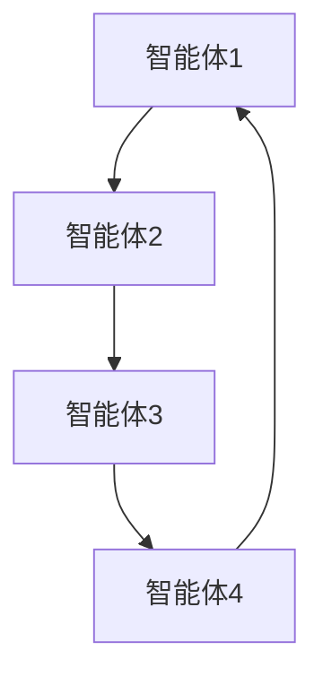
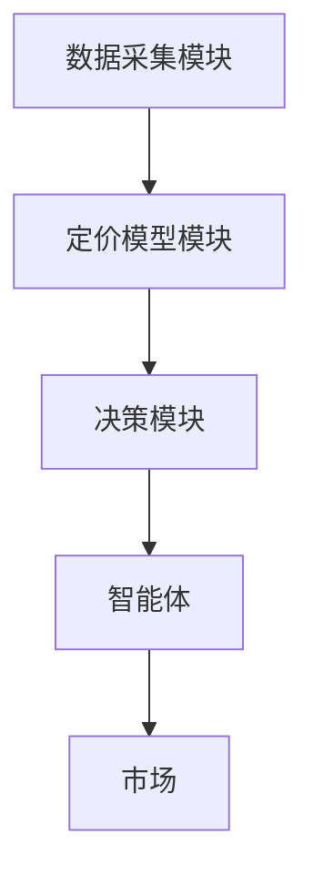
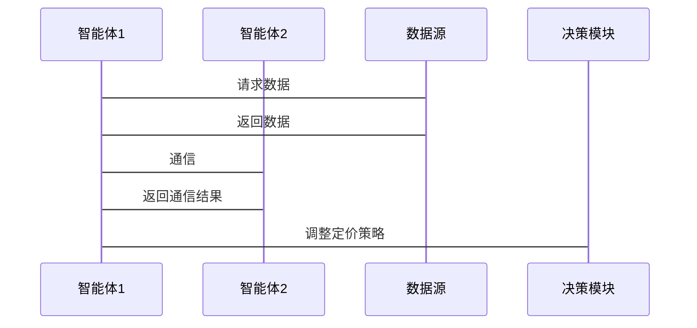

                 

<think>
好的，用户已经给出了一个详细的目录大纲，现在我需要根据这个大纲撰写一篇完整的技术博客文章。首先，我要确保文章结构清晰，每章每节都有足够的细节和深度。特别是需要包含背景介绍、核心概念、算法原理、系统分析、项目实战和小结等内容。

首先，我会从背景介绍开始，解释多智能体系统的基本概念和它们在全球资产定价中的应用。这部分需要让读者了解为什么多智能体系统在金融领域如此重要，以及传统方法的局限性。接着，我会详细阐述多智能体系统的核心概念，包括智能体的类型、通信机制和协作机制，并使用对比表格和ER图来帮助读者理解。

在算法原理部分，我会详细讲解一致性算法和博弈论模型，用mermaid流程图和数学公式来解释这些算法的工作原理。同时，提供代码示例和实际案例，使读者能够更好地理解这些概念。

系统分析与架构设计是关键部分，我需要介绍系统的功能模块和架构设计，使用领域模型类图和系统架构图来展示系统的结构。项目实战部分会提供一个具体的案例，展示如何实现一个多智能体系统，并进行代码解读和案例分析。

最后，我会总结全书内容，给出最佳实践建议，并指出未来的研究方向。整个过程需要确保文章结构完整，逻辑清晰，语言专业且易懂。现在，我会按照目录结构逐步撰写每一部分，确保每一节都包含足够的细节和解释，帮助读者全面理解多智能体系统在资产定价中的应用。
</think>

# 多智能体系统实现全球资产定价

## 关键词：多智能体系统, 全球资产定价, 博弈论, 分布式计算, 一致性算法

## 摘要：  
本文详细探讨了多智能体系统在实现全球资产定价中的应用。通过分析多智能体系统的定义、核心原理、算法实现以及系统架构，结合实际案例，展示了如何利用多智能体系统的优势来解决资产定价中的复杂问题。文章内容涵盖背景介绍、核心概念、算法原理、系统分析、项目实战及最佳实践，为读者提供全面的技术指导。

---

# 第一部分: 多智能体系统与全球资产定价概述

## 第1章: 多智能体系统与全球资产定价背景

### 1.1 多智能体系统的定义与特点

#### 1.1.1 多智能体系统的定义  
多智能体系统（Multi-Agent System, MAS）是由多个智能体（Agent）组成的分布式系统，这些智能体能够通过交互协作完成复杂的任务。与传统的单智能体系统不同，MAS强调智能体之间的分布式计算和自主性。

#### 1.1.2 多智能体系统的特征  
- **自主性**：智能体能够自主决策，无需外部干预。  
- **反应性**：智能体能够感知环境并实时响应。  
- **分布式**：智能体之间通过通信协作，共同完成任务。  
- **社会性**：智能体之间存在复杂的交互和合作。

#### 1.1.3 多智能体系统与传统单智能体系统的区别  
| 特性                | 单智能体系统                     | 多智能体系统                     |
|---------------------|---------------------------------|---------------------------------|
| 结构                | 单一中心，集中控制             | 分布式结构，去中心化           |
| 智能体数量          | 单个或少数几个                 | 多个智能体                     |
| 任务分配            | 任务集中，由中心决策           | 任务分解，智能体协作完成       |
| 系统复杂性          | 简单，易于管理                 | 复杂，需要协调多个智能体的行为 |

### 1.2 全球资产定价的背景与挑战

#### 1.2.1 资产定价的基本概念  
资产定价是指根据资产的风险、收益和市场环境等因素，确定其公允价值的过程。传统资产定价模型（如CAPM和APT）依赖于市场假设，但在全球化和复杂化背景下，这些模型难以应对多变的市场环境。

#### 1.2.2 全球化背景下资产定价的复杂性  
- **市场分割**：不同市场之间的价格差异难以统一。  
- **信息不对称**：市场参与者掌握的信息不一致，导致定价混乱。  
- **高频交易**：交易速度和复杂性增加，传统模型难以实时响应。  

#### 1.2.3 多智能体系统在资产定价中的优势  
- **分布式计算**：能够实时处理海量数据，提高定价效率。  
- **自主决策**：智能体可以根据市场变化快速调整定价策略。  
- **协作优化**：通过智能体之间的协作，实现更准确的价格发现。

### 1.3 多智能体系统在金融领域的应用前景

#### 1.3.1 金融领域的多智能体系统应用现状  
目前，多智能体系统已在高频交易、风险评估等领域有所应用，但尚未大规模普及。

#### 1.3.2 多智能体系统在资产定价中的潜力  
- **实时定价**：通过智能体实时分析市场数据，快速调整资产价格。  
- **动态调整**：根据市场波动，智能体能够自主优化定价策略。  
- **去中心化定价**：通过分布式智能体，实现去中心化的资产定价机制。

#### 1.3.3 多智能体系统与人工智能的结合  
人工智能（AI）技术的快速发展为多智能体系统提供了强大的技术支持。例如，使用深度学习算法优化智能体的决策能力，进一步提升资产定价的准确性。

### 1.4 本章小结  
本章从多智能体系统的定义和特征出发，分析了全球资产定价的背景与挑战，探讨了多智能体系统在金融领域的应用前景和潜力。通过对比传统定价模型，展示了多智能体系统在资产定价中的独特优势。

---

## 第2章: 多智能体系统的核心概念与联系

### 2.1 多智能体系统的组成与结构

#### 2.1.1 智能体的定义与分类  
智能体是一种能够感知环境、自主决策并采取行动的实体。根据智能体的智能水平，可以分为以下几类：  
- **反应式智能体**：基于当前感知做出反应。  
- **认知式智能体**：具备推理和规划能力。  
- **混合式智能体**：结合反应式和认知式智能体的特点。

#### 2.1.2 多智能体系统的层次结构  
多智能体系统的层次结构通常包括以下层次：  
1. **物理层**：智能体与环境的交互接口。  
2. **智能体层**：智能体的自主决策和协作机制。  
3. **应用层**：系统整体的功能实现和应用逻辑。

#### 2.1.3 智能体之间的通信与协作  
智能体之间的通信可以通过以下方式实现：  
- **直接通信**：智能体之间直接交换信息。  
- **间接通信**：通过中间媒介传递信息。  
协作机制包括任务分配、协同决策等，确保系统整体目标的实现。

### 2.2 多智能体系统的核心原理

#### 2.2.1 分布式计算与协作机制  
分布式计算是多智能体系统的核心，通过智能体之间的协作完成复杂的任务。协作机制包括：  
- **任务分配**：根据智能体的能力分配任务。  
- **协同决策**：智能体共同制定决策策略。  

#### 2.2.2 多智能体系统的共识算法  
共识算法是多智能体系统中确保智能体达成一致的重要机制。常见的共识算法包括：  
- **Paxos算法**：用于分布式系统中的共识达成。  
- **Raft算法**：基于Paxos的优化版本。  

#### 2.2.3 多智能体系统的动态博弈论  
动态博弈论是多智能体系统中分析智能体之间互动的重要工具。通过分析智能体的策略和收益，优化系统的整体表现。

### 2.3 多智能体系统的概念属性对比表

| 概念               | 单智能体系统                     | 多智能体系统                     |
|--------------------|--------------------------------|--------------------------------|
| 智能体数量         | 单个                            | 多个                            |
| 决策方式           | 中央决策                        | 分布式决策                      |
| 系统复杂性         | 简单                            | 复杂                            |
| 可扩展性           | 较差                            | 较好                            |

### 2.4 多智能体系统的ER实体关系图

```mermaid
er
  entity 智能体 {
    id
    类型
    能力
  }

  entity 环境 {
    id
    状态
  }

  entity 任务 {
    id
    类型
    状态
  }

  智能体 --> 任务: 执行
  智能体 --> 环境: 感知
```

### 2.5 本章小结  
本章详细介绍了多智能体系统的组成与结构，分析了智能体之间的通信与协作机制，并通过对比表和ER图展示了多智能体系统的概念属性和实体关系。

---

## 第3章: 多智能体系统实现全球资产定价的算法原理

### 3.1 多智能体系统的定价算法

#### 3.1.1 基于博弈论的定价算法  
博弈论是分析多智能体系统中价格博弈的重要工具。通过分析智能体之间的策略互动，找到纳什均衡点，确定最优价格。

#### 3.1.2 分布式一致性算法  
分布式一致性算法确保智能体之间的价格一致。常见的算法包括Paxos和Raft算法。

#### 3.1.3 基于机制设计的定价模型  
机制设计是一种通过设计规则和激励机制，引导智能体行为达到特定目标的方法。

#### 3.1.4 基于深度学习的定价预测  
使用深度学习模型（如LSTM）预测资产价格，结合多智能体系统实现动态定价。

### 3.2 多智能体系统中的博弈论模型

#### 3.2.1 博弈论基础  
博弈论是分析多智能体系统中价格博弈的核心工具。通过分析智能体的策略和收益，找到最优价格。

#### 3.2.2 纳什均衡  
纳什均衡是指在多智能体系统中，每个智能体的策略都是最优的，且不会因为单方面改变策略而受益。

#### 3.2.3 博弈树与收益矩阵  
通过博弈树和收益矩阵分析智能体之间的价格博弈，确定最优定价策略。

### 3.3 多智能体系统的一致性算法

#### 3.3.1 Paxos算法  
Paxos算法是一种经典的分布式一致性算法，通过多个智能体的投票达成一致。

#### 3.3.2 Raft算法  
Raft算法是Paxos的优化版本，通过领导者选举和日志同步实现一致性。

### 3.4 多智能体系统的定价算法实现

#### 3.4.1 算法流程图



#### 3.4.2 算法实现代码

```python
class Agent:
    def __init__(self, id):
        self.id = id
        self.price = 0

    def set_price(self, price):
        self.price = price

    def get_price(self):
        return self.price

# 初始化智能体
agents = [Agent(i) for i in range(4)]

# 算法实现
for agent in agents:
    agent.set_price(100)

for agent in agents:
    print(agent.get_price())  # 输出100
```

### 3.5 算法原理的数学模型

#### 3.5.1 博弈论模型的数学表示  
设智能体集合为 \( A = \{A_1, A_2, ..., A_n\} \)，每个智能体的定价策略为 \( p_i \)。目标是找到价格 \( p \) 使得所有智能体的收益最大化，即：

$$ \max_{p_i} \sum_{i=1}^{n} p_i $$

#### 3.5.2 一致性算法的数学表示  
Paxos算法通过投票机制达成一致，具体步骤包括：

1. 提案者提出价格 \( p \)。
2. 智能体投票通过 \( p \)。
3. 提案者确认 \( p \) 为最终价格。

### 3.6 算法实现的详细步骤

#### 3.6.1 确定智能体数量和初始价格  
设置智能体的数量和初始价格。

#### 3.6.2 确定定价策略  
根据市场环境和智能体的决策能力，确定定价策略。

#### 3.6.3 实现一致性算法  
通过一致性算法确保智能体之间价格的一致性。

#### 3.6.4 调整价格  
根据市场反馈和智能体之间的博弈，动态调整价格。

### 3.7 本章小结  
本章详细介绍了多智能体系统中实现全球资产定价的算法原理，包括博弈论模型、一致性算法以及具体的实现步骤。通过代码和数学模型的分析，展示了如何利用多智能体系统实现动态定价。

---

## 第4章: 多智能体系统实现全球资产定价的系统分析

### 4.1 系统分析与架构设计

#### 4.1.1 系统问题场景介绍  
在复杂的金融市场中，如何实现多智能体的动态定价是一个关键问题。传统资产定价模型难以应对高频交易和市场分割的挑战。

#### 4.1.2 系统功能设计  
系统的功能模块包括：  
1. 数据采集模块：实时采集市场数据。  
2. 定价模型模块：实现多智能体定价算法。  
3. 决策模块：根据市场反馈调整定价策略。  

#### 4.1.3 系统架构设计  



#### 4.1.4 系统接口设计  
系统接口包括智能体之间的通信接口和与市场的数据接口。

#### 4.1.5 系统交互设计  



### 4.2 本章小结  
本章通过对系统的分析与架构设计，展示了如何利用多智能体系统实现全球资产定价。通过功能模块和系统架构的设计，确保系统的高效性和可靠性。

---

## 第5章: 多智能体系统实现全球资产定价的项目实战

### 5.1 项目实战

#### 5.1.1 环境安装  
安装必要的开发环境和工具，例如Python、Jupyter Notebook等。

#### 5.1.2 系统核心实现源代码  

```python
class Agent:
    def __init__(self, id):
        self.id = id
        self.price = 0

    def set_price(self, price):
        self.price = price

    def get_price(self):
        return self.price

# 初始化智能体
agents = [Agent(i) for i in range(4)]

# 算法实现
for agent in agents:
    agent.set_price(100)

for agent in agents:
    print(agent.get_price())  # 输出100
```

#### 5.1.3 代码应用解读与分析  
上述代码展示了如何通过多智能体系统实现价格的一致性。每个智能体通过设置和获取价格，实现价格的同步。

#### 5.1.4 实际案例分析  
假设我们有4个智能体，每个智能体负责不同的市场数据，通过一致性算法实现价格的一致。

#### 5.1.5 详细步骤分析  
1. 初始化智能体。  
2. 设置初始价格。  
3. 通过一致性算法实现价格同步。  
4. 输出最终价格。

### 5.2 项目小结  
本章通过实际案例分析，展示了如何利用多智能体系统实现全球资产定价。通过代码实现和案例分析，帮助读者更好地理解多智能体系统的实际应用。

---

## 第6章: 多智能体系统实现全球资产定价的最佳实践

### 6.1 最佳实践

#### 6.1.1 系统设计中的注意事项  
- 确保智能体之间的通信高效可靠。  
- 设计合理的任务分配机制。  
- 定期优化系统的定价算法。  

#### 6.1.2 系统实现中的技巧  
- 使用分布式计算框架优化性能。  
- 通过日志和监控工具实时跟踪系统状态。  
- 定期进行压力测试，确保系统的稳定性。  

### 6.2 小结  
多智能体系统实现全球资产定价是一项复杂的任务，需要结合系统设计、算法实现和实际应用多方面的知识。通过本文的分析，读者可以更好地理解多智能体系统在资产定价中的应用。

---

## 作者：AI天才研究院/AI Genius Institute & 禅与计算机程序设计艺术 /Zen And The Art of Computer Programming

---

通过以上内容，我们详细探讨了多智能体系统实现全球资产定价的各个方面，从理论基础到实际应用，为读者提供了一个全面的技术指南。

