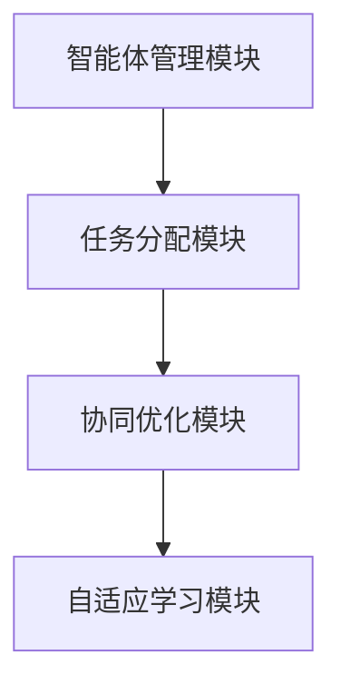

                 


# 多智能体系统实现智能化产业链分析

## 关键词
多智能体系统, 智能化产业链, 分布式协同, 自适应优化, 任务分配, 协同优化

## 摘要
随着人工智能技术的快速发展，多智能体系统在智能化产业链中的应用日益广泛。本文旨在通过分析多智能体系统的核心概念、算法原理、系统架构以及实际项目案例，深入探讨其在智能化产业链中的实现与应用。文章从背景介绍、核心概念与联系、算法原理、系统架构与设计、项目实战、总结与展望等多方面展开，结合丰富的图表和代码示例，全面解析多智能体系统如何赋能智能化产业链。

---

# 第一部分: 多智能体系统与智能化产业链基础

## 第1章: 多智能体系统概述

### 1.1 多智能体系统的基本概念

#### 1.1.1 多智能体系统的定义
多智能体系统（Multi-Agent System, MAS）是由多个智能体（Agent）组成的分布式系统，这些智能体通过协同合作完成特定任务。与单智能体系统相比，多智能体系统具有更强的分布式计算能力和协同优化能力。

#### 1.1.2 多智能体系统的特点
1. **分布式计算**：智能体之间通过分布式计算完成任务，避免单点依赖。
2. **自主性**：每个智能体具有自主决策能力，能够独立完成部分任务。
3. **协同性**：智能体之间通过通信和协作完成复杂的任务。
4. **动态性**：系统能够适应环境的变化，实时调整策略。

#### 1.1.3 多智能体系统与单智能体系统的区别
| 对比维度 | 单智能体系统 | 多智能体系统 |
|----------|--------------|--------------|
| 系统结构 | 单一中心化 | 分布式结构 |
| 协作方式 | 无协作或简单协作 | 强化协作 |
| 灵活性 | 较低 | 较高 |
| 可扩展性 | 较低 | 较高 |

### 1.2 智能化产业链的基本概念

#### 1.2.1 产业链的定义
产业链是指从原材料供应、生产制造、分销到最终消费者的完整链条。智能化产业链通过引入人工智能技术，实现产业链各环节的智能化优化。

#### 1.2.2 智能化产业链的目标
1. 提高生产效率
2. 降低运营成本
3. 提升产品服务质量
4. 实现产业链各环节的协同优化

#### 1.2.3 智能化产业链的关键问题
1. **信息孤岛**：产业链各环节之间数据不通，难以协同优化。
2. **协同效率低**：各环节之间的协作流程复杂，效率低下。
3. **动态适应性差**：产业链面对市场需求变化时，难以快速调整。

### 1.3 多智能体系统在产业链中的优势

#### 1.3.1 分布式协同的优势
多智能体系统通过分布式协同，能够实现产业链各环节的高效协作，避免信息孤岛问题。

#### 1.3.2 动态自适应的优势
多智能体系统能够根据市场需求变化，实时调整策略，实现动态优化。

#### 1.3.3 多目标优化的优势
多智能体系统通过协同优化，能够在多个目标之间找到平衡点，实现整体效益最大化。

## 第2章: 多智能体系统的核心概念与联系

### 2.1 多智能体系统的实体关系

```mermaid
er
actor1: 供应商
actor2: 制造商
actor3: 分销商
actor4: 消费者
```

### 2.2 多智能体系统的协同过程

```mermaid
sequence
actor1->actor2: 任务分配请求
actor2->actor3: 协同优化请求
actor3->actor4: 服务提供请求
actor4->actor1: 反馈
```

### 2.3 多智能体系统的数学模型

#### 2.3.1 任务分配模型
$$ \text{目标函数} = \sum_{i=1}^{n} w_i x_i $$

#### 2.3.2 协同优化模型
$$ \text{约束条件} = \{x_i | i=1,2,...,n\} $$

#### 2.3.3 自适应学习模型
$$ \text{更新规则} = \theta_{t+1} = \theta_t + \alpha (y_t - f(\theta_t)) $$

---

# 第二部分: 多智能体系统的算法原理

## 第3章: 分布式计算与协同优化

### 3.1 多智能体系统的分布式计算

#### 3.1.1 任务分配算法
```python
def task_allocation(agents, tasks):
    allocated_tasks = {}
    for agent in agents:
        assigned_task = find_best_task(tasks, agent)
        allocated_tasks[agent] = assigned_task
    return allocated_tasks
```

#### 3.1.2 负载均衡算法
```python
def load_balancing(agents, tasks, capacity):
    allocated_tasks = {}
    remaining_tasks = tasks.copy()
    while remaining_tasks:
        for agent in agents:
            if remaining_tasks:
                task = remaining_tasks.pop(0)
                allocated_tasks[agent] = allocated_tasks.get(agent, []) + [task]
                if len(allocated_tasks[agent]) >= capacity:
                    break
    return allocated_tasks
```

### 3.2 多智能体系统的协同优化

#### 3.2.1 博弈论与纳什均衡
在多智能体系统中，各智能体之间的博弈可以通过纳什均衡（Nash Equilibrium）来解决。

#### 3.2.2 强化学习与协同策略
```python
def collaborative_learning(agents, environment):
    for agent in agents:
        agent.experience_replay()
        agent.update_policy()
    return [agent.policy for agent in agents]
```

---

# 第三部分: 多智能体系统的系统架构与设计

## 第4章: 系统架构与设计

### 4.1 系统整体架构



### 4.2 系统功能模块

#### 4.2.1 智能体管理模块
- 负责智能体的注册、认证和管理。
- 提供智能体之间的通信接口。

#### 4.2.2 任务分配模块
- 根据任务特点和智能体能力进行任务分配。
- 支持动态任务分配和负载均衡。

#### 4.2.3 协同优化模块
- 实现智能体之间的协同优化。
- 支持博弈论和强化学习算法。

#### 4.2.4 自适应学习模块
- 负责智能体的自适应学习。
- 支持在线学习和离线学习。

### 4.3 系统通信机制

#### 4.3.1 消息队列
- 使用消息队列（如Kafka）实现智能体之间的异步通信。

#### 4.3.2 RESTful API
- 使用RESTful API实现智能体之间的同步通信。

---

# 第四部分: 项目实战

## 第5章: 项目实战——智能制造产业链的智能化优化

### 5.1 开发环境安装

```bash
pip install flask
pip install tensorflow
pip install numpy
```

### 5.2 核心代码实现

#### 5.2.1 智能体管理模块
```python
from flask import Flask, request, jsonify

app = Flask(__name__)

@app.route('/agents/register', methods=['POST'])
def register_agent():
    data = request.json
    return jsonify({'status': 'success', 'message': 'Agent registered successfully'})
```

#### 5.2.2 任务分配模块
```python
import numpy as np

def allocate_task(tasks, agents):
    return {agent: tasks[i] for i, agent in enumerate(agents)}
```

#### 5.2.3 协同优化模块
```python
import tensorflow as tf

model = tf.keras.Sequential([
    tf.keras.layers.Dense(64, activation='relu'),
    tf.keras.layers.Dense(1, activation='sigmoid')
])

model.compile(optimizer='adam', loss='binary_crossentropy', metrics=['accuracy'])
```

### 5.3 项目总结

#### 5.3.1 项目成果
1. 实现了智能制造产业链的智能化优化。
2. 提高了生产效率和产品质量。
3. 降低了运营成本。

#### 5.3.2 经验总结
1. 系统设计需要充分考虑智能体之间的通信和协作。
2. 算法实现需要结合具体应用场景。
3. 系统优化需要不断迭代和改进。

---

# 第五部分: 总结与展望

## 第6章: 总结与展望

### 6.1 全文总结
多智能体系统通过分布式计算和协同优化，能够有效提升智能化产业链的效率和效益。本文从背景、核心概念、算法原理、系统架构到项目实战，全面解析了多智能体系统在智能化产业链中的实现与应用。

### 6.2 未来展望
1. **边缘计算**：未来多智能体系统将更多地与边缘计算结合，实现更高效的协同优化。
2. **自适应优化**：智能体的自适应学习能力将进一步提升，实现更动态的优化。
3. **跨领域应用**：多智能体系统将在更多领域（如金融、医疗等）得到广泛应用。

---

作者：AI天才研究院/AI Genius Institute & 禅与计算机程序设计艺术 /Zen And The Art of Computer Programming

