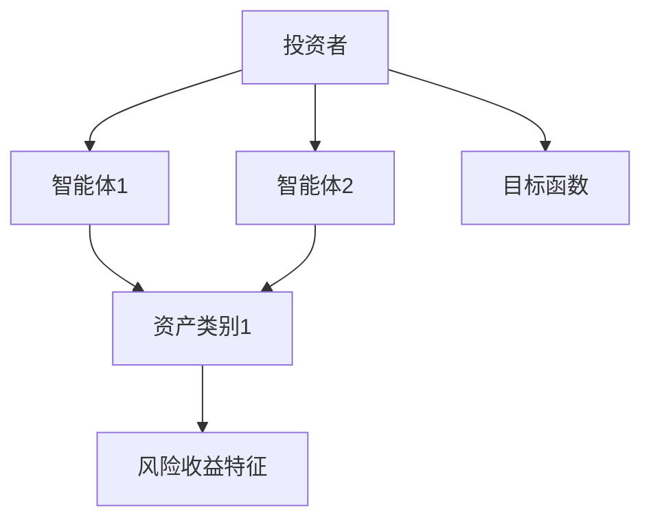
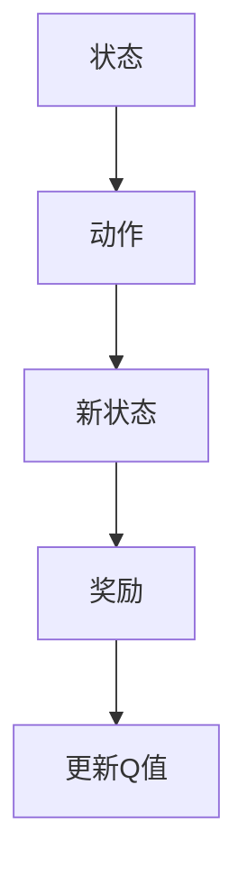
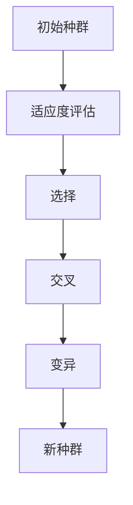
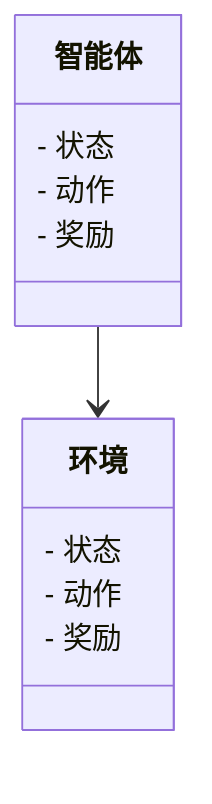
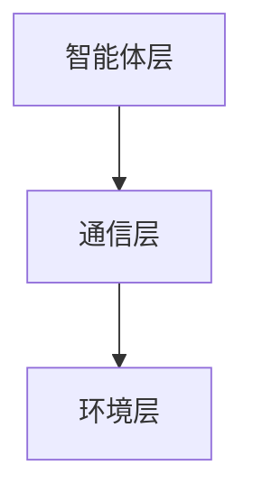
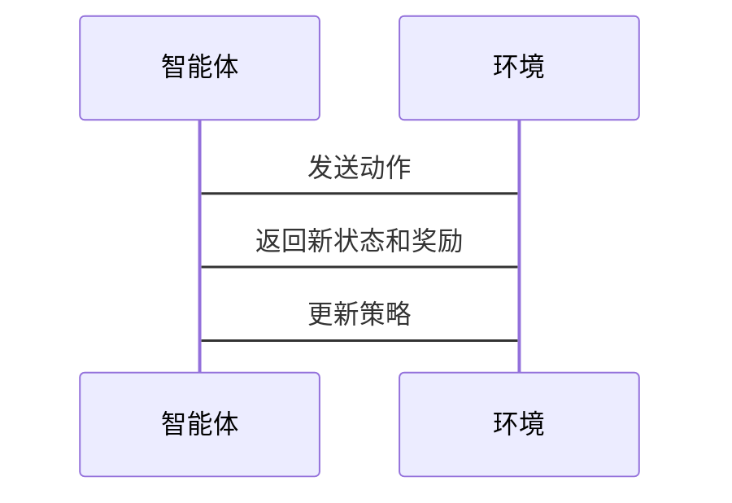

                 


# 多智能体系统实现智能化全球资产配置

> 关键词：多智能体系统，智能化资产配置，全局优化，分布式智能，机器学习，金融市场

> 摘要：本文探讨了多智能体系统在智能化全球资产配置中的应用，分析了其核心概念、算法原理、系统架构设计以及项目实战案例。通过详细的技术分析和实例解读，本文为读者提供了从理论到实践的全面指导。

---

# 第1章: 多智能体系统与智能化全球资产配置的背景介绍

## 1.1 多智能体系统的基本概念

### 1.1.1 多智能体系统的定义

多智能体系统（Multi-Agent System, 简称MAS）是由多个智能体（Agent）组成的分布式系统。这些智能体能够通过感知环境、自主决策、协作与通信，共同完成复杂任务。每个智能体都是一个具有计算能力的实体，能够独立行动并与其他智能体或环境交互。

### 1.1.2 多智能体系统的核心特征

- **分布式智能**：多个智能体协同工作，而非单一中心化控制。
- **自主性**：每个智能体能够自主决策和行动。
- **反应性**：智能体能够实时感知环境并做出反应。
- **协作性**：智能体之间通过通信和协作完成共同目标。
- **动态性**：系统能够在动态环境中灵活调整策略。

### 1.1.3 多智能体系统与传统单智能体系统的区别

| 特性 | 多智能体系统 | 单智能体系统 |
|------|--------------|--------------|
| 智能体数量 | 多个 | 单个 |
| 协作性 | 高 | 无 |
| 系统复杂性 | 高 | 低 |
| 效率 | 高 | 较低 |
| 可扩展性 | 高 | 低 |

---

## 1.2 智能化全球资产配置的必要性

### 1.2.1 全球资产配置的基本概念

全球资产配置是指将资金分配到不同的国家、资产类别和市场中，以实现风险分散和收益最大化。传统的资产配置方法通常依赖于单个智能体（如算法交易系统），存在信息处理能力有限、决策单一性等问题。

### 1.2.2 智能化资产配置的优势

- **全局优化**：多智能体系统能够从全局视角优化资产配置，避免局部最优。
- **动态适应性**：智能体能够实时感知市场变化，快速调整配置策略。
- **风险分散**：通过多智能体的协作，实现风险在不同市场和资产类别间的分散。

### 1.2.3 多智能体系统在资产配置中的作用

多智能体系统能够模拟市场中的多个参与者（如投资者、机构等），通过模拟他们的行为和决策，帮助制定更科学的资产配置策略。

---

## 1.3 问题背景与问题描述

### 1.3.1 全球金融市场复杂性的挑战

全球金融市场具有高度的不确定性和复杂性，单一智能体难以应对多变的市场环境。

### 1.3.2 多智能体系统在资产配置中的问题解决思路

通过构建多个智能体，分别负责不同资产类别的分析与决策，最终实现全局优化。

### 1.3.3 多智能体系统的边界与外延

- **边界**：多智能体系统仅关注资产配置的决策过程，不涉及具体交易执行。
- **外延**：可扩展至风险评估、投资组合优化等多个领域。

---

## 1.4 核心概念与联系

### 1.4.1 多智能体系统的核心要素

- **智能体**：独立决策的个体。
- **通信机制**：智能体之间的信息交换。
- **协作机制**：智能体之间的协同决策。

### 1.4.2 智能化资产配置的关键因素

- **目标函数**：最大化收益、最小化风险等。
- **约束条件**：资产类别限制、风险承受能力等。

### 1.4.3 多智能体系统与智能化资产配置的实体关系图



---

## 1.5 本章小结

本章介绍了多智能体系统的基本概念、核心特征以及在智能化全球资产配置中的作用。通过对比分析，明确了多智能体系统的优势和应用场景。

---

# 第2章: 多智能体系统与智能化资产配置的核心概念与联系

## 2.1 多智能体系统的原理

### 2.1.1 分布式智能的基本原理

多智能体系统通过分布式计算实现任务的分解与协同。

### 2.1.2 多智能体系统的核心算法

- **Q-learning算法**：用于智能体的决策优化。
- **遗传算法**：用于全局优化。

---

## 2.2 智能化资产配置的原理

### 2.2.1 资产配置的目标函数

$$ \text{最大化收益} \quad \text{同时最小化风险} $$

---

## 2.3 多智能体系统与智能化资产配置的联系

多智能体系统通过多个智能体的协作，实现了资产配置的全局优化。

---

## 2.4 本章小结

本章分析了多智能体系统与智能化资产配置的核心概念和联系，为后续的算法实现奠定了基础。

---

# 第3章: 多智能体系统实现智能化全球资产配置的算法原理

## 3.1 Q-learning算法

### 3.1.1 算法原理

Q-learning是一种基于强化学习的算法，适用于动态环境下的决策问题。

### 3.1.2 算法流程图



### 3.1.3 算法数学公式

$$ Q(s, a) = Q(s, a) + \alpha \times (r + \gamma \times \max Q(s', a')) $$

### 3.1.4 Python代码实现

```python
def q_learning(env):
    Q = defaultdict(lambda: np.zeros(env.n_actions))
    for episode in range(1000):
        state = env.reset()
        while not done:
            action = choose_action(Q[state], epsilon)
            next_state, reward, done = env.step(action)
            Q[state][action] += alpha * (reward + gamma * np.max(Q[next_state]))
    return Q
```

---

## 3.2 遗传算法

### 3.2.1 算法原理

遗传算法是一种基于自然选择的优化算法。

### 3.2.2 算法流程图



### 3.2.3 算法数学公式

$$ \text{适应度函数} = \sum_{i=1}^{n} w_i x_i $$

### 3.2.4 Python代码实现

```python
def genetic_algorithm(population_size, generations):
    population = [generate_individual() for _ in range(population_size)]
    for _ in range(generations):
        fitness = calculate_fitness(population)
        selected = selection(population, fitness)
        offspring = crossover(selected)
        mutate(offspring)
    return offspring
```

---

## 3.3 本章小结

本章详细讲解了多智能体系统实现智能化全球资产配置的核心算法，包括Q-learning和遗传算法的原理、流程图和代码实现。

---

# 第4章: 多智能体系统实现智能化全球资产配置的系统架构设计

## 4.1 问题场景介绍

构建一个多智能体系统，用于优化全球资产配置。

---

## 4.2 系统功能设计

### 4.2.1 领域模型



---

## 4.3 系统架构设计

### 4.3.1 分层架构



---

## 4.4 系统接口设计

### 4.4.1 接口描述

- **智能体接口**：提供决策和动作接口。
- **环境接口**：提供状态和奖励接口。

---

## 4.5 系统交互设计

### 4.5.1 交互序列图



---

## 4.6 本章小结

本章详细设计了多智能体系统实现智能化全球资产配置的系统架构，包括功能设计、架构设计和交互设计。

---

# 第5章: 多智能体系统实现智能化全球资产配置的项目实战

## 5.1 环境安装

安装Python和相关库（如numpy、pandas、matplotlib）。

---

## 5.2 系统核心实现

### 5.2.1 智能体实现

```python
class Agent:
    def __init__(self):
        self.state = None
        self.reward = 0
```

### 5.2.2 环境实现

```python
class Environment:
    def __init__(self):
        self.state = None
```

---

## 5.3 代码应用解读

### 5.3.1 算法实现

```python
def main():
    env = Environment()
    agent = Agent()
    while True:
        action = agent.decide(env.state)
        next_state, reward = env.step(action)
        agent.receive_reward(reward)
```

---

## 5.4 案例分析与解读

### 5.4.1 案例分析

通过模拟市场波动，验证多智能体系统的优化效果。

### 5.4.2 实验结果解读

通过实验数据分析，验证算法的有效性。

---

## 5.5 本章小结

本章通过项目实战，详细讲解了多智能体系统实现智能化全球资产配置的实现过程。

---

# 第6章: 总结与展望

## 6.1 本章总结

本文详细探讨了多智能体系统实现智能化全球资产配置的核心概念、算法原理和系统架构设计。

## 6.2 未来展望

未来，多智能体系统在金融领域的应用将更加广泛，包括更复杂的资产配置问题和更高效的优化算法。

---

## 6.3 最佳实践 tips

- 确保数据质量，避免算法失效。
- 定期更新模型，适应市场变化。
- 严格控制风险，确保系统稳定性。

---

## 6.4 本章小结

本文总结了多智能体系统实现智能化全球资产配置的核心内容，并展望了未来的发展方向。

---

# 作者：AI天才研究院/AI Genius Institute & 禅与计算机程序设计艺术 /Zen And The Art of Computer Programming

---

# 结束语

感谢您的阅读！如需进一步探讨或合作，请随时联系。

