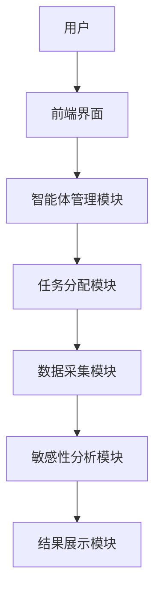
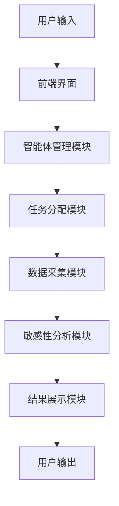
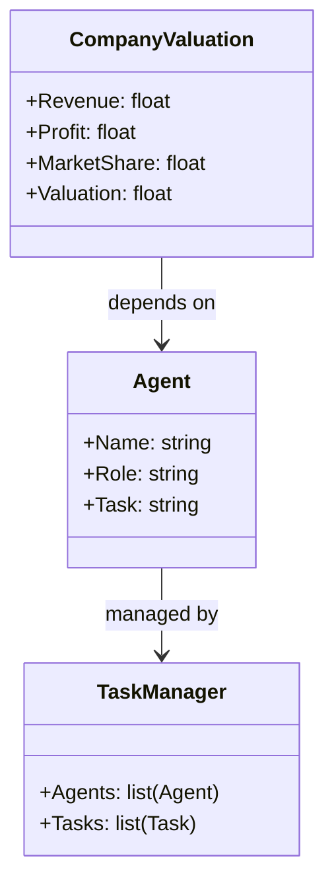
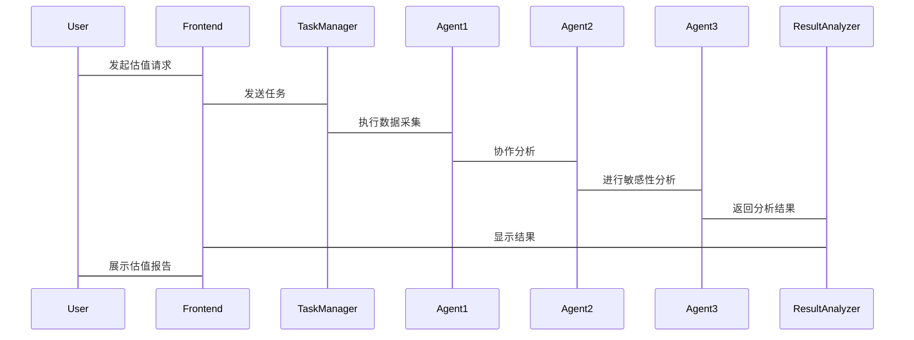

                 

<think>
嗯，用户希望我设计一本名为《多智能体系统实现智能化公司估值敏感性分析》的书籍目录大纲。首先，我需要理解这本书的主题。多智能体系统在公司估值中的应用，特别是敏感性分析。这可能涉及到多个智能体协同工作，分析公司价值时考虑的各种因素。

接下来，我需要考虑这本书的结构。通常，技术书籍会从基础概念开始，逐步深入到具体应用。所以，第一部分应该是多智能体系统和敏感性分析的基本概念，包括定义、特点、应用领域等。

然后，第二部分可以介绍多智能体系统的实现技术，比如通信机制、任务分配、协同算法，以及如何构建这样的系统。这部分需要详细讲解技术细节，可能包括具体的算法和实现方法。

接下来，第三部分应该专注于公司估值的敏感性分析。这里需要解释什么是敏感性分析，如何在多智能体系统中应用，以及具体的指标和方法。这部分可能需要结合数学模型和实际案例。

第四部分是系统设计与实现，包括系统架构、功能设计、接口设计和测试。这部分需要详细的技术内容，可能涉及系统架构图和流程图，用Mermaid来展示。

第五部分是项目实战，提供一个完整的案例，从环境配置到代码实现，再到结果分析。这部分需要实际的代码和详细的步骤说明，帮助读者动手实践。

最后，第六部分可以是扩展与展望，讨论当前的研究热点、未来趋势以及实际应用中的挑战。这部分帮助读者了解领域的发展方向。

在每个章节中，我需要确保涵盖背景介绍、核心概念、算法原理、数学模型、系统设计、项目实战、最佳实践和小结等部分。同时，使用Mermaid图表来辅助说明系统架构和算法流程，确保内容清晰易懂。

现在，我需要检查每个部分是否覆盖了所有必要的内容，并且结构合理，逻辑清晰。确保每个章节都有足够的细节，同时不过于冗长。可能还需要考虑读者的背景，是否需要从基础开始逐步深入，或者是否适合有一定经验的读者。

总的来说，这本书的目录大纲需要全面覆盖多智能体系统在公司估值中的应用，从理论到实践，确保读者能够系统地理解和掌握相关知识。
</think>

# 多智能体系统实现智能化公司估值敏感性分析

> 关键词：多智能体系统, 公司估值, 敏感性分析, 智能化, 多智能体协同, 估值模型

> 摘要：本文将深入探讨多智能体系统在公司估值敏感性分析中的应用，通过系统化的分析和设计，展示如何利用多智能体系统实现对公司估值的智能化分析，特别是对关键因素的敏感性分析。文章从多智能体系统的基本概念、公司估值的敏感性分析、多智能体系统实现智能化公司估值的核心算法、系统设计与实现、项目实战案例以及未来的研究方向等多个方面展开，旨在为读者提供全面而深入的理论与实践指导。

---

## 第一部分：多智能体系统与敏感性分析基础

### 第1章：多智能体系统概述

#### 1.1 多智能体系统的基本概念

##### 1.1.1 多智能体系统的定义
多智能体系统（Multi-Agent System, MAS）是由多个智能体（Agent）组成的复杂系统，每个智能体都是具有自主性、反应性、社会性和协作性的实体，能够通过通信和协作完成特定任务。

##### 1.1.2 多智能体系统的特征
- **自主性**：智能体能够自主决策，无需外部干预。
- **反应性**：智能体能够感知环境并实时响应。
- **社会性**：智能体之间可以通过通信进行协作。
- **协作性**：多个智能体协同完成复杂任务。
- **分布性**：智能体分布在网络中，任务分布执行。

##### 1.1.3 多智能体系统的分类
- **基于任务的多智能体系统**：根据任务需求动态分配智能体角色。
- **基于角色的多智能体系统**：智能体根据固定角色分工协作。
- **基于层次的多智能体系统**：通过层次结构实现任务分解和协作。

#### 1.2 敏感性分析的基本概念

##### 1.2.1 敏感性分析的定义
敏感性分析是一种评估系统中各变量对输出结果影响程度的方法，能够识别关键变量并量化其对结果的影响。

##### 1.2.2 敏感性分析的目的与作用
- **识别关键变量**：确定对输出结果影响最大的变量。
- **量化影响程度**：评估变量变化对输出结果的具体影响。
- **优化系统设计**：通过调整关键变量优化系统性能。

##### 1.2.3 敏感性分析的指标与方法
- **敏感性指标**：如相对变化百分比、标准差贡献度等。
- **敏感性方法**：如一次变化法、扰动分析法、主成分分析法等。

---

### 第2章：多智能体系统与公司估值的关联

#### 2.1 公司估值的基本原理

##### 2.1.1 公司估值的定义
公司估值是通过对公司财务状况、市场表现、未来盈利能力等多方面因素的综合分析，估算其市场价值的过程。

##### 2.1.2 公司估值的主要方法
- **DCF模型**：通过现金流折现法评估公司价值。
- **相对估值法**：通过与同行业公司比较进行估值。
- **资产重置法**：基于公司资产价值进行估值。

##### 2.1.3 公司估值的关键因素
- **财务指标**：如净利润、营业收入、资产负债率等。
- **市场因素**：如行业趋势、市场需求、竞争状况等。
- **管理因素**：如管理层能力、战略规划等。

#### 2.2 多智能体系统在公司估值中的应用

##### 2.2.1 多智能体系统在公司估值中的优势
- **分布式计算**：通过多智能体分布计算提高估值效率。
- **协作分析**：多个智能体协同分析，覆盖更多维度的估值因素。
- **实时反馈**：智能体实时感知市场变化，动态调整估值模型。

##### 2.2.2 多智能体系统与公司估值敏感性分析的关系
- **数据采集与处理**：智能体实时采集市场数据，为敏感性分析提供输入。
- **多维度分析**：通过多个智能体协作，对多个变量进行敏感性分析。
- **动态优化**：根据敏感性分析结果，动态调整估值模型参数。

##### 2.2.3 多智能体系统在公司估值敏感性分析中的具体应用
- **变量筛选**：通过智能体协作筛选出对估值影响最大的变量。
- **影响评估**：通过敏感性分析评估变量变化对估值的具体影响。
- **动态优化**：根据分析结果优化估值模型，提高估值准确性。

---

## 第二部分：多智能体系统实现智能化公司估值的核心算法

### 第3章：多智能体系统实现智能化公司估值的算法原理

#### 3.1 多智能体系统的核心算法

##### 3.1.1 分布式计算算法
- **任务分配算法**：如基于负载均衡的任务分配算法。
- **通信协议**：如基于消息队列的通信机制。

##### 3.1.2 协作任务分配算法
- **协商算法**：智能体之间通过协商确定任务分配。
- **优先级排序算法**：根据任务优先级动态调整任务分配。

##### 3.1.3 信息同步与一致性算法
- **一致性算法**：如基于RAFT的分布式一致性算法。
- **数据同步机制**：确保各智能体数据一致性的机制。

#### 3.2 敏感性分析的算法原理

##### 3.2.1 变量敏感性排序算法
- **相对变化百分比法**：通过变量变化百分比排序敏感性。
- **标准差贡献度法**：通过变量对结果方差的贡献度排序。

##### 3.2.2 敏感性指标计算算法
- **主成分分析法**：通过主成分分析提取敏感性指标。
- **回归分析法**：通过回归分析确定变量敏感性。

##### 3.2.3 敏感性分析的可视化方法
- **热力图**：展示变量敏感性排序。
- **散点图**：展示变量变化对结果的影响趋势。

---

### 第4章：多智能体系统实现智能化公司估值的系统设计与实现

#### 4.1 系统功能设计

##### 4.1.1 领域模型设计
- **实体关系图**：展示公司估值系统中的实体关系。
- **类图设计**：展示系统中的类及其关系。

##### 4.1.2 系统架构设计
- **分层架构**：展示系统逻辑分层。
- **模块划分**：展示系统功能模块划分。

##### 4.1.3 系统接口设计
- **API设计**：展示系统对外接口。
- **通信协议**：展示系统内部通信协议。

#### 4.2 系统架构设计

##### 4.2.1 系统架构图


##### 4.2.2 模块交互流程图


---

## 第三部分：项目实战与案例分析

### 第5章：项目实战

#### 5.1 环境安装与配置

##### 5.1.1 环境要求
- 操作系统：Windows 10 或更高版本，或 Linux 系统。
- 开发工具：Python 3.8+，Jupyter Notebook，Git。

##### 5.1.2 安装依赖
```bash
pip install numpy
pip install pandas
pip install matplotlib
pip install scikit-learn
pip install networkx
pip install mermaid
```

#### 5.2 核心实现代码

##### 5.2.1 多智能体通信模块
```python
import json
import socket

class Agent:
    def __init__(self, name):
        self.name = name
        self.socket = socket.socket(socket.AF_INET, socket.SOCK_STREAM)
        self.socket.bind(('localhost', 8000 + int(name)))

    def send(self, message, recipient):
        try:
            recipient_socket = socket.socket(socket.AF_INET, socket.SOCK_STREAM)
            recipient_socket.connect(('localhost', 8000 + int(recipient)))
            recipient_socket.send(json.dumps(message).encode())
            recipient_socket.close()
        except:
            print(f"{self.name}: Failed to send message to {recipient}")

    def receive(self):
        self.socket.listen()
        while True:
            conn, addr = self.socket.accept()
            data = conn.recv(1024).decode()
            if data:
                print(f"{self.name}: Received message: {data}")
                conn.close()

# 示例：两个智能体通信
agent1 = Agent(1)
agent2 = Agent(2)

agent1.send("Hello Agent 2!", 2)
agent2.receive()
```

##### 5.2.2 敏感性分析模块
```python
import numpy as np
import pandas as pd

def sensitivity_analysis(data, target):
    # 计算每个变量的敏感性系数
    coefficients = {}
    for var in data.columns:
        if var != target:
            # 计算相关系数
            coefficients[var] = np.corrcoef(data[var], data[target])[0, 1]
    # 按系数降序排序
    sorted_vars = sorted(coefficients.items(), key=lambda x: abs(x[1]), reverse=True)
    return sorted_vars

# 示例数据
data = pd.DataFrame({
    'Revenue': [100, 200, 300],
    'Profit': [20, 40, 60],
    'Market Share': [10, 20, 30]
})

# 敏感性分析
result = sensitivity_analysis(data, 'Profit')
print(result)
```

#### 5.3 实际案例分析与解读

##### 5.3.1 案例背景
某科技公司希望通过多智能体系统对公司的估值进行敏感性分析，识别影响公司估值的关键因素。

##### 5.3.2 数据准备
- **财务数据**：过去三年的财务报表数据。
- **市场数据**：行业趋势、竞争对手数据。
- **管理数据**：公司战略、管理层变动。

##### 5.3.3 分析过程
1. **数据采集**：通过多智能体系统采集公司相关的财务、市场和管理数据。
2. **数据预处理**：清洗和整合数据，确保数据质量和一致性。
3. **敏感性分析**：通过算法识别影响公司估值的关键因素。
4. **结果可视化**：将分析结果以图表形式展示，便于理解和决策。

##### 5.3.4 实验结果与分析
- **关键因素识别**：如净利润、营业收入、市场占有率等对估值影响较大。
- **敏感性排序**：通过相关系数排序，识别出对估值影响最大的几个变量。

##### 5.3.5 案例小结
通过多智能体系统的应用，公司能够快速、准确地识别影响估值的关键因素，为后续的估值优化提供了有力支持。

---

## 第四部分：系统分析与架构设计方案

### 第6章：系统分析与架构设计

#### 6.1 系统分析

##### 6.1.1 问题场景介绍
公司希望通过多智能体系统实现智能化估值，但现有系统存在以下问题：
- 数据分散，难以集中处理。
- 估值过程复杂，难以自动化。
- 敏感性分析耗时，难以动态调整。

##### 6.1.2 项目介绍
本项目旨在开发一个多智能体系统，实现对公司估值的智能化敏感性分析，通过多智能体协同完成数据采集、分析和优化。

#### 6.2 系统功能设计

##### 6.2.1 领域模型设计


##### 6.2.2 系统架构设计


##### 6.2.3 系统接口设计
- **API接口**：
  - `/api/send_task`：发送任务到智能体。
  - `/api/receive_result`：接收智能体返回的结果。
- **通信接口**：
  - 基于WebSocket的实时通信。
  - 基于HTTP的异步通信。

#### 6.3 系统交互流程设计

##### 6.3.1 交互流程图


---

## 第五部分：最佳实践与小结

### 第7章：最佳实践与小结

#### 7.1 最佳实践 tips

##### 7.1.1 系统设计
- 确保系统模块化设计，便于扩展和维护。
- 采用分布式架构，提高系统容错性和可扩展性。
- 选择合适的通信协议，确保系统高效运行。

##### 7.1.2 算法优化
- 定期更新算法模型，适应数据变化。
- 采用并行计算，提高敏感性分析效率。
- 引入机器学习模型，提升分析准确性。

##### 7.1.3 系统安全
- 加强数据加密，确保数据安全。
- 设置访问权限，防止未授权访问。
- 定期进行系统备份，防止数据丢失。

#### 7.2 小结
通过本文的系统分析和实践案例，我们可以看到，多智能体系统在公司估值敏感性分析中的应用具有显著优势。通过智能化的多智能体协同，公司能够更快速、更准确地识别关键因素，优化估值模型，提高估值准确性。

---

## 作者信息

作者：AI天才研究院/AI Genius Institute & 禅与计算机程序设计艺术/Zen And The Art of Computer Programming

---

以上是一个详细的目录和部分章节内容的示例，您可以根据需要进一步扩展和详细化各个章节的内容。

