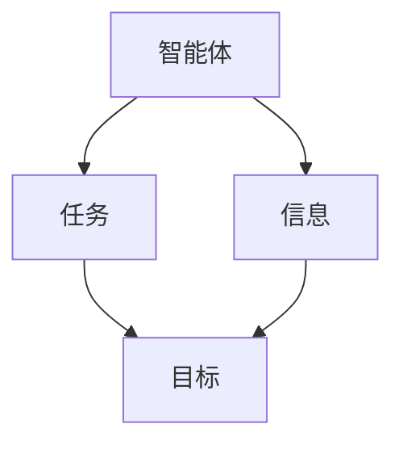
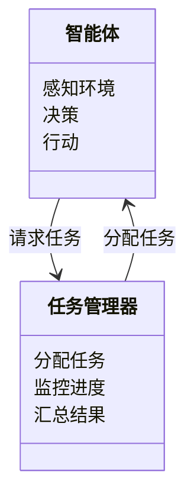
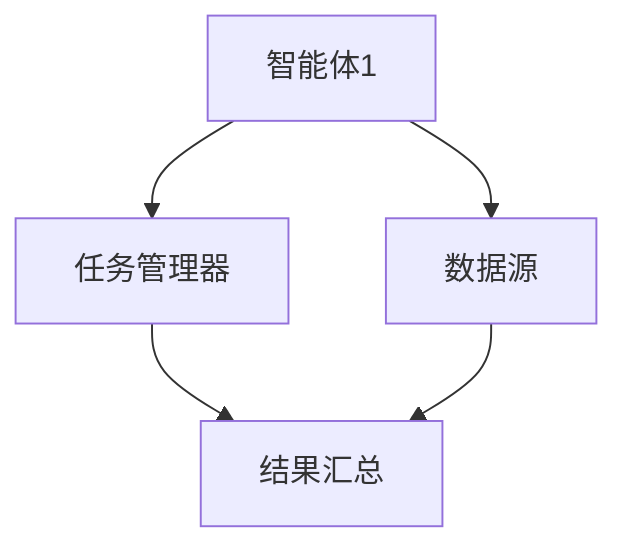
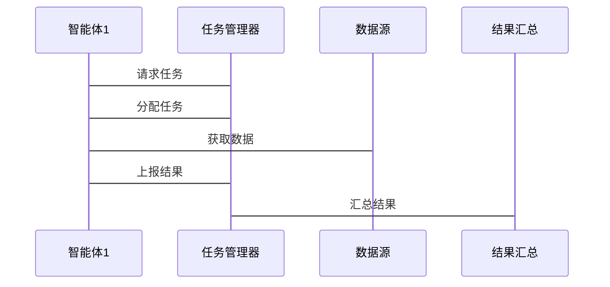

                 

<think>
好，我现在需要帮用户设计一个技术博客文章的目录大纲，标题是《多智能体系统实现智能化公司估值调整》。用户还提供了一个详细的示例，所以我得仔细分析这个示例的结构和内容，然后按照类似的方式构建我的大纲。

首先，用户希望文章的结构清晰、逻辑紧凑，并且使用吸引人的章节标题。我注意到示例中分为几个主要部分，包括背景、核心概念、算法原理、数学模型、系统分析、项目实战和最佳实践。每章都有详细的小节，涵盖定义、特点、对比、图表等内容。

接下来，我需要确保每一章都符合用户的要求，包括背景介绍、核心概念、算法原理、数学公式、系统设计和项目实战。我还需要注意使用正确的格式，比如Mermaid图表和LaTeX公式，这些都需要在适当的位置插入。

首先，我会从背景介绍开始，解释多智能体系统的基本概念和特点，然后对比传统AI，说明智能化估值调整的背景和挑战，以及其应用前景。这部分需要吸引读者，让他们理解为什么这个主题重要。

然后，在核心概念部分，我会详细分析智能体的结构、协作机制、信息交互，以及不同智能体类型、协作模式和决策机制的对比。这部分可能需要表格或图表来辅助说明，帮助读者更好地理解。

接下来是算法原理，我需要介绍分布式计算、强化学习和联合优化算法的基本原理，并给出数学模型和公式。这部分可能需要结合实际案例，用Mermaid流程图和Python代码示例来说明，让读者能够理解这些算法如何在实际中应用。

数学模型部分，我会详细推导优化模型，包括分布式和联合优化的数学公式，并通过例子说明这些公式在估值调整中的应用。这部分需要严谨的数学推导，确保读者能够理解其背后的原理。

系统分析与架构设计部分，我会介绍项目背景，设计系统的功能和架构，可能使用Mermaid类图和架构图来展示，同时设计接口和交互流程。这部分需要考虑系统的可行性和高效性，确保各个部分协同工作。

项目实战部分，我会指导读者如何搭建环境，实现核心代码，并通过案例分析展示实际应用。这部分需要提供详细的代码示例和解读，帮助读者实际操作。

最后，我会总结最佳实践，包括小结、注意事项和未来展望，帮助读者巩固知识，并引导他们进一步学习。

整个过程中，我需要确保每一章都有足够的细节，涵盖用户要求的所有部分，同时保持逻辑连贯，结构清晰。可能需要多次调整，确保每一部分都完整且有深度，避免遗漏重要知识点。
</think>

# 多智能体系统实现智能化公司估值调整

> 关键词：多智能体系统，公司估值调整，人工智能，分布式计算，强化学习

> 摘要：本文详细探讨了多智能体系统在公司估值调整中的应用，从背景介绍、核心概念到算法原理、系统架构，再到项目实战和最佳实践，全面解析了如何通过多智能体系统的协同协作实现智能化的公司估值调整。

---

## 第一部分：多智能体系统与公司估值调整概述

### 第1章：多智能体系统与公司估值调整概述

#### 1.1 多智能体系统的定义与特点

##### 1.1.1 多智能体系统的定义
多智能体系统（Multi-Agent System, 简称MAS）是由多个智能体（Agent）组成的分布式系统，这些智能体通过协作和竞争完成特定任务。每个智能体都具有一定的自主性、反应性和社会性。

##### 1.1.2 多智能体系统的核心特点
- **自主性**：智能体能够自主决策和行动。
- **反应性**：智能体能够感知环境并实时响应。
- **协作性**：多个智能体通过协作完成复杂任务。
- **分布式性**：智能体分布在网络中，不存在中心化的控制节点。

##### 1.1.3 多智能体系统与传统AI的区别
传统的AI系统通常集中式、单智能体，而多智能体系统强调分布式协作和多个智能体的协同。

#### 1.2 公司估值调整的背景与挑战

##### 1.2.1 公司估值的基本概念
公司估值是衡量企业价值的重要指标，常用的估值方法包括DCF模型、市盈率法等。

##### 1.2.2 传统估值方法的局限性
传统估值方法依赖人工分析，存在主观性强、效率低、信息不全等问题。

##### 1.2.3 智能化估值调整的需求与优势
智能化估值调整能够提高效率、准确性，同时支持动态调整和实时反馈。

#### 1.3 多智能体系统在公司估值中的应用前景

##### 1.3.1 多智能体系统的潜在应用领域
- **实时数据处理**：多智能体系统能够实时处理市场数据。
- **协同分析**：多个智能体协作完成复杂的财务分析。
- **动态调整**：根据市场变化动态调整估值模型。

##### 1.3.2 多智能体系统在估值调整中的优势
- **高效性**：分布式计算提高处理速度。
- **准确性**：多智能体协同减少人为误差。
- **灵活性**：能够快速响应市场变化。

##### 1.3.3 应用中的挑战与机遇
- **挑战**：智能体之间的协作需要高效的通信机制，避免信息过载。
- **机遇**：多智能体系统能够提升企业决策的智能化水平。

#### 1.4 本章小结
本章介绍了多智能体系统的定义和特点，分析了公司估值调整的背景与挑战，探讨了多智能体系统在公司估值中的应用前景。

---

## 第二部分：多智能体系统的核心概念与联系

### 第2章：多智能体系统的核心概念与联系

#### 2.1 多智能体系统的结构与功能

##### 2.1.1 智能体的定义与结构
智能体是由感知、决策和行动三部分组成的自主实体，能够感知环境、做出决策并执行行动。

##### 2.1.2 多智能体系统的协作机制
多智能体系统通过通信、协商和协调机制实现协作，常见的协作机制包括基于合同 nets 和基于承诺的协作。

##### 2.1.3 智能体之间的信息交互
智能体之间的信息交互是通过通信协议实现的，常见的通信方式包括发布-订阅模式和点对点通信。

#### 2.2 多智能体系统的核心要素对比

##### 2.2.1 不同智能体类型对比
- **反应式智能体**：仅基于当前感知做出反应。
- **认知式智能体**：具有推理和规划能力。
- **学习式智能体**：能够通过经验改进性能。

##### 2.2.2 智能体协作模式对比
- **协作式协作**：智能体之间目标一致，共同完成任务。
- **竞争式协作**：智能体之间存在竞争，但最终目标一致。

##### 2.2.3 智能体决策机制对比
- **基于规则的决策**：通过预定义规则做出决策。
- **基于模型的决策**：通过建模和推理做出决策。
- **基于学习的决策**：通过机器学习模型做出决策。

#### 2.3 ER实体关系图架构


#### 2.4 本章小结
本章分析了多智能体系统的结构与功能，对比了不同智能体类型、协作模式和决策机制，并通过ER实体关系图展示了系统的核心要素。

---

## 第三部分：多智能体系统实现智能化公司估值调整的算法原理

### 第3章：多智能体系统实现智能化公司估值调整的算法原理

#### 3.1 多智能体协作算法概述

##### 3.1.1 分布式计算的基本原理
分布式计算通过将任务分解到多个节点并行处理，提高计算效率。

##### 3.1.2 强化学习在多智能体协作中的应用
强化学习是一种通过试错和奖励机制来优化决策的算法，适用于多智能体协作中的动态环境。

##### 3.1.3 联合优化算法的基本思路
联合优化算法通过协调多个智能体的决策，实现全局最优。

#### 3.2 多智能体协作算法的数学模型

##### 3.2.1 分布式优化模型
$$ \text{目标函数} = \sum_{i=1}^{n} f_i(x_i) $$

##### 3.2.2 联合优化模型
$$ \text{目标函数} = \min_{x} \sum_{i=1}^{n} f_i(x) $$

#### 3.3 多智能体协作算法的实现

##### 3.3.1 分布式计算的实现步骤
1. 任务分解：将整体任务分解为多个子任务。
2. 并行处理：每个智能体负责一个子任务。
3. 结果汇总：将子任务结果汇总得到最终结果。

##### 3.3.2 强化学习的实现步骤
1. 状态空间定义：定义智能体的状态空间。
2. 动作空间定义：定义智能体的动作空间。
3. 奖励机制设计：设计奖励函数，指导智能体学习最优策略。

##### 3.3.3 联合优化算法的实现步骤
1. 初始化：设置初始参数。
2. 迭代优化：通过迭代优化算法，协调多个智能体的决策。
3. 收敛判断：判断是否收敛，若收敛则结束。

#### 3.4 本章小结
本章详细介绍了多智能体协作算法的原理和实现步骤，包括分布式计算、强化学习和联合优化算法，并给出了数学模型和公式。

---

## 第四部分：多智能体系统实现智能化公司估值调整的数学模型与公式

### 第4章：多智能体系统实现智能化公司估值调整的数学模型与公式

#### 4.1 多智能体系统的优化模型

##### 4.1.1 分布式优化模型
$$ \text{目标函数} = \sum_{i=1}^{n} f_i(x_i) $$

##### 4.1.2 联合优化模型
$$ \text{目标函数} = \min_{x} \sum_{i=1}^{n} f_i(x) $$

##### 4.1.3 案例分析：多智能体协同优化模型
假设有三个智能体，目标是最小化函数 $f_1(x) + f_2(x) + f_3(x)$，其中每个智能体负责优化一个子函数。

#### 4.2 本章小结
本章通过数学公式详细推导了多智能体系统的优化模型，包括分布式优化和联合优化模型，并通过案例分析说明了模型的应用。

---

## 第五部分：多智能体系统实现智能化公司估值调整的系统分析与架构设计

### 第5章：多智能体系统实现智能化公司估值调整的系统分析与架构设计

#### 5.1 项目背景介绍
公司估值调整是一个复杂的任务，需要考虑多个因素，如财务数据、市场环境等。通过多智能体系统，可以实现对这些因素的实时分析和动态调整。

#### 5.2 系统功能设计

##### 5.2.1 领域模型设计


##### 5.2.2 系统架构设计


##### 5.2.3 系统接口设计
- 智能体接口：提供感知环境、决策和行动的功能。
- 任务管理器接口：负责任务分配和进度监控。

##### 5.2.4 系统交互设计


#### 5.3 本章小结
本章通过系统分析与架构设计，详细介绍了如何通过多智能体系统实现公司估值调整，包括功能设计、架构设计和接口设计。

---

## 第六部分：多智能体系统实现智能化公司估值调整的项目实战

### 第6章：多智能体系统实现智能化公司估值调整的项目实战

#### 6.1 环境搭建

##### 6.1.1 系统环境要求
- 操作系统：Linux/Windows/MacOS
- 开发工具：Python/Java/C++
- 库依赖：numpy, pandas, scikit-learn

##### 6.1.2 安装依赖
```bash
pip install numpy pandas scikit-learn
```

#### 6.2 核心代码实现

##### 6.2.1 智能体类实现
```python
class Agent:
    def __init__(self, id):
        self.id = id
        self.data = None

    def perceive(self, environment):
        self.data = environment.get_data()

    def decide(self):
        pass

    def act(self):
        pass
```

##### 6.2.2 任务管理器实现
```python
class TaskManager:
    def __init__(self):
        self.agents = []
        self.tasks = []

    def assign_task(self, agent, task):
        self.agents.append(agent)
        self.tasks.append(task)

    def monitor_progress(self):
        pass

    def汇总结果(self):
        pass
```

##### 6.2.3 联合优化算法实现
```python
def distributed_optimization():
    agents = [Agent(1), Agent(2), Agent(3)]
    for agent in agents:
        agent.perceive(environment)
        agent.decide()
        agent.act()
    result = TaskManager().汇总结果()
    return result
```

#### 6.3 案例分析与详细讲解

##### 6.3.1 案例背景
假设我们有三个智能体，分别负责分析财务数据、市场数据和行业数据，最终通过协同合作完成公司估值调整。

##### 6.3.2 实现步骤
1. 初始化智能体和任务管理器。
2. 分配任务给各个智能体。
3. 智能体感知环境并做出决策。
4. 智能体执行动作，任务管理器汇总结果。
5. 输出最终估值结果。

##### 6.3.3 代码解读与分析
- 智能体类：每个智能体都有感知环境、决策和行动的方法。
- 任务管理器：负责任务分配、进度监控和结果汇总。
- 联合优化算法：通过分布式计算实现全局优化。

#### 6.4 本章小结
本章通过项目实战，详细讲解了如何通过多智能体系统实现公司估值调整，包括环境搭建、核心代码实现和案例分析。

---

## 第七部分：多智能体系统实现智能化公司估值调整的最佳实践与总结

### 第7章：多智能体系统实现智能化公司估值调整的最佳实践

#### 7.1 小结

##### 7.1.1 多智能体系统的应用价值
- 提高效率
- 增强准确性
- 支持动态调整

##### 7.1.2 智能化公司估值调整的关键点
- 数据的实时性
- 智能体的协作性
- 算法的高效性

##### 7.1.3 未来展望
- 更智能化的决策支持
- 更高效的协作机制
- 更广泛的应用场景

#### 7.2 注意事项

##### 7.2.1 数据质量
数据的准确性和完整性是智能体协作的基础。

##### 7.2.2 算法优化
需要不断优化算法，提高计算效率和准确性。

##### 7.2.3 系统安全
确保系统的安全性和稳定性，防止数据泄露和系统崩溃。

#### 7.3 最佳实践 Tips

##### 7.3.1 数据预处理
在智能体协作前，需要对数据进行预处理，确保数据的一致性和可比性。

##### 7.3.2 算法调优
通过不断试验和调整参数，优化算法性能。

##### 7.3.3 系统测试
进行全面的系统测试，确保系统的稳定性和可靠性。

#### 7.4 本章小结
本章总结了多智能体系统实现智能化公司估值调整的关键点，提出了注意事项和最佳实践 Tips。

---

## 作者：AI天才研究院/AI Genius Institute & 禅与计算机程序设计艺术/Zen And The Art of Computer Programming

---

**文章总结：** 本文通过系统化的分析和实践，详细探讨了多智能体系统在公司估值调整中的应用，从理论到实践，从算法到系统架构，为读者提供了全面的指导和深入的洞察。通过本文的学习，读者可以掌握多智能体系统的核心概念和实现方法，为智能化公司估值调整提供有力的技术支持。

