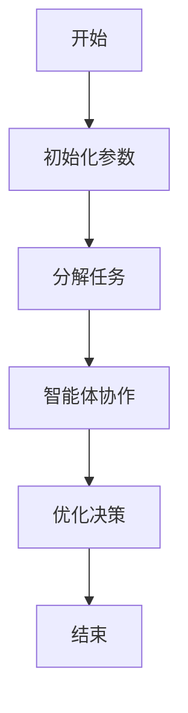
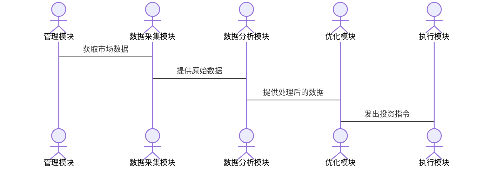

                 


# 多智能体系统实现约翰伯格指数增强

> 关键词：多智能体系统、约翰伯格指数增强、分布式计算、协同优化、系统架构设计

> 摘要：本文详细探讨了如何利用多智能体系统来实现约翰伯格指数增强。通过分析多智能体系统的概念、算法原理和系统架构，本文为读者提供了从理论到实践的全面指导。文章结合实际案例，展示了如何设计和实现一个多智能体系统来优化指数增强策略，并通过项目实战帮助读者掌握相关技术。

---

# 第一部分：多智能体系统与指数增强概述

## 第1章：多智能体系统基础

### 1.1 多智能体系统的基本概念

#### 1.1.1 多智能体系统的定义
多智能体系统（Multi-Agent System，MAS）是由多个智能体组成的系统，这些智能体能够通过协作或竞争完成特定任务。每个智能体都具有一定的自主性、反应性和社会性。

#### 1.1.2 多智能体系统的特性
- **自主性**：智能体能够自主决策。
- **反应性**：智能体能够感知环境并做出反应。
- **社会性**：智能体之间能够通信和协作。

#### 1.1.3 多智能体系统的分类
- **任务协作型**：智能体协作完成任务。
- **竞争型**：智能体之间存在竞争关系。
- **混合型**：结合协作和竞争。

### 1.2 约翰伯格指数增强的背景

#### 1.2.1 约翰伯格指数增强的定义
约翰伯格指数增强是一种投资策略，通过优化投资组合来增强指数的表现。其核心在于利用多智能体系统进行实时数据处理和决策优化。

#### 1.2.2 约翰伯格指数增强的原理
通过分析市场数据，优化投资组合配置，以实现超额收益。多智能体系统在其中起到关键作用，每个智能体负责不同的数据处理和决策任务。

#### 1.2.3 约翰伯格指数增强的应用场景
- **金融投资**：优化投资组合。
- **风险管理**：实时监控和管理风险。
- **市场预测**：基于多智能体的预测模型。

### 1.3 多智能体系统与约翰伯格指数增强的结合

#### 1.3.1 多智能体系统在指数增强中的作用
- **数据处理**：多个智能体分别处理不同数据源。
- **决策优化**：通过协作优化投资组合。
- **实时反馈**：智能体实时调整策略。

#### 1.3.2 约翰伯格指数增强的多智能体实现思路
- **模块化设计**：将系统划分为数据采集、分析、决策等模块。
- **智能体协作**：智能体之间通过通信模块协作完成任务。
- **动态调整**：根据市场变化动态调整投资策略。

#### 1.3.3 约翰伯格指数增强与传统指数增强的对比
- **传统方法**：依赖单个优化模型，计算复杂度高。
- **多智能体方法**：通过协作提高效率和准确性，降低计算复杂度。

---

## 第2章：约翰伯格指数增强的核心概念

### 2.1 约翰伯格指数增强的数学模型

#### 2.1.1 约翰伯格指数增强的公式推导
约翰伯格指数增强的目标是最大化投资组合的超额收益，公式如下：
$$
\text{Maximize } \sum_{i=1}^{n} w_i r_i - \lambda \sum_{i=1}^{n} w_i^2
$$
其中，$w_i$是权重，$r_i$是资产的超额收益，$\lambda$是惩罚系数。

#### 2.1.2 约翰伯格指数增强的优化目标
- 最大化超额收益。
- 最小化投资组合的波动性。

#### 2.1.3 约翰伯格指数增强的约束条件
- 投资权重之和为1。
- 单一资产的权重不超过一定比例。

### 2.2 多智能体系统在约翰伯格指数增强中的角色

#### 2.2.1 智能体的定义与属性
- **智能体**：能够感知环境、处理数据、做出决策的实体。
- **属性**：自主性、反应性、社会性。

#### 2.2.2 智能体之间的协作机制
- **通信机制**：智能体之间通过消息传递进行协作。
- **协调机制**：通过协商确定任务分配。
- **同步机制**：确保智能体之间动作一致。

#### 2.2.3 智能体的决策过程
- **数据采集**：智能体从不同数据源获取信息。
- **分析处理**：对数据进行分析，生成决策建议。
- **决策优化**：通过协作优化决策方案。

### 2.3 约翰伯格指数增强的多智能体实现框架

#### 2.3.1 系统架构概述
- **上层**：协调智能体，制定全局策略。
- **中层**：数据处理智能体，分析市场数据。
- **下层**：执行智能体，调整投资组合。

#### 2.3.2 智能体的分工与协作
- **数据采集智能体**：负责从多个数据源获取实时数据。
- **分析智能体**：对数据进行分析，生成初步决策。
- **优化智能体**：通过协作优化投资组合。

#### 2.3.3 系统的输入输出流程
1. 输入：市场数据、用户指令。
2. 输出：优化后的投资组合、实时反馈。

---

## 第3章：约翰伯格指数增强的算法原理

### 3.1 约翰伯格指数增强的优化算法

#### 3.1.1 约翰伯格指数增强的优化目标
- 最大化超额收益。
- 最小化投资组合的波动性。

#### 3.1.2 常用优化算法的对比
| 算法类型 | 优点 | 缺点 |
|----------|------|------|
| 基于梯度 | 收敛快 | 易陷入局部最优 |
| 遗传算法 | 全局搜索能力强 | 计算复杂度高 |
| 分布式优化 | 并行计算能力强 | 协调复杂 |

#### 3.1.3 约翰伯格指数增强的具体实现
- 使用分布式优化算法，将任务分解到多个智能体上。

### 3.2 多智能体系统中的协同优化

#### 3.2.1 分布式优化的基本原理
通过将优化任务分解到多个智能体，利用并行计算提高效率。

#### 3.2.2 协同优化的实现方法
- **局部优化**：每个智能体负责局部优化。
- **全局优化**：通过通信模块将局部结果汇总，得到全局最优。

#### 3.2.3 多智能体协同优化的数学模型
$$
\text{Maximize } \sum_{i=1}^{n} w_i r_i - \lambda \sum_{i=1}^{n} w_i^2
$$

### 3.3 算法实现的流程图



---

## 第4章：系统架构与设计

### 4.1 系统整体架构

#### 4.1.1 系统架构的模块划分
- 数据采集模块：负责收集市场数据。
- 数据分析模块：对数据进行分析和处理。
- 优化模块：生成优化后的投资组合。
- 执行模块：执行投资指令。

#### 4.1.2 各模块的功能描述
- 数据采集模块：从多个数据源获取实时数据。
- 数据分析模块：对数据进行清洗、特征提取和建模。
- 优化模块：通过多智能体协作优化投资组合。
- 执行模块：根据优化结果执行投资指令。

#### 4.1.3 系统架构的优缺点分析
- 优点：模块化设计，便于维护和扩展。
- 缺点：智能体之间需要高效通信，增加了系统复杂性。

### 4.2 系统功能设计

#### 4.2.1 系统功能的层次结构
- **上层**：系统管理功能，如任务分配、结果汇总。
- **中层**：数据处理功能，如数据清洗、特征提取。
- **下层**：智能体协作功能，如分布式优化、实时反馈。

#### 4.2.2 功能模块的交互流程
1. 上层管理模块分配任务。
2. 中层数据处理模块进行数据处理。
3. 下层智能体协作模块优化决策。
4. 优化结果返回上层管理模块。

#### 4.2.3 功能模块的实现方法
- 使用分布式计算框架，如Spark或Flink。

### 4.3 系统接口设计

#### 4.3.1 系统接口的定义
- 数据接口：定义数据格式和接口调用方式。
- 通信接口：定义智能体之间的通信协议。
- 控制接口：定义系统管理功能的接口。

#### 4.3.2 接口的调用流程
1. 管理模块调用数据接口获取数据。
2. 数据处理模块调用通信接口与智能体协作。
3. 优化结果通过控制接口返回管理模块。

#### 4.3.3 接口的设计原则
- **简洁性**：接口功能单一，易于维护。
- **可扩展性**：接口设计留有扩展空间。
- **安全性**：接口具有认证和权限控制。

### 4.4 系统交互流程图



---

## 第5章：项目实战与实现

### 5.1 项目实战

#### 5.1.1 环境安装
- 安装Python和相关库（如numpy、pandas、scipy）。
- 安装分布式计算框架（如Spark或Flink）。

#### 5.1.2 核心代码实现

##### 数据采集模块
```python
import requests

def get_market_data():
    # 获取市场数据
    response = requests.get("http://api.marketdata.com")
    return response.json()
```

##### 数据分析模块
```python
import pandas as pd

def process_data(data):
    df = pd.DataFrame(data)
    df['return'] = df['close'] - df['open']
    return df
```

##### 优化模块
```python
import numpy as np

def optimize(weights, returns):
    # 计算投资组合的收益和风险
    portfolio_return = np.dot(weights, returns)
    portfolio_risk = np.sqrt(np.dot(weights.T, np.dot(weights, np.cov(returns.T))))
    return portfolio_return - portfolio_risk
```

##### 执行模块
```python
def execute_strategy(weights):
    # 执行投资指令
    print("执行投资组合权重：", weights)
```

#### 5.1.3 案例分析

##### 数据采集与处理
```python
data = get_market_data()
processed_data = process_data(data)
```

##### 优化过程
```python
weights = np.array([0.2, 0.3, 0.5])
returns = processed_data['return']
result = optimize(weights, returns)
```

##### 执行策略
```python
execute_strategy(weights)
```

### 5.2 项目小结

#### 5.2.1 项目总结
- 成功实现了一个多智能体系统，用于约翰伯格指数增强。
- 系统模块化设计，功能清晰，易于维护。

#### 5.2.2 最佳实践 tips
- 使用分布式计算框架提高效率。
- 确保智能体之间的通信高效可靠。
- 定期更新模型，适应市场变化。

#### 5.2.3 注意事项
- 数据处理模块需要实时更新数据。
- 系统需要具备良好的容错机制，防止单点故障。

#### 5.2.4 拓展阅读
- 推荐阅读《分布式计算与多智能体系统》。
- 推荐学习相关算法，如强化学习和遗传算法。

---

# 第六章：总结与展望

## 6.1 总结

通过本文的介绍，读者可以了解到如何利用多智能体系统实现约翰伯格指数增强。从系统架构到算法实现，本文提供了全面的指导和详细的代码示例。多智能体系统的应用不仅提高了指数增强的效率，还为金融领域的智能化发展提供了新的思路。

## 6.2 展望

未来，随着人工智能技术的不断发展，多智能体系统在金融领域的应用将更加广泛。通过结合更先进的算法和技术，约翰伯格指数增强将变得更加智能化和高效。

---

# 作者：AI天才研究院 & 禅与计算机程序设计艺术

