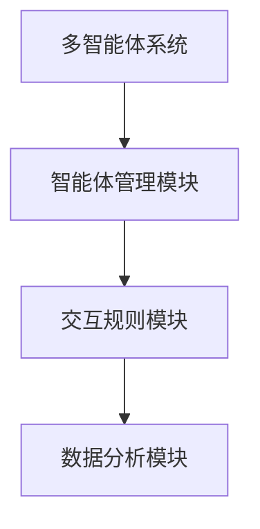

                 


# 多智能体系统模拟市场参与者行为

> 关键词：多智能体系统、市场模拟、行为建模、强化学习、博弈论、分布式系统、系统架构

> 摘要：本文详细探讨了多智能体系统（MAS）在模拟市场参与者行为中的应用。从核心概念到算法实现，从系统架构到项目实战，系统性地分析了如何利用MAS技术建模和模拟市场中的复杂行为。通过具体案例，本文展示了如何在实际场景中应用MAS，并提供了丰富的代码示例和系统设计图，帮助读者深入理解MAS技术及其在市场模拟中的价值。

---

## 第1章：多智能体系统概述

### 1.1 多智能体系统的基本概念

#### 1.1.1 智能体的定义与特征
智能体（Agent）是指能够感知环境、自主决策并采取行动的实体。智能体具有以下特征：
- **自主性**：无需外部干预，自主决策。
- **反应性**：能感知环境并实时响应。
- **社会性**：能与其他智能体或人类进行交互。

#### 1.1.2 多智能体系统的定义
多智能体系统（MAS）是由多个智能体组成的分布式系统，这些智能体通过协作或竞争完成特定目标。

#### 1.1.3 多智能体系统与单智能体系统的区别
| 特性 | 单智能体系统 | 多智能体系统 |
|------|--------------|--------------|
| 决策 | 单一决策者 | 多个决策者 |
| 交互 | 无 | 智能体间交互 |
| 复杂性 | 较低 | 较高 |

### 1.2 多智能体系统的分类

#### 1.2.1 按智能体类型分类
- **简单反射型智能体**：基于当前感知做出反应。
- **基于模型的反射型智能体**：利用内部模型进行决策。
- **目标驱动型智能体**：根据目标采取行动。

#### 1.2.2 按任务类型分类
- **协作型MAS**：智能体协作完成任务。
- **竞争型MAS**：智能体之间存在竞争。
- **混合型MAS**：协作与竞争并存。

#### 1.2.3 按环境类型分类
- **静态环境**：环境不变。
- **动态环境**：环境变化。
- **部分可观察环境**：智能体只能感知部分状态。

### 1.3 多智能体系统的特点与优势

#### 1.3.1 分布式计算
MAS通过分布式计算提高系统的可靠性和容错性。

#### 1.3.2 自主性与协作性
智能体自主决策且能协作完成复杂任务。

#### 1.3.3 灵活性与适应性
MAS能快速适应环境变化，增强系统的灵活性。

---

## 第2章：市场参与者行为分析

### 2.1 市场参与者的类型

#### 2.1.1 消费者
消费者基于价格和偏好选择产品。

#### 2.1.2 供应商
供应商根据市场需求调整生产和定价。

#### 2.1.3 中间商
中间商协调供需，优化资源配置。

### 2.2 市场参与者的行为特征

#### 2.2.1 需求预测
参与者预测市场趋势，做出决策。

#### 2.2.2 价格敏感性
参与者对价格变化敏感，调整购买或供应策略。

#### 2.2.3 偏好变化
参与者偏好随市场变化而变化。

### 2.3 市场行为建模方法

#### 2.3.1 基于规则的建模
通过预定义规则模拟参与者行为。

#### 2.3.2 基于强化学习的建模
通过强化学习算法优化决策策略。

#### 2.3.3 基于博弈论的建模
分析参与者在博弈中的策略选择。

---

## 第3章：多智能体系统模拟市场机制

### 3.1 市场机制的多智能体建模

#### 3.1.1 供需关系建模
通过智能体模拟供需变化，分析市场均衡。

#### 3.1.2 价格形成机制
模拟价格波动，分析价格决定因素。

#### 3.1.3 交易过程模拟
模拟交易过程，分析交易效率和结果。

### 3.2 多智能体系统的市场仿真

#### 3.2.1 仿真环境构建
设计仿真环境，模拟真实市场条件。

#### 3.2.2 智能体交互设计
设计智能体之间的交互规则，实现市场行为模拟。

#### 3.2.3 仿真结果分析
分析仿真数据，评估市场机制的有效性。

---

## 第4章：系统架构与实现

### 4.1 系统架构设计

#### 4.1.1 系统模块划分
- **智能体管理模块**：管理多个智能体。
- **交互规则模块**：定义智能体交互规则。
- **数据分析模块**：分析仿真数据。

#### 4.1.2 系统功能设计
- **智能体行为定义**：定义智能体的行为规则。
- **交互规则配置**：配置智能体之间的交互规则。
- **仿真结果可视化**：可视化仿真结果，便于分析。

#### 4.1.3 系统架构图


### 4.2 系统实现与代码示例

#### 4.2.1 环境安装
- 安装Python：`python --version`
- 安装相关库：`pip install numpy matplotlib`

#### 4.2.2 核心代码实现

##### 智能体类定义
```python
class Agent:
    def __init__(self, id, preference):
        self.id = id
        self.preference = preference
```

##### 交互规则实现
```python
def interact(agent1, agent2):
    if agent1.preference > agent2.preference:
        return "成交"
    else:
        return "不成交"
```

##### 仿真结果分析
```python
import matplotlib.pyplot as plt

def plot_results(data):
    plt.plot(data)
    plt.xlabel('时间')
    plt.ylabel('价格')
    plt.show()
```

---

## 第5章：项目实战

### 5.1 案例分析：模拟股票市场

#### 5.1.1 环境安装
- 安装股票数据库：`pip install pandas`

#### 5.1.2 核心代码实现

##### 价格预测算法
```python
import numpy as np

def predict_price(days):
    prices = np.random.normal(100, 10, days)
    return prices
```

##### 交易策略实现
```python
def trading_strategy(prices, threshold):
    profit = 0
    for price in prices:
        if price > threshold:
            profit += (price - threshold)
    return profit
```

#### 5.1.3 案例分析与解读
分析仿真结果，优化交易策略，提高盈利能力。

---

## 第6章：总结与扩展

### 6.1 总结
本文系统介绍了多智能体系统在模拟市场参与者行为中的应用，从理论到实践，全面分析了MAS的优势和实现方法。

### 6.2 最佳实践 tips
- 理解智能体行为特征，选择合适的建模方法。
- 设计合理的交互规则，优化系统性能。
- 定期更新模型，适应市场变化。

### 6.3 注意事项
- 确保数据准确，避免仿真结果偏差。
- 处理好智能体之间的交互，避免冲突。
- 选择合适的工具和库，提高开发效率。

### 6.4 拓展阅读
推荐相关书籍和论文，深入研究MAS和强化学习。

---

作者：AI天才研究院/AI Genius Institute & 禅与计算机程序设计艺术 /Zen And The Art of Computer Programming

---

通过以上目录结构和内容，您可以逐步撰写完整的文章，确保每个部分都详细且有条理。

