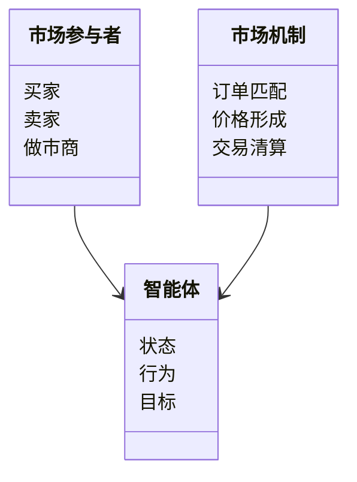
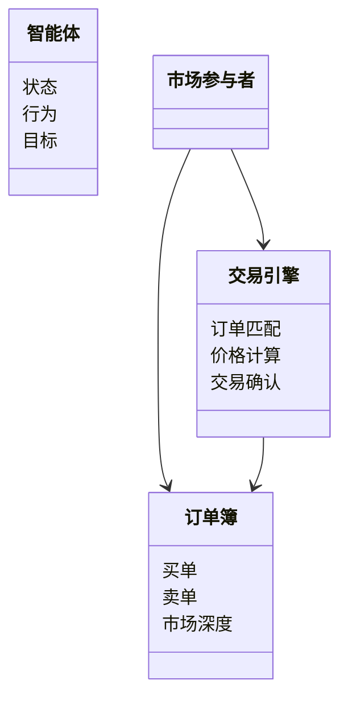
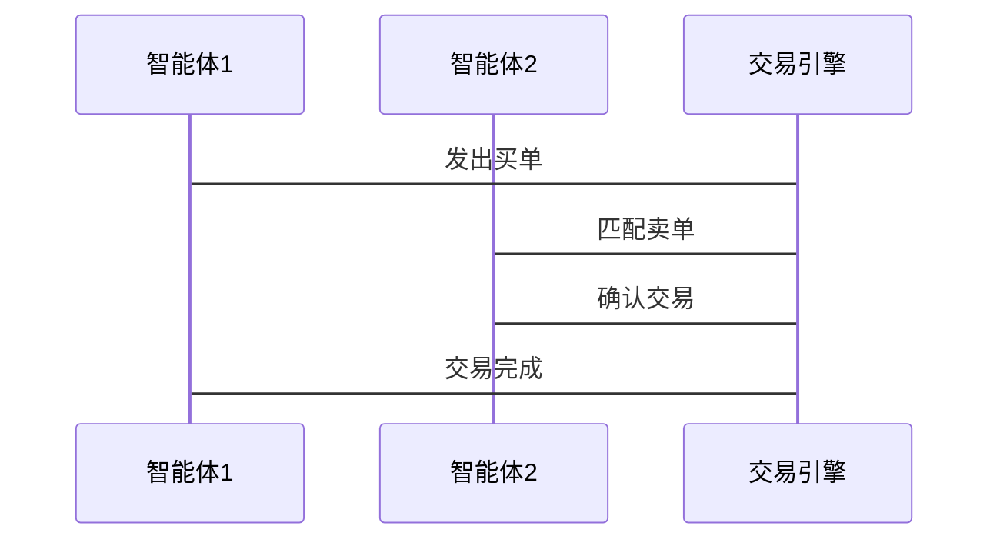

                 


# 多智能体系统模拟市场微观结构

---

## 关键词：
- 多智能体系统
- 市场微观结构
- 交易策略
- 信息传播
- 市场 clearing
- 系统架构设计

---

## 摘要：
本文深入探讨了多智能体系统在模拟市场微观结构中的应用，分析了市场参与者的行为模型、市场机制的动态演化以及信息传播的复杂性。通过详细讲解多智能体系统的算法原理、数学模型和系统架构，本文为读者提供了一个全面理解市场微观结构模拟的框架。文章还通过具体案例展示了如何实现一个多智能体系统，并分析了其在金融市场中的实际应用。最后，本文总结了最佳实践方法，并展望了未来的研究方向。

---

## 第一部分: 多智能体系统与市场微观结构基础

### 第1章: 多智能体系统概述

#### 1.1 多智能体系统的定义与特点
##### 1.1.1 多智能体系统的定义
多智能体系统（Multi-Agent System, MAS）是由多个相互作用的智能体组成的系统，这些智能体能够自主决策、协作或竞争以实现特定目标。

##### 1.1.2 多智能体系统的核心特点
- **分布式性**：智能体分布在不同的位置，独立决策。
- **自主性**：每个智能体都能自主感知环境并做出决策。
- **协作性**：智能体之间可以通过协作提高整体系统的性能。
- **动态性**：系统状态会因智能体的交互而动态变化。

##### 1.1.3 多智能体系统与单智能体系统的区别
| 特性       | 单智能体系统                     | 多智能体系统                     |
|------------|--------------------------------|--------------------------------|
| 决策主体    | 单一主体                       | 多个独立主体                   |
| 交互方式    | 无交互或单向交互               | 多智能体之间可协作或竞争         |
| 复杂性      | 系统行为简单                   | 系统行为复杂，涌现性特征明显     |

#### 1.2 市场微观结构的定义与分析
##### 1.2.1 市场微观结构的定义
市场微观结构指的是市场参与者的交互方式、交易机制和信息传播规则的集合，是市场运行的基本框架。

##### 1.2.2 市场微观结构的组成部分
- **市场参与者**：包括买家、卖家、交易商、做市商等。
- **市场机制**：如订单匹配、价格形成、交易清算等。
- **市场信息**：包括订单流、价格变动、市场深度等。

##### 1.2.3 市场微观结构的动态特性
市场微观结构具有动态性，受参与者行为、市场规则和外部环境的影响，系统状态会实时变化。

#### 1.3 多智能体系统在市场微观结构中的应用
##### 1.3.1 多智能体系统模拟市场微观结构的必要性
- 多智能体系统能够模拟市场参与者的异质性行为。
- 可以捕捉市场微观结构中的动态交互和涌现现象。

##### 1.3.2 多智能体系统在金融市场的应用场景
- 模拟股票交易市场。
- 模拟外汇交易市场。
- 模拟拍卖市场。

##### 1.3.3 多智能体系统模拟的优势与挑战
- **优势**：能够模拟复杂的市场动态，提供微观层面的洞察。
- **挑战**：智能体的交互复杂，系统设计和实现难度大。

---

## 第二部分: 多智能体系统的核心概念与联系

### 第2章: 多智能体系统的核心概念与联系

#### 2.1 多智能体系统的核心概念
##### 2.1.1 智能体的行为模型
智能体的行为模型包括：
- **感知**：智能体通过传感器或信息源获取环境信息。
- **决策**：基于感知信息做出决策。
- **行动**：根据决策执行动作。

##### 2.1.2 智能体的交互机制
智能体之间的交互机制包括：
- **直接通信**：智能体之间通过消息传递信息。
- **间接交互**：通过共享环境或中间媒介进行交互。

##### 2.1.3 智能体的决策过程
智能体的决策过程通常包括：
1. 状态感知。
2. 目标设定。
3. 行为选择。
4. 行为执行。

#### 2.2 市场微观结构的核心要素
##### 2.2.1 市场参与者
市场参与者包括：
- **买家**：需求方，希望通过购买获得商品或服务。
- **卖家**：供给方，希望通过出售获得收益。
- **交易商**：中介角色，帮助买卖双方完成交易。
- **做市商**：提供流动性的市场参与者。

##### 2.2.2 市场机制
市场机制包括：
- **订单匹配**：确定买卖双方的订单如何匹配。
- **价格形成**：确定资产的价格。
- **交易清算**：完成交易并结算资金和资产。

##### 2.2.3 市场信息
市场信息包括：
- **订单流**：市场参与者发出的订单信息。
- **价格变动**：资产价格的实时变化。
- **市场深度**：当前市场上的买卖订单情况。

#### 2.3 多智能体系统与市场微观结构的联系
##### 2.3.1 多智能体系统模拟市场微观结构的逻辑框架
多智能体系统模拟市场微观结构的逻辑框架包括：
1. 定义市场参与者。
2. 设计智能体的行为模型。
3. 设定市场机制和规则。
4. 模拟市场运行过程。

##### 2.3.2 多智能体系统与市场机制的相互作用
智能体的行为会影响市场机制，而市场机制又反过来约束或激励智能体的行为。

##### 2.3.3 多智能体系统在市场微观结构中的动态演化
多智能体系统的动态演化体现在市场参与者的策略调整和市场机制的优化过程中。

---

## 第三部分: 多智能体系统模拟市场微观结构的算法原理

### 第3章: 多智能体系统模拟市场微观结构的算法原理

#### 3.1 基于有限状态机的交易策略
##### 3.1.1 有限状态机的基本概念
有限状态机（Finite State Machine, FSM）是一种行为模型，描述智能体在不同状态之间的转换规则。

##### 3.1.2 交易策略的状态转移规则
交易策略的状态转移规则包括：
1. **等待状态**：智能体未持有头寸，等待市场信号。
2. **买入状态**：智能体根据信号买入资产。
3. **卖出状态**：智能体根据信号卖出资产。

##### 3.1.3 交易策略的实现流程
1. 智能体感知市场信息。
2. 根据当前状态和市场信息决定下一步动作。
3. 执行交易指令。

#### 3.2 基于拍卖机制的市场 clearing
##### 3.2.1 拍卖机制的基本原理
拍卖机制是一种通过竞价确定价格的市场 clearing 方式，常见于股票交易和外汇市场。

##### 3.2.2 市场 clearing 的实现步骤
1. 收集所有买卖订单。
2. 根据订单价格和数量匹配交易。
3. 完成交易并结算资金和资产。

##### 3.2.3 拍卖机制的优化与改进
- **价格优先**：价格高的订单优先成交。
- **时间优先**：价格相同的情况下，先到达的订单优先成交。

#### 3.3 多智能体系统中的信息传播与扩散
##### 3.3.1 信息传播的基本模型
信息传播模型包括：
- **广播模型**：信息从一个智能体传播到所有其他智能体。
- ** gossip 模型**：信息通过智能体之间的随机交互传播。

##### 3.3.2 信息扩散的实现算法
信息扩散的实现算法包括：
- **扩散-合并算法**：信息在智能体之间扩散并合并。
- **基于概率的传播算法**：信息传播的概率由智能体的影响力决定。

##### 3.3.3 信息传播对市场微观结构的影响
信息传播会影响市场参与者的决策，从而影响市场价格和交易量。

---

## 第四部分: 多智能体系统模拟市场微观结构的数学模型与公式

### 第4章: 多智能体系统模拟市场微观结构的数学模型与公式

#### 4.1 市场微观结构的数学模型
##### 4.1.1 市场参与者的行为模型
市场参与者的行为可以用以下公式表示：
$$
\text{决策} = f(\text{感知}, \text{目标}, \text{策略})
$$

##### 4.1.2 市场机制的数学表达
市场机制可以用以下公式表示：
$$
P(t) = \max_{i} P_i(t)
$$
其中，$P(t)$ 表示时间 $t$ 的价格，$P_i(t)$ 表示第 $i$ 个参与者在时间 $t$ 的出价。

##### 4.1.3 市场信息的传播模型
市场信息的传播可以用以下公式表示：
$$
I_j(t+1) = \sum_{i=1}^{n} w_{ij} I_i(t)
$$
其中，$I_j(t+1)$ 表示智能体 $j$ 在时间 $t+1$ 的信息，$w_{ij}$ 表示智能体 $i$ 和 $j$ 之间的权重。

#### 4.2 多智能体系统的数学公式
##### 4.2.1 智能体的决策函数
智能体的决策函数可以用以下公式表示：
$$
a_j(t) = \arg\max_{a} u_j(a, s_j(t))
$$
其中，$a_j(t)$ 表示智能体 $j$ 在时间 $t$ 的动作，$u_j(a, s_j(t))$ 表示智能体 $j$ 在状态 $s_j(t)$ 下选择动作 $a$ 的效用函数。

##### 4.2.2 智能体的交互规则
智能体的交互规则可以用以下公式表示：
$$
s_{j}(t+1) = f(s_j(t), s_{k}(t), a_j(t), a_k(t))
$$
其中，$s_{j}(t+1)$ 表示智能体 $j$ 在时间 $t+1$ 的状态，$f$ 是状态更新函数。

##### 4.2.3 多智能体系统的状态转移方程
多智能体系统的状态转移方程可以用以下公式表示：
$$
S(t+1) = F(S(t), A(t))
$$
其中，$S(t)$ 表示时间 $t$ 的系统状态，$A(t)$ 表示时间 $t$ 的系统动作，$F$ 是状态转移函数。

#### 4.3 市场 clearing 的数学推导
##### 4.3.1 市场 clearing 的基本公式
市场 clearing 的基本公式可以用以下公式表示：
$$
\sum_{i=1}^{n} q_i^b = \sum_{j=1}^{m} q_j^s
$$
其中，$q_i^b$ 表示买家 $i$ 的需求量，$q_j^s$ 表示卖家 $j$ 的供给量。

##### 4.3.2 市场 clearing 的优化算法
市场 clearing 的优化算法可以用以下公式表示：
$$
\min_{P} \sum_{i=1}^{n} (P - P_i^b)^2 + \sum_{j=1}^{m} (P - P_j^s)^2
$$
其中，$P$ 是市场价格，$P_i^b$ 是买家 $i$ 的报价，$P_j^s$ 是卖家 $j$ 的报价。

##### 4.3.3 市场 clearing 的实现步骤
1. 收集所有买卖订单。
2. 根据价格匹配订单。
3. 计算市场价格和交易量。

---

## 第五部分: 系统分析与架构设计方案

### 第5章: 系统分析与架构设计方案

#### 5.1 问题场景介绍
本文将设计一个多智能体系统来模拟股票市场的微观结构，包括买家、卖家和做市商。

#### 5.2 系统功能设计
##### 5.2.1 领域模型


##### 5.2.2 系统架构设计


##### 5.2.3 系统接口设计
- **输入接口**：接收市场参与者的订单。
- **输出接口**：输出交易结果和市场价格。

##### 5.2.4 系统交互设计


---

## 第六部分: 项目实战

### 第6章: 项目实战

#### 6.1 环境安装
- 安装 Python 和必要的库（如 matplotlib、numpy）。
- 安装多智能体系统模拟框架（如 mesa）。

#### 6.2 系统核心实现源代码
```python
import random

class Agent:
    def __init__(self, id, strategy):
        self.id = id
        self.strategy = strategy
        self.state = 'waiting'

    def感知(self, 市场信息):
        # 根据市场信息更新状态
        pass

    def决策(self):
        # 根据策略和当前状态做出决策
        pass

    def行动(self):
        # 根据决策执行动作
        pass

class Market:
    def __init__(self, participants):
        self.participants = participants
        self.order_book = {'买单': [], '卖单': []}

    def匹配订单(self):
        # 匹配买单和卖单
        pass

    def计算价格(self):
        # 根据订单匹配计算市场价格
        pass

    def清算交易(self):
        # 完成交易并结算
        pass

# 示例：模拟股票交易市场
agents = [Agent(1, 'buy'), Agent(2, 'sell')]
market = Market(agents)

market.匹配订单()
market.计算价格()
market.清算交易()
```

#### 6.3 代码应用解读与分析
1. **Agent 类**：表示市场参与者，具有感知、决策和行动的能力。
2. **Market 类**：表示市场，包含订单簿和市场参与者。
3. **订单匹配**：根据价格和数量匹配买单和卖单。
4. **价格计算**：根据订单匹配结果计算市场价格。
5. **交易清算**：完成交易并结算资金和资产。

#### 6.4 实际案例分析
以模拟股票交易市场为例，假设有两个智能体，一个以买入策略为目标，一个以卖出策略为目标。

##### 6.4.1 案例分析
1. 智能体1（买家）感知市场价格上涨，发出买单。
2. 智能体2（卖家）感知市场价格下降，发出卖单。
3. 市场匹配买单和卖单，计算市场价格，完成交易。

##### 6.4.2 结果解释
- 交易完成，市场价格为计算结果。
- 智能体1持有资产，智能体2持有资金。

#### 6.5 项目小结
通过该项目实战，读者可以理解如何将多智能体系统应用于市场微观结构模拟，掌握系统设计和实现的基本方法。

---

## 第七部分: 总结与展望

### 第7章: 总结与展望

#### 7.1 核心知识点回顾
- 多智能体系统的定义与特点。
- 市场微观结构的核心要素。
- 多智能体系统模拟的算法原理。
- 系统架构设计与实现。

#### 7.2 最佳实践 tips
- 在设计多智能体系统时，需要考虑智能体的异质性和动态性。
- 在实现市场微观结构模拟时，需要详细设计市场机制和交易规则。
- 在系统实现中，建议使用现有的框架和库以提高效率。

#### 7.3 小结
本文系统地介绍了多智能体系统模拟市场微观结构的方法，通过理论分析和实际案例展示了系统的实现过程，为读者提供了全面的指导。

#### 7.4 注意事项
- 系统设计时需要考虑性能和扩展性。
- 系统实现时需要确保代码的可读性和可维护性。
- 系统测试时需要考虑各种边界情况。

#### 7.5 拓展阅读
- 多智能体系统的应用研究。
- 市场微观结构的复杂性研究。
- 多智能体系统的优化算法研究。

---

## 作者：AI天才研究院/AI Genius Institute & 禅与计算机程序设计艺术/Zen And The Art of Computer Programming

--- 

# END

