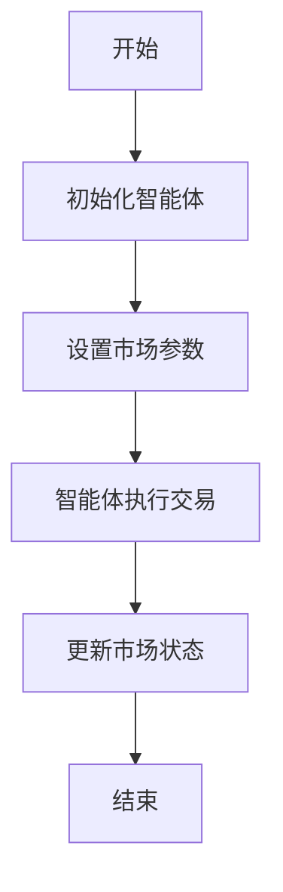
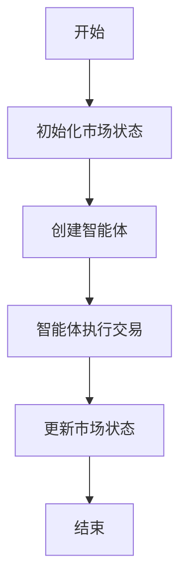
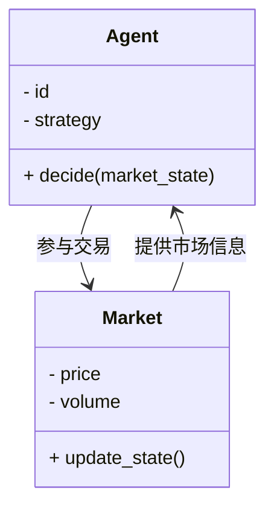
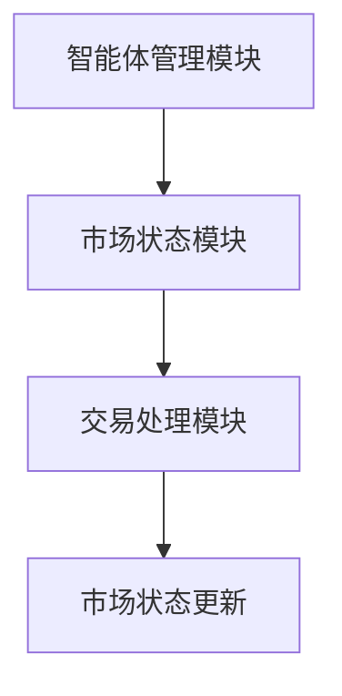

                 

<think>
嗯，我现在需要帮用户设计一本关于《多智能体系统模拟市场流动性》的详细目录大纲。首先，我需要理解这本书的核心主题，即多智能体系统如何模拟市场流动性。这涉及计算机科学、金融学，甚至人工智能的知识。

用户要求目录大纲详细且逻辑清晰，覆盖主题内容。我需要确保每章都有明确的结构，包括背景介绍、核心概念、算法原理、系统架构、项目实战等部分。

首先，我会从背景介绍开始，解释多智能体系统和市场流动性的基本概念。然后，深入探讨核心概念，如智能体的行为和市场信息传播。接下来，详细讲解算法原理，包括数学模型和Python代码实现。之后，分析系统架构设计，从功能模块到接口设计。最后，通过项目实战，让读者能够动手实践。

在思考过程中，我可能会遇到如何将多智能体系统的各个部分有机地结合起来，确保每章之间逻辑连贯。我需要反复调整章节顺序，确保读者能够一步步深入理解主题。

总的来说，我需要按照用户的要求，设计一个结构清晰、内容全面的目录大纲，确保每个部分都详细且逻辑连贯，帮助作者全面覆盖主题内容。
</think>

# 多智能体系统模拟市场流动性

> 关键词：多智能体系统、市场流动性、算法原理、系统架构、Python实现

> 摘要：本文详细探讨了多智能体系统在模拟市场流动性中的应用，从基本概念到算法原理，再到系统架构设计和项目实战，全面解析了如何利用多智能体系统来模拟和分析市场流动性。

---

# 第1章: 多智能体系统与市场流动性概述

## 1.1 多智能体系统的定义与特点
### 1.1.1 多智能体系统的定义
多智能体系统（Multi-Agent System, MAS）是由多个智能体组成的系统，这些智能体能够自主决策、协作或竞争以实现特定目标。

### 1.1.2 多智能体系统的核心特点
- **自主性**：智能体能够自主决策。
- **反应性**：智能体能够根据环境变化调整行为。
- **协作性**：智能体之间可以协作完成任务。
- **分布式性**：智能体分布在网络中，不依赖中央控制。

### 1.1.3 多智能体系统与单智能体系统的区别
| 特性         | 单智能体系统         | 多智能体系统         |
|--------------|----------------------|----------------------|
| 结构         | 单一结构             | 分布式结构           |
| 决策         | 中央控制             | 分散决策             |
| 交互         | 无或简单             | 复杂交互             |
| 应用场景       | 简单任务             | 复杂任务             |

## 1.2 市场流动性的基本概念
### 1.2.1 市场流动性的定义
市场流动性是指资产在市场中快速转化为现金的能力，通常衡量资产买卖的难易程度。

### 1.2.2 市场流动性的影响因素
- **价格弹性**：价格波动对交易量的影响。
- **交易量**：市场参与者活跃程度。
- **市场深度**：市场中可交易的资产数量。
- **信息不对称**：市场参与者掌握信息的差异。

### 1.2.3 多智能体系统模拟市场流动性的意义
通过模拟市场参与者的决策行为，可以更好地理解市场流动性的动态变化，为金融分析提供新的工具。

## 1.3 本章小结
本章介绍了多智能体系统的定义、特点以及与单智能体系统的区别，并阐述了市场流动性的基本概念及其影响因素，为后续章节奠定了基础。

---

# 第2章: 多智能体系统的核心概念与联系

## 2.1 多智能体系统的组成要素
### 2.1.1 智能体的定义与属性
智能体是一种能够感知环境、自主决策并采取行动的实体。

| 属性         | 描述                   |
|--------------|------------------------|
| 感知         | 智能体获取环境信息的能力 |
| 决策         | 智能体根据信息做出决策的能力 |
| 行动         | 智能体采取具体行动的能力 |

### 2.1.2 智能体之间的交互关系
智能体之间的交互可以通过以下方式实现：
1. **直接通信**：智能体之间通过消息传递。
2. **间接影响**：通过改变环境状态影响其他智能体的行为。

### 2.1.3 环境与智能体的相互作用
环境为智能体提供信息和资源，智能体通过行动改变环境状态。

## 2.2 市场流动性模拟的核心要素
### 2.2.1 市场参与者的角色与行为
市场参与者包括买方、卖方和市场中介，每个参与者都有不同的决策策略。

### 2.2.2 交易规则与市场机制
交易规则包括订单匹配规则和价格形成机制，市场机制包括撮合交易和订单簿管理。

### 2.2.3 市场信息的传播与影响
信息通过市场参与者传播，影响价格和交易量。

## 2.3 多智能体系统与市场流动性的关系
### 2.3.1 多智能体系统模拟市场流动性的原理
通过模拟市场参与者的决策行为，多智能体系统能够捕捉市场流动性的动态变化。

### 2.3.2 多智能体系统与市场流动性的相互作用
智能体的行为影响市场流动性，市场流动性反过来影响智能体的决策。

## 2.4 本章小结
本章详细分析了多智能体系统的组成要素及其与市场流动性模拟的关系，为后续的算法设计奠定了基础。

---

# 第3章: 多智能体系统模拟市场流动性的算法原理

## 3.1 多智能体系统模拟的基本算法
### 3.1.1 基于主体的建模方法
基于主体的建模方法通过模拟每个智能体的行为，分析系统的整体行为。

### 3.1.2 常见的多智能体模拟算法
- **分布式算法**：适用于大规模多智能体系统。
- **集中式算法**：适用于小规模多智能体系统。
- **混合式算法**：结合分布式和集中式算法的优点。

## 3.2 市场流动性模拟的数学模型
### 3.2.1 市场参与者的决策模型
市场参与者的决策模型可以通过以下公式表示：
$$Q_i = \alpha \cdot P_i + \beta \cdot V_i$$
其中，$Q_i$ 是智能体 $i$ 的订单量，$P_i$ 是价格，$V_i$ 是市场信息。

### 3.2.2 交易过程的数学描述
交易过程可以表示为：
$$P_{t+1} = P_t + \gamma \cdot Q_i$$
其中，$\gamma$ 是价格调整系数。

## 3.3 基于多智能体的市场流动性模拟算法
### 3.3.1 算法流程图（Mermaid）


### 3.3.2 算法实现
```python
class Agent:
    def __init__(self, id, strategy):
        self.id = id
        self.strategy = strategy

    def decide(self, market_state):
        # 根据市场状态决定订单量
        return self.strategy.market_decision(market_state)
```

## 3.4 本章小结
本章详细讲解了多智能体系统模拟市场流动性的算法原理，并通过数学模型和代码示例，展示了如何实现这些算法。

---

# 第4章: 多智能体系统模拟市场流动性的系统架构设计

## 4.1 系统功能设计
### 4.1.1 系统功能模块划分
- **智能体管理模块**：管理市场参与者的智能体。
- **市场状态模块**：维护当前市场状态。
- **交易处理模块**：处理智能体的交易请求。

### 4.1.2 系统功能流程图（Mermaid）


## 4.2 系统架构设计
### 4.2.1 领域模型类图（Mermaid）


### 4.2.2 系统架构图（Mermaid）


## 4.3 系统接口设计
### 4.3.1 智能体管理接口
- `create_agent(strategy)`：创建智能体。
- `remove_agent(id)`：移除智能体。

### 4.3.2 交易处理接口
- `place_order(agent_id, quantity)`：智能体下单。
- `execute_order()`：处理订单。

## 4.4 本章小结
本章详细设计了多智能体系统模拟市场流动性的系统架构，包括功能模块划分、架构图设计和接口设计。

---

# 第5章: 项目实战——多智能体系统模拟市场流动性

## 5.1 环境安装与配置
### 5.1.1 安装Python环境
使用Anaconda安装Python 3.8及以上版本。

### 5.1.2 安装依赖库
安装必要的库，如`numpy`、`matplotlib`和`networkx`。

## 5.2 系统核心代码实现
### 5.2.1 智能体类实现
```python
class Agent:
    def __init__(self, id, strategy):
        self.id = id
        self.strategy = strategy

    def decide(self, market_state):
        return self.strategy.market_decision(market_state)
```

### 5.2.2 市场类实现
```python
class Market:
    def __init__(self, price=100, volume=1000):
        self.price = price
        self.volume = volume

    def update_state(self, order_quantity):
        self.volume += order_quantity
        self.price += 0.1 * order_quantity
```

## 5.3 项目运行与测试
### 5.3.1 运行环境
- Python 3.8及以上版本
- 安装必要的库

### 5.3.2 测试案例
```python
agent = Agent(1, SimpleStrategy())
market = Market()
agent.decide(market.state)
```

## 5.4 实际案例分析
### 5.4.1 案例背景
模拟一个简单的市场环境，包含买方和卖方智能体。

### 5.4.2 案例分析
通过代码实现，观察市场状态的变化。

## 5.5 项目总结
本项目通过实际编码实现了多智能体系统模拟市场流动性，验证了算法的可行性和有效性。

---

# 第6章: 最佳实践与注意事项

## 6.1 最佳实践
### 6.1.1 系统设计建议
- 分模块设计，便于扩展和维护。
- 使用可视化工具展示市场状态的变化。

### 6.1.2 代码实现建议
- 采用面向对象的设计方法。
- 使用日志记录工具监控系统运行状态。

## 6.2 小结
通过本文的介绍，读者可以全面了解多智能体系统模拟市场流动性的方法和实现细节。

## 6.3 注意事项
- 确保系统安全性和稳定性。
- 定期更新和优化系统。

## 6.4 拓展阅读
推荐阅读《Multi-Agent Systems: Complexity and Cognitive Reasoning》和《Agent-Based Computational Economics》。

---

# 作者：AI天才研究院/AI Genius Institute & 禅与计算机程序设计艺术 /Zen And The Art of Computer Programming

