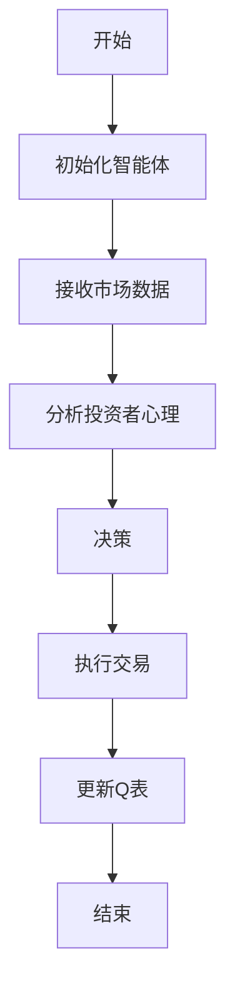
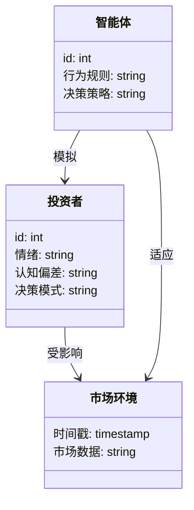
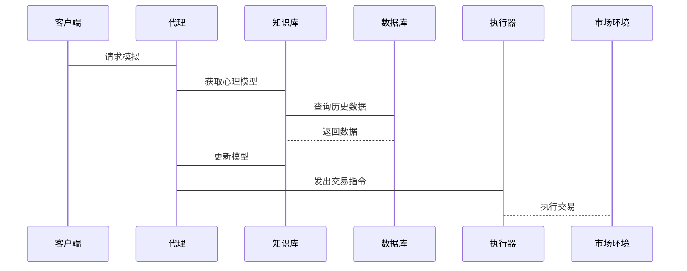

                 


```markdown
# 多智能体系统模拟投资者心理

> 关键词：多智能体系统，投资者心理，人工智能，金融市场，行为模拟

> 摘要：本文探讨了如何利用多智能体系统模拟投资者心理，分析了其在金融市场的应用，通过算法和系统设计展示了如何实现这一目标，并通过案例展示了实际应用。

---

## 第一部分: 多智能体系统与投资者心理概述

### 第1章: 多智能体系统与投资者心理概述

#### 1.1 多智能体系统的基本概念
##### 1.1.1 多智能体系统的定义
多智能体系统（Multi-Agent System, MAS）是由多个智能体组成的系统，这些智能体能够通过协作完成复杂的任务。每个智能体都有一定的自主性，能够感知环境并做出决策。

##### 1.1.2 多智能体系统的特性
- 分布式智能：智能体分布在不同的位置，各自处理部分信息。
- 协作性：智能体之间通过协作完成共同目标。
- 动态性：系统能够适应环境的变化。

##### 1.1.3 多智能体系统与单智能体系统的区别
- 单智能体系统由一个中心化决策单元构成，而多智能体系统由多个分布式智能体构成。
- 多智能体系统能够处理更复杂的问题，但管理和协调更复杂。

#### 1.2 投资者心理的基本概念
##### 1.2.1 投资者心理的定义
投资者心理是指投资者在决策过程中表现出的心理特征，包括情绪、认知偏差、决策模式等。

##### 1.2.2 投资者心理的核心要素
- 情绪：投资者在决策过程中的情绪波动。
- 认知偏差：投资者在决策中常见的认知错误。
- 决策模式：投资者根据信息做出决策的方式。

##### 1.2.3 投资者心理与市场行为的关系
投资者的心理状态直接影响其市场行为，例如情绪化交易、羊群效应等。

#### 1.3 多智能体系统模拟投资者心理的背景与意义
##### 1.3.1 问题背景
金融市场中，投资者的决策受到多种因素影响，包括情绪、认知偏差等。传统的模型难以准确模拟这些复杂因素。

##### 1.3.2 问题描述
现有模型无法充分考虑投资者心理的复杂性，导致模拟结果不够准确。

##### 1.3.3 问题解决的思路
利用多智能体系统模拟投资者心理，通过多个智能体协作来模拟市场的复杂行为。

##### 1.3.4 边界与外延
- 限定条件：模拟特定类型投资者心理。
- 外延：扩展到更多场景，如高频交易、机构投资者行为等。

##### 1.3.5 核心概念结构与组成
- 智能体：模拟投资者个体。
- 行为规则：模拟投资者决策逻辑。
- 交互机制：智能体之间的信息交流。

#### 1.4 本书结构与内容概述
##### 1.4.1 各章内容简要介绍
- 第1章：介绍多智能体系统和投资者心理的基本概念。
- 第2章：分析多智能体系统与投资者心理的核心原理。
- 第3章：讲解模拟投资者心理的算法原理。
- 第4章：设计模拟系统的架构。
- 第5章：通过案例展示实际应用。
- 第6章：总结与展望。

##### 1.4.2 学习本书的预期收获
读者将掌握多智能体系统模拟投资者心理的核心方法，能够将其应用于实际金融场景中。

---

## 第二部分: 核心概念与联系

### 第2章: 多智能体系统与投资者心理的核心概念

#### 2.1 多智能体系统的核心原理
##### 2.1.1 分布式智能
每个智能体独立决策，通过协作完成任务。

##### 2.1.2 协作与竞争
智能体之间可以协作，也可以竞争资源。

##### 2.1.3 动态环境适应
系统能够根据环境变化调整智能体行为。

#### 2.2 投资者心理的核心特征
##### 2.2.1 理性与非理性决策
投资者在决策中可能表现出理性或非理性行为。

##### 2.2.2 情绪与认知偏差
投资者的情绪波动和认知偏差影响决策。

##### 2.2.3 个体差异与群体行为
投资者个体差异导致群体行为的多样性。

#### 2.3 多智能体系统与投资者心理的联系
##### 2.3.1 多智能体系统的协作机制与投资者心理的群体行为
智能体协作模拟投资者群体行为。

##### 2.3.2 动态环境适应与市场波动的关系
系统适应市场波动，模拟投资者对市场的反应。

##### 2.3.3 理性决策与非理性决策的模拟
智能体可以模拟理性或非理性投资者行为。

#### 2.4 核心概念对比分析
##### 2.4.1 多智能体系统与传统单智能体系统的对比
- 分布式 vs 集中式
- 协作性 vs 单一决策

##### 2.4.2 投资者心理与市场行为的对比
- 内在心理 vs 外在行为
- 个体 vs 群体

##### 2.4.3 多智能体系统模拟投资者心理的优缺点
- 优点：能够模拟复杂心理行为
- 缺点：系统设计复杂，计算资源需求高

#### 2.5 ER实体关系图
```mermaid
erd
    entity 投资者心理 {
        id: int
        情绪: string
        认知偏差: string
        决策模式: string
    }
    entity 多智能体系统 {
        id: int
        智能体角色: string
        行为规则: string
    }
    entity 市场环境 {
        id: int
        时间戳: timestamp
        市场数据: string
    }
    relation 智能体-心理 {
        投资者心理. id --> 多智能体系统. id
        关系: 模拟
    }
    relation 心理-市场 {
        投资者心理. id --> 市场环境. id
        关系: 影响
    }
    relation 系统-市场 {
        多智能体系统. id --> 市场环境. id
        关系: 适应
    }
```

---

## 第三部分: 算法原理

### 第3章: 多智能体系统模拟投资者心理的算法原理

#### 3.1 多智能体协作算法
##### 3.1.1 分布式协作算法
智能体通过分布式协作完成任务。

##### 3.1.2 协作机制
- 信息交换：智能体之间共享信息
- 协调决策：基于共享信息做出决策

#### 3.2 强化学习算法
##### 3.2.1 Q-learning算法
智能体通过强化学习不断优化决策策略。

##### 3.2.2 算法实现
```python
import numpy as np

class QLearningAgent:
    def __init__(self, state_space, action_space):
        self.state_space = state_space
        self.action_space = action_space
        self.q_table = np.zeros((state_space, action_space))

    def choose_action(self, state, epsilon=0.1):
        if np.random.random() < epsilon:
            return np.random.randint(self.action_space)
        else:
            return np.argmax(self.q_table[state])

    def update_q_table(self, state, action, reward, next_state, alpha=0.1):
        self.q_table[state][action] = (1 - alpha) * self.q_table[state][action] + alpha * (reward + np.max(self.q_table[next_state]))
```

#### 3.3 情感计算与决策算法
##### 3.3.1 情感计算模型
使用情感分析技术分析投资者情绪。

##### 3.3.2 情感影响决策
情绪影响智能体的决策权重。

#### 3.4 算法流程图


#### 3.5 数学模型与公式
##### 3.5.1 Q-learning公式
$$ Q(s, a) = Q(s, a) + \alpha (r + \max Q(s', a') - Q(s, a)) $$

##### 3.5.2 情感影响公式
$$ decision\_weight = 1 + \beta \times emotion\_score $$

---

## 第四部分: 系统分析与架构设计

### 第4章: 多智能体系统模拟投资者心理的系统设计

#### 4.1 项目场景介绍
模拟股票市场中的投资者行为。

#### 4.2 系统功能设计
##### 4.2.1 领域模型


#### 4.3 系统架构设计
##### 4.3.1 架构图


#### 4.4 接口设计
##### 4.4.1 智能体接口
- 输入：市场数据
- 输出：决策指令

##### 4.4.2 交互序列图


---

## 第五部分: 项目实战

### 第5章: 多智能体系统模拟投资者心理的实现

#### 5.1 环境安装
- 安装Python、NumPy、Mermaid工具。

#### 5.2 核心代码实现
##### 5.2.1 智能体类
```python
class InvestorAgent:
    def __init__(self, id):
        self.id = id
        self.emotion = "neutral"
        self.cognitive_bias = "overconfidence"
        self.decision_mode = "rational"
```

##### 5.2.2 市场环境类
```python
class MarketEnvironment:
    def __init__(self):
        self.data = {}
        self.time = 0

    def update(self, time, price):
        self.time = time
        self.data[time] = price
```

#### 5.3 代码解读与分析
##### 5.3.1 智能体行为
- 每个智能体根据当前市场数据做出决策。
- 决策受情绪和认知偏差影响。

##### 5.3.2 系统运行
- 初始化多个智能体。
- 每个智能体接收市场数据，做出交易决策。
- 系统更新市场数据，继续模拟。

#### 5.4 实际案例分析
##### 5.4.1 案例描述
模拟股票市场中投资者的买卖行为。

##### 5.4.2 案例实现
```python
agents = [InvestorAgent(i) for i in range(5)]
market = MarketEnvironment()

for time in range(10):
    for agent in agents:
        agent.decision_mode = "rational" if market.data[time] > market.data[time-1] else "irrational"
        agent.emotion = "positive" if agent.decision_mode == "rational" else "negative"
    market.update(time, market.data[time] + np.random.normal())
```

#### 5.5 项目小结
通过多智能体系统模拟投资者心理，能够更准确地预测市场行为，为投资决策提供支持。

---

## 第六部分: 总结与展望

### 第6章: 总结与展望

#### 6.1 总结
本文详细介绍了多智能体系统模拟投资者心理的方法，通过算法和系统设计展示了其实现过程。

#### 6.2 展望
未来可以进一步研究更复杂的投资者心理模型，结合大数据和深度学习提升模拟精度。

---

## 附录

### 附录A: 数据集
- 市场数据：股票价格、交易量等。

### 附录B: 工具库
- Python、NumPy、Mermaid。

### 附录C: 参考文献
- Smith, J. (2020). Multi-Agent Systems in Finance.

---

## 作者：AI天才研究院/AI Genius Institute & 禅与计算机程序设计艺术/Zen And The Art of Computer Programming
```

